# webpack:从 0 到自动化测试

> 原文：<https://itnext.io/webpack-from-0-to-automated-testing-4634844d5c3c?source=collection_archive---------0----------------------->

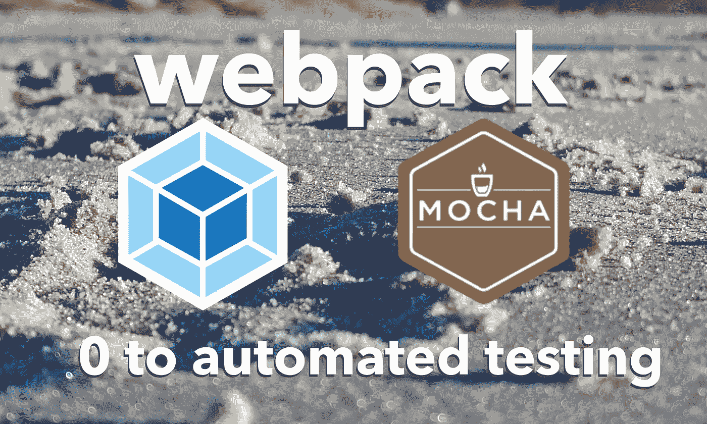

自 1995 年问世以来，JavaScript 在语言和生态系统方面都发生了巨大的变化。现在，这种语言正被用来在前端和后端制作更大的工具和 web 应用程序，对于这些大型 JavaScript 项目，人们会导入大量不同的第三方代码。这些依赖可以是方便的 JS 功能库(如 Lodash)、React、Angular 或 Vue 等框架、自动化测试代码(如 Mocha 或 Jest ),甚至是添加到 JavaScript 语言本身的代码(如 Flow ),用于为 JS 提供 C++或 Go 等语言中的静态类型。

由于所有这些复杂性，HTML 用一堆`<script>` 标签导入所有 JavaScript 变得很麻烦而且容易出错，比如:

```
<script src="path/to/lodash.js"></script>
<script src="path/to/my-helper-functions.js"><script>
<script>
  // This code can now use functions from lodash.js and
  // my-helper-functions.js
</script>
```

当您只有两个脚本要导入时，这可能很容易管理，但是二十个或数百个脚本呢？构建一个由数百个`<script>`标签组成的堆栈并以正确的顺序导入它们需要大量的思考，而且随着依赖列表的增长和变化，维护起来会很头疼。

幸运的是，管理依赖关系之间错综复杂的关系网是机器人最擅长的思维方式。因此，对于制作大型专业 web 应用程序来说，自动化构建过程是必不可少的，而 webpack 是处理这一问题的一个非常流行的工具。它为您的 JavaScript、CSS 等构建了一个依赖图，输出单个文件的**包**代码，因此您可以用一个`<script>`标签导入您需要的所有 JavaScript！

在本教程中，我们将为一个小型 web 应用程序构建一个 webpack，然后我们将看到如何使用 webpack 来设置自动化测试。

# 制作应用程序

对于这个示例应用程序，我们将为树懒绘制一张地图，以找到剑桥出售木槿茶的当地商店。因为剑桥淡水池塘的每一只树懒都知道芙蓉茶是最好的慢下来的茶！


注意:现实生活中没有生活在淡水池上的树懒，但是树懒在爬树一整天后确实喜欢美味的芙蓉花！

接下来，创建一个名为`webpack-mocha-tutorial`的目录，在其中创建一个`app/src`目录，并运行`npm init`或`yarn init`。应用程序的代码在这里是[这里是](https://github.com/andyhaskell/webpack-mocha-tutorial)，存储库的[提交历史](https://github.com/andyhaskell/webpack-mocha-tutorial/commits/master)是按照教程编写的，所以我将链接到每个提交以跟踪代码更改，除了提交 1，它只是设置了 repo。

该应用程序的基本结构如下所示:

*   你有一个文件`app/src/distance.js`，它导出一个运行距离公式的函数(实际上我们应该使用地理坐标的大圆距离公式)，以及一个告诉我们一系列点中哪个点离你最近的函数

```
// distance takes in two points, represented as objects with
// numeric x and y values and returns the distance between them
//
// [TODO] Use great-circle distance, not 2D distance, which we're
// only using to keep the code in this tutorial short
function distance(p2, p1) {
  let yDist = p2.y - p1.y;
  let xDist = p2.x - p1.x;
  return Math.sqrt(Math.pow(yDist, 2) + Math.pow(xDist, 2));
}// sortByDistance takes in your location and an array of points
// and returns the array of points sorted
function sortByDistance(myPt, points) {
  return points.sort(
    (pt1, pt2) => distance(pt1, myPt) - distance(pt2, myPt));
}
```

*   您有一个名为`app/src/page.js`的文件，它使用`distance.js`中的代码从列表中获取最近的商店，然后在页面上显示出来

```
let stores = [
  {name: "Cambridge Naturals",     x: -71.1189, y: 42.3895},
  {name: "Sarah's Market",         x: -71.1311, y: 42.3823},
  {name: "Whole Foods Fresh Pond", x: -71.1420, y: 42.3904},
];let here = {name: "You are here",  x: -71.1470, y: 42.3834};
let nearest = sortByDistance(here, stores)[0];
document.getElementById("nearest-store").innerHTML = nearest.name;
```

*   最后，你有了你的 HTML 网页，`index.html`。

```
<!DOCTYPE html>
<html>
  <head>
    <title>Closest store with hibiscus tea</title>
  </head> <body>
    <p>Nearest store is <span id="nearest-store"></span></p>
    <script src="app/src/distance.js"></script>
    <script src="app/src/page.js"></script>
  </body>
</html> 
```

总体目录结构是:

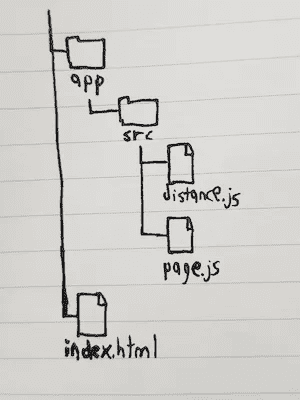

如果你在浏览器中打开 index.html，你会看到离新鲜池塘最近的地方是扶轮社附近的全食超市。

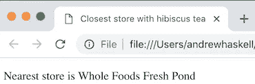

如你所见，`distance.js`定义了我们的距离函数，然后`page.js`使用它们运行，将 sortByDistance 函数的结果放入 DOM。但是如果你看看你的文件之间的依赖关系，你的`page.js`文件依赖于你的`distance.js`文件，而不是相反([提交 2](https://github.com/andyhaskell/webpack-mocha-tutorial/commit/13a7f43fb1a0f92445bcd67d99a5586e3c8adcb0) )。

这样，您就有了一个设置，在依赖图的基础上，您基本上有一个 JavaScript 文件 page.js。所以，如果你能让 index.html 导入一个带有一个`<script>`标签的 JavaScript 文件，那就太好了。使用 webpack，您可以做到这一点！

# 输入 webpack

正如我在开始时提到的， [webpack](https://webpack.js.org) 是一个工具，它可以让你获取你的 web 应用程序所需的所有代码，并将其转换成一个生产就绪包。要得到它，使用 npm 或 yarn 来安装它:

```
yarn add --dev webpack webpack-cli
```

有了这个命令，现在您的`node_modules`中就有了 webpack 及其命令行工具，并且可以用`webpack`命令行工具运行它。但是在运行这个 webpack 构建之前，我们需要让我们的 page.js 文件实际导入 distance.js 中的代码。因此，我们让 distance.js 通过添加以下行来导出它的函数:

```
module.exports = {distance, sortByDistance};
```

为了让 page.js 使用导出的`sortByDistance`函数，我们添加了一行代码:

```
import {sortByDistance} from "./distance";
```

酷，我们已经连接了我们的 JavaScript 依赖项。现在让我们使用 webpack 来构建我们的应用程序！运行以下命令:

```
npx webpack app/src/page.js
```

现在你应该会看到一个新的文件，`dist/main.js`，它包含了你在 page.js 和 distance.js 中的所有代码。现在让`index.html`导入`dist/main.js`而不是在`app/src`中导入你的脚本，如下所示:

```
<!DOCTYPE html>
<html>
  <head>
    <title>Closest store with hibiscus tea</title>
  </head> <body>
    <p>Nearest store is <span id="nearest-store"></span></p>
    **<script src="dist/main.js"></script>**
  </body>
</html>
```

现在在你的浏览器中打开这个文件，你应该仍然有工作的代码。这个 main.js 文件包含 distance.js 和 page.js 中的所有代码，因此您可以从一个文件导入所有内容！

其工作方式是，使用命令`npx webpack app/src/page.js`，您指定 JavaScript 代码的起点，或者用 webpack 术语来说，**入口点**是 page.js。因此 webpack 读取 page.js，并在该文件中看到行`import {sortByDistance} from ./distance`。现在它知道 page.js 有 distance.js 作为依赖项。根据代码中的所有依赖关系，webpack 构建了一个**依赖图**，并使用它来构造您的**捆绑包** JavaScript 文件`dist/main.js`。([提交 3](https://github.com/andyhaskell/webpack-mocha-tutorial/commit/551d1392d46df44dd10f759bfe268c9dfb5cd49e) )


webpack 从我们的入口点 page.js 构建依赖图

顺便说一下，这也适用于让您的代码在您的`node_modules`中导入第三方依赖项。让我们尝试用 jQuery 而不是`document.getElementById`来进行 DOM 操作。首先安装 jQuery:

```
yarn add --dev jquery
```

然后更新 page.js 以包含和使用 jQuery:

```
import {sortByDistance} from "./distance";
**import $ from "jQuery";**let stores = [
  {name: "Cambridge Naturals",     x: -71.1189, y: 42.3895},
  {name: "Sarah's Market",         x: -71.1311, y: 42.3823},
  {name: "Whole Foods Fresh Pond", x: -71.1420, y: 42.3904},
];let here = {name: "You are here",  x: -71.1470, y: 42.3834};
let nearest = sortByDistance(here, stores)[0];
**$("#nearest-store").html(nearest.name);**
```

现在你的依赖图是:

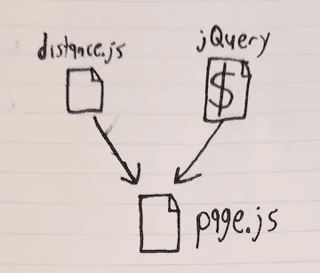

page.js 导入 jQuery 的新依赖图

如果你做了`npx webpack app/src/page.js`并重新加载 index.html，尽管你的 dist/main.js 文件因为包含 jQuery 代码而变得更大，你的 web 应用程序仍然可以工作！

在我们继续之前，进入您的 package.json 文件并添加这三行:

```
"scripts": {
  "build": "webpack app/src/page.js"
}
```

现在，如果你正在运行你的 webpack 构建，你只需要输入`yarn build`就可以了，而不需要记住`npx webpack app/src/page.js`。除了更容易键入之外，如果您的构建命令发生变化，您可以使用新的构建命令更新 package.json 文件中的那一行，然后您仍然可以使用`yarn build`来构建应用程序，而不是让您和您的工程团队习惯于运行新的命令。([提交 4](https://github.com/andyhaskell/webpack-mocha-tutorial/commit/76df5a1fcf71cdae2cec55714b019d8e2530382a) )

# 使用 webpack.config.js 文件配置 webpack

您看到的命令`npx webpack app/src/page.js`是 webpack 的默认行为。如果您运行`webpack [entry-file.js]`，那么 webpack 从该条目文件构建一个依赖图，并在`dist/main.js`中输出一个包文件。但是如果用配置文件配置 webpack，您可以控制入口点和输出点的位置。将这段代码放到 webpack-mocha-tutorial 目录下的一个名为`webpack.config.js`的文件中:

```
module.exports = {
  entry: __dirname + "/app/src/page.js",
  output: {
    path: __dirname + "/dist/",
  }
}
```

现在如果你运行`npx webpack`或者你可以像以前一样做同样的构建，不要在命令行参数中指定你的入口点，因为它现在在`webpack.config.js`中！这也意味着您可以更新您的`package.json`文件的构建脚本:

```
"build": "webpack",
```

如果您要将 webpack 配置文件中的输出路径更改为类似于`__dirname + "/somewhere_else"`的路径，那么再次运行`yarn build`命令会将捆绑文件放入`somewhere_else/main.js`中。([提交 5](https://github.com/andyhaskell/webpack-mocha-tutorial/commit/c0f145d430d333f78865241d3846661a5fe30abe) )

但是 webpack 配置文件不仅仅是用来设置输入和输出文件的位置。您还可以通过使用**加载器**来设置 webpack *在依赖图中遇到不同类型的文件时做什么，加载器基本上是以某种方式转换您的代码的 JavaScript 程序。例如，您可以在 webpack 配置文件中设置一条规则，规定如果 webpack 在其依赖关系图中遇到一个 TypeScript 文件，则该文件将通过一个加载程序发送，该加载程序会将其从 TypeScript 转换为常规 JavaScript。*

我们要用的装载机是巴别塔装载机。如果你以前没有用过， [Babel](https://babeljs.io) 是一个工具，它获取使用现代特性的 JS 代码，并将其转换为向后兼容的等价代码。这使得您的应用程序可以在较旧的浏览器上工作，或者更一般地说，可以在尚不支持一些新的 JavaScript 特性的浏览器上工作。毕竟，一些使用我们应用的树懒自 2009 年以来就没有更新过他们的浏览器。我们编写的部分代码无法在 2009 版浏览器上运行:

```
return points.sort((pt1, pt2) =>
  distance(pt1, myPt) — distance(pt2, myPt));
```

我们用的是箭头函数，那些还没有被发明出来。所以让我们用 babel-loader 把这个箭头函数送过去吧！首次运行:

```
yarn add --dev babel-core babel-loader@7.1.5 babel-preset-env
```

然后在 webpack.config.js 中，将这段代码添加到`module.exports`对象中:

```
module: {
  rules: [
    {
      test: /\.js$/,
      exclude: ["/node_modules/"],
      use: [
        {
          loader: "babel-loader",
          options: {
            presets: ["env"],
          },
        },
      ],
    },
  ],
},
```

这为我们的 webpack 构建添加了一个新的**规则**。如果 webpack 在依赖关系树中遇到一个以`.js`结尾的文件(比如 distance.js)，而这个文件不在`node_modules`中(比如 jQuery)，那么我们的规则适用于这个文件。

然后，任何匹配这个规则的文件都将通过规则的`use`数组中的所有加载器(在我们的例子中，它只是 babel-loader)。因此`distance.js`和`page.js`通过 babel-loader 运行，导致`distance.js`的箭头功能被移除，然后 webpack 继续其构建您的包的快乐之路。同时，当 webpack 遇到 jQuery 时，它只是加载代码，因为 jQuery 在`node_modules`目录中，所以没有任何加载器。

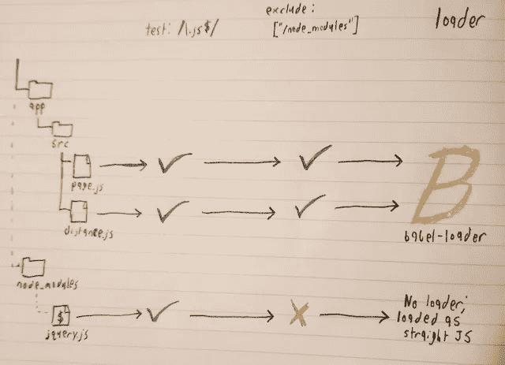

webpack 决定对依赖图中的每个文件使用哪些加载器

如果您运行`yarn build`并进入`dist/main.js`的源代码，对应于您的排序函数的代码现在使用`function`关键字，而不是箭头函数！([提交 6](https://github.com/andyhaskell/webpack-mocha-tutorial/commit/8064767238ea4639f46b9c01b1e5f3ed475eb54c) )

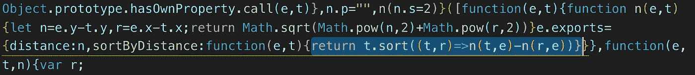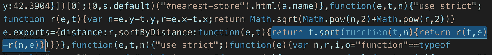

上图中高亮显示的代码是 dist/main.js 中添加 babel-loader 之前的 sortByDistance 函数，下方高亮显示的代码是添加 babel-loader 之后的同一个函数。注意上面我们使用了一个箭头函数，而下面我们有一个 2009 友好的函数关键字。

我们的应用已经准备就绪！但是为了保持代码的可维护性，我们应该为它编写一些测试。

# 向我们的构建添加一些测试覆盖

让我们在 distance.js 文件中添加一些测试覆盖率。我们将使用 [Mocha](https://mochajs.org) ，一个用于编写测试的基于测试套件的工具，并将 [Chai](https://www.chaijs.com) 作为我们的断言库，所以运行这个命令:

```
yarn add --dev mocha chai
```

然后创建一个新的`app/test`目录和一个新文件`app/test/distance.test.js`，其中包含以下代码:

```
import {expect} from "chai";
import {distance, sortByDistance} from "../src/distance";describe("distance", function() {
  it("calculates distance with the good ol' Pythagorean Theorem", function() {
    let origin = {x: 0.0, y: 0.0};
    let point = {x: 3.0, y: 4.0};
    expect(distance(point, origin)).to.equal(5);
  });
});describe("sortByDistance", function() {
  it("sortsByDistance", function() {
    let places = [
      {name: "Far away", x: 100, y: 50},
      {name: "Nearby", x: 20, y: 10},
    ];
    let origin = {name: "Origin", x: 0, y: 0}; let sorted = sortByDistance(origin, places);
      expect(sorted[0].name).to.equal("Nearby");
      expect(sorted[1].name).to.equal("Far away");
    });
});
```

我们的`distance`和`sortByDistance`函数有自己的测试函数，它们断言距离函数计算距离公式，sortByDistance 函数使用距离公式对坐标数组进行排序，使用 Mocha 测试套件和 Chai 断言。非常标准的测试设置。

然而，如果我们运行`mocha app/test/distance.test.js`，我们将得到一个错误，我们的 JavaScript 是无效的，因为它包含了`import`关键字，这是节点目前不支持的。但是，如果我们通过使用 webpack 来管理测试代码的依赖性，从而绕过这个限制，会怎么样呢？(注意:这也可以通过在我们的测试文件中使用`require`而不是`import`来简单地解决，但是如果您正在测试像使用类型注释的流类型 JavaScript 或使用。vue 文件，因为这两者都需要转换成常规的 JS)。

我们的测试流程是这样的:

1.  让 webpack 从我们的测试文件开始构建依赖关系树，而不是从我们的应用程序文件开始。
2.  webpack 然后会生成一个 JavaScript 文件，包含我们所有的测试代码及其依赖项，没有`import`关键字
3.  然后，我们通过在这个 JavaScript 文件上运行 Mocha 来进行测试

看起来像这样:

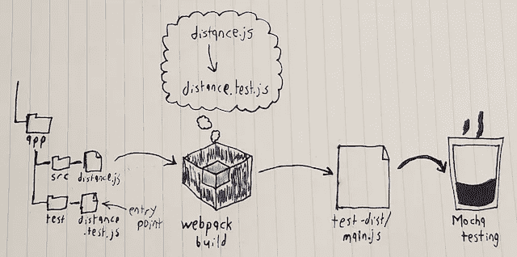

如你所见，这也意味着我们要制作两个独立的版本。一个将我们的应用程序代码作为入口点，将`dist`文件夹作为输出目录，另一个将我们的测试文件作为入口点，将`test-dist`作为输出目录。因此，让我们更新我们的 webpack 配置文件以支持第二次构建:

```
let glob = require("glob");let entry = __dirname + "/app/src/page.js";
let outputPath = __dirname + "/dist/";if (process.env.TESTBUILD) {
  entry = glob.sync(__dirname + "/app/test/**/*.test.js");
  outputPath = __dirname + "/test-dist/";
}module.exports = {
  entry: entry,
  output: {
    path: outputPath,
  },
  // rest of webpack config file stays the same
```

这是做什么的？在第五行，我们有一个 if 语句，如果我们的环境变量 TESTBUILD 有一个非空值，我们就运行这个语句。因此，如果我们运行`TESTBUILD=true webpack`，那么我们将输入 if 语句，但是如果我们只运行`npx webpack`，我们就不会这样做。

在 if 语句中，我们更改哪个 JS 文件是我们入口点。我们的输出路径不是到`dist`文件夹，而是到`test-dist`文件夹。我们的入口点不再是`app/src/path.js`作为我们的条目，而是匹配 glob 表达式`app/test/**/*.test.js`的所有文件的数组。换句话说，所有文件都是:

1.  在`app/test`目录下的一个路径中
2.  有一条以`.test.js`结尾的路径

我们将新的入口点和输出路径传递到`module.exports`对象中，webpack 运行它来构建我们的测试。如你所见，webpack 配置是常规的 JavaScript，所以我们可以使用 Node 的标准库和 if 语句像 JavaScript 一样配置它。运行`TESTBUILD=true npx webpack`，你应该会看到一个`test-dist`目录。如果您运行`npx mocha test-dist/main.js`，您应该会看到您的测试正在运行！

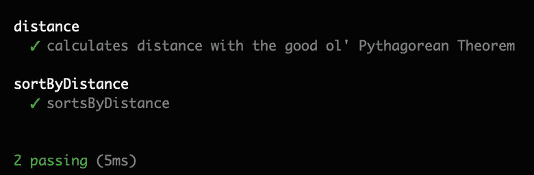

他们通过了！

最后，在`package.json`的“脚本”部分添加这一行:

```
"test": "TESTBUILD=true webpack && mocha test-dist/main.js && rm -rf test-dist"
```

这意味着现在当您运行`yarn test`时，您使用 webpack 构建您的`test-dist`版本，然后在该版本上运行 Mocha，最后，`rm -rf test-dist`删除 test-dist 目录，因为我们已经用完了它。([提交 7](https://github.com/andyhaskell/webpack-mocha-tutorial/commit/b5a69f819abdf5c45a6dbbeb19e366924e9bfe05) )

# 源代码映射我们的测试代码

现在我们已经有了我们的测试版本，但是当我们测试我们的代码时，有一件事情会变得很烦人。如果我们在我们的`test-dist/main.js` 文件上运行 Mocha，并且我们的一个测试失败了，那会是什么样子呢？让我们在`app/test/distance.test.js`让距离公式测试失败:

```
describe("distance", function() {
  it("calculates distance with the good ol' Pythagorean Theorem", function() {
    let origin = {x: 0.0, y: 0.0};
    let point = {x: 3.0, y: 4.0}; **expect(distance(point, origin)).to.equal(2071);**
  });
});
```

运行`yarn test`你应该得到这个

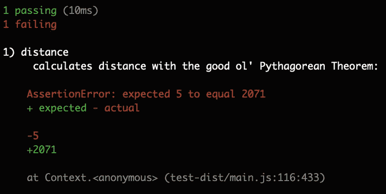

测试失败了，但是你看不到你的原始测试代码是哪一行，如果你的 web 应用有很多测试，你的测试失败的那一行可能很难找到。


Lola the Micropanda 在 test-dist/main.js 的第 116 行寻找失败的断言

失败的代码在`app/test/distance.test.js`的第 8 行，但是我们在`test-dist/main.js`上运行 Mocha，所以从 Mocha 的角度来看，失败的断言在第 116 行。幸运的是，webpack 支持**源代码映射**，它可以告诉你哪一行代码对应于一个 bug。源映射就像一个特殊标记的谷物盒中的解码器环，您可以使用您的解码器环和捆绑的 main.js 文件来获取对应于捆绑代码的原始代码行。这份完整早餐的一部分，现在是这份完整 webpack 配置的一部分！更新您的`webpack.config.js`文件中的 if 语句:

```
let entry = __dirname + "/app/src/path.js";
let outputPath = __dirname + "/dist/";
**let devtool = "";**if (process.env.TESTBUILD) {
  entry = glob.sync(__dirname + "/app/test/**/*.test.js");
  outputPath = __dirname + "/test-dist/";
  **devtool = "source-map";**
}
```

然后在 module.exports 对象中添加一行:

```
devtool: devtool,
```

现在，在您的测试构建中，您的 test-dist 目录将包含一个源映射文件。运行`npx webpack TESTBUILD=true`，你的`test-dist`目录将会有一个`main.js.map`文件和`main.js`包。

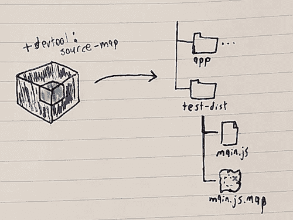

为了让 Mocha 在运行测试时使用这个源映射，我们只需要再安装一个包:

```
yarn add --dev source-map-support
```

现在要使用它，我们只需要更新我们的`package.json`的`scripts.test`部分中的 Mocha 脚本:

```
TESTBUILD=true webpack && mocha test-dist/main.js --require source-map-support/register && rm -rf test-dist
```

Mocha 中的那个标志，`--require source-map-support/register`让 Mocha 要求 source-map-support 包，这意味着 Mocha 将使用可用的 source map。所以现在如果你运行`yarn test`，当你得到一个失败的断言时，你会知道它在哪一行，并且可以修复代码！

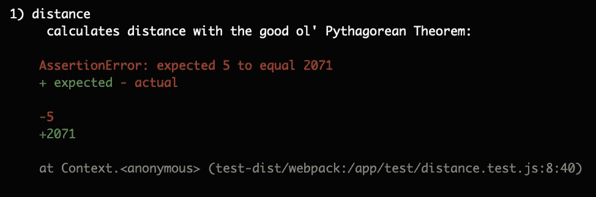

断言 fail 位于 distance.test.js 的第 8 行

洛拉同意，源地图确实是，它在哪里！([提交 8](https://github.com/andyhaskell/webpack-mocha-tutorial/commit/0085f471b94cb69f504a71a1c8761b80320ddeff) )


因此，现在您已经为您的常规发行版构建和测试构建设置了源代码映射。从现在开始，您可以在此基础上构建更多的方法，例如将多个 JavaScript 加载器链接在一起以在管道中处理您的代码，或者将 webpack 作为开发服务器运行以立即查看您的代码更改对最终 webpack 构建的影响，因此继续尝试将我们不同的包组合到您的应用程序的`webpack.config.js`文件中，因为我们只是触及了表面。

下次见，继续偷懒！

树懒图片由 Jenny Jozwiak 拍摄，由 2.0 在 [CC 下授权](https://creativecommons.org/licenses/by/2.0/)