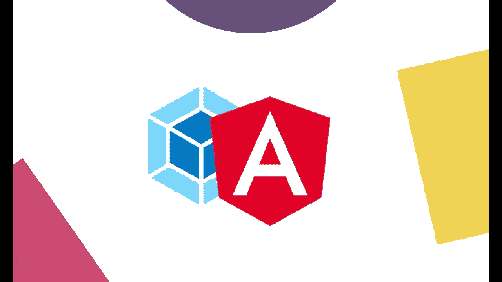
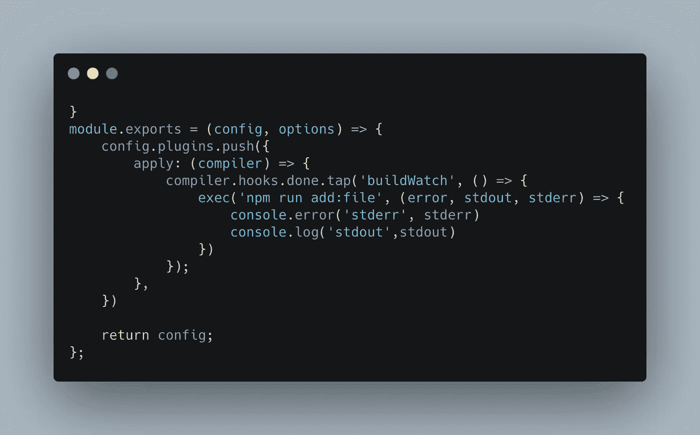

# 网袋挂钩和 ng 手表

> 原文：<https://itnext.io/webpack-hooks-and-ng-watch-2822ffb35538?source=collection_archive---------7----------------------->



“手表”是我们在开发周期中想当然的东西。随着每个文件的改变或保存，我们的应用程序会自动重建/重新渲染，我们会看到最新的版本。但是有一个问题。构建命令永远不会结束…这很烦人。

如果你以前尝试过:

```
ng build --watch && node test.js
```

我很生气你的 test.js 从来没有真正运行过，这是因为我们给了 ng build 一个小小的*手表*标志。它告诉 angular 保持进程并监听所有的文件变化(或者我们告诉它监听的文件类型)。

在我的用例中，我需要在构建后将一个配置文件添加到 dist 文件夹，我尝试的任何解决方案(run-all，concurrently，postbuild)都失败了，因为命令之间的时间不匹配。每次保存后都强迫我手动运行。(不是最佳实践)
然后…，当所有希望都破灭时，我发现了这一点:

# Webpack 挂钩。

我们有一个我们不喜欢接触的文件，***web pack . config . js***，它很可怕，我们大多数人都不知道它是如何工作的，它是我们用来创建应用程序的无论什么 cli 命令给定的。一个真正的“黑匣子”。那么 Angular 是如何使用 webpack.config.js 文件的呢？

在项目根目录下的 Angular.json 文件中，我们可以选择将自定义 webpack 配置传递给项目文件夹中的每个应用程序/库。

```
"build": {
  "builder": "@angular-builders/custom-webpack:browser",
  "options": {
    "customWebpackConfig": {
      "path": "./custom-webpack.config.js"
    },
```

Angular 编译器将在构建时运行我们给它的配置文件，并把原始的 webpack 配置传递给它。
这允许我们根据需要扩展或/和覆盖配置(除非我们破坏 webpack)。参见下面的例子



在这个例子中，我向 webpack 的“done”挂钩添加了一个功能，它在每次完成其周期(在我们的例子中是一个 ng 构建周期)时运行，可以在这里找到所有可用的 webpack 挂钩的列表[。](https://webpack.js.org/api/compiler-hooks/#hooks)

每当 webpack 完成我的 angular 项目的重建时，上面示例中的行为将运行" *npm run add:file"* 。

这只是用 webpack 配置可以做什么的一个小例子。我很高兴发现这个调整为我的团队解决了一个真正的问题，并给了我们一个更流畅的开发体验。
不幸和幸运的是，Webpack 使用了大量的黑魔法，这是我们尝试和学习了解它的时候了，所以我们可以按照我们想要和需要的方式使用这个强大的工具。