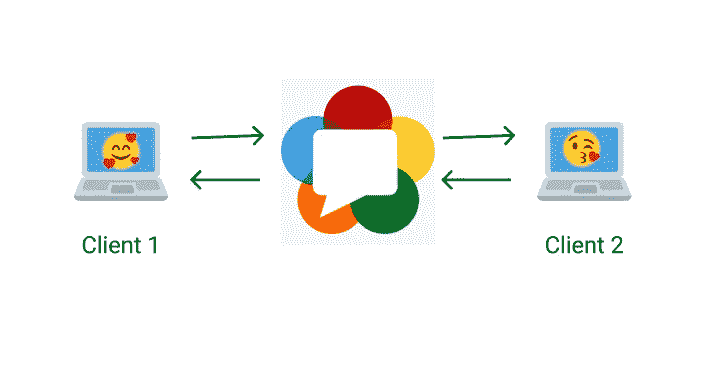
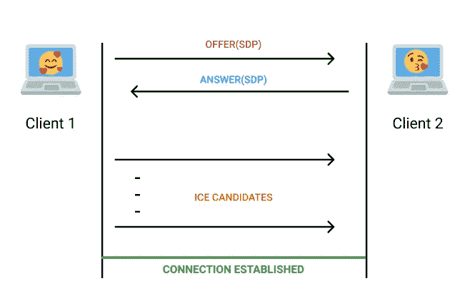
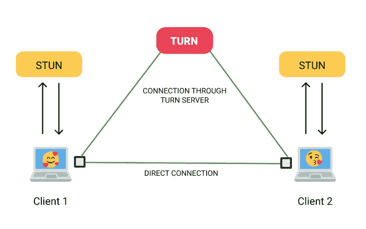

# 面向初学者的 WebRTC 从外面打电话是如何工作的！

> 原文：<https://itnext.io/webrtc-for-beginners-how-it-all-works-from-the-outside-3c806f582229?source=collection_archive---------1----------------------->

WebRTC 是一个支持实时通信(RTC)的开放框架，对于视频音频通话、聊天、P2P 文件共享等非常有用

它是实时通信的开放标准，为如此多的产品提供动力，并被用于大型组织的生产中。例如，Google Meet，Discord，Facebook Messenger，以及更多由 WebRTC 支持的应用。像 Zoom 这样的应用程序间接使用 WebRTC 作为数据通道。

让我们来看看一些与 WebRTC 相关的术语和材料，同时我们了解在连接两个用户进行视频通话时它是如何工作的。

# <> IP 地址和 NAT

我们都知道每台设备都必须有一个 ***唯一的*** IP 地址才能访问互联网。但是，当可用 IP 地址的数量少于想要使用互联网的用户数量时，会发生什么呢？ [IPv4 地址](https://en.wikipedia.org/wiki/IPv4_address_exhaustion)正是这种情况。

IPv6 经过精心设计，旨在避免未来出现这些问题。

但是为了解决 IPv4 的这个问题，在路由器中使用了网络地址转换(NAT)，它为其下面的设备使用自己的一组 IP 地址，也称为*本地/私有* IP 地址(10.x.x.x，192.168.x.x，172 . 16 . 0 . 0–172 . 31 . 255 . 255)。只有本地网络的 NAT 和对等体可以通过这个*私有*地址进行通信。

因此，由于 NAT，我们将有两个 IP 地址；一个是**公共地址，**与路由器相关联，仅从外部可见，另一个是**私有地址**，仅对于连接到同一路由器的那些人可见。

# **< / >**

仅仅通过 IP 地址不可能直接连接两个对等体。大多数连接需要你传递一个唯一的地址来定位你在互联网上的位置，一个中继服务器来传递媒体，如果你的路由器不允许 P2P 连接，最后但同样重要的是，你必须绕过防火墙。

为了促进这一点，使用一个称为[交互式连接建立(ICE)](https://www.geeksforgeeks.org/interactive-connectivity-establishment-ice/) 的框架来连接终端用户。

# 建立联系的步骤

在建立直接连接之前，我们需要在客户端之间来回传递一些信息。这正是 WebRTC 不完全是 [P2P](https://www.investopedia.com/terms/p/peertopeer-p2p-service.asp) 的原因。

为了初始化连接，需要信令服务器在对等体之间传输一些基本信息。一旦连接建立，我们就不再需要信令服务器了。

现在让我们来看看发信号时需要做的步骤。

1.  第一个用户必须向另一个用户发送提供 SDP。
2.  第二个用户必须接受该 SDP，并发送应答 SDP 作为回报。
3.  然后，第一个用户应该接受该 SDP，此后，他们中的任何一个必须将生成的 ICE 候选发送给另一个。
4.  后者必须接受收到的候选人。

做完这些，连接就建立了。

但是现在你搞不清楚什么是 SDP，什么是 ICE 候选，对吧？别担心。

# 会话描述协议(SDP)

[会话描述协议或简称 SDP](https://tools.ietf.org/html/rfc4566) ，是一种用于描述多媒体会话的协议。通常，它包含连接的多媒体内容的描述，如分辨率、格式、编解码器、加密等。这被传送，以便在连接建立之前，另一个对等体可以知道媒体将被发送的内容和方式。

因此，传输 SDP 意味着在直接连接(P2P)建立之后，您将告诉其他用户您将要发送的内容。

# </>

现在，在我们看一看 ICE 候选对象是什么之前，让我们试着了解更多关于如何与 ICE 框架建立连接的信息。

让我们尝试一些 WebRTC 视频通话的场景。

***场景 1:两个用户都通过本地网络连接:***

如果两个用户都在本地网络上，那么相互连接没有问题。他们可以直接相互通信，只需他们的本地/私有 IP 地址。但大多数情况下，这是不太可能发生的情况。

***场景 2:两个用户都通过互联网连接:***

当两个用户都不在本地网络下时，连接就变得有点复杂。由于 NAT，用户只能看到他的*私有* IP 地址，无法从本地网络外部建立连接。

为了克服这个问题，我们使用了一个 STUN 服务器。

# <>**NAT 会话遍历实用程序(STUN)**

[STUN 服务器](https://help.singlecomm.com/hc/en-us/articles/115007993947-STUN-servers-A-Quick-Start-Guide)允许客户端找出它们的*公共* IP 地址和它们背后的 NAT 类型。该信息用于稍后建立媒体连接。在大多数情况下，STUN 是促进连接所必需的。

通过在发送 SDP 之前联系 STUN 服务器，一个用户可以与另一个用户连接，即使他们不在本地网络上。

# </>

***场景 3:两个用户都通过互联网连接，但无法直接连接:***

有人可能认为，使用 STUN 服务器可以解决互联网连接的所有问题。知道*公共* IP 地址是很好的，但是这可能还不足以建立连接。存在根本不可能直接连接的情况。

> 大约 80%的连接可以通过使用本地 IP 地址或使用 STUN 和公共 IP 地址来解决。

有些情况可能是。其中一个对等体位于对称 NAT(一种更安全的 NAT)之后，或者简单地说，防火墙不允许 P2P 连接。在这些情况下，我们需要一个服务器在整个连接过程中在两个对等体之间中继媒体，不像 STUN 服务器那样，在连接建立之前只需要一次。

我们这里用的叫回合服务器。

# <> **穿越使用中继 NAT** (转)

TURN 服务器用于绕过对称 NAT 限制，并通过该服务器中继所有信息/媒体。第一个对等体必须创建到 TURN 服务器的连接，并要求另一个对等体也这样做，以便另一个对等体发送到服务器的所有信息都被转发给前者。

> TURN 服务器通常集成了自己的 STUN 服务器，因此不需要额外的 STUN 服务器。轮流服务器通常被称为“中继服务器”。

正如你可能知道的，由于带宽的使用，TURN 服务器的维护成本通常很高。因此，只有在没有其他连接方式的情况下才应该使用它。

# </>

现在你可能会想，在建立联系之前，有太多的东西要看。那么，怎么可能总是使用高效的路径进行交流呢？

这就是冰架的切入点。WebRTC 为要建立的连接找到最有效的网络路径。

# <>冰候选

就像 SDP 用于交换介质信息一样，对等体也必须交换网络连接信息。这就是 [ICE 候选人](https://developer.mozilla.org/en-US/docs/Web/API/RTCIceCandidate)的作用。它们包含关于可用通信方法的所有细节，如直接连接或通过 TURN 服务器。

ICE 候选是由 WebRTC 框架本身自动生成的，并且应该尽快通过信令发送到另一个对等体，以获得可能的最佳连接路由。

> 只有在提供/回答交换发生后，才应接受收到的 ICE 候选。处理 ICE 候选者是大多数时候人们会发现 WebRTC 存在问题的地方。

# </>

因此，在 WebRTC 中已经建立了成功的对等连接。

# 如果你觉得这份材料有用，请不要忘记鼓掌👏并与你的同伴分享。如果你在上面的材料中发现了错误或误导，请留下评论。

如果你想支持我，你可以请我喝咖啡

**可以在** [**LinkedIn**](https://www.linkedin.com/in/karthikeyanssvk/) **上联系我，在**[**GitHub**](https://github.com/coder-with-a-bushido)**上关注我的作品或者给我发** [**邮件**](mailto:karthikeyanssvk@gmail.com) **。**

# 祝您愉快！🎉