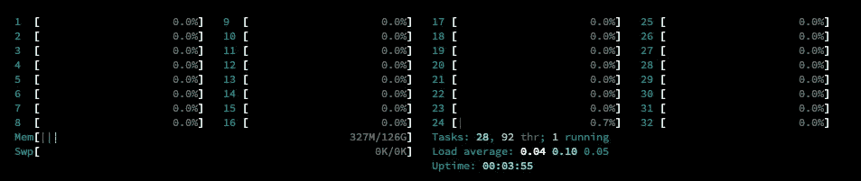
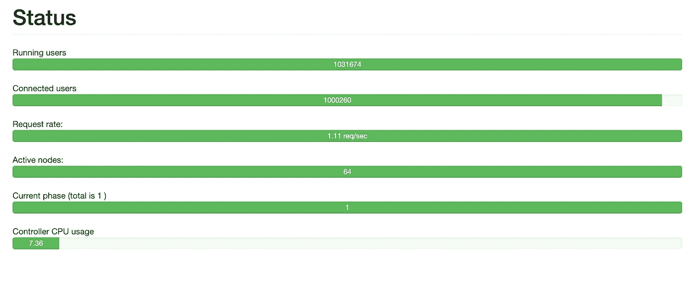

# WebSocket —使用 Appwrite 的 100 万个连接

> 原文：<https://itnext.io/websocket-1-million-connections-using-appwrite-2d2a2c363a37?source=collection_archive---------0----------------------->


在我们最近的博客文章中，我们谈到了我们从构建 WebSocket 服务器中学到的东西。现在，我们希望收获我们努力的成果，并检查我们的服务器在恶劣条件下的表现。

[](/lessons-learned-from-building-a-websocket-server-e9bc0bd3ef80) [## 构建 WebSocket 服务器的经验教训

### Appwrite 是一个开源、自托管的后端即服务，旨在通过 SDK 简化应用程序开发…

itnext.io](/lessons-learned-from-building-a-websocket-server-e9bc0bd3ef80) 

## Appwrite 是什么？

[Appwrite](https://appwrite.io) 是一个开源、自托管的后端即服务，旨在通过各种编程语言提供的 SDK 简化应用开发。

Appwrite 中使用的 WebSocket 服务器为一个非常灵活的[实时 API](https://appwrite.io/docs/realtime) 提供动力，用 Appwrite 的所有服务为你的应用增压！这样，当文档更新、用户创建新会话或功能执行完成时，您会得到通知。所有订阅都受到 Appwrite 的身份验证和权限系统的保护，这意味着用户只能收到他拥有读取权限的资源的更新。

我们的目标是达到 100 万并发连接数。

# 设置

对于 WebSocket 服务器，我们使用了 DigitalOcean 的通用 Droplet，它有 32 个内核和 128 的内存。对于客户端，我们使用了 16 个较小的微滴，每个微滴有 4 个内核和 16gb 的内存。


为了避免任何外部干扰，所有的水滴都是在同一个数据中心创建的，基准测试是在一个内部隔离网络( [VPC](https://www.digitalocean.com/products/vpc/) )中运行的——因此没有流量流出。

对于实际的基准测试，我们使用了 [Tsung](https://github.com/processone/tsung) ，一个开源的多协议分布式负载测试工具来模拟用户，以测试基于 IP 的客户端/服务器应用程序的可伸缩性和性能。事实上，我们可以轻松地将负载分布在一个客户机集群上，这使得这个工具非常强大。

[](https://github.com/processone/tsung) [## processone/tsung: Tsung 是各种协议的高性能基准框架。

### 这个文档给出了关于这个包的信息的指针，这个包是在 GNU 通用公共许可证下发布的…

github.com](https://github.com/processone/tsung) 

在下面几节中，我们将把客户机称为客户机，把运行 Appwrite 的服务器称为管理器。

# 配置

为了让 Tsung 通过 SSH 与其所有的客户机通信，我们需要在每台充当基准客户机的机器上执行以下步骤:

**添加一个 SSH 密钥。**

**设置特定的主机名:**

*   实时-工作人员-1
*   实时-工人-2
*   …
*   实时-工人-16

**安宗。**

添加的 SSH 密钥稍后将在运行 Appwrite 的机器上使用，该机器也将使用 Tsung 来执行基准测试并协调所有客户端。请注意，该计算机不会与实时服务器建立任何连接。

由于 Tsung 需要配置中每个客户机的主机名，而不是 IP，所以我们已经将所有机器添加到`/etc/hosts`中，包括其主机名和来自内部网络的相关 IP 地址。

```
10.114.0.x realtime-worker-1
10.114.0.x realtime-worker-2
….
10.114.0.x realtime-worker-15
10.114.0.x realtime-worker-16
```

设置好所有客户端后，我们从管理器手动连接到每个客户端，将它们添加到`known_hosts`文件中。这是必需的，因为否则 Tsung 将无法连接。

现在，我们修改了 Tsung 的配置文件，并添加了所有的客户端。

```
<?xml version="1.0"?><tsung loglevel="debug" version="1.0">
  <clients>
    <client host="realtime-worker-1" cpu="4" use_controller_vm="false" maxusers="64000"/>
    <client host="realtime-worker-2" cpu="4" use_controller_vm="false" maxusers="64000"/>
    <client host="realtime-worker-3" cpu="4" use_controller_vm="false" maxusers="64000"/>
    <client host="realtime-worker-4" cpu="4" use_controller_vm="false" maxusers="64000"/>
    <client host="realtime-worker-5" cpu="4" use_controller_vm="false" maxusers="64000"/>
    <client host="realtime-worker-6" cpu="4" use_controller_vm="false" maxusers="64000"/>
    <client host="realtime-worker-7" cpu="4" use_controller_vm="false" maxusers="64000"/>
    <client host="realtime-worker-8" cpu="4" use_controller_vm="false" maxusers="64000"/>
    <client host="realtime-worker-9" cpu="4" use_controller_vm="false" maxusers="64000"/>
    <client host="realtime-worker-10" cpu="4" use_controller_vm="false" maxusers="64000"/>
    <client host="realtime-worker-11" cpu="4" use_controller_vm="false" maxusers="64000"/>
    <client host="realtime-worker-12" cpu="4" use_controller_vm="false" maxusers="64000"/>
    <client host="realtime-worker-13" cpu="4" use_controller_vm="false" maxusers="64000"/>
    <client host="realtime-worker-14" cpu="4" use_controller_vm="false" maxusers="64000"/>
    <client host="realtime-worker-15" cpu="4" use_controller_vm="false" maxusers="64000"/>
    <client host="realtime-worker-16" cpu="4" use_controller_vm="false" maxusers="64000"/>
   </clients><servers>
    <server host="10.114.0.x" port="9505" type="tcp"/>
  </servers><load>
    <arrivalphase phase="1" duration="10000" unit="second">
      <users maxnumber="2000000" arrivalrate="2000" unit="second"/>
    </arrivalphase>
  </load><options>
    <option name="ports_range" min="1025" max="65535"/>
  </options><sessions>
    <session name="websocket" probability="100" type="ts_websocket">
      <request>
        <websocket type="connect" path="/v1/realtime?project=console&amp;channels[]=files"/>
      </request>
      <for var="i" from="1" to="1000" incr="1">
        <thinktime value="30"/>
      </for>
    </session>
  </sessions>
</tsung>
```

正如你在`<load>`标签中看到的，`maxnumber`属性被设置为 200 万，这样做的原因是我们在实时服务器上设置了 100 万个连接的限制，我们不想成为瓶颈。

基于 GitHub 的一个问题，当时我们的印象是，我们的 PHP 框架只允许每个实例最多 100 万个连接。后来我们在 Swoole 社区 Slack 中被告知，这实际上是不正确的，在 64 位机器上的实际限制是 2，147，483，584。

唯一需要配置的就是操作系统本身。Linux 的网络栈为许多工作负载提供了相同的缺省值，但是该栈没有针对 100 多万个并发连接进行调整。

我们预计会面临某种形式的 [C10k 问题](https://en.wikipedia.org/wiki/C10k_problem)，因此我们提前准备了我们的系统:

*   增加了系统的默认 TCP 缓冲区大小
*   增加了默认 IPv4 端口范围
*   增加了打开文件和文件句柄的限制
*   更多

这些配置允许我们每个客户端进行大约 64，000 次连接，最终达到 100 万次:

```
# increasing maximum number of open files
ulimit -n 4000000
sysctl -w fs.file-max=12000500 
sysctl -w fs.nr_open=20000500
echo “root soft nofile 4000000” >> /etc/security/limits.conf
echo “root hard nofile 4000000” >> /etc/security/limits.conf
echo 20000500 > /proc/sys/fs/nr_open# increasing size of the TCP socket buffer.
sysctl -w net.ipv4.tcp_mem=”10000000 10000000 10000000"
sysctl -w net.ipv4.tcp_rmem=”1024 4096 16384"
sysctl -w net.ipv4.tcp_wmem=”1024 4096 16384"
sysctl -w net.core.rmem_max=16384
sysctl -w net.core.wmem_max=16384# disable TCP receive buffer auto-tuning
sysctl -w net.ipv4.tcp_moderate_rcvbuf=”0"# increasing local port range that is used by TCP and UDP
sysctl -w net.ipv4.ip_local_port_range=”500 65535"
```

我们用来解决这些限制的资源:

*   [https://www . IBM . com/support/pages/tuning-and-debugging-maximum-connections-accepted-message sight-v 20](https://www.ibm.com/support/pages/tuning-and-debugging-maximum-connections-accepted-messagesight-v20)
*   [https://www . LinkedIn . com/pulse/ec2-tuning-1m-TCP-connections-using-Linux-Stephen-Blum/](https://www.linkedin.com/pulse/ec2-tuning-1m-tcp-connections-using-linux-stephen-blum/)
*   [https://Cromwell-intl . com/open-source/performance-tuning/TCP . html](https://cromwell-intl.com/open-source/performance-tuning/tcp.html)

# 准备

由于所有提到的步骤都需要在我们使用的所有液滴上完成，手动完成所有这些步骤会花费太多时间。为了自动化这项任务，我们使用了 [Ansible](https://www.ansible.com/) 并创建了一个剧本，负责安装我们使用的所有必要工具，以及操作系统的配置。

```
- name: apt update and upgrade
  hosts: all
  tasks:
  - name: Update and upgrade apt packages
    apt:
      upgrade: yes
      update_cache: yes
      cache_valid_time: 86400- name: Run tsung setup
    ansible.builtin.script: ./setup.sh- name: Setup manager server
  hosts: manager
  tasks:- name: Install Docker
    ansible.builtin.script: ./get-docker.sh- name: Install Docker Compose
    get_url: 
      url : "[https://github.com/docker/compose/releases/download/1.29.2/docker-compose-Linux-x86_64](https://github.com/docker/compose/releases/download/1.29.2/docker-compose-Linux-x86_64)"
      dest: /usr/local/bin/docker-compose
      mode: 'a+x'
      force: yes- name: Copy private key
    ansible.builtin.copy:
      src: ./id_rsa
      dest: /root/.ssh/id_rsa
      owner: root
      group: root
      mode: '0600'- name: Copy tsung config
    ansible.builtin.copy:
      src: ./bench.xml
      dest: /root/bench.xml
      owner: root
      group: root
      mode: '0644'- name: Copy etchosts
    ansible.builtin.copy:
      src: ./etchosts
      dest: /root/etchosts
      owner: root
      group: root
      mode: '0600'- name: Append etchosts to /etc/hosts
    ansible.builtin.shell: cat /root/etchosts >> /etc/hosts- name: Clone Appwrite repo
    ansible.builtin.git:
      repo: [https://github.com/appwrite/appwrite.git](https://github.com/appwrite/appwrite.git)
      dest: /root/appwrite- name: Copy sshkeys to workers
  hosts: workers
  tasks:
    - name: add manager public key to workers
      authorized_key:
        user: root
        state: present
        key: "{{ lookup('file', './id_rsa.pub') }}"
```

在第一部分中，我们升级到所有软件包的最新版本，安装了 Tsung，并在所有 Droplets 上使用`setup.sh`脚本调整了操作系统。

安装 Tsung 需要我们编译它并安装依赖项，为此我们使用了以下脚本:

```
# install dependencies
apt-get install elixir build-essential gnuplot libtemplate-perl make erlang erlang-base libyaml-dev python python3-pip libssl-dev autoconf# download and compile tsung
wget [http://tsung.erlang-projects.org/dist/tsung-1.7.0.tar.gz](http://tsung.erlang-projects.org/dist/tsung-1.7.0.tar.gz)
tar -xvf tsung-1.7.0.tar.gz
cd tsung-1.7.0/
./configure
make
make install
```

第二步是让经理做好准备，并采取以下行动:

*   安装 Docker
*   安装 Docker 撰写
*   复制私有 SSH 密钥
*   复制 Tsung 的配置文件
*   将所有客户端添加到`/etc/hosts`文件中
*   安装 Appwrite

第三步也是最后一步是将公共 SSH 密钥复制到所有客户端，以便管理器能够连接。

Ansible 处理完所有任务后，我们就可以开始实际的基准测试了。

# 基准



管理器上的 htop

看着管理器中的`htop`拥有 32 个内核和 128 GB 的内存，随时可以加载工作，这已经是一个非常美好的景象了。然后，我们用下面的命令启动了 Tsung:

```
tsung -f bench.xml -k start
```

一旦基准开始运行，我们就会得到一个更加令人兴奋的 16 个客户端的`htop`汇编。


Tsung 自己提供了一个关于`8091`港的公共网站，它为我们提供了一个对基准本身的简单监控。遗憾的是，页面没有实时更新，所以我们发现自己每隔一秒钟就刷新一次页面，兴奋地看着连接的并发用户数量上升。

因为我们将 Tsung 配置为每秒建立 2000 个连接，所以我们正好需要 500 秒才能达到神奇的一百万。

大约 500 秒后，我们做到了。我们有 100 万个并发连接到一个连接的实时服务器！



我们对这个数字非常满意，特别是因为在生产中，没有一个实时实例可以容纳那么多的连接。尤其是管理器的负载让我们很开心，仅仅是 **16 GB 的内存**和 **7%的 CPU** 负载就被用来维护已经建立的连接。

然而，该基准测试仅测试连接的并发用户数量，而不是具有许多不同通道和发送的消息的真实场景。我们确实有一些想法，在未来对不同的场景进行基准测试，这些场景反映了典型的用例以及 200 万个连接。

# 结果

由于 Appwrite 是开源的，我们希望提供尽可能多的透明度，所以我们提供所有结果、配置和脚本供下载。我们还准备了[网页](https://realtime-1-million-auig4.ondigitalocean.app/)，在那里所有的结果都很容易获得。

[](https://realtime-1-million-auig4.ondigitalocean.app) [## app write-100 万基准

### 一段时间内同时连接的用户数量。同时用户的数量。通过…连接的用户数量

real time-100 万-auig4.ondigitalocean.app](https://realtime-1-million-auig4.ondigitalocean.app) 

你也可以在[这个 GitHub 库](https://github.com/appwrite/realtime-1-million)里找到所有文件。