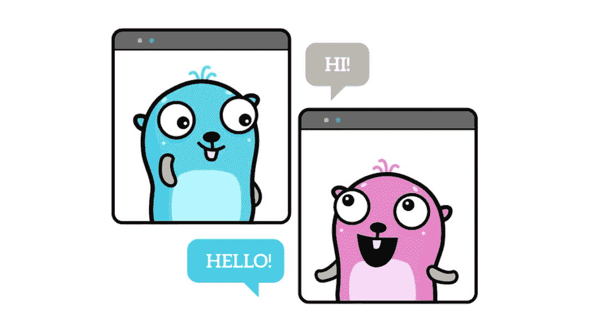

# 两个 Go 程序之间的 WebSocket 通信，简单的方法

> 原文：<https://itnext.io/websocket-communication-between-two-go-programs-the-easy-way-d8c9cf40043f?source=collection_archive---------2----------------------->

## 有一个提示，在 Docker 中运行围棋程序时

由 Renee French 创建的原始地鼠图像，使用由 Maria Letta 创建的地鼠图像

写这篇文章的目的只有一个:向您展示如何使用 WebSockets 在两个 Go 程序之间进行通信。最简单的方法。

本文是由[彼得·贾霍达](https://medium.com/u/6f72c855da06?source=post_page-----d8c9cf40043f--------------------------------)撰写的系列文章的独立补充，明智的做法是将这种类型的交流纳入正确的服务行为(系列文章的第 2 部分)。

 [## 以简单的方式创建 Go 服务

### 适用于 Windows、Linux、MacOS 和 Docker

medium.com](https://medium.com/swlh/create-go-service-the-easy-way-de827d7f07cf) 

当使用 WebSockets 时，一个程序必须充当服务器。

但是可以有许多其他程序作为客户端。在本文中，我们将创建一个服务器和一个客户端。戈兰将是我们的首选。

# WebSocket 服务器

服务器的代码非常简单。而且因为不想多此一举，我们就用`gobwas`模块。

下面是运行在端口 8080 上的 WebSocket 服务器的代码

服务器除了等待连接、打印接收到的数据并最终发回一条消息(随机整数)之外什么也不做。

如果一个客户端断开连接(或者有人停止了程序)，它将打印一个关于这个断开连接的信息。

# WebSocket 客户端

客户端的代码是类似的。同样，我们将使用`gobwas`模块。

客户端通过端口 8080 连接到本地主机。

这个客户端除了连接、发送消息(随机整数)和打印发送回来的内容之外，没有做任何特别的事情。

# 测试通信

我同时负责这两个项目。

在左侧，您可以看到服务器结果。
右边，客户端结果。

一张图片胜过千言万语。不管是 gif 还是几百万字。

这是结果。

客户端每 5 秒钟向服务器发送一个随机数。服务器用另一个随机数作出响应。

仅此而已。两个程序之间的通信。完成了。

如果您停止服务器，您将在客户端看到服务器已断开连接。如果您再次启动服务器，客户端会再次连接。

你可以期待同样的行为以另一种方式出现。如果您停止客户端，服务器将打印一条消息，表明客户端已断开连接。如果您再次运行客户端，它会再次连接。

# 结果

因为 Go 大量用于服务和/或微服务，所以在这些服务之间进行通信是有意义的。

WebSockets 对一些应用程序结构有用，对另一些则没用，但是在你的口袋里有一个工具，知道你如何使用它总是好的。

# 码头工人小费

一个提示，如果你正在使用 Docker(就像我们经常使用的那样):你可以创建一个 Docker 服务器服务(例如，用一个名字`ws-server`)，运行在端口 8080 和 Docker 客户端服务上。

通过使用 Docker Compose 文件，客户端可以连接到`ws://ws-server:8080/`，而无需知道正确的 ip 地址。

# 更新

这里有一篇关于普通套接字通信的文章。

[https://petrjahoda . medium . com/plain-socket-communication-between-two-go-programs-the-easy-way-bd5ac 5819 EB 6](https://petrjahoda.medium.com/plain-socket-communication-between-two-go-programs-the-easy-way-bd5ac5819eb6)