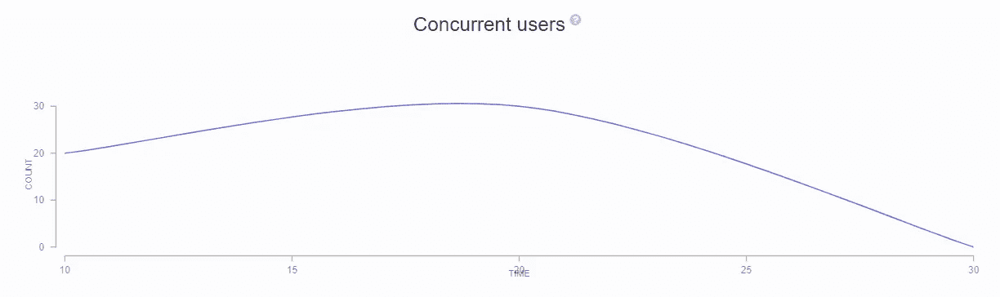
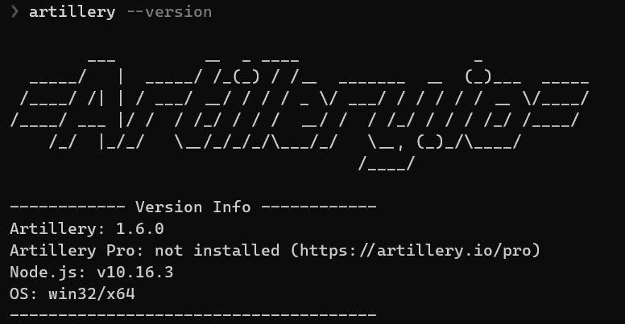
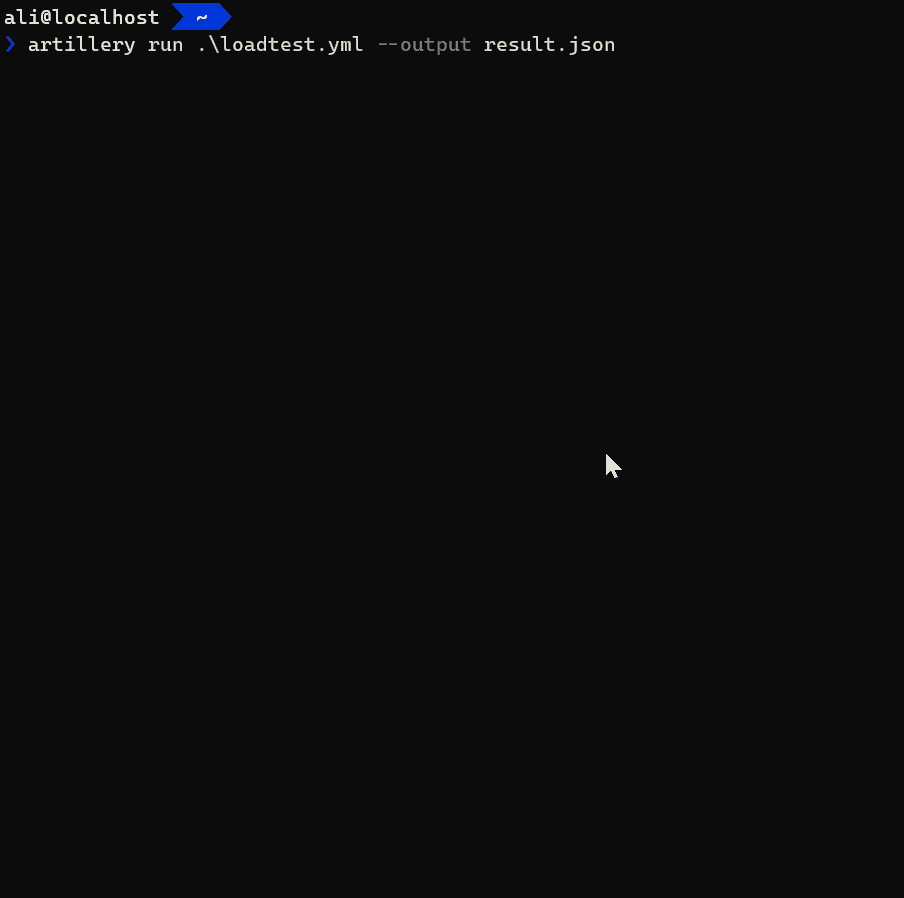
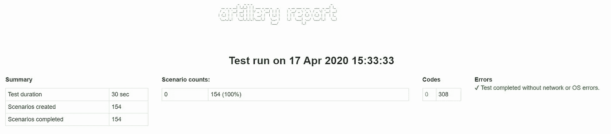

# 用 cannon . io 进行 WebSocket 负载测试

> 原文：<https://itnext.io/websocket-load-testing-with-artillery-io-b8b7ecbcd7ed?source=collection_archive---------1----------------------->

这篇文章背后的故事始于在树莓 Pi 3 B 上的 [Windows 物联网核心](https://developer.microsoft.com/en-us/windows/iot/)上测试[ASP.NET 核心 WebSocket](https://docs.microsoft.com/en-us/aspnet/core/fundamentals/websockets?view=aspnetcore-3.1) 性能的想法。网；都是关于用[cannon . io](https://artillery.io/docs/)进行 WebSocket 负载测试。

## 什么是炮兵 io？

火炮是一个先进的，强大的和易于使用的负载测试和功能测试工具包。使用它来发布在高负载下保持高性能和弹性的可扩展应用程序。它支持从延迟到并发用户的各种报告。



## 炮兵入门. io

cannon 是用 [Node.js](http://nodejs.org/) 编写的，这意味着它已经是跨平台的，你可以很容易地开始使用它，而不需要任何其他依赖。在开始使用它之前，确保你已经在你的机器上安装了[node . js 10 . 16 . 3](https://nodejs.org/en/download/)(LTS 版本)或更高版本。

要安装火炮，运行以下命令:

*   npm 用户

```
npm install -g artillery
```

*   纱线用户

```
yarn global add artillery
```

💡如果不知道[纱包管理器](https://yarnpkg.com/)是什么，用 npm 安装。

安装可能需要一些时间。运行`artillery — version`命令检查安装是否正确。我使用的是 1.6 版本，这是我写这篇文章时的最新版本。



火炮-版本输出

## 设计负载测试方案

首先，在尝试配置任何负载测试器来测试您的服务之前，有必要设计您的负载测试场景。我有一个简单的 echo WebSocket 服务器，运行在 Windows 物联网核心和 Raspberry Pi 上。

我喜欢将我的负载测试场景分为两个阶段:

*   预热 web 套接字服务
*   尝试实现服务、操作系统和硬件的全部容量
*   错误率应低于 1%
*   每个虚拟用户应该发送一个问候，等待 3 秒钟，然后发送另一个消息

Artillerry.io 测试剖面是 YAML[格式。我开始在 YAML 文件中创建我的测试场景概要文件。](https://en.wikipedia.org/wiki/YAML)

```
config:
  target: "ws://10.10.10.1:5000/ws"
```

将目标更改为您的 WebSocket 服务地址。如果你有一个安全的 WebSocket 服务，不要忘记使用`wss://`协议。

**错误率应低于 1 个百分点:**

```
config:
  target: "ws://10.10.10.1:5000/ws"
  ensure:
    maxErrorRate: 1
```

确保选项有什么作用？当在 CI/CD 管道中运行火炮时，当条件不满足时，用非零代码让火炮退出可能是有用的。根据我的设想，最大错误率不应大于 1 %;通过在`ensure`内添加`maxErrorRate:1`，在测试过程中满足了这一要求。

💡cannon . io 支持大量保障因素，你可以在[官方文档](https://artillery.io/docs/script-reference/#setting-success-conditions-with-ensure)上找到。

**负载测试期间的不同阶段:**

```
config:
    target: "ws://10.10.10.1:5000/ws"
    ensure:
      maxErrorRate: 1
    phases:
      - duration: 20
        arrivalRate: 5
        rampTo: 10
        name: "Warming up"
      - duration: 60
        arrivalRate: 10
        rampTo: 100
        name: "Max load"
```

我定义了两个阶段:热身和最大负荷。

💡*您可以定义任意多的不同阶段，但不要忘记为它们定义一个名称。*

第一阶段运行 **20** 秒，到达速率为 **5** ，这意味着每秒有 **5** 个新用户加入测试。通过 **rampUp** 选项，火炮将到达率从 **5** 增加到 **10** 。第二阶段运行时间为 **60** 秒，每秒应向 **100** 添加 **10** 个新用户。

负载测试概要文件的最后一部分是定义操作或场景。在我的场景中，每个虚拟用户首先发送一条 hello 消息，他们等待 3 秒钟，然后发送另一条消息。

```
config:
    target: "ws://10.10.10.1:5000/ws"
    ensure:
      maxErrorRate: 1
    phases:
      - duration: 20
        arrivalRate: 5
        rampTo: 10
        name: "Warming up"
      - duration: 60
        arrivalRate: 10
        rampTo: 100
        name: "Max load"
scenarios:
  - engine: "ws"
    flow:
      - send: "hello"
      - think: 3
      - send: "how are you?"
```

如果您仔细查看场景部分，您会发现首先我将引擎定义为 WebSocket。在流程内部，起初每个虚拟用户发送一个“你好”，它等待 3 秒钟；然后它发送“你好吗？”为服务干杯。

现在，将文件保存为`loadtest.yml`。要运行测试，请运行以下命令:

```
artillery run .\loadtest.yml --output result.json
```

它让 cannon 使用您的测试概要文件运行测试，并将报告以 **JSON** 格式保存为 **result.json** 。如果你的 YAML 文件格式正确，你会看到如下视频:



您可以从控制台的负载测试中读取一些有用的信息，但是我们要求 cannon 将结果保存在一个 JSON 文件中。cannon 可以将 JSON 结果转换成人性化的 HTML 报告。

```
artillery report .\result.json
```

通过运行上面的命令，它将生成 HTML 报告并在浏览器中打开它。



关于每秒请求、延迟、并发用户等的不同图表。

## **结论**

cannon 是一个强大的工具，可以对你的 WebSockets 进行负载测试。它易于配置，并且支持您的负载测试场景的各种配置。你可以在[官方文件](https://artillery.io/docs/ws-reference/)中了解更多关于它的特性。

负载测试愉快！