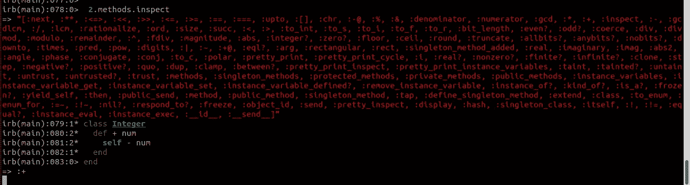

# 我在开发过程中遇到的奇怪事情解释如下

> 原文：<https://itnext.io/weird-things-i-encountered-in-my-development-journey-explained-545de8b5ac31?source=collection_archive---------5----------------------->

## Ruby:几乎所有东西都是对象



在了解 Ruby 的早期，我建议我的朋友读几本书来学习这门语言。我们只是浏览一下这本书，因为我们认为我们已经很擅长这门语言了，因为我们创建了我们的 [*巧妙的杂货店销售应用程序，它也销售文具*](https://shanshaji.medium.com/weird-things-i-encountered-in-my-development-journey-explained-210b1aae7cfc) *。但是第一段深深震撼了我们——它让我们意识到，像所有的新手开发者一样，我们也有过不合理自信的时候。*

> [**你操纵的一切都是对象，那些操纵的结果本身就是对象。**](https://ruby-doc.com/docs/ProgrammingRuby/html/intro.html)

是的，甚至是字符串和数字！嗯，这确实有道理，不然字符串怎么会有 object_id 方法呢？你操作的一切都是对象，即使它是整数、字符串、数组等等。因此，如果一切都是对象，而对象是类的实例，那么应该存在用方法定义的类。由于 object_id 同时存在于 integer 类和 string 类中，我们以为会有一个父类。我们可以用`ancestors`方法来查找:

```
1.object_id
=> 3
1.class
=> Integer
1.class.ancestors
=> [Integer, Numeric, Comparable, Object, PP::ObjectMixin, Kernel, BasicObject]"Foo".class.ancestors
=> [String, Comparable, Object, PP::ObjectMixin, Kernel, BasicObject]
```

几乎所有的 Ruby 类都自动从 Object 类继承，这解释了为什么我们在几乎所有的东西中都有 object_id 方法。所有的 Ruby 对象都是与生俱来的能力，它们知道如何执行这些能力，因为它们是 Ruby 对象。

这本书的前几行给了我们很多启示。我们知道一切都是对象，我们向对象发送消息/调用对象上的方法。我们愉快地回到了随意浏览 Ruby 文本的状态。

这时，我的朋友拦住了我，问我“那么数学运算符是如何工作的呢？”对此我回答道，“你说‘怎么做’是什么意思？”"

"好吧，如果一切都是一个对象，如果我们在一个对象上调用方法，`a + b`是如何工作的？"嗯，这让我很惊讶，我从来没有想过。为了更好地了解这一点，我做的第一件事是通过调用整数实例上的`methods`来检查整数可用的方法。

```
2.methods # Returns an array of public and protected methods
```

`methods`返回了大量公共的和受保护的方法，包括`+`方法，它帮助我们理解`a + b`是解析器魔术，它粗略地将其转换为`a.+ b`

```
1 + 2
=> 3
1.+(2)
=> 3
```

所以为了在幕后证明`a + b`调用`a.+(b)`，我决定开放 Integer 类并改变`+`方法以返回减去的值而不是增加的值。

*   *由于某种原因，这段代码在 irb 中不工作，但在 pry 中工作正常。*

```
class Integer
  def +(num)
    self - num   # self is the integer on which + method is called
  end
end
=> :+
2 + 3
=> -1
```

简而言之，“你在 Ruby 中处理的所有东西要么是一个对象，要么是一个计算结果为对象的构造，每个对象都是某个类的一个实例。”明白吗？