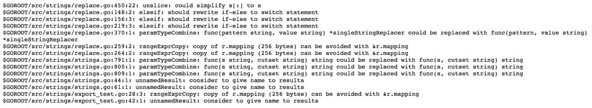

# 欢迎围棋评论家

> 原文：<https://itnext.io/welcome-go-critic-a26b6e30f1c6?source=collection_archive---------2----------------------->


我们将为 [Go](https://golang.org/) 发布一个新的 linter，它也将成为在静态代码分析的世界中为你的想法建立原型的沙箱。

go-critical 基于这些观察:

*   有一个“足够好”的实现总比没有好。
*   如果一个检查是自以为是的，这并不意味着它一点用都没有，我们可以把它标记为“自以为是”并试一试。
*   从头开始编写另一个 linter 总是比在一个简单且支持良好的现有平台上添加一个新的检查更难。

在这篇文章中，我们将描述 go-critic 的架构，有些已经[实现了 checks](https://go-critic.github.io/overview.html) 并从头开始编写新的 check。

## 快速启动

```
$ cd $GOPATH
$ go get -u github.com/go-critic/go-critic/...
$ ./bin/gocritic check-package strings
```



见完整输出:[https://gist . github . com/quasi lyte/22db 23699108 a0a 04 ce 7544 a 552 C6 CAA](https://gist.github.com/Quasilyte/22db23699108a0a04ce7544a552c6caa)

[gocritic](https://github.com/go-critic/go-critic/tree/master/cmd/gocritic) 程序能够通过导入路径检查单独的包(检查包命令)，并递归扫描给定目录的整个树(检查包命令)。例如，您可以通过以下命令之一在整个 GOROOT 或 GOPATH 上运行`gocritic`:

```
$ gocritic check-project $GOROOT/src
$ gocritic check-project $GOPATH/src
```

有计划将 go-critic 添加到 gometalinter 中。

## 它是如何开始的

在对一个 Go 项目进行常规的代码审查或审计第三方库时，你会一次又一次地看到同样的问题。

不幸的是，你还没有找到一个可以检测到这种问题的棉绒。

您的第一步可以是问题分类，然后联系一些现有的 linter 维护者来提出一个新的检查。你的提议被批准和合并的机会很大程度上取决于项目，可能很低。此外，这可能需要一些时间…

但是如果你的支票有争议，有人可能会认为它非常固执己见，那该怎么办呢？

`go-critic`被创建成为一个沙箱和这样的检查的家，这比要求合并到现有的 linter 中更容易实现。

`go-critic`最小化制造新棉绒的工作量。我们可以说只添加一个文件就足够了(除了测试😉).

## `go-critic`是如何工作的？

Critic 是描述诊断属性的规则和执行源代码检查以发现违反规则的微提示(检查器)的集合。

嵌入 linter 的应用程序(例如 [cmd/gocritic](https://github.com/go-critic/go-critic/tree/master/cmd/gocritic) 或 [golangci-lint](https://github.com/golangci/golangci-lint) 接收支持的规则列表，根据它们的属性过滤它们，创建一个检查函数并在分析包中运行它们。

添加新的 checker 包括 3 个步骤:

*   添加测试
*   添加 check 的实现
*   为 linter 添加文档

让我们为建议重命名以大写字母开头的参数的 [captLocal](https://go-critic.github.io/overview.html#captLocal-ref) linter 完成所有这些步骤。


## 添加新测试

为了添加新检查的测试数据，我们需要在 [cmd/gocritic/testdata](https://github.com/go-critic/go-critic/tree/master/cmd/gocritic/testdata/captLocal) 中创建一个新目录。

每个目录都必须有一个 [positive_tests.go](https://github.com/go-critic/go-critic/blob/master/cmd/gocritic/testdata/captLocal/positive_tests.go) 来描述必须触发检查的代码示例。为了测试假阳性情况的存在，我们可以(并且应该😉)创建 [negative_tests.go](https://github.com/go-critic/go-critic/blob/master/cmd/gocritic/testdata/captLocal/negative_tests.go) 其中不得触发检查。

## 例子

编码:[https://gist . github . com/cristaloleg/8 cbccc 3 eedc 63 E4 b 05921 BF 09895 FDE 1](https://gist.github.com/cristaloleg/8cbccc3eedc63e4b05921bf09895fde1)

编码:[https://gist . github . com/cristaloleg/52 fc 78 c 911 e 03d 53 a 1 AEC 6a 87 ad 8 a 634](https://gist.github.com/cristaloleg/52fc78c911e03d53a1aec6a87ad8a634)

要运行 test，只需运行以下命令之一:

```
$ go test -v ./...
# or
$ make test
```

## 实现检查器

让我们创建一个`lint/captLocal_checker.go`

按照惯例，所有带检查的文件都有后缀`_checker.go`

编码:[https://gist . github . com/cristaloleg/2073d 243 af 04 F4 Fe 9512 f 73 c 342d 8056](https://gist.github.com/cristaloleg/2073d243af04f4fe9512f73c342d8056)

[checkerBase](https://github.com/go-critic/go-critic/blob/master/lint/checker_base.go) 是每个 checker 都必须嵌入的类型。它提供了有用方法的默认实现，允许在每个 linter 中编写更少的代码。

`checkerBase`还包含一个指向`lint.context`的指针，它包含关于被检查的包的类型信息和其他元数据。

字段`upcaseNames`将包含一个著名名称的地图，我们将建议用小写版本的名称来替换。对于所有其他的名字，我们建议不要使用大写形式。

对于每个 checker 实例，内部状态初始化一次。

`Init`必须只为那些需要一些状态初始化的 linter 定义方法。

编码:[https://gist . github . com/cristaloleg/8b 98569 CB 86 ff 46 c 95 b 9441 CB 70110 EC](https://gist.github.com/cristaloleg/8b98569cb86ff46c95b9441cb70110ec)

现在我们要实现验证功能。在`captLocal`的情况下，我们需要验证所有提供新变量的`ast.Ident`节点。

为了验证所有的局部变量定义，我们需要实现一个带有以下签名的方法:

```
VisitLocalDef(name astwalk.Name, initializer ast.Expr)
```

所有可用访问者接口的列表可以在[lint/internal/visitor . go](https://github.com/go-critic/go-critic/blob/master/lint/internal/astwalk/visitor.go)中找到

`captLocal`实现`LocalDefVisitor`。

编码:[https://gist . github . com/cristaloleg/d07e 51265 b 99 B4 D1 a2 beee 3c 1036 fefc](https://gist.github.com/cristaloleg/d07e51265b99b4d1a2beee3c1036fefc)

按照惯例，触发警告的方法被排除在单独的方法之外。有一些罕见的例外，但是遵循这个规则是一个很好的实践。

最后也是非常重要的一步:

编码:[https://gist . github . com/cristaloleg/3249 c 76b 3343 df 74 CB 220 fa 52 e 00 e 21 b](https://gist.github.com/cristaloleg/3249c76b3343df74cb220fa52e00e21b)

`addChecker`需要一个指向新 linter 的零值的指针和一个可选的可变参数，该参数允许我们指定 linter 的属性。

`attrSyntaxOnly`是 linters 的可选属性，不依赖于验证代码中的类型信息。例如，`golang-lint`将这种棉绒标记为`fast`(因为它们速度很快😉).

现在，当我们通过`addChecker`注册了新的 linter，就可以运行测试了:

```
# From GOPATH:
$ go test -v github.com/go-critic/go-critic/cmd/gocritic# From GOPATH/src/github.com/go-critic/go-critic:
$ go test -v ./cmd/gocritic# or run it as a make command:
$ make test
```

## 添加文档

为了描述新的 linter，我们需要在实现文件中添加一个“神奇”的注释，这里是来自`captLocal_checker.go`的注释

代码…好评论:[https://gist . github . com/cristaloleg/c 403 c 45 F4 a3 b 32 b 9 a5 BFF 8 c 64 a 21 a 094](https://gist.github.com/cristaloleg/c403c45f4a3b32b9a5bff8c64a21a094)

此注释的结构是严格的，并在文档生成过程中得到验证。最简单的文档注释由简短的一行摘要和两个部分`Before`和`After`组成。

## 乐观合并，差不多…

在拉取请求审查期间，我们试图遵循[乐观合并](https://rfc.zeromq.org/spec:42/C4/)。总的来说，这意味着我们将合并一些有小的不一致的公关或未来改进的地方。就在那次公关合并之后，可能会有下一个来自审查者的公关，该审查者将修复上一个公关的遗留问题。最初的补丁作者将在这个后续的公关 CCed😉。

如果没有达成共识，linter 有两个标记可以避免被拒绝:

*   `Experimental` —实施可能会有大量的误报、无效(但问题的根源已经确定)或在某些极端情况下失败。这种实现可以和`attrExperimental`属性合并。这个属性也可以用于名称不明确的棉绒。
*   `VeryOpinionated` —对于 linter 的实现，有利弊。这将防止棉绒由于地鼠之间的一些代码风格偏好差异而被拒绝。`attrVeryOpinionated`属性用于此棉绒。

我们建议在发送一个实现之前，在 github 上创建一个问题，但是如果你以前做过一个实现并且做过公关，没问题，其他人会为你创建一个问题。

关于开发过程的更多信息可在 [CONTRIBUTING.md](https://github.com/go-critic/go-critic/blob/master/CONTRIBUTING.md) 中找到。

主要规则在[主要规则](https://github.com/go-critic/go-critic/blob/master/CONTRIBUTING.md#code-review-main-rules)部分描述。

## 编后记

除了添加新支票之外，还有其他贡献方式，例如:

*   在你或其他人的代码上运行它，在大型或小型项目上，在开放或封闭的源代码库中，分享误报、漏报或其他特性，有趣的发现，任何你认为有趣的分享。如果您能在[奖杯页面](https://go-critic.github.io/trophies.html)添加注释，我们将不胜感激。
*   提出新的想法。增加一个新的[问题](https://github.com/go-critic/go-critic/issues/new)就够了。
*   为现有检查添加测试。

go-critical 用许多 Go 开发者的声音批评你的代码。

每个人都可以批评——加入我们吧！


是啊，像素眼镜😎

原文:【https://habr.com/post/414739/ 