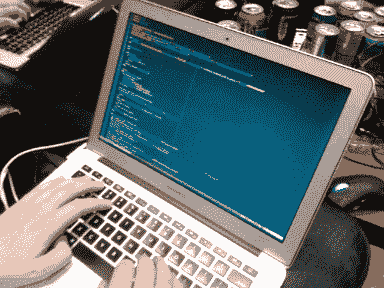

# 教程:如何在 Go 中使用 JSON 数据

> 原文：<https://itnext.io/welcome-to-just-enough-go-7dbef7e30188?source=collection_archive---------2----------------------->

欢迎来到**刚够走**！这是关于 [Go 编程语言](https://golang.org/)的系列文章中的第一篇，在这篇文章中，我将介绍一些最常用(也是最常用)的 [Go 标准库包](https://golang.org/pkg)，例如`encoding/json`、`io`、`net/http`、`sync`等。我计划保持这些相对简短的例子驱动。

的代码可在[这个 GitHub repo](https://github.com/abhirockzz/just-enough-go) 中找到

> 如果您想让我介绍一些具体的围棋话题，我将非常乐意接受您的建议！请随意发表 [*推文*](https://twitter.com/abhi_tweeter) *或发表评论😃*

本文涵盖了处理 JSON 和 Go 类型之间转换的`[encoding/json](https://golang.org/pkg/encoding/json/)`包(根据 [RFC 7159](https://tools.ietf.org/html/rfc7159) )。让我们直接跳进来吧！



# 将 Go 类型转换成 JSON

## 整理

一个常见的选项是使用`Marshal`函数，其签名为:

```
func Marshal(v interface{}) ([]byte, error)
```

这里有一个例子:

```
func main() {
    profile := Profile{Email: "abhirockzz@gmail.com", Username: "abhirockzz", Blogs: []Blog{
        Blog{BlogName: "devto", URL: "https://dev.to/abhirockzz/"},
        Blog{BlogName: "medium", URL: "https://medium.com/@abhishek1987/"},
    }}
 **jsonData, err := json.Marshal(&myprofile)**    //jsonData, err := json.MarshalIndent(&profile, "", " ")
    if err != nil {
        panic(err)
    }
    fmt.Println(string(jsonData))
}
```

> *您可以使用* `*MarshalIndent*` *(已注释)来缩进 JSON 输出*

## 编码器

当`Marshal`处理字节数组(`[]byte`)时，`Encoder`是通用的，允许您使用`io.Writer`，您可以将它定义为 JSON 数据的接收器，也就是说，您可以指定实现`io.Writer`接口的任何类型，例如，这可以是标准输出(`os.Stdout`)，或者 HTTP 响应(`http.ResponseWriter`)，等等。

```
func main() {
    profile := Profile{Email: "abhirockzz@gmail.com", Username: "abhirockzz", Blogs: []Blog{
        Blog{BlogName: "devto", URL: "https://dev.to/abhirockzz/"},
        Blog{BlogName: "medium", URL: "https://medium.com/@abhishek1987/"},
    }} encoder := json.NewEncoder(os.Stdout)
 **err := encoder.Encode(&profile)**    if err != nil {
        panic(err)
    }
}
```

使用`NewEncoder`指定`io.Writer`。当您调用`Encode`时，转换发生，JSON 被写入到您指定的`io.Writer`中。

下面是它如何处理 HTTP 响应的示例:

```
func main() {
    profile := Profile{Email: "abhirockzz@gmail.com", Username: "abhirockzz", Blogs: []Blog{
        Blog{BlogName: "devto", URL: "https://dev.to/abhirockzz/"},
        Blog{BlogName: "medium", URL: "https://medium.com/@abhishek1987/"},
    }} http.HandleFunc("/", func(w http.ResponseWriter, r *http.Request) {
        encoder := json.NewEncoder(w)
 **err := encoder.Encode(&profile)**        if err != nil {
            panic(err)
        }
    }) http.ListenAndServe(":8080", nil)
}
```

# 将 JSON 数据转换为 Go 类型

## 解组

给定字节数组形式的 JSON，`Unmarshal`将 JSON 解析结果存储到您指定的 Go 数据类型的指针中(通常是一个`struct`

```
func Unmarshal(data []byte, v interface{}) error
```

这里有一个简单的例子:

```
func main() {
    jsonData := `{"email":"abhirockzz@gmail.com","username":"abhirockzz","blogs":[{"name":"devto","url":"https://dev.to/abhirockzz/"},{"name":"medium","url":"https://medium.com/@abhishek1987/"}]}`

    var profile Profile
 **err := json.Unmarshal([]byte(jsonData), &profile)**    if err != nil {
        panic(err)
    }
    ...
}
```

## 解码器

`Decoder`提供了一种解组 JSON 数据的通用方法，允许您以`io.Reader`的形式指定 JSON 输入源，而不是字节数组。

```
func main() {
    jsonData := `{"email":"abhirockzz@gmail.com","username":"abhirockzz","blogs":[{"name":"devto","url":"https://dev.to/abhirockzz/"},{"name":"medium","url":"https://medium.com/@abhishek1987/"}]}`

    jsonDataReader := strings.NewReader(jsonData)
    decoder := json.NewDecoder(jsonDataReader) var profile Profile
 **err := decoder.Decode(&profile)**    if err != nil {
        panic(err)
    }
    ...
}
```

我们从使用快捷方式`strings.NewReader`从 JSON `string`数据创建一个`io.Reader`开始。然后我们可以使用`NewDecoder`实例化解码器，并简单地使用`decode`和一个指向存储结果的`Profile`结构的指针

这个博客到此为止！敬请关注更多内容，不要忘记喜欢和关注😃😃