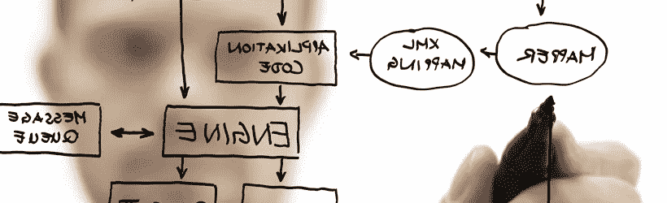

# 在(IT)体系结构下工作；时尚界还是时尚界？

> 原文：<https://itnext.io/werken-onder-it-architectuur-modegril-of-bittere-noodzaak-dd47c38776cf?source=collection_archive---------0----------------------->

在建筑下工作对很多人来说是一个模糊的相对未知的概念，尽管每个人都听说过。当您在 IT 部门工作时，您会听到“也许我们应该考虑采用体系结构”。那是什么意思？有什么用？或者是时装罢了。这到底是不是一个技术上的故事？从不同的角度来阐述这一主题似乎很有意义，这样大家就可以对在建筑下工作的重要性及其增加的价值形成看法。

我认为，组织在架构下工作时，可以取得很多资料。在发展和趋势(尤其是 IT 领域)迅速同步的时代，it 基础架构的可重用性、可扩展性和灵活性对企业的持续成功至关重要。从我的角度来看，对 IT 体系结构没有清晰的愿景的组织(例如，从没听说过服务导向体系结构(SOA)或服务导向体系结构(SGA)，很难根据快速变化的市场情况调整 it 服务。IT 不再是企业的成本中心或服务中心，而是越来越多地成为推动新业务策略的业务启用者。当您以这种方式看待 IT 时，您会发现业务和 IT 可以极大地相互促进，共同成就大事。你可能会说，在体系结构下工作会导致企业 IT 调整。

## **也有症状**

一般而言，缺乏对 IT 环境的洞察力、一致性、可管理性和可见性，通常是一个组织无法在体系结构下工作的信号。项目的时间和资金预算超支、技术和工具的使用方式激增、业务连接中断以及体系结构组件之间未知的依赖关系造成的意外影响，通常都是特定的信号。多年来，许多组织的 IT 环境因应用程序、管理解决方案、流程更改等而变得一片混乱。IT 环境的监控和可管理性几乎是一项尚未起步的工作，尤其是管理预算每年都在紧缩。因此，组织经常会遇到需要改变的情况。解释得好！

## **也就是解决方案**

在建筑之下工作！这是否立即解决了所有问题，并且易于输入？当然不会，但这是创建概述并保持 IT 环境可管理性和可控制性以及着眼于未来的重要第一步。体系结构为组织内外的每个人提供了框架和持久性。请考虑一下链合作伙伴和行业战略合作伙伴，例如，通过体系结构标准，您可以轻松地共享数据和连接系统。最初，大多数阻力来自于多年来习惯于自己做出选择的开发人员和管理员。本集团天生就喜欢使用他们最喜欢的工具、程序和解决方案，但他们必须认识到自己是更大整体的一部分，在这一整体中，最佳解决方案并不总是最适合他们的组织。

## **谨记葛氏始于**

你不会没有设计和地基就盖房子吧？

当您开始开发、构建和管理产品时，如果知道基础知识、原则和标准并加以遵守，将会容易得多。在 IT 领域，这是不一样的。在体系结构下工作并不是目的，而是帮助组织掌握信息资源和整体业务。业务目标和策略始终是体系结构和 it 基础。此外，IT 体系结构必须支持策略的实施。

从各种研究中发现，但更重要的是，实际上，在体系结构下工作可以为组织带来巨大的价值，同时还可以节省成本。但是，情况并非总是如此。组织、领导能力、远见和共享的紧迫感证明是成功的关键因素。

## **在体系结构下工作的组织表现更好**

建筑对很多人来说是非常复杂和技术性的，但实际上并不需要。体系结构主要是一种管理工具，用于支持组织的专业化，并协调体系结构、业务体系结构、应用程序体系结构和技术体系结构的一致性。

在本节中，我前面提到了一些信号，这些信号表明需要在体系结构下工作。很明显，清晰的建筑观会破坏负面的信号。事实证明，在体系结构下工作的公司，信息和服务的提供更有效率、更有效率，并且采用了明确的策略。内部或外部开发所需的业务流程、信息和技术基础架构调整正在进行，称为业务 IT 调整。简而言之，在体系结构下工作的组织比在体系结构下工作的组织表现更好

在文学作品中，你会看到不同的定义和建筑形式。在不声称这是“唯一”真相的情况下，我认为以下格式在实践中经常得到认可。

*   企业架构
*   解决方案体系结构
*   域体系结构
*   体系结构应用程序
*   红外线架构

无论如何，体系结构是由链中相互依赖的不同组件组成的。每一种新的科技都会产生连锁问题。例如，不要将云和移动等发展视为理所当然。要将云服务或其他“服务”集成到现有环境中，您需要对上下文和依赖关系进行概述和了解。体系结构提供了提高透明度和可管理性所需的框架和准则。因此，在体系结构下工作对业务流程、组织和 IT 环境都有很大影响。因此，要在组织中嵌入体系结构，必须注意流程以及正确的职责和结构角色的指定。

## **第一步**

在尝试采用体系结构的过程中，您会发现企业通常倾向于将组织中最有经验的 IT 人员提升为 IT 架构师，然后继续每天的工作。请注意，此方法不会产生预期的结果。

当一个组织在体系结构下工作时，通常会采用特定的标准，如在政府内部的 Nora 或 Gemma。此外，在“产品”的基础架构下工作通常会节省一些成本，例如目标体系结构、企业体系结构和项目启动的体系结构(包括应用程序、信息、流程和技术基础架构的前景)。

## **但是瓦尔基里**

在建筑之下工作的好处太多了。谁不想要一个完全符合组织策略的可管理和透明的体系结构国家/地区，以及所有组件都是透明和可管理的。但是，建筑之下的工作之路不仅仅是玫瑰，也不是从今天开始铺的。

它需要整个组织的时间、金钱和投入。在体系结构下工作可能是组织内部的一次重大变革，需要得到良好的指导。某些罢工者(例如，管理员和开发者)通常会采取消极的态度，即改变，因为他们在体系结构下工作被认为是对他们自由的限制。体系结构为设计和实现(it)解决方案提供了框架，并强调了组织的重要性，而不是个人或项目的重要性。这种限制并不总是有趣的，但从长远来看，只会带来积极的影响。例如，考虑更快的决策、一致的基础架构以及更高的组件灵活性和可重用性。

随着时间的推移，建筑的方向和具体填充也发生了变化。长期以来，体系结构都是由客户机/服务器计算决定的，但是随着 SaaS、PaaS 和 IaaS 等云服务和趋势的出现，面向服务的体系结构的原则变成了独立的应用程序/服务通过数字服务总线(例如。Biztalk 或 Tibco)已经在市场上得到广泛应用。实际上，您可能会发现，您的组织过于忙碌(通常是被动的)，无法在体系结构下正常工作，而且缺乏支持和支持。以及各种专门在体系结构下设置和实施工作的公司。例如，作为一个链接，一家公司在不同行业的不同大型组织中引入体系结构方面有着丰富的(实际的)经验，使他们能够借助适当的专业知识和人员，在组织中获得成功。

此外，您还可以获得支持在体系结构下工作的卓越系统。在这类系统中，您通常可以描述、记录和跟踪组织的所有体系结构方面。请考虑流程、人员、资源和 IT 基础架构。所有信息都是明确的、集中的和统一的。简而言之，可管理性的基础。

## **IT 体系结构标准、框架和模型**

当您深入了解 IT 体系结构的广泛领域时，您将很快发现标准、框架和模型的种类繁多。考虑到市场的广泛适用性和当前的相关性，我想在本白皮书中特别强调“服务导向体系结构”的核心和重要性。

TOGAF 是一个全面、公认的企业体系结构框架(由 Open Group 开发)，旨在提高业务工作效率，并提供一致的标准、技术和通信指导。它以市场上的最佳实践为基础，并且有一个流程方法。TOGAF 坚定不移地提供业务体系结构、信息系统体系结构、技术基础架构、实施管理和变革体系结构。TOGAF 的强大之处在于它是一个开放的标准框架，而且是独立于供应商的工具和技术。它是一个经过验证的成功框架，适用于面向服务的体系结构。

面向服务的体系结构(SOA)使服务从一个高度关注灵活性、模块化构建、可管理性和可重用性的体系结构模型发展而来。SOA 允许服务与应用程序下的操作系统、编程语言和其他技术分离。因此，应用程序可以轻松地相互通信，并且可以轻松地与呼叫服务和链集成。这些服务是根据业务流程分组的功能而构建的。

SOA 在许多情况下都是可重用性、可管理性、快速上市的解决方案，可实现独立运行的应用程序和系统的互连。一个良好的 ESB 层是不可或缺的。业务流程管理系统(BPM)可确定要调用哪些 web 服务组合来支持特定的业务流程。SOA 对于业务流程的一部分尤其有意义，这些业务流程会发生很大的变化，或者 IT 支持会遇到很多软件集成问题。SOA 的巨大优势(如灵活性、模块化构建、可管理性和可重用性)将最大化。SOA 现在非常流行，被认为是解决许多问题的方法。但是，请注意，并非所有应用程序都适合在 SOA 中进行部署。例如，高峰值负载的应用程序(例如，在税务部门)需要同时处理大量数据，从而导致性能问题，因此不太适合于面向服务的应用程序。因此，SOA 提供了许多优势，但也有许多限制和选项，这些限制和选项决定了机构。SOA 不是大爆炸技术，而是一种体系结构模型。在企业内部，it 通常会透过后门缓慢地进入，例如超越 SaaS 概念和应用程式的业务流程。

## **的结论**

在建筑下工作有很多形式和等级。重要的是，组织和 IT 环境都有明确的结构和变化，并且需要从一个协调的中心点进行管理。事实上，许多组织在技术、组织和应用方面的变革，对于在体系结构下工作都有很大的帮助。你能认出这出戏里的症状吗？因此，最好考虑在体系结构下引入工作。任何需要的变更都是从现状分析(IST)和期望的情况分析(SOLL)开始，以建立一个由体系结构惯例指导和推动的过渡计划。我对组织如何在体系结构下开始工作以及哪种标准最适合的观点可能是下一篇文章的有趣主题。

我们很乐意听听你的意见。透过连结社群媒体与我们分享: