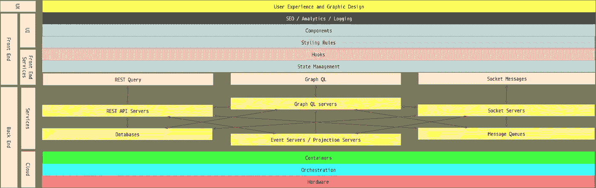
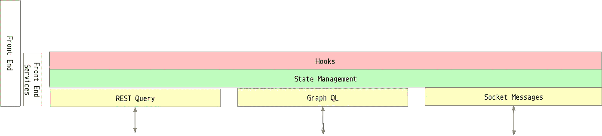
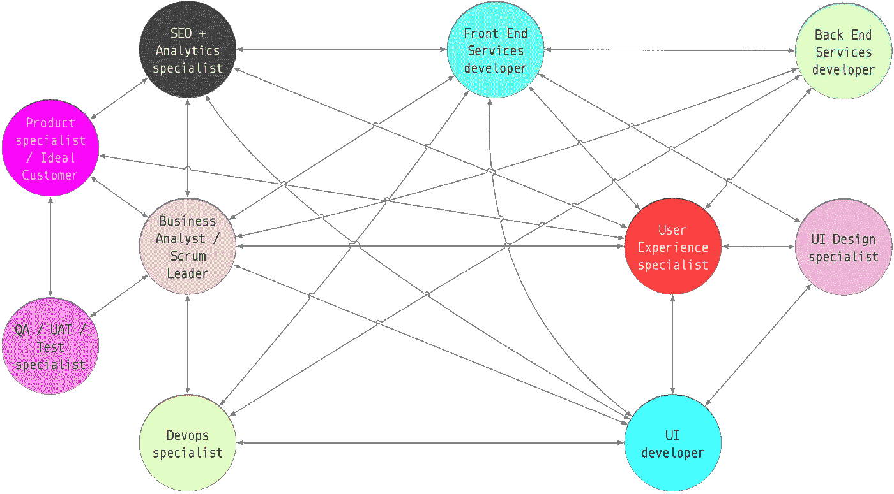

# 什么是前端服务层？

> 原文：<https://itnext.io/what-are-front-end-service-layers-4dba95db21bb?source=collection_archive---------0----------------------->


汉堡包是对 n 层应用程序各层的一个极好的比喻。[媒体新闻](https://www.flickr.com/photos/98756468@N04/9408040030/in/photolist-fkmEwJ-8Y2gTC-xRkYT-rc1SS-6RQRzy-CnwdEP-Cy1HqX-EVEk8e-5WJomt-xRnFC-vbHsiB-7hN55p-fi3WnV-58bYyM-4iErYj-8AiBhn-UkzWPN-7PXKka-UNEFLs-9rRuHB-tWvFhA-V45rn8-xjQDa-38PhYz-77vh29-ohFKxV-iaHYbD-9dVSHj-a6wbyK-8SsUm5-9UEw15-r788FD-BdrtY9-8rRDMD-8HBzFM-hwDXSq-peUZUy-7Y1cn2-dmvh8o-xjQGg-mMykHi-8GdKhL-CDZ91L-412ofm-h6rLvR-8HBzQn-WLHXZN-4PBtuM-qtE3ya-r8Zs9g)拍摄并在其[许可](https://creativecommons.org/licenses/by/2.0/)的期限内使用。

## 组成全栈项目团队的技能是什么？

当我在 1995 年开始构建 web 应用程序时，它们被称为数据驱动网站，当时令人兴奋的行话是“三层”。这个想法是一个 web 应用程序有三层。在浏览器中运行的前端显示“视图”层，而在后端则是“控制器”层(可能是一个 REST API，或者只是将“视图”呈现为 HTML 的代码)，以及“模型”层，这是一些易变数据的表示。(我知道 3 层架构比网站要早得多，但是直到 20 世纪 90 年代中期，很少有人听说过网站，更不用说 3 层或 MVC 架构了)。

随着时间的推移，后端的复杂性不断增加，出现了消息队列、事件源服务、带有与 REST APIs 和 WebSockets 交互的解析器的 GraphQL 服务，以及将数据存储在任何或所有 Postgres、Redis 和 MongoDb 类型的数据存储中的服务。并且需要部署和配置这些服务；那时候通常是在你自己的硬件上，但现在变成了云服务或容器，它们抽象了硬件并支持可编程的服务编排。

## 分离关注点

看到既需要后端开发人员又需要开发运维专家的需求并不罕见。当人们提到 Devops 时，他们往往指的是知道如何组合配置 AWS、GCP 和 Azure 的人，他们用 Perl、Puppet 脚本和 Kubernetes 配置等编写代码。对于那些编写 Java SpringBoot REST APIs、Ruby on Rails、Node JS、Elixir、Python 或其他服务的人来说，这显然是一套不同的技能，他们理解业务和流程建模，但他们的 Devops 技能通常扩展到创建一个`docker-compose.yml`文件和配置 CircleCI。

类似地，开发 UX 和应用程序设计方面的人，通常以草图文档或 Figma 文件或类似文件的形式交付，需要不同于网站分析和 SEO 方面的人和实际构建前端代码的开发人员的技能。大多数项目领导都认识到，进行独立的用户验收测试比仅仅信任开发人员要好得多。

然而，经常被忽视的是，在“前端开发人员”的保护伞下，真正获得结构和数据的开发人员与真正获得 CSS 的开发人员之间有着明显的区别，以及如何呈现用户实现 UX 和设计师愿景所需的数据和控件。

# 现代多层 web 应用程序

现代应用程序(无论是响应式 web 应用程序，还是在桌面或手机上运行的本机代码应用程序)都可以分为以下几层(您可以根据需要添加或删除一些元素，但这基本上就是现代应用程序的样子)。



现代 n 层应用程序架构看起来很像顶部照片中的汉堡，你不觉得吗？

## 现代后端

在最底层，我们有已故苏格兰小说家伊恩·M·班克斯所说的“[基础现实](https://www.goodreads.com/book/show/7937744-surface-detail)”。这是硬件层，一切都在其上运行。


这可能是您的开发笔记本电脑，运行由简单的`docker-compose.yml`文件编排的 docker 容器，也可能是基于云的系统，如 Amazon Web Services、Heroku、Google Cloud Platform 或 Microsoft Azure。事实上，这可能是一种混合，本地开发服务在本地容器中运行，而共享开发、准备和生产服务在一个主要的云服务上运行，通过 CI/CD 系统部署，如 CircleCI、Travis 或类似的服务。

在这些容器中运行的是传统的后端服务；REST API 服务器，通常带有用于实时交互的相关 Web Socket 服务器，带有相关视图和投影的数据库或事件源服务器，以及通过 GraphQL 解析器连接到其他服务的 GraphQL 服务器。通常，这些服务通过消息总线(如 RabbitMQ 或 Kafka)连接在一起。

后端如何工作与前端无关。后端做什么和前端需要的数据之间的抽象通常由一个或多个 REST APIs、WebSocket 连接或 GraphQL 服务来定义。

## 现代前端

UI 开发人员主要关心的是，当需要时，正确的数据和约定的`shape`被提供给他们的 UI 组件，并且 UI 中的用户活动发出的动作被解释和执行。



前端服务层(从上面的 n 层图中提取)

沿着堆栈向上，大多数现代前端使用某种状态管理层来处理用户生成的操作，以及来自后端套接字连接或 GraphQL 订阅的事件。前端还需要能够进行 API 或 GraphQL 查询，从后端请求数据，并将数据推送到后端；将响应转换成前端组件可以使用的状态数据。

这是**前端服务**层；位于样式规则和组件之下的层，在前端运行，获取和更新数据，并管理 UI 和后端之间的交互。

虽然这适用于几乎所有的现代 web 应用系统，无论是 Angular、Vue 还是 Svelte，但我最熟悉 React，因此，在 React 上下文中，UI 组件开发人员以服务挂钩的形式获得了她需要的所有处理程序和控件。(Vue 使用“复合函数”来达到类似的目的。)

## UX 和用户界面设计

在前端堆栈的最顶端是用户体验(UX)和设计层。这一层由 UX 和视觉设计专家合作开发，严格来说不是软件层，而是文档层。UX 专家计算出应用程序需要做什么，以及用户将如何使用该应用程序以一种让他们最开心的方式实现他们的目标。设计专家与 UX 专家密切合作，将愿景转化为线框图表、屏幕设计、字体选择和调色板。

一名优秀的业务分析师将与 UX 和设计人员以及应用程序的样本用户、构建应用程序的开发人员和分析团队密切合作，他们会影响与 SEO 相关的事情，如`slugs`与`ids`的使用、url 路由路径、标题等。

关于屏幕元素的决策必然会影响关于必须开发哪些组件、如何设计它们的样式、它们需要的数据以及它们需要处理的用户操作的决策。

> 但是一次又一次，我从事的项目错误地认为 UI 和前端服务开发人员之间没有区别。

前端编程团队通常会划分职责，更适合样式和组件设计的开发人员与设计人员更紧密地合作，而更适合建模用户操作和底层数据管理的开发人员与后端团队更紧密地合作。但是一次又一次，我从事的项目错误地认为 UI 和前端服务开发人员之间没有区别。

## 前端服务

让应用看起来像设计和 UX 专家所设想的那样所需的技能，与有效地对用户、数据和后端服务之间的交互进行建模所需的技能截然不同。在一个复杂的项目中，你需要比前端服务开发人员更多的 UI 开发人员。

在 React 上下文中，前端服务开发人员将专注于开发 React 挂钩集，以及 Redux 操作、reducers 和选择器。开发人员可以根据应用程序的特定需求，利用 API 和套接字管理器、GraphQL 查询系统、sagas 等中间件。(Vue 开发人员通常会使用 Vuex 之类的东西，Angular 开发人员可能会使用 NgRx，而 Svelte 开发人员可以使用 Stores，但值得注意的是，Redux 实际上并没有绑定到 React，几乎可以在任何地方使用。我写过使用 Redux 的 Node JS 命令行应用。)

UI 和前端服务开发人员必须从约定的数据表面开始工作，通常指定为组件可以用来验证输入的`shapes`文件，就像 GraphQL 或 OpenAPI 定义形成前端服务和后端之间的契约关系一样。

您的特定应用程序可能不使用 GraphQL(尽管 GraphQL 很棒，您确实应该使用它)，但它总是需要一种与数据交互和处理用户交互的方式。

# 示例:显示任务的简单组件

*如果您不关心 React / Redux JavaScript 代码示例，请跳过这一点(下面的“为什么不两者都要”)。*

举例来说，让我们想象我们的应用程序有一个允许用户显示任务的功能。所以我们需要定义什么是任务，一个显示任务的简单组件，以及一个用给定的`id`获取任务的服务。

## 什么是任务？

为了简单起见，我们假设一个任务有一个`id`、一个`title`和一个可选的`text`属性。我们需要定义一个任务的`shape`。通过事先达成一致，我们在 UI 和前端服务之间建立了一个*契约*。(Typescript 的粉丝当然会定义一个`Interface`而不是使用 React 的`prop-types`)

`src/services/tasks/shapes.js`

```
import { string } from 'prop-types'export const taskShape = {
  id: string.isRequired,
  title: string.isRequired,
  text: string
}export const taskDefaults = { text: null }
```

这里有一个简单的、功能性的 React 组件，如果它有一个`id`和`title`就显示一个任务，如果有`text`就显示它。

`src/components/ShowTask/ShowTask.js`

```
import {
  taskDefaults,
  taskShape
} from 'services/tasks/shapes'const ShowTask = ({ id, title, text }) => {
  if (!id || !title) return null return (
    <div>
      <h2>{title} ({id})</h2>
      {text && <p>{text}</p>}
    </div>
  )
}
ShowTask.propTypes = { ...taskShape }
ShowTask.defaultProps = { ...taskDefaults }export default ShowTask
```

## 任务服务

为了从后端加载任务，我们需要一个任务服务。假设我们使用 Redux 进行状态管理，并且有一个 REST API 公开了一个`/task/:id`端点，我们将需要一些调用 API 的动作，以及返回新状态的 reducers，给定一个先前的状态和一个动作。我们还需要一种方法来选择处于 Redux 存储当前状态的任务。

## 行动

为了简单起见，让我们假设我们正在使用不可思议的`[redux-api-middlware](https://github.com/agraboso/redux-api-middleware)`库来处理任务的获取。

`src/services/tasks/actions.js`

```
import { createAction } from 'redux-api-middleware'import { apiBase, headers } from 'config'export const taskLoad = *id* =>
  createAction({
    endpoint: `${apiBase}/task/${id}`,
    headers,
    method: 'GET',
    types: [
      'TASK_LOAD',
      'TASK_LOAD_SUCCESS',
      'TASK_LOAD_FAIL'
    ]
})
```

当被调度时，这个动作将被`redux-api-middleware`捕获，然后`dispatch`一个简单的`TASK_LOAD`动作，然后从`endpoint`获取任务数据。如果请求成功，中间件将把任务数据作为`payload`传递给`TASK_LOAD_SUCCESS`动作。如果请求失败，则`error`作为`payload`传递给`TASK_LOAD_FAIL`动作。

注意:`taskLoad`动作可以很容易地进行`GraphQL`查询，或者通过`WebSocket`连接发送消息。任何此类操作的具体实现都与提供数据的服务的性质相关联。有些人会认为使用`GraphQL`及其数据解析器会使 Redux 这样的状态管理系统变得无关紧要，但是我不同意这种观点。像这样的 Redux 动作的好处在于，无论数据传输层实际上是什么，逻辑都很容易封装和隔离在前端服务中的一致位置。

## 还原剂

我们需要 reducers 来执行这些操作，以保持共享的应用程序状态是最新的。

`src/services/tasks/reducer.js`

```
import { handleActions } from 'redux-actions'export const taskLoad = state => ({ ...state, loading: true })export const taskLoadSuccess = (state, { payload: task }) => ({
  ...state,
  loading: false,
  task: { ...task }
})export const taskLoadFail = (state, { payload: error }) => ({
  ...state,
  loading: false,
  error: error.toString()
})export const INITIAL_STATE = {
  loading: false,
  error: null,
  task: null
}export const handlers = {
  TASK_LOAD: taskLoad,
  TASK_LOAD_SUCCESS: taskLoadSuccess,
  TASK_LOAD_FAIL: taskLoadFail
}export default handleActions(handlers, INITIAL_STATE)
```

## 选择器

我们需要一个选择器，这样我们就可以轻松地从 Redux 状态中检索加载的任务。假设我们的服务的缩减器在`tasks`被安装到 Redux store 的`state`中，我们可以编写一个选择器，比如:

`src/services/tasks/selectors.js`

```
export const getTask = ({ tasks: { task } }) => *task*
```

## 钩住

为了对组件本身隐藏所有这些复杂性，任务服务公开了一个名为`useTaskLoader`的钩子，它在组件挂载时加载一个任务。

`src/services/tasks/hooks.js`

```
import { useEffect } from 'react'
import { useDispatch, useSelect } from 'redux'
import { taskLoad } from './actions'
import { getTask } from './selectors'export const useTaskLoader = id => {
  const dispatch = useDispatch()
  const task = useSelector(getTask) useEffect(() => {
    dispatch(taskLoad(id))
  }, [dispatch, id])

  return task
}
```

`useTaskLoader`钩子获取一个任务的`id`，获取 Redux `dispatch`函数，获取已经在 Redux store 的`state`中的任务，然后使用 React 的`useEffect`钩子通过提供的`id`来`dispatch`执行`taskLoad`动作。

只有当`dispatch`函数或`id`值改变时，该效果才会重新运行，但是`task`的值会随着`taskLoad`动作的副作用调用获取任务的 API 调用并分派`taskLoadSuccess`动作而改变

## 使用钩子

添加一个使用`useTaskLoader`钩子加载任务并将任务数据传递给纯`ShowTask`组件的组件。

`src/components/ShowTask/index.js`

```
import PureShowTask from './ShowTask'import { useTaskLoader } from './hooks'const ShowTask = ({ id }) => {
  const task = useTaskLoader(id)

  return <PureShowTask {...task} />
}
```

`ShowTask`从哪里得到它的`id`？假设在组件层次结构的较高位置，从位置路径(例如类似于`/task/:id`的路线)或从从任务概要列表中选择任务的某人处提取`id`。

## 应用程序结构

我们现在有了下面的应用程序结构，突出显示了`ShowTask/ShowTask.js`，这是 UI 开发人员需要关注的唯一组件:

```
src/
  config.js
  components/
    ShowTask/
      index.js
 *ShowTask.js*  services/
    tasks/
      actions.js
      hooks.js
      reducer.js
      selectors.js
      shapes.js
```

当然，您还需要为所有这些东西添加测试，并且理想情况下使用诸如`[Storybook](https://storybook.js.org)`之类的东西来单独显示`ShowTask`组件。

## 前端= UI +前端服务

组件现在可以独立于向组件提供数据的服务逻辑进行开发。UI 开发人员现在可以相对独立于应用程序的其他部分，专注于`src/components/ShowTask/ShowTask.js`中的组件。如果任务的定义发生了变化，比如说因为需求发生了变化，或者由于后端对任务的理解发生了变化，那么这种变化可以首先反映在`src/services/tasks/shapes.js`中，然后独立地传播到组件和服务。

随着被操作的数据类型变得越来越复杂，并且随着可用用户交互数量的增长，UI 和前端服务之间的这种关注点分离(通过数据的形状松散耦合)变得越来越重要。

# 为什么不两者都要？

一些开发人员是非常有天赋的人，他们可以在改进组件外观和管理应用程序数据之间来回穿梭。这对复杂性有限、时间限制很少的小型项目来说非常好。


当你的任务是在截止日期前构建一个中等复杂的 web 应用程序时，你会发现区分 UI 和前端服务工作与区分前端和后端工作一样重要。像这样的划分允许你更有效地扩展你的团队。当然你不会期望 UI 开发人员完全忽略前端服务代码，你也不会期望编写 Redux 动作的人完全避免了解样式是如何工作的；但是一般来说，在一个中型到大型的项目中，前端的这些不同方面需要不同的概念框架和技能。

# “全栈”开发者呢？

没有真正的全栈开发者。

随着职业的发展，所有的开发人员都会找到他们的舒适区。有些人倾向于硬件和云服务层，有些人喜欢构建事件和服务交互的语法，有些人过着真实的生活，编写 GraphQL 模式定义或 Redux reducers，有些人甚至喜欢前端开发的可视化方面。

指望一个人是 jQuery、Material UI、Tailwind CSS、React、Swagger、Java、C#、SQL、Ruby、NodeJS、GoLang、Perl、AWS、GCP、Azure、Terraform、Puppet 和 Capybara 的专家，简直太可笑了。过去，我使用了几乎所有的工具，在所有的层面上工作过，我非常确定地知道我喜欢和享受的部分，以及我不感兴趣的部分。

> 我理想的‘全栈’是 React+Redux+graph QL+Node+Docker(针对 Postgres、RabbitMQ、Nginx、API 或 mock APIs 等)+GitHub+circle ci+CodeCov+Snyk+Heroku+Netlify。因此，从许多定义来看，这使我成为“全栈”，因为我可以用这些工具构建和维护任何东西。但是，如果我必须使用 Jenkins 建立一个 CI 管道，从 BitBucket 中触发的 PRs 将 Angular 应用程序部署到 AWS 实例，那么我将让其他人来做这件事。

# 扩展开发团队

作为一个项目，因此开发团队规模扩大，专业化是不可避免的，并提高效率。复杂的前端总是需要比前端服务开发人员更多的 UI 开发人员，就像复杂的后端总是需要比部署脚本更多的人来定义和交付 API 表面一样。

所有开发人员、UX 和设计专家、产品所有者/理想客户/领域专家以及 BAs、QA 和 SEO 专家之间的持续沟通和知识共享至关重要。

所有开发人员，包括 UI、前端服务和后端服务开发人员，都应该参与对应用程序所有方面的拉请求的审查，即使只是为了确保对数据形状、动作和事件的名称或查询名称和路径的共同理解不会在没有警告的情况下被更改。

*   人物角色和示例数据需要在所有层中保持一致。在 UX 和后端团队的推动下，前端服务开发人员将创建*fixture*如`src/fixtures/tasks.js`导出一致的示例数据集，这些数据集可以由故事书故事、单元测试导入，或用于播种 mock REST API 或 GraphQL 服务。
*   在上面的例子中，任务的`shape`需要在后端 API、数据库和事件层以及前端中明确定义。前端服务开发者将再次在故事、测试和种子中使用`src/fixtures/tasks.js`中的*装置*。
*   属性、事件、动作和 API 端点的命名需要正交和清晰。
*   任何开发人员都需要很容易地构建一个模拟后端，用一组一致的数据作为种子，供开发和测试时使用，并且任何人都应该能够在自己的笔记本电脑上部署一个具有基线数据的工作系统。
*   作为 CI/CD 管道的一部分，对共享开发、暂存和生产系统的部署必须完全自动化。每当您部署一个新的开发服务器时，您也应该部署一个新的 storybook 服务器，以便团队的其他成员可以单独预览变更。

贡献过程、命名和部署过程都需要成为整个开发团队的共同知识。这使得团队中的每个成员都可以专注于他们的专业领域和他们的团队互动，从而将所有事情整合在一起。

# 完整的项目团队

鉴于没有全栈开发人员这种东西，谈论全栈团队更有意义。



这些是构成梦想的东西。

上图强调了全栈团队所需的技能领域和联系。您的团队的确切组成将因项目而异。在较小的项目中，您可能会发现将一些开发人员的角色合并到一个人身上，跳过专门的 QA 角色，或者有一个人将 UX 和设计角色，或者 UI 开发人员和设计角色合并在一起。不管项目的规模如何，从个人需要扮演的角色的角度来考虑你的团队是有帮助的。

在一些非常小的项目中，我是一名 UI、前端服务和后端服务开发人员，通过部署到 Heroku 和 Netlify，我已经最大限度地减少了对 Devops 的需求，团队将 UX 和设计角色与另一名 UI 开发人员结合在一起，所以只有我们两个人编写代码，加上一名兼职 BA + Scrum 领导者，客户自己同时担任产品和 SEO 专家。但是在大型项目中很少看到这种重叠，尽管大多数开发人员，特别是如果栈是构建在节点后端上的 JavaScript 前端，可以在需要时在他们专业领域之外做出贡献。

# 结论

当您为您的项目团队整合需求时，请确保您不会陷入前端开发人员的谬论，假设 UI 和前端服务角色是可互换的。擅长让 ui 好看的人和让数据好看的人有不同的技能。UI 开发人员将与设计专家密切合作，而前端服务开发人员将与后端服务开发人员和 Devops 人员密切合作，并将比 UI 开发人员更多地参与软件架构决策。

随着项目的扩展，确保你有一个团队，或一个团队的计划，涵盖所有上述角色，即使一个人可能需要承担一个以上的角色。

一旦商定了数据的形式，就可以独立开发 ui 和前端服务。通常 UI 开发人员会比前端服务开发人员多，甚至在更大的项目中也是如此，因为使组件看起来正确通常比转换数据要多得多。类似地，构建后端服务通常比任何前端工作都要多得多。

将 Node 用于后端带来了开发人员互操作性的优势，使开发人员更容易同时处理后端和前端任务，但这绝不是必需的，而且，理想情况下，前端不应该关心后端如何工作。

通常通过 REST APIs 和 WebSocket 通道或 GraphQL 查询和订阅向前端服务公开的后端表面需要保持一致，并映射到前端中定义的形状，这些形状构成了 UI 和前端服务层之间的契约的一部分。

开发人员和其他项目专家之间的交流需要畅通无阻，但是共同的假设、数据模式、事件名称和其他术语都需要记录并保持最新。对这些工件进行更改需要一个治理过程，以便可能影响几个应用层的更改不会被随意或单方面地实现。开发人员应该被给予对所有其他代码库的监督，并被邀请对新的拉请求执行代码审查。

请记住这句老话:一周的编码可以节省一小时的计划。

—

《伊恩·M·班克斯》《T2》《文化》《T3》是有史以来最好的推理小说，而《T4》《文化》在我看来是所有科幻小说中最好的发明。

# 链接

*   [https://github.com/agraboso/redux-api-middleware](https://github.com/agraboso/redux-api-middleware)
*   [https://www.goodreads.com/book/show/7937744-surface-detail](https://www.goodreads.com/book/show/7937744-surface-detail)
*   [https://storybook.js.org](https://storybook.js.org)
*   [https://www . red bubble . com/I/mug/A-week-of-coding-can-save-A-hour-of-planning-by-Dave sag/13000089.9 q0ad](https://www.redbubble.com/i/mug/A-week-of-coding-can-save-an-hour-of-planning-by-davesag/13000089.9Q0AD)

—

像这样但不是订户？你可以通过[davesag.medium.com](https://davesag.medium.com/membership)加入来支持作者。