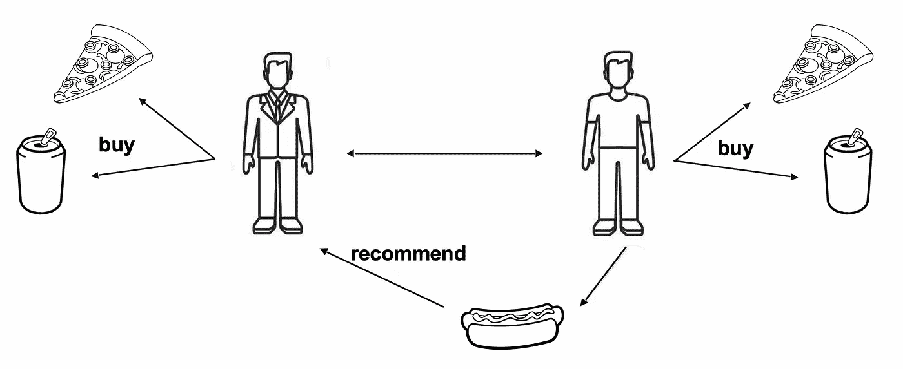
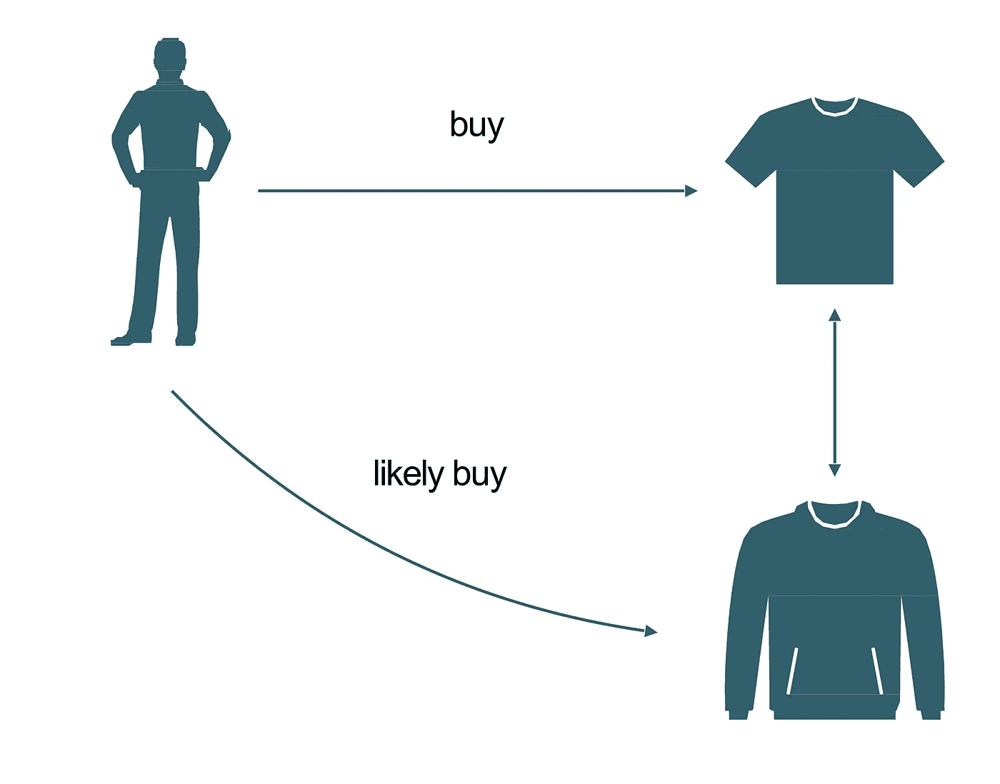
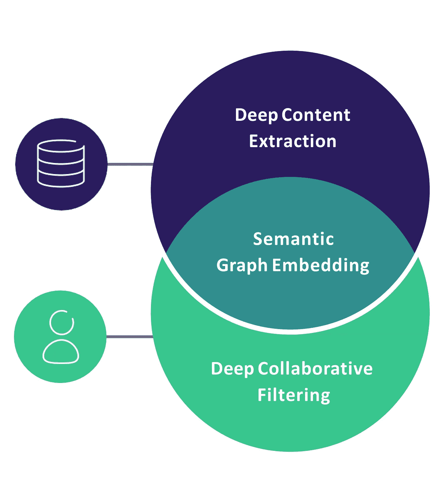

# 当今顶尖的推荐引擎算法有哪些？

> 原文：<https://itnext.io/what-are-the-top-recommendation-engine-algorithms-used-nowadays-646f588ce639?source=collection_archive---------0----------------------->

在 [Unsplash](https://unsplash.com?utm_source=medium&utm_medium=referral) 上由 [Helloquence](https://unsplash.com/@helloquence?utm_source=medium&utm_medium=referral) 拍摄的照片

我们通常将推荐引擎算法分为两类:**协同过滤模型**和**基于内容的模型**。它们的不同之处在于涉及的数据类型。

协作过滤模型使用用户对项目的反馈数据集(通常是星级或拇指向上/拇指向下)来计算预测。基于内容的模型只使用项目的特征(如产品的价格或颜色)。

# 协同过滤

首先我们潜入[协同过滤](https://en.wikipedia.org/wiki/Collaborative_filtering)模型。它们建立在用户/项目反馈的数据集上。这可以是**明确的反馈**，例如星级评定或拇指向上/拇指向下，或者是**隐含的反馈**，例如在电视节目中观看的集数。

协同过滤

我们根据这些模型处理数据的方式进一步对它们进行分类。让我们来看看每种方法的优缺点。

## 用户-用户

最常用的推荐算法遵循*“喜欢你的人，喜欢那个”*逻辑。我们称之为 **"** [**用户-用户**](https://medium.com/@tomar.ankur287/user-user-collaborative-filtering-recommender-system-51f568489727) **"** 算法，因为它会在相似用户之前喜欢某个项目的情况下向用户推荐该项目。两个用户之间的相似性是根据他们在数据集中共有的项目数量来计算的。

当用户数量远小于项目数量时，该算法非常有效。你可以想象一个拥有数百万产品的中型网上商店。主要的缺点是添加一个新用户是昂贵的，因为它需要更新用户之间的所有相似性。

## 项目-项目

**"**[**item-item**](https://en.wikipedia.org/wiki/Item-item_collaborative_filtering)**"**算法使用相同的方法，但是颠倒了用户和项目之间的视图。它遵循的逻辑是*“如果你喜欢这个，你可能也会喜欢那个”*。它会推荐与你之前喜欢的物品相似的物品。和以前一样，两个项目之间的相似性是使用它们在数据集中共有的用户数量来计算的。

当商品数量远小于用户数量时，例如大型网上商店，这种算法是最好的。如果你的物品没有太大的变化，它是非常适合的，因为你可以预先计算物品之间相似性的完整表格，然后实时提供建议。不幸的是，更新这个表来添加一个新条目是很困难的。

## 用户项目

有多种形式的“用户项目”推荐算法，它们结合了这两种方法来生成推荐。最简单的是基于 [**矩阵分解**](https://en.wikipedia.org/wiki/Matrix_factorization_(recommender_systems)) 技术。

目标是为所有用户和所有项目学习**低维向量(“嵌入”)**，以便将它们相乘可以恢复用户是否喜欢某个项目。你可以把这些向量看作是编码一个项目有多少特定的特征(就像一部电影是一部戏剧)，以及用户有多喜欢项目中的这个特征。

这种因式分解最好使用 [**SVD**](https://medium.com/@m_n_malaeb/singular-value-decomposition-svd-in-recommender-systems-for-non-math-statistics-programming-4a622de653e9) 进行训练，但是由于这种算法计算量非常大，我们通常更喜欢替代方案。对于中等规模的数据集 [**ALS**](https://towardsdatascience.com/prototyping-a-recommender-system-step-by-step-part-2-alternating-least-square-als-matrix-4a76c58714a1) 会给出合理的性能。对于大型数据集，只有 [**SGD**](https://ruder.io/optimizing-gradient-descent/) 算法能够伸缩，但会非常慢。

一旦预先计算了用户嵌入和项目嵌入，就可以实时提供推荐。这种方法的另一个好处是，您可以使用它们的嵌入来了解更多关于用户和项目的信息。例如，您可以根据用户或项目的偏好对其进行分类。

用户项目算法都有一个缺点，即在添加新项目或新用户后，没有有效的方法来更新嵌入。

# 基于内容

所有以前的型号都遭受所谓的**冷启动问题**。因为推荐是使用用户对商品的反馈数据集计算的，所以他们不能推荐没有(或只有少量)反馈的商品，比如新商品。同样，在他们开始对足够多的项目给出一些反馈之前，他们不能向新用户推荐任何东西。

使用**基于内容的模型**可以缓解这些问题。除了仅使用基于内容的特征来计算相似性之外，该方法与先前的用户-用户或项目-项目算法相同。训练解决冷启动项目的模型。用户冷启动)您需要一个数据集，其中包括您的物品的详细描述(分别为。例如电影的类型、预算、持续时间或任何有助于推荐的变量。

基于内容的模型

机器学习中模式识别的最新进展使得使用从原始图像或原始文本描述中提取的信息的基于内容的模型有了很大的改进。在网上可以找到大量的工具和预先训练的计算机视觉或自然语言处理的深度学习模型。

使用预训练模型的明显好处是，你不需要庞大的数据集和昂贵的服务器来训练你的推荐引擎。

# 混合模型和深度学习

最现代的推荐引擎算法，以及我们在[交叉思维](http://crossingminds.com)使用的那种算法，利用深度学习来*结合*协同过滤和基于内容的模型。**混合深度学习算法**允许我们学习用户和物品之间更精细的交互。因为它们是非线性的，所以不太容易过分简化用户的口味。

深度学习模型可以代表各种项目的复杂口味，甚至来自**跨领域数据集**(例如涵盖音乐、电影和电视节目)。在混合深度学习算法中，使用使用协作过滤方法学习的嵌入和基于内容的特征来建模用户和项目。一旦计算出嵌入和特征，也可以实时提供推荐。

混合模型

这类算法的学习方案接近传统的深度学习，即**带加速启发式的小批量 SGD**。但是推荐数据集与通常的计算机视觉数据集非常不同的事实使得使用现有的实现和工具变得更加复杂(例如，像 TensorFlow 或 PyTorch 这样的库中的许多优化器不支持动量的稀疏更新，这是为推荐训练深度模型的基石)。工程师和研究人员经常被留下来自己实现和训练更多的东西，这需要专家的时间和大量的计算资源。

深度学习模型的另一个缺点是，它们需要大量的**超参数优化**。与计算机视觉中过多的开源架构相比，推荐引擎几乎没有众所周知的架构或预先训练的模型。

**原载** [**答案**](https://www.quora.com/What-are-the-top-recommendation-engine-algorithms-used-nowadays-What-are-the-pros-cons-of-each-of-them-How-should-I-know-when-to-use-each-of-them) **由** [**艾米尔·康塔尔**](https://www.linkedin.com/in/emile-contal-72837652)**[**【穿越心术】**](https://crossingminds.com/) **、上**[**Quora**](http://quora.com)**。****