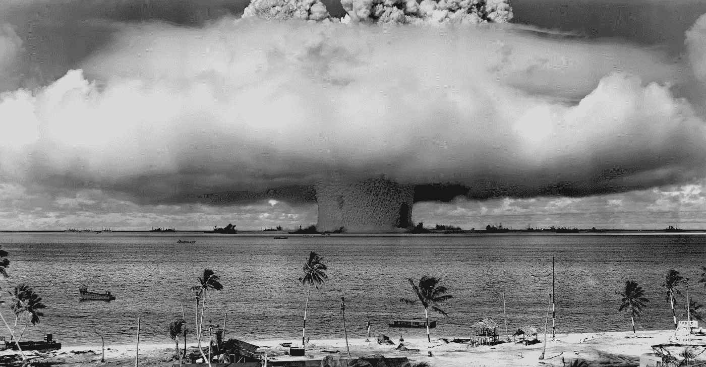

# 开发者能从这场差点引发核战争的虚惊中学到什么

> 原文：<https://itnext.io/what-developers-can-learn-from-the-false-alarm-that-nearly-started-a-nuclear-war-40-year-ago-c0390e907aec?source=collection_archive---------3----------------------->

## 感谢彼得罗夫，我们避免了核战争

[来自 Pexels 的 pix abay](https://www.pexels.com/photo/grayscale-photo-of-explosion-on-the-beach-73909/)

> “我很清楚，如果我犯了一个错误，没有人能纠正我的错误”斯坦尼斯拉夫·彼得罗夫

1983 年 9 月 26 日，斯坦尼斯拉夫·叶夫格拉夫维奇·彼得罗夫通过质疑似乎是核攻击并认定这是一场虚惊而避免了核战争。

这是一个很好的例子，不要相信别人告诉你的或者看起来正在发生的事情，而是思考真正正在发生的事情。

我们可以庆祝斯坦尼斯拉夫·彼得罗夫避免了一场核战争，他的故事给了我们一个有趣的教训。

**易反应，难思考，难回应。**

# **1983 年苏联核假警报事件**

1983 年是冷战时期，美苏关系紧张。9 月 26 日前三周，苏联击落了一架韩国飞机，因为它进入了苏联领空。

美国拒绝停止军备竞赛的呼吁，核战争是一个真正的危险。

以下是来自 Wiki-1[983 苏联核假警报事件](https://en.wikipedia.org/wiki/1983_Soviet_nuclear_false_alarm_incident#:~:text=Kalugin%20said%3A%20%22The%20danger%20was,is%20commemorated%20as%20Petrov%20day.)的精彩片段

> 1983 年 9 月 26 日，苏联防空部队中校斯坦尼斯拉夫·彼得罗夫是莫斯科附近谢尔普霍夫-15 地堡的值班军官，该地堡是苏联预警卫星指挥中心，代号奥科。[10]彼得罗夫的职责包括观察卫星预警网络，并向上级通报任何即将发生的针对苏联的核导弹袭击。如果从预警系统收到通知，说已经探测到来袭导弹，苏联的战略是立即对美国进行强制性核反击(警告后发射)，这在相互确保摧毁的理论中有具体规定。[11]
> 
> 午夜过后不久，地下掩体的计算机报告说，一枚洲际弹道导弹正从美国射向苏联。彼得罗夫认为探测到的是计算机错误，因为美国的第一次核打击很可能涉及数百枚同时发射的导弹，以使苏联的任何反击手段失效。此外，卫星系统的可靠性在过去曾受到质疑。[12]彼得罗夫认为这个警告是虚惊一场

赌注不会比这更大。如果这是一次真正的导弹袭击，数百万俄罗斯人将死亡，俄罗斯将在没有回应的情况下受到攻击。

如果这是一场虚惊，按照规定的程序做出反应，俄罗斯就会发射核导弹，发动核战争。

早期预警系统称俄罗斯遭到多枚导弹袭击。在时间紧迫的情况下，你如何证明它是真的还是假的？

> 他得出结论，电脑检测是假的，没有发射导弹。彼得罗夫对预警系统失灵的怀疑得到了证实，因为实际上没有导弹到达。后来，计算机发现空中有另外四枚导弹，都指向苏联。彼得罗夫怀疑计算机系统又出故障了，尽管没有直接的方法来证实这一点。[13]苏联的陆地雷达无法探测到地平线以外的导弹。[12]
> 
> 后来确定，假警报是由高海拔云层上的阳光和卫星的闪电轨道罕见地对齐造成的，14 后来通过交叉参照一颗地球静止卫星纠正了这一错误。[15]
> 
> 在解释导致他的决定的因素时，彼得罗夫引用了他的信念和训练，即美国的第一次打击将是大规模的，所以五枚导弹似乎是一个不合逻辑的开始。[11]此外，发射探测系统是新的，他认为还不完全可信，而地面雷达甚至在假警报发出几分钟后也未能发现确凿的证据。[12]

# **不要惊慌**

软件开发充满了信息缺失和突发事件(尽管还没有核打击)

[开发人员没有通过黄猫测试](https://blog.devgenius.io/most-software-developers-fail-the-yellow-cat-test-6202027e952f)，因为他们没有验证他们所看到的或被告知的。恐慌和突发事件会很快被夸大并失去控制。

在紧急情况下，人们希望有一个权威的声音来冷静地解释发生了什么以及该做什么。这通常会落到开发团队的头上。

当技术炸弹落下时，他们希望开发团队中有人说不要担心。都备份了，我们要做的就是关了再开。

恐慌和恐惧是情绪，是蜥蜴的大脑接管并让我们对情况做出反应，因为有些事情需要迅速做，例如，当你听到狮子吼叫时，跑，不要停下来想，我想知道那是什么声音。

在紧急情况下，恐惧会把最坏的情况想象 10 倍。这增加了压力，当其他人都在担心最坏的情况时，很难做出冷静、理性的决定。

# **冷静沉着**

> 海军陆战队有句谚语——“慢就是平稳，平稳就是快”

你跑得快不是因为你想跑得快，而是因为你动作流畅，动作正确。在紧急情况下，你需要避免快速反应。给自己时间思考，找出正确的行动。

像彼得罗夫一样，你需要找到时间去思考和考虑事实。在软件开发中，人们给出不正确的信息，他们告诉你他们认为正在发生的事情。

a 最近经历了一个事件，在部署新版本后，生产中的聊天机器人崩溃。聊天机器人愉快地工作了 30 分钟，突然都停止了工作。

有许多潜在的原因，在讨论的前一周，聊天机器人可能没有足够的能力。几乎没有任何理由，人们认为聊天机器人的能力导致了这个问题。

*   聊天次数是问题所在吗？
*   是我们部署的新变化吗？
*   会不会有别的原因？

事实是什么？什么是真的？

*   聊天机器人毫无问题地工作了 30 分钟
*   所有聊天机器人都出错了
*   它不是由某个特定的动作引起的
*   没有很多用户

**什么不是真的？**

如果它与变化有关，它应该在 SIT 中出错

**我怎样才能得到更多的信息？什么信息？**

我查看了管理中心的服务健康状况。英国聊天机器人出现故障。微软证实可能有原因，因为中断与我们的问题一致。

从情境中减少噪音和情绪，获取事实。我们知道什么是真的？你不能相信人们所说的或他们所想的。你需要核实什么正在发生，什么没有发生。

软件开发中的错误经常会误导人。他们说一件事，但可以隐藏真正的错误。错误可以被吃掉，并抛出一个误导性的错误或不出现错误。你不能相信你所看到的；你需要弄清楚发生了什么，什么是真的。

# **情绪**

当安迪·格罗夫还是英特尔的一员时，他们必须做出决定，是继续销售已经为他们赚了数十亿美元的内存，还是转向销售处理器。在这里阅读更多[只有偏执的开发者才能生存](/only-the-paranoid-developer-survives-40719dca7935)

英特尔有一个问题，他们制造了数十亿英镑的内存(RAM、DRAM ),但受到日本公司的攻击，这些公司以更低的成本制造更可靠的计算机内存。之前在内存领域的成功阻止了英特尔向处理器领域转移。

> 我转身问戈登，“如果我们被踢出局，董事会又请来了一位新的首席执行官，你认为他会怎么做？””戈登毫不犹豫地回答，“他会把我们带出记忆。我盯着他，麻木了，然后说，“为什么我们不走出门，回来自己做呢？”“格罗夫——只有偏执狂才能生存

安迪·格罗夫的故事表明，当你情绪化地投入决策时，做出理性的决策是多么困难。因此，更容易对别人的代码/项目/想法做出理性的决定，你在上面投入的时间更少。

我喜欢从局外人的角度看问题。如果别人第一次看到这种情况会怎么想？

# **结论**

人们想要快速的答案和行动。故事是根据人们认为正在发生的事情创造出来的，听起来似乎可信。

你需要更像一个科学家而不是艺术家，获取事实，并证明正在发生的事情。花点时间思考，从局外人的角度看问题，而不是面对灾难的人。

让彼得罗夫的回应更引人注目的是《T2 纽约时报》是如何报道的。这是一个五五开的决定！

> 经过令人伤脑筋的五分钟——电子地图和屏幕在闪烁，他一手拿着电话，另一手拿着对讲机，试图吸收源源不断的信息——彼得罗夫上校认定，发射报告可能是一场虚惊。正如他后来解释的那样，这是一个直觉决定，充其量是一个“50-50”的猜测，基于他对早期预警系统的不信任和发射的导弹相对较少。
> 
> 这是一个直觉的决定，基于对早期预警系统的不信任，他合乎逻辑地决定没有一个国家会只发射 5 枚核导弹。

# **延伸阅读**

*   [边际革命—彼得罗夫日](https://marginalrevolution.com/marginalrevolution/2022/09/petrov-day.html)(受本文启发)
*   斯坦尼斯拉夫·彼得罗夫:可能拯救了世界的人
*   [“我有种奇怪的感觉”](https://www.washingtonpost.com/wp-srv/inatl/longterm/coldwar/shatter021099b.htm)
*   [1983 年苏联核假警报事件](https://military-history.fandom.com/wiki/1983_Soviet_nuclear_false_alarm_incident)