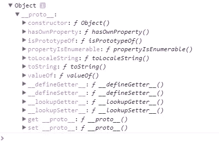
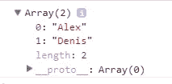
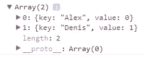
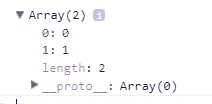
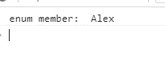
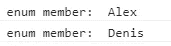

# 关于 TypeScript 中的枚举需要知道什么？

> 原文：<https://itnext.io/what-do-need-know-about-enumerations-in-typescript-48b554cec43b?source=collection_archive---------0----------------------->


简短介绍...类型脚本中的类型定义技术；

[*点击这里在 LinkedIn* 上分享这篇文章](https://www.linkedin.com/cws/share?url=https%3A%2F%2Fitnext.io%2Fwhat-do-need-know-about-enumerations-in-typescript-48b554cec43b)

**简单类:**

```
var UserType = (function(){
    function UserType(){
    }
    /* some code */
    return UserType;
})();
```

**或枚举:**

```
var UserType;
(function(){
    /* other code */
})(UserType || UserType = <type_initializer>);
```

需要匿名功能吗？：

```
var typeName = (function(){ ... })();
```

TypeScript 使用自调用匿名函数在函数执行后创建用户类型。Him 函数是返回函数生成器或设置变量，它已作为参数接收。你可以在可自调用函数后看到括号` *()* `。这需要在满足 him 时调用自调用函数。

**所以…转到枚举…**

枚举是具有**对象**原型的简单对象。这是事实！看…

 [## 操场打字稿

### 在您的浏览器中尝试使用 TypeScript！

www.typescriptlang.org](https://www.typescriptlang.org/play/#src=enum%20Names%20%7B%0D%0A%7D%0D%0Aconsole.log%28Names%29%3B) 

# **实验后的命名约定:**

*对象是简单的字典，其中:*

***枚举键—对象键/对象属性。***

***枚举值——自身对象的属性值。***

在开始之前，我们先看看 TypeScript 中的类和枚举有什么不同。

TypeScript 类定义:

```
class User {
}
```

传输到 ES5:

```
var User = (function () {
    function User() {
    }
    return User;
}());
```

键入枚举定义:

```
enum Names {
}
```

传输到 ES5:

```
var Names;
(function (Names) {
})(Names || (Names = {}));
```

我们可以看到，枚举定义使用了一个自己的类型作为参数，一个自调用函数，它随后被修改(添加了键:值)。

## 所以…任何地方都很简单…需要添加成员…

**打字稿:**

```
/*
 You can skip values initialization into enum definition.
 TypeScript use it as default enum declaration.
*/
enum Names {
    Alex = 0,
    Denis = 1
}
```

ES5:

```
var Names;
(function (Names) {
    Names[Names["Alex"] = 0] = "Alex";
    Names[Names["Denis"] = 1] = "Denis";
})(Names || (Names = {}));
```

所以…它更感兴趣…我们看到了什么(简化为步骤)？：

```
/*
    No step. Only for example.
    This is function will be created at run-time in memory really.
*/
function selfInvokable(enumType) {
    ***step 3***: enumType["Alex"] = 0;
    ***step 4:*** enumType[enumType["Alex"]] = "Alex";
    ***step 5:*** enumType["Alex"] = 1;
    ***step 6:*** enumType[enumType["Denis"]] = "Denis";
}***step 0:*** var Names = undefined;
***step 1:*** if(!Names) { Names = {}; }
***step 2:*** selfInvokable(Names);
```

现在我们可以枚举呈现为如下对象(原型成员已被排除):

```
var Names = {
    "0":"Alex",
    "1":"Denis",
    "Alex":0,
    "Denis":1
};
```

使用 JSON.stringify()(没有序列化原型)来表示上面的图片。和 Object.keys()来获取对象的 keys 数组。**警告！不要使用 for-in 构造来获取枚举键，因为她会额外从 prototype 返回键。**

所以…可能有时候需要开发助手来处理枚举…一定要做！

```
class EnumHelpers { /**
    * No instances guard.
    */
    private constructor() { } /**
     * Get all keys from enumeration.
     */
    public static keys(enumType: object) {
        const members = Object.keys(enumType);
        return members.filter((x) => Number.isNaN(parseInt(x, 10)))
    }
}
```



不错…我们可以从枚举中得到键。然后让 develop 方法获得{ key，value }对象的数组。

```
/**
* Get key-value array from enumeration.
*/
public static toKeyValueArray(enumType: object) {
   return EnumHelpers.keys(enumType)
       .map((key) => {
           return { key, value: enumType[key] };
        });
}
```



When 方法从枚举类型中获取值:

```
/**
* Get values from enumeration.
*/
public static values(enumType: object) {
   return EnumHelpers.toKeyValueArray(enumType)
       .map((kv) => kv.value);
}
```



你可以找到从枚举中获取密钥的其他解决方案，但是它们可能是不正确的。比如:[https://stackoverflow.com/a/18112157](https://stackoverflow.com/a/18112157)。

**问题:枚举值可以是负数。**

```
enum Names {
    Alex = 0,
    Denis = -1
}/**
 * Sample from stack overflow.
 * [@see](http://twitter.com/see) [https://stackoverflow.com/a/18112157](https://stackoverflow.com/a/18112157)
 */
function getValues(enumType: object) {
    for (var enumMember in enumType) {
        var isValueProperty = parseInt(enumMember, 10) >= 0
        if (isValueProperty) {
            console.log("enum member: ", enumType[enumMember]);
        }
    }
}getValues(Names);
```



执行结果。

**预期:**



预期结果。

**修复:**

```
**var isValueProperty = !Number.isNaN(parseInt(enumMember, 10));**
```

# 2.4 中新的 TypeScript 枚举功能。


在 TypeScript 2.4 之前，我们只能有数字枚举，但在 TypeScript 2.4 中，已经添加了字符串值作为枚举值。

TypeScript 定义:

```
enum Names {
    Alex = "a",
    Denis = "d"
}
```

传输到 ES5:

```
var Names;
(function (Names) {
    Names["Alex"] = "a";
    Names["Denis"] = "d";
})(Names || (Names = {}));
```

我们看到枚举值没有被复制到对象键。所以，接下来需要重构我们的助手来处理字符串枚举:

```
/**
* Check to numeral enumeration.
*/
private static isNumeral(enumType: object) {
    const members = Object.keys(enumType);
    if (!members.some((x) => true)) {
        throw new TypeError("Invalid enumeration type.");
    } let parsedCount = 0;
    members.forEach((x) => {
        const parsedValue = parseInt(x, 10);
        if (!Number.isNaN(parsedValue)) {
            parsedCount++;
        }
    }); return parsedCount === members.length / 2;
}/**
 * Get all keys from enumeration.
 */
public static keys(enumType: object) {
    const members = Object.keys(enumType);
    if (!EnumHelpers.isNumeral(enumType)) {
        return members;
    }

    const keys: string[] = [];
    members.forEach((x) => {
        const parsedValue = parseInt(x, 10);
        if (Number.isNaN(parsedValue)) {
            keys.push(x);
        }
    });
    return keys;
}
```

# **但这并没有结束…混合枚举…**

TypeScript 定义:

```
enum Size {
    One = 1,
    All = "all"
}
```

传输到 ES5:

```
var Size;
(function (Size) {
    Size[Size["One"] = 1] = "One";
    Size["All"] = "all";
})(Size || (Size = {}));
```

*嗯…助手不知道如何使用这个混血儿…需要调整一个键()方法。*

**解决方案:**

```
/**
* Get all keys from enumeration.
*/
public static keys(enumType: object) {
    const members = Object.keys(enumType); let keys: string[];
    if (!EnumHelpers.isNumeral(enumType)) {
        keys = members;
    } else {
        keys = [];
        members.forEach((x) => {
            const parsedValue = parseInt(x, 10);
            if (Number.isNaN(parsedValue)) {
                keys.push(x);
            }
        });
    }
    // key of enumeration can't be number      
    return keys.filter((x) => Number.isNaN(parseInt(x, 10)));
}
```

**看看评论上面返回的关键词^.**