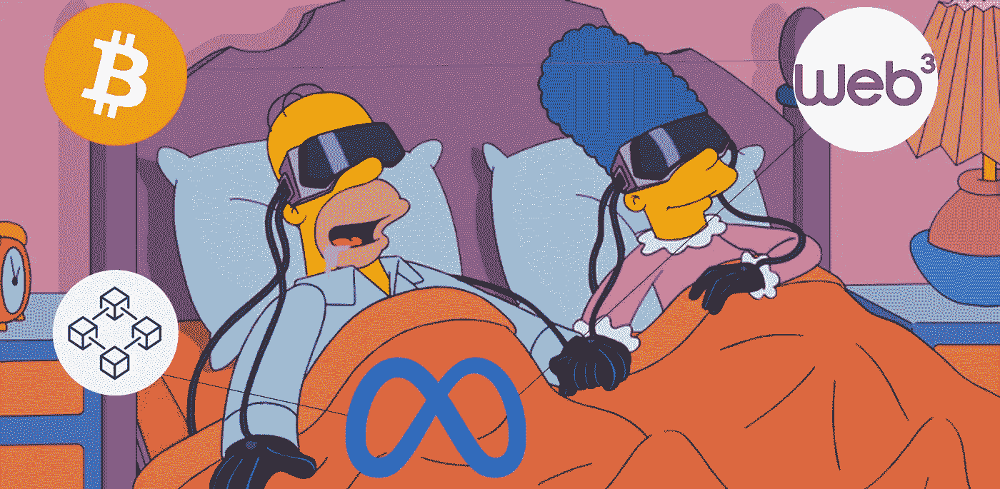

# 🔥作为一名前端开发人员，您需要了解互联网 Web 3.0 新时代的哪些信息

> 原文：<https://itnext.io/what-do-you-need-to-know-about-new-era-of-internet-web-3-0-as-a-frontend-developer-55e51f2cd03f?source=collection_archive---------1----------------------->

## 互联网 Web 3.0 的未来是什么样子，我们在哪里。

# 内容

*   [**简介**](#9d78)
*   [**旧石器时代或静止时代的网页 1.0**](#cc34)
*   [**Web 2.0 的中石器时代或大数据时代**](#79dc)
*   [**新石器时代或区块链时代的 Web 3.0**](#8172)
*   [**2022 年每个前端开发者都要追随的 18 大 Web 3.0 趋势**](#4b29)
*   [**结论**](#fda7)
*   [**了解更多**](#dc4a)

# 介绍

在马克·祖克伯格展示了一个关于将脸书更名为 Meta 并定义公司建设元宇宙的方向的小演示后，Web 3.0 的讨论再次升温。这引发了多米诺骨牌效应，其他大型科技公司开始透露他们对超宇宙的计划和愿景。毫无疑问，这将影响到我们生活的方方面面，当然也影响到人们对互联网的看法。它加速了向互联网新版本——Web 3.0——的过渡。

有很多关于 Web 3.0 的解释，但没有一个是足够清晰的。原因是很难准确定义什么是 Web 3.0，因为没有严格的定义。Web 3.0 通常与**元宇宙**、**区块链、**和**加密货币**建立关联。部分是真的，所有这些技术已经在塑造现代互联网。此外，对什么是 Web 3.0 有一个清晰的认识可能需要更多的时间，没有人知道确切的时间。例如，从 Web 1.0 过渡到 Web 2.0 花了大约 10 年的时间。在这篇文章中，我们将简要总结互联网的演变，并找出我们正在走向何方。

# 旧石器时代还是 Web 1.0 的静态时代

互联网发展的第一阶段或者说 Web 1.0 从 1991 年开始，一直持续到 2004 年。那个时代的大多数网站都是简单的静态页面，只有文字和图片。除了读课文，你不能做别的事情。流行的是代表一个人或一个企业的组合网站。 ***用户就是消费者*** ，他们可以看到相同的内容，只能像看报纸一样阅读。互联网没有受到保护，用户可以通过点击恶意链接感染病毒。网站不盈利，广告没有针对性，也不起作用。在 flash 和 javascript 等技术出现后，网站开始变得更加动态。👴

# **Web 2.0 的中石器时代或大数据时代**

> “生活中唯一不变的就是变化。”赫拉克利特

**Web 2.0** 的时代始于 2004 年，我们仍然在那里。不再是只读网站，用户开始与它们互动:发帖子，交流，买卖，把它当作一个软件。所有用户都能看到不同的内容，这取决于他们的兴趣。因为收集了用户数据和分析，这才有可能。数据科学和机器学习是生成目标内容的主要工具。数据是用户创造的，但不属于他们，由大科技存储和管理，没有*隐私*。公司用它来展示试图预测用户需求的广告。 ***用户就是产品*** 。

# 新石器时代还是区块链时代**的** Web 3.0

现在，我们迎来了一个新的时代——Web 3.0。在 Web 3.0 中，用户是信息的所有者。数据、公司、服务由分散的**区块链**网络 DAO(分散的自治组织)拥有和管理。没有首席执行官或总裁，公司将不得不转换到道。所有的服务都是*开源*的，服务的变更是通过用户之间的 ***共识*** 做出的。所有数据传输都是保密的，信息是安全的。数字资产受到版权保护，并被分配给 ***NFT*** (存储在区块链的唯一令牌)。所有的金融交易都是用密码进行的，这使得它更快更安全。每个用户都是匿名的，隐藏在虚拟化身的背后。用户可以连接到不同的虚拟世界，并与 3d 模型和其他人互动。

听起来像科幻小说，但这是已经发生的事情。随着时间的推移，这种转变只会加速。区块链是一项革命性的技术，将彻底改造所有行业，并建立一个新的标准。如果您不想错过机会并为 Web 3.0 趋势做好准备。[**订阅**](https://medium.com/@easy-web/subscribe) **和** [**关注我中**](https://medium.com/@easy-web/membership) **获取更新。此外，查看更多关于本文中使用的术语，并在下面的文章中熟悉所有 Web 3.0 趋势。**

> 博客路线图中的下一个主题是: **Web 3.0 应用架构**和**如何构建 Web 3.0 应用**。如果你想看这个内容，让我们收集 **2000👏**

# 2022 年每个前端开发人员都必须遵循的 18 大 Web 3.0 趋势

 [## 🔥2022 年每个前端开发人员都必须遵循的 18 大 Web 3.0 趋势

### 这个列表将展示 Web 3.0 可以带来的新机会，并可能激发下一个百万美元的想法。😜

medium.com](https://medium.com/@easy-web/top-18-web-3-0-trends-every-frontend-developer-has-to-follow-in-2022-2861f9b63627) 

# 结论

我们仍处于向 Web 3.0 过渡的开端，还有很长的路要走。第一个原因是，区块链挑战了太多强大的组织:跨国公司、银行，甚至政府。因为它的目标是从他们手中接管权力，使权力分散。如果它不是**民主**，那它是什么？😛另一方面，新一代正在成长，他们已经在游戏(元宇宙)中度过了人生的很大一部分，他们知道游戏中的数字交易，以及加密货币和区块链。而当他们开始取代我们时，他们对市场的要求也会不同。它将迫使企业适应，我们将面临一个互联网的新时代。

 [## 每当维塔利·舍甫琴科发表文章时，就收到一封电子邮件。

### 每当维塔利·舍甫琴科发表文章时，就收到一封电子邮件。通过注册，您将创建一个中型帐户，如果您还没有…

medium.com](https://medium.com/@easy-web/subscribe)  [## 通过我的推荐链接加入 Medium 维塔利·舍甫琴科

### 作为一个媒体会员，你的会员费的一部分会给你阅读的作家，你可以完全接触到每一个故事…

medium.com](https://medium.com/@easy-web/membership) 

# 了解更多信息

 [## 🔥2022 年每个前端开发人员都必须遵循的 18 大 Web 3.0 趋势

### 这个列表将展示 Web 3.0 可以带来的新机会，并可能激发下一个百万美元的想法。😜

medium.com](https://medium.com/@easy-web/top-18-web-3-0-trends-every-frontend-developer-has-to-follow-in-2022-2861f9b63627)  [## 🔥建造一个漂亮的抖音克隆体，有棱角和微前端

### 第 1 部分:不再有丑陋的教程，只有美丽的，真实世界的例子，通过构建抖音学习微前端

javascript.plainenglish.io](https://javascript.plainenglish.io/building-beautiful-tiktok-clone-with-angular-and-micro-frontend-part-1-bdd189425695)  [## 🔥帮助我获得亚马逊和 LinkedIn 录用通知的前端面试备忘单

### 如果你正在准备一个前端面试，想快速更新你的领域知识，这个备忘单将…

itnext.io](/frontend-interview-cheatsheet-that-helped-me-to-get-offer-on-amazon-and-linkedin-cba9584e33c7)