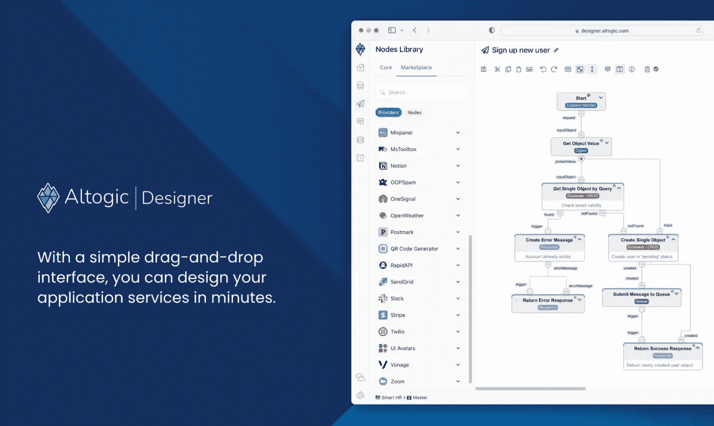
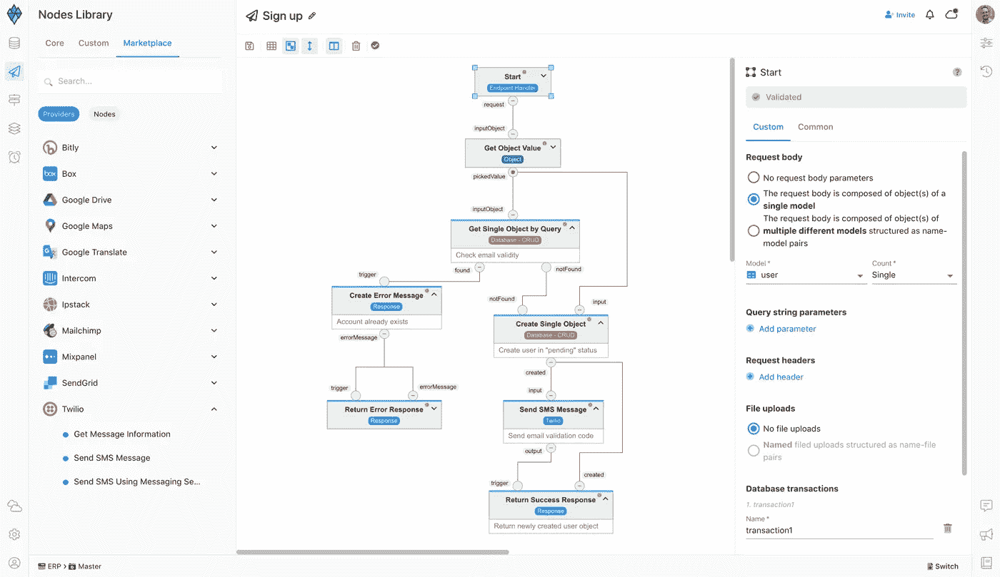

# Altogic 给你提供了什么？

> 原文：<https://itnext.io/what-does-altogic-offer-you-6386d177333d?source=collection_archive---------3----------------------->

嗨！我是来自 Altogic 团队的 Mehmet。

我在 Flutter 社区遇到了一些问题:“为什么我应该使用 Altogic？”，“为什么要选这个而不是 X？”，“或者其他 BaaS 替代品？”

这些问题提醒我，颤振社区需要对 Altogic 有更多的了解。

在这篇文章中，我不想长篇大论地解释 Altogic，我想简单地解释一下为什么你应该切换到 alto gic**。**

# **Altogic 提供了什么？**

**让我们简单看一下它基本上提供了什么。**

*   ****在几分钟内构建后端:****

**在 Altogic Designer 界面中创建应用程序后，您的后端应用程序就准备好了！环境、部署、安装和配置文件呢？不需要！**

**同样，当你做任何改变的时候，你的后台程序总是准备好的。**

*   ****授权:****

**Altogic 提供了电子邮件-密码等授权流，以及 OTP、Magic-Link、oAuth2 等现代流。所有的流都易于与客户端 API 一起使用。**

*   ****数据库:****

**Altogic 提供了一个易于使用、可伸缩、安全且快速的数据库，使您复杂的工作变得更加容易。**

*   ****存储****

**Altogic 提供易于管理和使用的云存储服务。**

*   ****缓存:****

**您可以使用缓存(Redis)服务存储和快速访问您经常访问的数据。例如，您的远程定位数据。**

*   ****终点:****

**每个应用都有独特的需求。您可以通过创建带有无代码和全代码选项的端点来满足这些需求。**

*   ****任务:****

**您可以为应用程序中定期运行的流程创建服务。**

*   ****队列:****

**队列管理器允许您与应用程序的不同部分进行通信，并异步执行云功能。消息队列提供了一个临时存储消息的缓冲区，并将消息分派给它们的消费服务。**

*   **实时:**

**现在直播互动这么重要！有一种网络套接字服务，你可以在那里与你的用户交换即时信息。**

# **你为什么需要它？**

**我们正在经历一个移动应用和网站变得非常重要的时期。每天我们都会听到一个新功能，迫不及待地想体验一个新想法。我们正努力使我们的业务适应全球化影响下快速变化的设计理念。**

**在这一切进行的同时，您对新功能和更现代设计的关注将使您的业务更有价值。**

**安全性、速度、效率、可伸缩性、架构和高级案例主题呢？他们不重要吗？**

****当然不是！****

**现在，逻辑开始发挥作用了。它为你做所有这些，让你只关注你的业务和你的功能。**

**我们把这个概念称为 BaaS，有很多例子。**

**但 Altogic 是最现代的 BaaS，与众不同。**

# **有什么区别？**

## **更加可定制**

**使用 Altogic，您可以快速创建无代码(或全代码)REST 端点，并且不需要部署它们。您可以使用客户端 API 快速调用这些端点。Altogic 为您捕捉错误，检查条件，并以标准方式返回响应或错误。**

****

## **强大的数据库**

**通过在后端管理与数据库相关的一切，并执行复杂的查询和计算，您可以建立一个安全而灵活的业务逻辑。**

**您是否正在分配计数器函数、通过复杂的方法对一些事物进行分组，或者计算数值字段的总和或平均值？**

**有了使用 MongoDB 强大引擎的 Altogic，就不需要任何棘手的方法了。您可以用熟悉的结构非常简单地编写查询。**

**此外，当您很少需要复杂的查询时，Altogic 不会让您失望并推荐复杂的路径。您可以使用[alto logic 的功能](https://www.altogic.com/docs/category/functions)来满足您的复杂需求。**

## **证明**

**您可以以标准和安全的方式执行许多身份验证流程，包括 oAuth2。Altogic 为您提供完全可管理的流程。虽然它不强迫您使用特定的服务或方法，但它用最现代的技术提供了安全性。**

## **安全性**

**Altogic 提供了内置的 jwt-token、API 键、会话和用户结构。**

**有许多安全机制，例如数据库的对象级安全性、端点的授权控制以及服务的速率和域控制。**

## **完全访问您的用户**

**使用 Altogic 的消息队列服务，您可以向您的用户发送电子邮件和短信，并完全定制您的验证电子邮件和短信。此外，您可以完全控制您的密码更新，电子邮件验证等。、接口，如果您有移动应用程序，您可以在您的移动应用程序中编写这些接口。**

## **隐藏物**

**通过使用缓存服务存储您经常访问的各种数据，您可以拥有一个更高效的后端。**

## **设置、集成、配置**

**没有那样的事情。**

**一旦创建了项目，所有这些服务都可以使用了。部署、分发、配置或安装。你不需要这些。**

## **开发与生产分离**

**通过在 Altogic 中创建不同的环境，您可以防止团队之间的冲突，并在生产过程中毫不犹豫地继续开发您的应用程序。创建不同的环境也为您提供了显著的扩展优势。**

## **定价政策**

**许多 baa 的定价政策会迫使您执行更多操作，从而使您的工作变得复杂，或者会将您导向外部服务，从而增加您的支付项目。例如，要创建一个计数器，您需要创建一个不同的集合，并且您必须进行额外的读取来计算总数或获取数据的元数据。**

**Altogic 中的定价策略不是基于任何服务/功能的限制。它提供了可以保存数据和操作的工具。例如，由于缓存服务的存在，您可以显著减少数据库操作。你可以通过高级查询来减少你的阅读量。**

**同样，Altogic 也不建议您使用外部服务进行全文/模糊搜索。它包含了所有这些。**

**此外，Altogic 的定价政策不会对开发过程中使用的免费计划施加任何功能限制。**

## **实时的**

**现在实时交流比以往任何时候都更有必要，而且由于有了 altogic，这比以往任何时候都更容易。**

**你的电子商务平台上的实时支持，你的 web3 业务的实时汇率，约会应用程序中的聊天系统，或者让你一起听音乐的移动应用程序。您可以使用实时服务进行实时交互，无论是在用户之间还是在后端和客户端之间。**

## **客户端库**

**由于使用标准化架构开发的强大客户端库，您可以访问所有这些特性。**

**[客户端 API 指南](https://www.altogic.com/client/)**

# **摘要**

**当我们考虑所有这些特性时，结果是:使用 Altogic，您将体验到专用服务器的自由，同时体验到 BaaS 的便利。**

**在我们这个时代，像 Flutter 这样允许我们快速开发并帮助我们更加关注功能的工具变得越来越重要。**

**[试试奥拓吉](https://altogic.com)在这列火车上占你的位置。**

**在我们的博客文章中，我们快速浏览了一下 alto logic 和 Flutter: [走向 alto logic 和 Flutter](/towards-altogic-with-flutter-b6830bdb45cb)**

> **如果你认为你将在 Altogic 度过愉快而富有成效的时光:**
> 
> **关注我们:**
> 
> **👉🏼[推特](https://twitter.com/Altogic)**
> 
> **加入我们的社区:**
> 
> **💬[不和](https://discord.gg/6mZcKhXW)**
> 
> **📰[论坛](https://community.altogic.com)**
> 
> **审查文件:**
> 
> **🚀[快速启动](https://www.altogic.com/docs/quick-start/)**
> 
> **📜[逻辑文档](https://www.altogic.com/docs/)**
> 
> **尝试示例:**
> 
> **🔴[颤振现场实例](https://altogic-flutter-example.netlify.app)**
> 
> **🗄️ [逻辑范例库](https://github.com/altogic/altogic)**

**感谢阅读！**