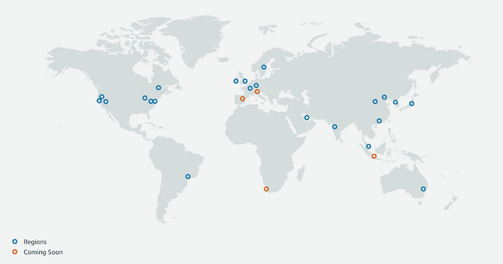
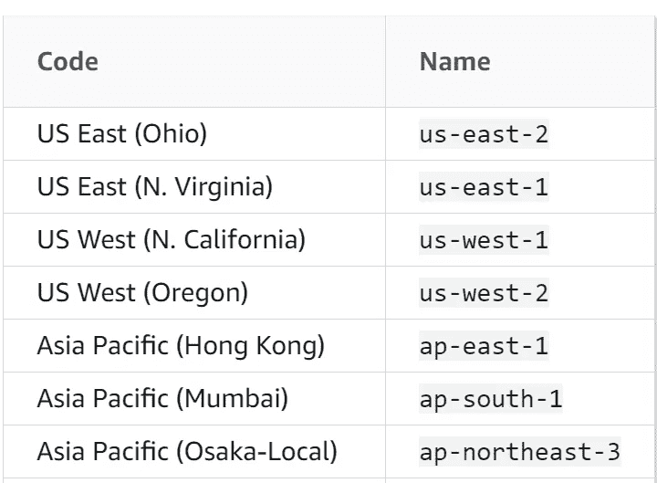
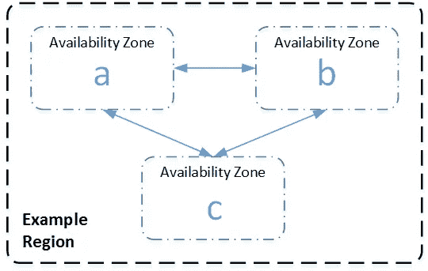
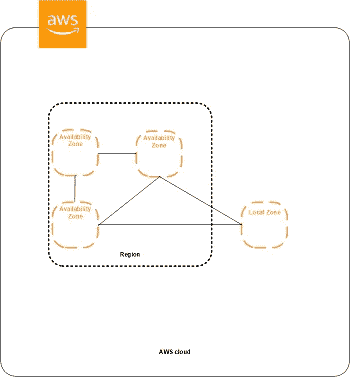

# AWS 中的区域和不同类型的区域到底是什么？

> 原文：<https://itnext.io/what-exactly-are-region-and-different-types-of-zones-in-aws-333d7e0ce373?source=collection_archive---------2----------------------->

## 描述 AWS 中的区域、可用性区域、本地区域和波长区域


图片来自 [TechSpot](https://www.techspot.com/)

[亚马逊网络服务(AWS)](https://aws.amazon.com/) 是一个按需付费的云计算平台，提供超过 175 种服务，从计算、存储和数据库等基础设施技术到 ML 和 AI 以及物联网等新技术。AWS 允许我们更多地关注特性(而不是基础设施或安全性),并更快地实现它们。

在本文中，我将详细介绍 AWS(区域、可用性区域、本地区域和波长区域)中的一些基本概念:

# AWS 在哪里部署我们的服务？

AWS 在各地区部署我们的服务。**区域**是一个国家边界内地理上独立的区域。它包含我们应用程序所需的所有资源、计算和存储。你可以把一个地区想象成一群数据中心。每个区域**与其他区域**隔离**且**独立。

我们在全世界有许多地区，例如，你可能会在柏林、悉尼、蒙特利尔、圣保罗或东京看到一个地区。



[AWS 全球基础设施地图](https://aws.amazon.com/about-aws/global-infrastructure/)(2020 年 1 月)

并非所有 AWS 服务在所有地区都可用([您可以在此处查看](https://aws.amazon.com/about-aws/global-infrastructure/regional-product-services/))，而且一些 AWS 服务，如身份和访问管理(IAM)，也没有地区资源。

每个地区都是独立的，拥有运行我们的应用程序所需的所有资产(如果我们想要的服务在那里可用的话)。您应该为您的业务选择合适的地区，并考虑以下具体问题:

*   **延迟**(到我们客户的距离)
*   **价格**(例如税法或财务状况)
*   **法律限制**(例如美国 HIPAA 或欧洲 GDPR 要求)
*   [**服务可用性**](https://aws.amazon.com/about-aws/global-infrastructure/regional-product-services/) (例如新服务)

**延迟**非常重要，因为速度的原因，你应该选择一个你的客户所在的区域靠近它。除了延迟之外，为您的应用选择合适的区域还有其他一些重要的因素。**价格**、**法律限制**和**某种服务的可用性**对选择合适的地点有重要作用。

每个区域都有一个名称和一个代码(区域代码):



我们可以使用这个`region-code`为大多数 Amazon Web 服务(比如支持区域的 EC2 或 DynamoDB)创建[区域端点](https://docs.aws.amazon.com/general/latest/gr/rande.html)。

区域端点的一般语法如下:

```
*protocol*://*service-code*.*region-code*.amazonaws.com
```

例如，`https://dynamodb.**us-west-2**.amazonaws.com`是美国西部(俄勒冈州)地区 Amazon DynamoDB 服务的端点。你可以在这里阅读更多关于 [AWS 服务端点的信息](https://docs.aws.amazon.com/general/latest/gr/rande.html)。

正如我之前提到的，您可以将一个区域想象成一个数据中心**集群**，其中有多个孤立的位置，称为**可用性区域。**



# 什么是 AWS 可用性区域？

一个**区域**中的每组逻辑数据中心(一个或多个)称为一个**可用性区域**，正如我之前提到的，每个区域由区域边界内多个隔离的、物理上独立的可用性区域组成。

可用性区域由逻辑上被视为单个实体的一个或多个数据中心组成。一个区域中的所有可用性区域都通过**高带宽、低延迟网络**相互连接。可用性区域让我们有能力开发更高可用性、容错性和可伸缩性的应用程序。

在一个区域内，我们总是至少有**两个相距很远的可用性区域**，这一距离有利于使用同步复制进行灾难恢复。网络性能足以支持可用性区域之间的同步复制。可用性区域对应用程序进行分区，以实现更简单的高可用性。如果应用程序跨可用性区域进行分区，我们的应用程序可以更好地防范灾难问题，如龙卷风、地震和…

因为我们的应用程序同时在两个或更多的可用性区域中运行，所以如果其中一个可用性区域暂时不可用，这并不重要。这就是我们如何通过在一个区域内运行来实现可伸缩性和高可用性。部署在一个可用性区域中的应用程序不具备高可用性。

# 什么是 AWS 本地区域？

与可用性区域类似， [**本地区域**](https://aws.amazon.com/about-aws/global-infrastructure/localzones/) 是一种服务于 AWS 服务的 AWS 基础架构部署，但与可用性区域不同，本地区域不在区域边界内，更靠近我们的最终用户。为了提供低延迟通信(一位数毫秒延迟)，本地区域更靠近没有 AWS 区域的大型人口、工业和 it 中心。



带有本地区域的 AWS 区域

Local Zone 非常适合延迟敏感型应用程序，其使用案例包括媒体和娱乐内容创建、实时游戏、油藏模拟、电子设计自动化和机器学习。

本地区域是与该区域位置不同的区域的扩展，它们并不在每个区域都可用([您可以查看可用性](https://docs.aws.amazon.com/AWSEC2/latest/UserGuide/using-regions-availability-zones.html#concepts-available-regions))。本地区域由 AWS 管理和支持，为我们带来了 Amazon AWS 的所有弹性、可伸缩性和安全性优势。

# 什么是自动气象站波长区？

[波长区](https://aws.amazon.com/wavelength/)使我们能够构建向移动设备和最终用户提供个位数毫秒延迟(超低延迟)的应用。**波长区域**与**本地区域**的主要区别在于，我们的应用流量无需离开移动提供商的网络即可到达服务器。

通过在电信提供商位于 5G 网络边缘的数据中心内放置波长区域，我们可以最大限度地减少从移动设备连接到应用的延迟。

我们可以选择在所选区域内的某个波长区部署全部或部分应用程序。


[AWS 波长](https://aws.amazon.com/wavelength/)

# 资源:

*   [AWS 官网](https://aws.amazon.com/)
*   [AWS 服务端点](https://docs.aws.amazon.com/general/latest/gr/rande.html)
*   [AWS 本地区域](https://aws.amazon.com/about-aws/global-infrastructure/localzones/)
*   [AWS 波长区](https://aws.amazon.com/wavelength/)