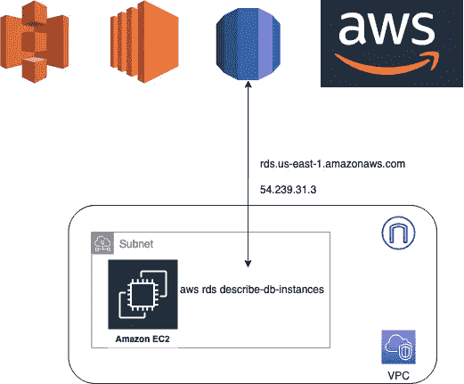
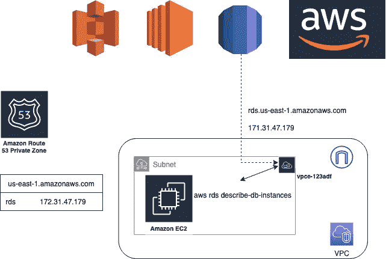
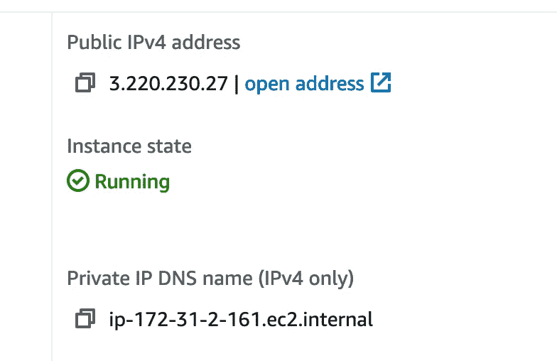
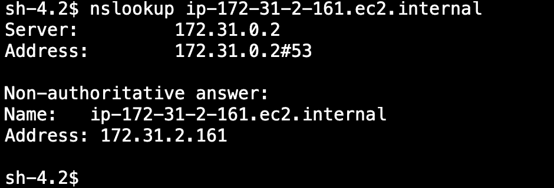
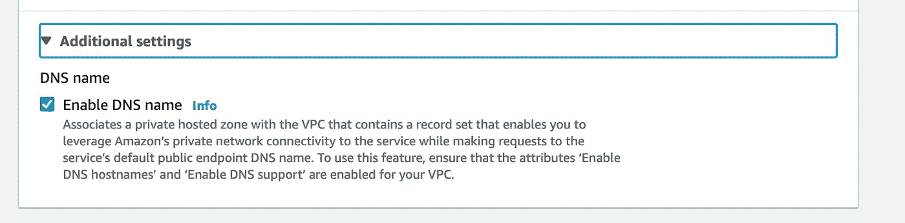
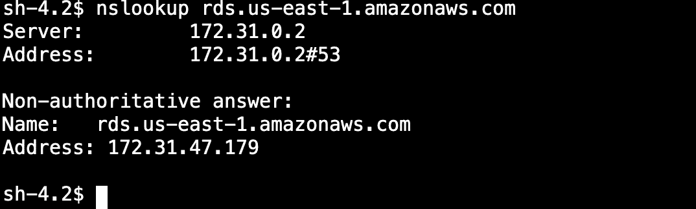
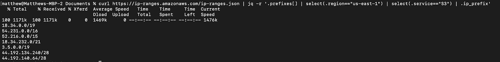
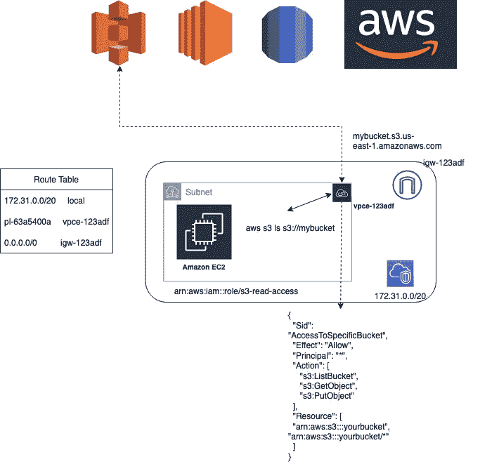
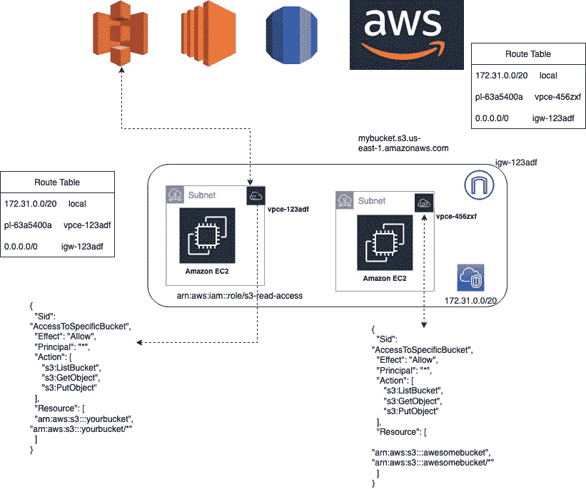
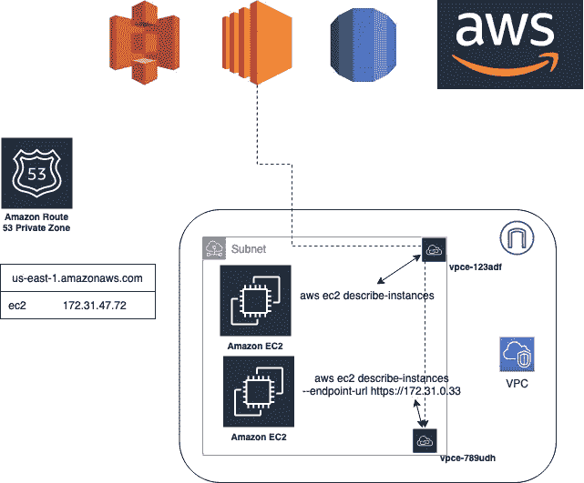

# 什么是 VPC 端点，为什么他们需要真正的跨地区支持

> 原文：<https://itnext.io/what-exactly-are-vpc-endpoints-and-why-they-need-real-inter-region-support-283a9987fe51?source=collection_archive---------0----------------------->

AWS 最容易被误解的特性之一是 VPC 端点。我觉得我必须每周解释一次他们实际上是如何工作的。此外，由于它们被如此误解，它们在客户环境中的使用不足已经到了犯罪的边缘。因此，让我们花一分钟时间来充分理解它们是什么以及为什么应该使用它们。

# AWS API

AWS API 只是一堆 HTTPS 443 TCP 端点(当然也有一些显著的例外，它们使用不同的协议，比如 SES 和 IOT，但是概念是一样的)。当您使用 AWS SDK 时——无论是 AWS CLI、Python Boto3、AWS SDK for JS，还是它们中的任何一个——该 SDK 本质上都是在执行 HTTPS 请求。例如，当你跑步时

```
aws rds describe-db-instances --region us-east-1
```

CLI 向 rds.us-east-1.amazonaws.com 发送包含您的 IAM 信息的 DescribeDbInstances API 操作的 HTTPS 请求，以对该请求进行身份验证。为了找到向其发送请求的正确 IP，CLI 还必须对 rds.us-east-1.amazonaws.com 进行 DNS 查找。

```
matthew@Matthews-MBP-2 Documents % nslookup rds.us-east-1.amazonaws.com
Server:  192.168.1.1
Address: 192.168.1.1#53

Non-authoritative answer:
Name:    rds.us-east-1.amazonaws.com
Address: 54.239.31.3
```



这是默认的流量流，无论客户端是在 VPC 还是在家里的笔记本电脑上。在 VPC 内部，这将需要一个互联网网关，或许还需要一个 NAT GW。

然而，允许通过互联网的流量有 4 个问题:

1.  需要出站防火墙规则，例如 IP 允许列表、域允许列表，这可能会很麻烦。如果你想让他们出去，你必须事先知道这些域名和 IP 地址。调试和正确实现这一点非常耗时，而且会让人发疯。
2.  出口数据费用——如果你使用的是托管 NAT GW，AWS 会向你收取出口流量的数据处理费用，这对 S3 来说尤其昂贵(如果 Corey Quinn 发现了这篇文章，他会使劲点头)
3.  延迟——如果在该地区持续存在，这可能不是一个大问题，但通过公共互联网链路的流量几乎总是比通过 MPLS 或其他方式的私有路由的流量慢。* *一些读者联系我，表示 VPC 端点不一定会减少 AWS 服务的延迟，有时似乎会增加延迟。这不是我的经验，但我觉得必须更新。有很多因素会影响延迟，尽管我倾向于相信大多数情况下 VPC 端点至少会略微改善延迟。
4.  细粒度的访问控制。AWS SDKs 通常内置有自己独立的证书信任存储(它们可能不使用本地操作系统的信任存储)。许多 NGFWs 能够解密出站 TLS 流量，Palo Alto 将此称为 SSL 转发代理，其中 Palo Alto 终止 VPC 资源之间的出站 TLS，并作为中间人在应用层检查之前加密的流量。这需要信任防火墙使用的证书链。这增加了额外的管理开销，还需要防火墙中一些复杂的规则来控制对 AWS APIs 的网络访问。出于这些原因，AWS 域经常被排除在出站解密之外。

为了帮助客户解决上述难题，AWS 允许您创建 VPC 端点。必须指出，VPC 端点是严格的网络结构。人们通常会认为 VPC 端点无法工作，因为他们试图访问另一个 AWS 帐户中的资源——但这是不正确的！端点只是改变请求到达服务 API 的网络路径。

以下示例假设您在美国东部 1 区工作。我们将在之后讨论地区间的分歧。

# 界面端点

为了混淆视听，有两种类型的 VPC 端点。第一个是接口端点。



当您创建 RDS VPC 端点时，它会在 rds.us-east-1.amazonaws.com 的不可见 Route 53 私有托管区域中创建一个记录，并将其指向您的端点的 IP 地址。这样，去往 rds.us-east-1.amazonaws.com 的所有 VPC 流量都将去往私有端点，而不是公共 IP。

人们最难理解的是域名系统，因为 AWS 对此的解释总是很随意。要使上面的图表起作用，必须启用三样东西:

1.  在您的 VPC 中启用 DNS 主机名—这将创建和管理一个不可见的 Route 53 私有托管区域。我更希望这是可见的，并设置为只读，因为它真的会清除一些人开始混淆。例如，EC2 实例的私有主机名位于这个区域中。



2.启用 DNS 解析。这将启用 VPC 分解器，它始终位于 VPC CIDR 的+2 处。如果你的 VPC·CIDR 是 10.244.0.0/16。R53 递归解析器的 IP 地址是 10.244.0.2。启用此功能:我们现在可以在不可见的私有托管区域中查找我们私有 IP 地址的 DNS 记录。



3.在 VPC 端点上启用 DNS 名称。这将为 myregion.amazonaws.com 创建一个区域，为服务创建一个记录，并将其与您的 VPC 相关联，因此它将覆盖您尝试访问的 AWS 服务的公共 DNS。它将使您的 VPC 资源解析您正在创建的端点的私有 IP，而不是公共端点。如果您正在为单个服务创建多个接口端点(下面将详细介绍为什么要这样做)，您应该在“默认”端点上启用它。请注意，下图中的描述有点误导，因为您的 VPC 没有“DNS 支持”这种东西，他们指的是 DNS 解析。



现在，当我创建我的 RDS 端点时，它现在解析为我的 VPC 中的端点。



从这个 VPC 到 rds.us-east-1.amazonaws.com 的所有 API 调用都将转到这个端点。

# 网关端点

上面我们看到了接口端点，这本质上是一个“DNS 黑客”。对于 S3 和 DynamoDB，它们需要网关端点作为“路由黑客”。(由于网关端点的一些限制，S3 现在支持接口端点和网关端点)。从历史上看，网关端点类型是必要的，因为这些服务下的网络是不同的。


检查路由表，有 3 个条目:本地 VPC 路由、到 IGW 的默认路由和到 VPC 端点的路由。pl-63a5400a 是一个前缀列表，它列出了与特定服务相关的 IP 范围，在本例中是 us-east-1 中的 S3。没有 DNS 更改，因为 AWS 知道 S3 的 IP 地址，他们说只要将此条目添加到您的路由表中，任何去往与 S3 相关联的 CIDR 块的流量都将被路由到 VPC 端点。DNS 没有更新。每当您的 SDK 调用 S3 API 时，它将查找 s3.us-east-1.amazonaws.com，并且它将总是获得以下所示范围内的 IP 地址响应(无论网关端点是否存在)，这些响应与前缀列表相关联，从而导致 VPC 路由器适当地路由流量。



```
curl [https://ip-ranges.amazonaws.com/ip-ranges.json](https://ip-ranges.amazonaws.com/ip-ranges.json) | jq -r ‘.prefixes[] | select(.region==”us-east-1") | select(.service==”S3") | .ip_prefix’
```

发往 S3 IP 前缀列表内 CIDR 块的所有流量都将经过 S3 端点。

# 端点策略

由于您的 AWS API 调用不再通过互联网进行，因此绕过了您的防火墙，AWS 为您提供了在您的策略上强制执行哪些 API 操作是允许的、哪些 IAM 主体是允许的、哪些资源是允许的等能力。这符合“零信任”原则——或者用我尊敬的同事埃德·本德(Ed Bender)的话来说，就是“腰带和吊带”。考虑下图:



即使我们将 s3FullAccess IAM 策略应用于 s3-read-access IAM 角色，只要它在使用所示策略将 S3 流量路由到 VPC 端点的子网内使用，它就永远无法执行 aws s3 ls s3://mybucket，因为端点策略只允许 s3://yourbucket 上的 ListBucket。

由于您可以将不同的策略与不同的端点相关联，因此您通常会看到多个端点，并使用所需的端点配置不同子网的路由表。



或者，如果您使用的是接口端点，则可以指定向其发送 HTTPS 请求的端点。其中“默认”端点是在 DNS 中注册的端点。下面指定的端点将具有允许该请求的必要端点策略，而默认端点将阻止该请求。

```
aws ec2 describe-instances --endpoint-url https://172.31.0.33
```



我建议对您的所有端点使用 VPC 端点策略。它们通过强制执行授权流量来改善您的安全状况，尤其是在涉及恶意内部人员时。如果有人获得了对 VPC 资源的外壳访问权，并从他们自己的 AWS 帐户引入凭证，则具有正确配置的策略的 VPC 端点可以阻止这些凭证被使用。即使*恶意*配置文件在 IAM 中有适当的访问权限，下面的命令也会失败

```
aws s3 cp ./sensitivefile s3://maliciousbucket --profile malicious
```

在设计您的 VPC 端点架构时，理解您的用例及架构尤为重要。没有放之四海而皆准的方法。不要过分为每个 API 动作创建端点。具有复杂策略的共享终端是完全可以接受的，只要该设计能够适应您的威胁模型。

# 区域间的流量呢？

您现在可能已经注意到，在上述每个场景中，我们都在一个地区工作，即 us-east-1。如果您想从区域 B 中的 VPC 访问区域 A 中的资源，会发生什么情况呢？它的关键是你可以，但除非你想让它通过互联网，你必须配置类似这里概述的参考架构[https://hands-on . cloud/automating-access-to-multi-region-VPC-endpoints-using-terraform/](https://hands-on.cloud/automating-access-to-multi-region-vpc-endpoints-using-terraform/)。这利用了 DNS 转发规则，允许您通过私有通道利用跨区域 API。然而，由于它的复杂性和范围限制，它并不理想；它要求每个区域都有一个 DNS 转发规则，每个区域都有一个 VPC 端点，并且每个区域都有一个正确配置的策略。这增加了大量额外的管理开销，尤其是如果您在其他区域没有 VPC 工作负载的话。最后但并非最不重要的是，如果你没有一个特定地区的 DNS 转发规则，该流量仍将通过公共互联网。没有单一的包罗万象。恶意的内部人员仍然可以通过点击按钮将您的所有数据发送到他们拥有的另一个区域的 bucket 中。我估计这个漏洞在 CVSS 3.1 评分系统中最低为 6 分，但也可能高达 8.2 分。我将完整性影响和可用性影响标记为“无”,但可以说它们可能更高。以下是我对它的评分:

[AV:L/AC:L/PR:H/UI:N/S:C/C:H/I:N/A:N](https://nvd.nist.gov/vuln-metrics/cvss/v3-calculator?vector=AV:L/AC:L/PR:H/UI:N/S:C/C:H/I:N/A:N&version=3.1)

我倾向于在创建端点时指定多区域支持。Amazon 已经在幕后控制该区域的 DNS 条目，为每个区域自动添加 DNS 记录是微不足道的。对于网关端点，他们已经知道他们所有的 IP 地址，为什么不更新前缀列表来包括所有区域的公共范围呢？S3 跨区域复制以及 VPC 和 TGW 的跨区域对等网络的管道肯定是存在的。

一个潜在的缓解措施是在您的出口安全组规则中添加特定的规则(如果您利用网关端点，您可以在安全组规则中引用前缀列表)。这将完全阻止对端点的网络访问。然而，EC2 实例可能出于多种原因访问 AWS 之外的公共 API:打补丁(是的，我知道 WSUS 和卫星回购服务器可以缓解)、安全更新(IDS/IPS、AV)、应用程序相关、容器映像等。有些情况下可能需要 0.0.0.0/0 出站规则。如果我使用 VPC 端点定义对 AWS APIs 的网络访问，似乎我应该能够使用端点策略明确地控制对它们的访问，而不必依赖其他组件。

# **…分区间呢？**

对于那些不熟悉分区的人来说，AWS 中有 3 个分区:商业(大多数人在那里操作)，GovCloud(一个完全独立的数据中心，已经被美国政府审计其敏感工作负载——想想国防部 SRG IL-4/5，FedRAMP High，IRS 1075 等。)，以及完全在中国运营并符合中国政府合规要求的 AWS 中国。它们本质上作为不同的区域运作，但也有完全唯一的身份边界；您不能在 GovCloud 中引用商业 arn，反之亦然。因此，您不能让商业 lambda 使用 IAM 角色访问 GovCloudS3 bucket，您必须使用访问键，并让 Lambda 在进行 API 调用时使用这些键。但目前，没有办法在分区之间使用 VPC 端点——所有的流量都将通过互联网——确保您对*.amazonaws.com 子域名有默认的拒绝操作！如果没有这个，我可以利用与上面类似的攻击媒介。

# 推荐

将 VPC 端点用于您使用的 API 服务，甚至可能是少数您不使用的 API 服务(如 DynamoDB、CloudWatch、Kinesis 和 S3)，目前没有包含所有服务的主端点——这在 AWS 用户的愿望清单上已经存在多年了。在高度敏感的工作负载中，对于以数据为中心的服务，如 S3、DynamoDB、CloudWatch、Kinesis，有严格的拒绝流量的策略。这些服务能够将数据泄漏到您的环境之外。即使您没有使用 Kinesis 或 DDB，在这些端点上使用“拒绝所有 VPC 端点”策略也会阻止任何网络流量流向这些端点。注意:IAM 和 SCPs 不会涵盖这一点！如果我使用的是不同账户的 I am 信用，你就没有别的办法阻止我了！

如果您没有正确配置的端点，允许网络防火墙列出域，特别列出 aws 域肯定会有所帮助，但有时您可能需要制定更精确的策略。这里的关键始终是:像攻击者一样思考，什么地方会出问题。想一想一项服务或一项资源可以被以非设计的方式使用的方法。

# 《我的愿望》

在一个完美的世界里，Amazon 应该包括接口端点的所有分区服务子域和前缀列表的所有公共范围，并且在分区之间有一个默认的 deny。换句话说，除非明确列入白名单，否则 AWS API 流量不可能在分区之间流动。如果您的 GovCloud 工作负载需要访问商业 S3 中的文件，请将其移动到 GovCloud 存储桶或添加到端点策略中。

Matthew 是领先的 AWS 网络安全合作伙伴 stackArmor 的高级解决方案总监，该公司为希望满足合规框架安全要求的客户设计定制解决方案:FedRAMP、NIST 800 系列、PCI-DSS、国防部 SRG、HIPAA、FISMA、FIPS 140–2(和 3)等。StackArmor 提供了一个经过 AWS 审核的解决方案，可以加速 FedRAMP ATO 的运行并降低 40%以上的成本。