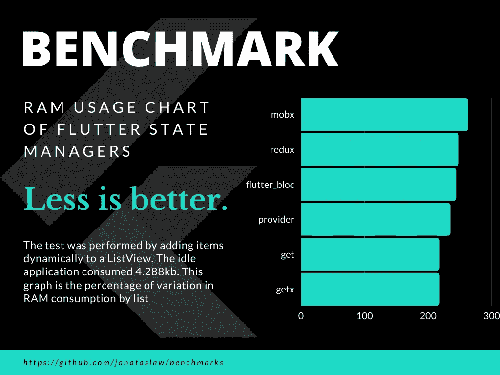

# 谷歌隐藏了哪些令人震惊的最佳实践

> 原文：<https://itnext.io/what-flutter-best-practices-is-google-hiding-735c374a9986?source=collection_archive---------1----------------------->

现在，我不是在谈论表面的东西，比如如果你使用生命周期包作为你的导航观察者，你也可以在你的应用程序日志中获得应用程序生命周期事件。我说的是一只更大的大象。

我可能会与谷歌、非常好的风险投资公司、GSkinner 等公司的一些人对抗。

# **背景**

我们都在某个时候见过这种情况:

好吧，让我用你看不到的方式来解释这个图形基准。

MVVM 的核心，有时也是 ASVM 的核心，是视图模型。这通常意味着一个列表视图，意味着一个列表，甚至在模型方面，它是一个列表而不是一个地图。

那么为什么我要提醒大家这不是一张地图呢？

就计算机科学而言，映射是最精简的内存性能 OOP 结构。猜猜和地图相比，什么最占内存？是的，名单。

想象一下，如果我们实现一个视图模型，有多少列表忽略了 Flutter 框架本身？至少两个。

现在，它对我们选择依赖注入解决方案有意义吗；选择一个使用地图的解决方案，在我们应用程序的一个屏幕上的前两个列表中添加至少一组内存大的斑点？

为什么谷歌和其他公司正在推动 Widget DI？

# **为什么 Widget 依赖注入**

你会注意到谷歌和其他知名的 Flutter 社区成员从来不把 Bloc 或其他形式的 Flutter 称为 MVVM，实际上是 MVVM。在微软的第二轮 ASP-NET 中，他们发明了 MVVM 架构。这项发明的一部分是使它成为马丁·福勒演示模型的变体。它们的部分变化是视图-模型到视图的绑定是由代码生成处理的。

因此，继承的 MVVM 架构定义的一部分是，如果要被称为真正的 MVVM，MVVM 绑定必须是自动的，而不是由开发人员处理。

这就把我们带到了 Google 和其他 Flutter 社区成员推动基于提供商和 Widget-DI 的集团的原因。也就是说，因为当时没有 mixin 结构实现来轻松地将视图-模型方法绑定到视图。

事实上，mixins 并不是将视图模型方法绑定到小部件的唯一方式，因为我们也可以使用扩展。

这两个 MAP 实现的服务定位器 DI 解决方案实际上采用了两种方式。Get_IT 使用 mixins 将视图模型方法绑定到小部件，而 GETX 使用扩展来实现相同的绑定。

 [## get_it | Dart 包

### ❤️赞助商这是一个简单的服务定位器，为飞镖和颤振项目提供一些额外的好东西，非常受启发…

公共开发](https://pub.dev/packages/get_it)  [## get_it_mixin | Flutter 包

### 这个包提供了一组 mixin 类型，使得存储在 GetIt 中的数据的绑定变得非常容易。当我…

公共开发](https://pub.dev/packages/get_it_mixin)  [## 获取| Flutter 包

### GetX 是一款超轻且功能强大的颤振解决方案。它结合了高性能状态管理、智能…

公共开发](https://pub.dev/packages/get) 

# **但是没有基于非小部件的阻塞实现**

你表现得好像这很难。Bloc 的核心是一些将流和汇绑定到视图模型的简单方法。我们已经可以做到这一点。的确，您必须做一些工作来分叉反应组件包并修复零安全实现:

[无功组件空安全分支](https://github.com/polyflection/reactive_component/tree/null-safety)

但是，这不是火箭科学。我在几个小时内完成了这项工作。

# **但是如果我想要 Redux** 呢

你知道有一个非 Widget-DI 为基础的 Redux 吗？它已经实现了 ASVM 架构，因为它与流和接收器集成在一起。它被称为异步 Redux:

 [## async_redux | Flutter 包

### Async Redux 是 Redux 的一个特殊版本，它易于学习，易于使用，易于测试，没有样板文件

公共开发](https://pub.dev/packages/async_redux) 

它很强大，但并不复杂，因为它没有中间件，不像其他复杂的 Redux 实现。对于我们的内存性能讨论很重要的一点是，除了父 app-one 之外，您可以将 redux 存储分离为每个视图模型一个。

这有一个移动方面，因为在 Android 上，我们可以在应用程序上存储的恢复数据有限，只有 2GB 到 3GB。其概念是，您将存储视图模型 redux 商店，因为它将低于 2GB 到 3Gb，如果应用程序由于内存压力而关闭，只需重新创建应用程序模型商店的其余部分。

# **有什么理由继续做遗留小部件 DI**

有没有继续做遗留 Widget DI 的理由，比如 Provider 和 RiverPod？除非你真的重视增加应用程序关闭的内存压力，只是为了虐待用户，更不用说运行缓慢的应用程序，因为使用基于列表的 DI 解决方案会额外增加内存。

# **什么是 ASVM(RXVAMS)**

什么是 ASVM？这是异步流视图模型架构。我不是第一个创造它的人，当然也不是最后一个。

其他人称之为 RxVAMS，它是反应-视图-应用模型-服务。具体请看这篇文章:

[使颤振更具反应性](https://www.burkharts.net/apps/blog/making-flutter-more-reactive/)

# **结论**

使用 Flutter Skeleton 模板应用程序并对其进行修改和润色以及深入研究最佳实践的原因之一是，我可以质疑每个选择，并了解每个开发人员和设计人员在创建 Flutter 应用程序时应该使用的 Flutter 最佳实践的核心。

当有更好的方法来改善 Flutter 应用程序的用户体验时，坚持传统是没有意义的。

关于我，弗雷德·格罗特

从 Android Java-Kotlin 开发转移到 Flutter 应用程序开发。

我目前在 flutter 上的免费资料就像代码和创意资产一样，在我的 code-with me GitHub 资料库中，网址是:

 [## GitHub-Fred grott/not _ in _ flutter _ docs:flutter 代码教程

### 这说明了一切。在 Flutter Docs 中没有，这是一种地下的 Flutter 应用程序开发和设计指南。代码在…

github.com](https://github.com/fredgrott/not_in_flutter_docs) 

您可以关注我

 [## 弗雷德·格罗特(弗雷德·格罗特)

### Keybase 是什么鬼东西？Keybase 为您提供了管理身份、创建安全聊天和…

keybase.io](https://keybase.io/fredgrott)  [## JavaScript 不可用。

### 编辑描述

twitter.com](https://twitter.com/fredgrott)  [## fredgrott -概述

### 我是创业前端开发设计师。我正在构建一些 flutter 应用程序和编写一些 flutter 应用程序开发人员…

github.com](https://github.com/fredgrott)