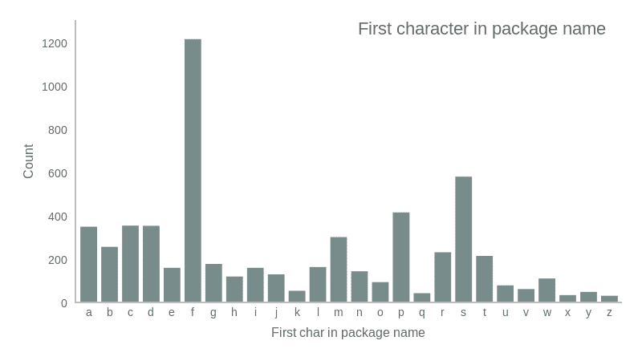

# 我从用 Flutter 开发游戏中学到了什么

> 原文：<https://itnext.io/what-i-learned-developing-games-from-scratch-on-flutter-a2eda59460e5?source=collection_archive---------4----------------------->


“Dart 工程师探索堆栈溢出‘Flutter game dev’部分”，照片由 [Elena Zhuravleva](https://www.instagram.com/lena_5z/) 拍摄。

曾几何时，每个软件工程师都会想到自己写游戏。作为一个纸牌飞人或僵尸网络游戏生存制作狂，有时它会让你发疯，你是多么想现在就写下它。

人类大脑的连接方式，哦，这个非常聪明的优化机器，我们经常倾向于用我们已经熟悉的东西或者每个人都使用的东西来开始我们的项目。前者是我的选择，那正是我激动万分的时期。长话短说，我已经开始用它写一个游戏，下面是我学到的东西。

# #1: Dart 社区喜欢以“F”开头的库名。

我知道这似乎是一个牵强的说法，但这里有一些来自 [pub.dev](/pub.dev) 的数字:



并且特别有 **907** (超过 **74%** )名称以 ***打头*** 的套餐。因此，如果您在 dart 生态系统中遗漏了什么，尝试寻找 *"f"* 单词:)

数据由以下[木偶师](https://pptr.dev/)收集🙌脚本:

```
const puppeteer = require('puppeteer');
const alphabet = 'poiuytrewqlkjhgfdsamnbvcxz'.split('');(async () => {
  let results = {};
  const browser = await puppeteer.launch({args: ['--no-sandbox', '--disable-setuid-sandbox']});
  const page = await browser.newPage(); await page.setViewport({ width: 1024, height: 768 });

  for (let char of alphabet) {
    await page.goto(`https://pub.dev/packages?q=package%3A${char}`);
    const el = await page.$('.package-count span');
    const count = await (await el.getProperty('textContent')).jsonValue(); results[char] = parseInt(count);
    await page.screenshot({path: `pub/${char}.png`});
  } console.log(JSON.stringify(results, null, 2)); await browser.close();
})();
```

# #2: Flutter 的顶级游戏引擎是 Flame🔥

对上述说法的另一个证明， [Flame](https://flame-engine.org/) 是 Flutter 的顶级游戏引擎，截至 2019 年 9 月。这是一个很棒的库，具有方便的 API，允许你避免自己实现游戏循环和组件抽象，并且允许方便地将其嵌入到你的小部件树中的某个地方。然而，火焰仍然远离那些被认为“小型”的引擎(如 [Phaser](https://phaser.io/) 、 [Pixi.js](https://www.pixijs.com/) 或 [Babylon.js](https://www.babylonjs.com/) )，也远离像[虚幻引擎](https://www.unrealengine.com/en-US/)或 [Unity](https://unity.com/) 这样的怪物。


从好的方面来说，Flame 的简单性很棒，它允许你简单地阅读它的源代码，并快速修改你的代码来做它应该做的事情，而不是花半天时间在文档和社区门户网站上寻找**that method，它做你需要的**。他们的[指南](https://jap.alekhin.io/2d-casual-mobile-game-tutorial-flame-flutter-part-1)并没有提到黑盒和魔法。同时，如果你需要具体的东西，*几乎可以肯定*，它还没有出现。

*免责声明:本人与火焰游戏引擎无关，以上观点主观。*

# #3:自己写

是的，这可能是一个相当大的范式转变，特别是如果你来自现代 *Javascript* 的富饶之地，NPM*[有超过一百万个软件包](http://www.modulecounts.com/)随时可用。Dart 还没有出现，你将会陷入这样一种境地:你需要的东西还没有被世界上的任何人写出来。*

*好的一面是，它会让你以你意想不到的方式扩展你的工程专业知识。有一点需要注意的是，如果你正在为游戏开发而探索 Flutter，你可能已经不害怕未知了，所以 [**WIY**](https://www.abbreviations.com/term/235205) 一路走好！*

**

*所以，准备好为你自己的等级提升、库存、设置持久性等等编写系统吧。*

# *#4: Flutter 让你完全控制屏幕上显示的内容*

*这是真的，而且一个不同时*和*，所以有点量子的说法。*

**

**图片来源:*[*Kurzgesagt——总而言之*](https://www.youtube.com/channel/UCsXVk37bltHxD1rDPwtNM8Q)*

*折叠这个语句的波函数，您会观察到自己处于这样一种情况，即您真的控制了屏幕上的每一个像素，但是没有多少 Dart 代码使用常见的 Flutter APIs 或小部件。但与此同时，利用框架的渲染能力会在多个方面限制您，因此如果您停留在 widgets 框架内，将无法获得相同级别的控制。但是，就像任何量子现象一样，现实最终会处于两种状态。游戏内 UI 和画布的 Flutter 和 widgets，以及实际需要 _full_ control 的地方的自定义画师。因此，你仍然可以获得实际界面的 Flutter APIs 的惊人便利，但可以完全访问 canvas 以获得实际的游戏视图。*

# *#5:完全控制未满*

*是的，是的，我对文章情节中的这种老套扭曲感到抱歉，但如果你真的考虑使用 Flutter 进行游戏开发，因为它可以“完全控制”屏幕上发生的事情，那么你应该知道一些限制。*

*首先，如果你在寻找真正的力量，你很可能最终会在 **dart:ui** 层使用 Flutter。你可以在 [Flutter:穿越抽象森林中找到更多关于 Flutter 分层架构的信息🌲](https://medium.com/@maksimrv/flutter-through-the-abstractions-forest-5d165ecdb406)文章。哦，好家伙，那层*是镖*。在我们之间，我对那里发生的一些事情还没有准备好。一些限制是:*

*-画布内容只能通过绑定的 [PictureRecorder](https://api.flutter.dev/flutter/dart-ui/PictureRecorder-class.html) 异步访问。我试过，这意味着你不能在每一帧后复制游戏图像的全部内容，对每个像素进行一些变换，然后再渲染回来。*

*-您无法使用 **dart:ui** 画布访问完整的 [Skia](https://skia.org/) API。所以如果你想为你的游戏写一些着色器，现在还不可能。*

*-**dart:ui**[Path](https://api.flutter.dev/flutter/dart-ui/Path-class.html)对象不允许您访问路径内的点数据，尽管它显然是可用的。*

*-如果你想在游戏中使用 3D 场景，你需要自己编写所有的投影逻辑。这是可能的，但它将纯粹在 CPU 上运行，所以从性能和时间投资的角度来看，这不是一个好主意。*

**

*总的来说，在这个层面上使用 Flutter 感觉有 API 和实现的差距，它不能直接应用于 2D UI 渲染，但同时，如果你的利基是雪碧 2D 游戏，你可能不会受到太多的限制。*

# *那么我甚至应该考虑用 Flutter 做手游吗？*

*用 flutter 写游戏是一种冒险，用它写一个冒险游戏将是冒险平方。就我个人而言，我喜欢 Dart 和 Flutter 生态系统，也不害怕做一些令人讨厌的编码，比如编写 BMP 编码器或转换矩阵的插值器。但这可能对你不适用，所以如果你在寻找一个答案，如果 Flutter 对于编写移动游戏是可行的，就像在数百个其他博客帖子中一样，答案将是量子。*

***是**如果*这些*中至少有两个*为真*:*

*   *你这样做是为了*乐趣*和*经验*的一个*副业**
*   *你正在*享受* *飞镖*和*飘起*的生态系统*
*   *你不介意*编程*一些基础的东西*从头开始**

***否，**如果*这些*中的任何一个*为真*:*

*   *你在为你的下一个产品寻找最快的营销方式*
*   *你没有任何在其他技术平台开发游戏的经验*

*所以，简单地说，它还没有准备好进入黄金时间，但它绝对是一个值得探索和跟踪的有趣的技术组合。*

*感谢你来到这里！如果你有任何关于用 Flutter 编写游戏的有趣故事，请在评论中留言或给我留言 [av@av.codes](mailto:av@av.codes) ，我想我们会有话题可聊的！*

*是的，你不会在这个帖子中看到任何关于我自己的游戏或任何东西的无耻插件:)*

*祝你和 Flutter(可能还有 Flame)玩得开心！*