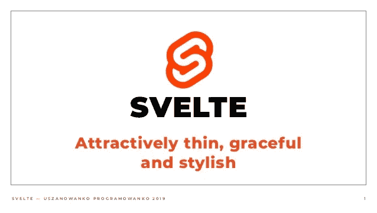

# 如果斯维特有另一个变化探测器会怎么样

> 原文：<https://itnext.io/what-if-svelte-would-had-another-change-detector-4955f9b584d4?source=collection_archive---------1----------------------->



Svelte 是非常好的框架/库，但是它有一个敏感的问题——它是一个变化检测器，如果你改变对象，它不能很好地检测变化，所以有时我听说我应该使用不可变的方式。

我想尝试任何其他细长的变化检测器，例如 Angular。所以我做了一些类似于 Svelte (Svelte-M)的实验性编译器，顺便说一下它给出了更好的捆绑包大小和性能:

**一个测试 todo-app 的 bundle** 大小几乎是*的两倍*:

*   纤薄: **4.7k** (2.2k gzipped)
*   纤薄 M: **2.7k** (1.2k gzipped)

**性能** *(基准更新于 2020 年 7 月 5 日，Firefox 78)*:

*   5000 项渲染:svelet**353 ms**，svelet-M**327 ms**(svelet-M 略快)
*   重新渲染(移除和添加 5000 个项目):svelet:**445 ms**，svelet-M**277 ms**(快两倍)

用 Svelte-M 编译的 todo-app 示例:[example.html](https://github.com/lega911/svelte-m/blob/master/example.html)并部署在 [jsfiddle](https://jsfiddle.net/lega911/w1a63hj8/) 中。[基准源](https://gist.github.com/lega911/4372e9eabb3bba29057be0f7766264a9)。

*警告:Svelte-M 只是一个小实验，所以功能不多，非常有限*

**为什么更快？** Svelte 逐个元素地构建 DOM，然后添加 props，这不是构建 DOM 的最快方法，而且会增加源代码，Svelte-M 将 DOM 构建为一个命令，并使用 *Node.cloneNode* 克隆项目(DOM 树)(作为一个命令，而不是逐个元素地构建)。

> 以后还想看这个故事吗？把它保存在[](https://usejournal.com/?utm_source=medium.com&utm_medium=blog&utm_campaign=noteworthy&utm_content=eid7)**期刊中。**

## *另一个变化检测器*

*但最重要的是另一个变化检测(我会称之为绑定检查)，下面几个例子如何更好:*

```
*let todos = [];const add = () => {
  todos.push({name: 'Hello!'});
};*
```

*当你调用函数“add()”时，Svelte 没有检测到变化，所以 DOM 不会被更新，你必须使用赋值，例如 t *odos=todos* (看起来像其他框架中的手动“setValue”)。这个片段与 Svelte-M 一起工作很好，它检测任何变化。*

*另一个例子:我有一个待办事项列表，我想通过点击待办事项来更改一些内容:*

```
*<script>
  let todos = [];
  const fix = (todo) => {
    todo.name += '!';
  }
</script><ul>
  {#each todos as todo }
  <li>
    <span on:click={() => fix(todo)}>{todo.name}</span>
  </li>
  {/each}
</ul>*
```

*当你点击一个项目，函数“修复”将被调用，Svelte 不会检测到变化，有几种方法可以修复它，但无论如何你需要做些什么。与苗条-M 它的工作只是因为它被改变了。*

*因此，另一个变化检测系统可能会更好，它像预期的那样工作(更接近 javascript)，技巧更少，工作速度足够快。我想看到类似的苗条…*

*Svelte-M 编译器的源代码:[https://github.com/lega911/svelte-m](https://github.com/lega911/svelte-m)*

*如果你愿意尝试，有一个小的绑定变化，只是因为它更短:*

```
*Svelte:
  <span on:click={() => fix(todo)}>Svelte-M:
  <span on:click={fix(todo)}>*
```

*📝把这个故事保存在[杂志](https://usejournal.com/?utm_source=medium.com&utm_medium=noteworthy_blog&utm_campaign=tech&utm_content=guest_post_read_later_text)上。*

*👩‍💻每周日早上醒来，你的收件箱里会有本周最值得关注的科技新闻。[阅读科技简讯](https://usejournal.com/newsletter/noteworthy-in-tech/?utm_source=medium.com&utm_medium=noteworthy_blog&utm_campaign=tech&utm_content=guest_post_text)中值得关注的内容。*