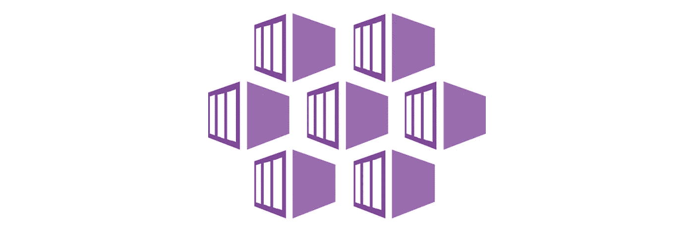

# Azure Kubernetes 服务中的节点资源组是什么？

> 原文：<https://itnext.io/what-is-a-node-resource-group-in-azure-kubernetes-service-f693207912db?source=collection_archive---------0----------------------->

这里有一个关于 [Azure Kubernetes 服务](https://docs.microsoft.com/azure/aks/?WT.mc_id=medium-blog-abhishgu)中`Node Resource Group`的快速提示



当你[创建一个 AKS 集群](https://docs.microsoft.com/azure/aks/kubernetes-walkthrough?WT.mc_id=medium-blog-abhishgu)作为 [Azure 资源组](https://docs.microsoft.com/azure/azure-resource-manager/management/overview?WT.mc_id=medium-blog-abhishgu#terminology)的一部分时，它包含的只是 AKS 集群，而不是其他 AKS 组件，比如节点(虚拟机)等。这些与您的 AKS 集群相关的资源是另一个*不同的*资源组的一部分，该资源组是在部署期间*自动*创建的，这被称为**节点资源组**

> *这经常会使不熟悉 AKS 的人出错，因为他们试图在部署 AKS 的原始资源组中寻找组件*

除了最初部署时作为 AKS 集群一部分的节点、虚拟网络和其他资源之外，节点资源组还可以托管其他组件。例如，如果您[使用默认存储类](https://docs.microsoft.com/azure/aks/concepts-storage?WT.mc_id=medium-blog-abhishgu#persistent-volume-claims)的持久卷声明，AKS 将提供一个 [Azure 磁盘](https://docs.microsoft.com/azure/virtual-machines/linux/managed-disks-overview?WT.mc_id=medium-blog-abhishgu)，或者，如果您使用`[LoadBalancer](https://kubernetes.io/docs/concepts/services-networking/service/)` [服务](https://kubernetes.io/docs/concepts/services-networking/service/)，AKS 将在幕后提供一个 [Azure 负载平衡器](https://docs.microsoft.com/azure/load-balancer/load-balancer-overview?WT.mc_id=medium-blog-abhishgu)。

节点资源组有一个默认的命名约定，所以找到它并不困难。格式为— `MC_<AKS resource group>_<AKS cluster name>_<AKS region>`如`MC_mygroup_myaks_southeastasia`。假设您想要列出支持 AKS 集群中持久卷的磁盘，您可以在 [Azure CLI](https://docs.microsoft.com/cli/azure/?view=azure-cli-latest&WT.mc_id=medium-blog-abhishgu) 中使用`[az disk list](https://docs.microsoft.com/cli/azure/disk?view=azure-cli-latest&WT.mc_id=medium-blog-abhishgu#az-disk-list)`命令以及节点资源组的名称:

```
export AKS_CLUSTER_RESOURCE_GROUP=mygroup
export AKS_CLUSTER_NAME=myaks
export AKS_CLUSTER_REGION=southeastasiaaz disk list --resource-group MC_${AKS_CLUSTER_RESOURCE_GROUP}_${AKS_CLUSTER_NAME}_${AKS_CLUSTER_REGION}
```

在 AKS 集群创建过程中，您还可以选择[为节点资源组提供您选择的自定义名称](https://docs.microsoft.com/azure/aks/faq?WT.mc_id=medium-blog-abhishgu#can-i-provide-my-own-name-for-the-aks-node-resource-group)。您可以使用 Azure CLI 使用`[az aks show](https://docs.microsoft.com/cli/azure/aks?view=azure-cli-latest&WT.mc_id=medium-blog-abhishgu)`命令来查询这个资源组的名称

```
az aks show --resource-group $AKS_CLUSTER_RESOURCE_GROUP --name $AKS_CLUSTER_NAME --query nodeResourceGroup -o tsv
```

请注意:

*   不要(手动)向节点资源组添加不相关的组件，因为它的生命周期与 AKS 集群本身的生命周期紧密相关，也就是说，一旦删除了 AKS 集群，节点资源就会自动删除
*   [请不要修改](https://docs.microsoft.com/azure/aks/faq?WT.mc_id=medium-blog-abhishgu#can-i-modify-tags-and-other-properties-of-the-aks-resources-in-the-node-resource-group)节点资源组中资源的属性

> 在总结之前，您是否已经了解了[应用云故事](https://aka.ms/applied-cloud-stories)计划？这是一个关于相关云场景和工作负载的技术内容、有趣的挑战以及可以在 Azure 上运行的实用解决方案的公开征集。你可以通过写一篇新文章，或者录制一个关于你选择的主题的新视频来参与！
> 
> [您可以在 2020 年 3 月 15 日之前提交您的故事](https://forms.office.com/Pages/ResponsePage.aspx?id=v4j5cvGGr0GRqy180BHbR3gEboqOOXdAmlybbKuHqRhURVNQTzkwWjdHNTlIQTlVOEFIWjYxSzFMSy4u)🙌它们将有助于启发和教育全球的工程师，让他们了解如何采用先进、创新和关键任务的云方案来解决具体问题。

目前就这些。敬请关注更多内容！