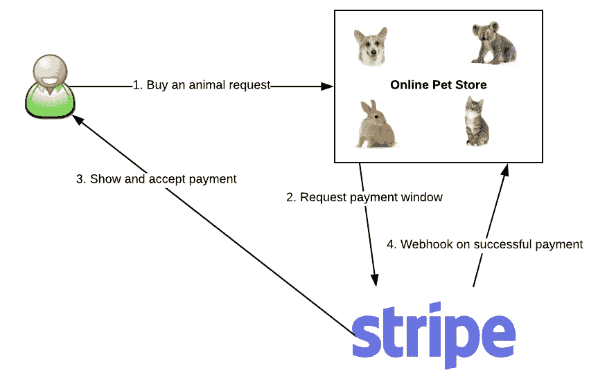
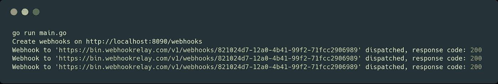
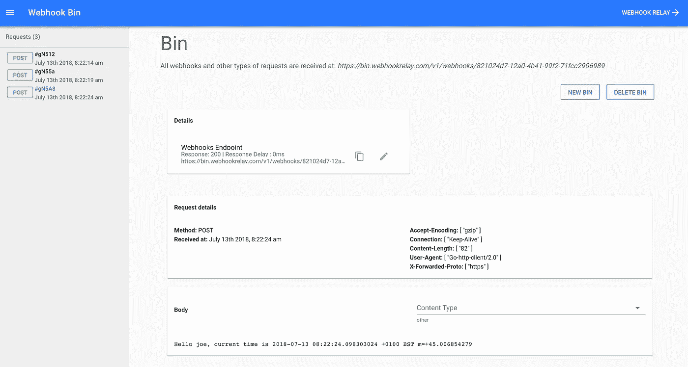

# 什么是 webhook 以及如何创建 web hook？

> 原文：<https://itnext.io/what-is-a-webhook-and-how-to-create-one-f7057d2cc0a?source=collection_archive---------4----------------------->

由于我们在 web 上做的大多数事情都可以用事件来描述，webhooks 已经成为一种事实上的连接系统的方式，无论是新用户帐户的创建、成功的支付、DockerHub 图像推送事件还是 Git 存储库中的新 pull 请求。它们是非常有用和轻量级的信息共享方式。



那么，到底什么是 webhook？webhook 是应用程序向其他应用程序提供实时信息的一种方式。webhook 在数据发生时将数据传送给其他应用程序，这意味着您可以立即获得数据。与典型的 API 不同，在典型的 API 中，您需要非常频繁地轮询数据以便实时获取数据。这使得 webhooks 对提供商和消费者来说都更加有效。由于大多数供应商都有严格的 API 速率限制，您要么必须采用 webhooks，要么接受您的系统总是稍微(或更多)过时的事实。上面的例子显示了向用户请求付款的典型流程。

webhook 有时被称为“反向 API”，因为它们给出了 API 规范，并且您必须为 web hook 设计一个 API 来使用。webhook 会向你的应用发出一个 HTTP 请求(通常是一个帖子)，然后你会负责解释它。您可以将其视为 CLI/UI 使用的常规 API 路由，但在这种情况下，用户将是您依赖的第三方服务。

虽然大多数开发人员都在使用由 Stripe 或 GitHub 等流行服务产生的 webhooks，但有时您也想让用户从您的应用程序接收 webhooks。在这篇博文中，我们将构建一个简单的应用程序，用户可以在其中注册他们的端点并接收事件。

# 创建 webhook 调度应用程序

我们的应用程序将会用 Go 编写(安装说明可以在这里找到[但是你可以选择任何你想要的语言，这只是一个简单的例子来演示外发的 webhook 行为。代码很简单，即使是非 Go 开发人员也应该觉得可读:](https://golang.org/doc/install)

# 运行您的 webhook 生成器

要使用我们的 webhook 生成器，我们需要一个可以接收并帮助我们调试它的端点。对于这个任务，我们将使用这个免费的服务:【https://bin.webhookrelay.com/[。打开链接后，你应该被重定向到一个独特的网址，这是你的 bin。获取 bin 地址，您马上会需要它。](https://bin.webhookrelay.com/)

让我们开始我们的应用程序:

```
$ go run main.goCreate webhooks on http://localhost:8090/webhooks
```

现在，添加我们的 bin:

```
curl --request POST \--url http://localhost:8090/webhooks \--header 'content-type: application/json' \--data '{"name": "joe","destination": "https://bin.webhookrelay.com/v1/webhooks/821024d7-12a0-4b41-99f2-71fcc2906989"}'
```

添加后，几秒钟后您应该会看到日志:



在我们的 webhooks bin 中，我们应该看到传入的请求:



# 结论

总结一下——web hooks 和 API 请求是相似的，都是事件，目的是在系统之间共享信息。虽然 API 轮询在早期看起来是一个不错的解决方案，但是如果有太多的用户依赖它，可能会导致后端停机或者严重影响性能。

要在您的系统中成功实现 webhooks，请考虑:

*   用户应该能够指定网页挂钩的目的地
*   虽然大多数系统只允许为 webhooks 添加一个目的地，但是您可能希望允许更多目的地。
*   如果状态代码> =500，请重试 webhooks。虽然有些人可能认为我们应该使用 4XX 状态代码重试，但他们通常意味着这是一个错误的请求，我们不应该重试相同的请求。

对 webhooks 感兴趣或有兴趣吗？在我们的 [*示例集*](https://webhookrelay.com/v1/examples/receiving-webhooks-on-localhost.html) *中查看如何在本地主机或私有网络上接收 webhook。Webhook Relay 为开发者提供了一个免费层！*

*原载于 2018 年 7 月 13 日*[*webhookrelay.com*](https://webhookrelay.com/blog/2018/07/13/how-to-create-webhook/)*。*