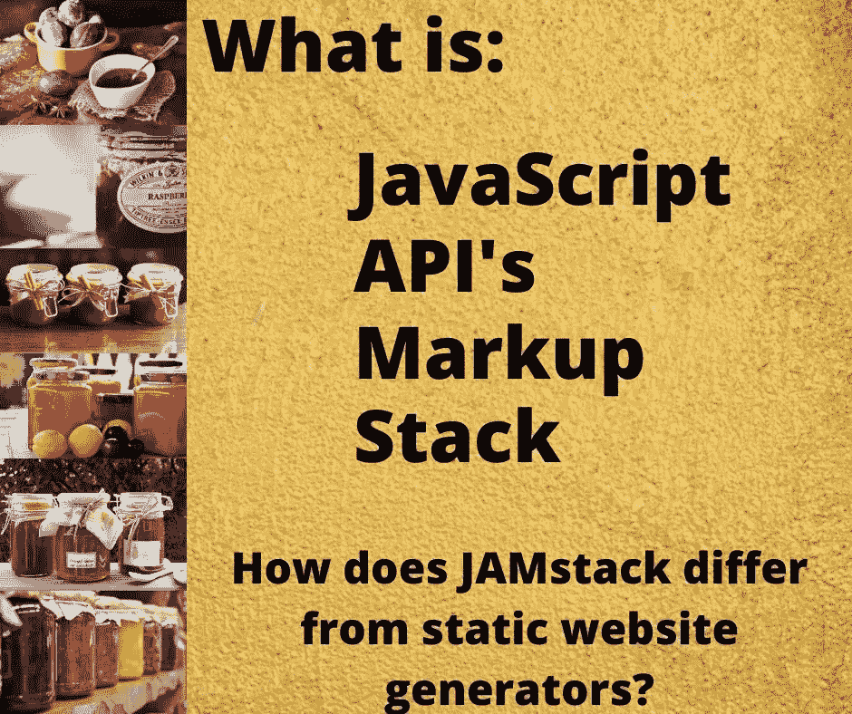
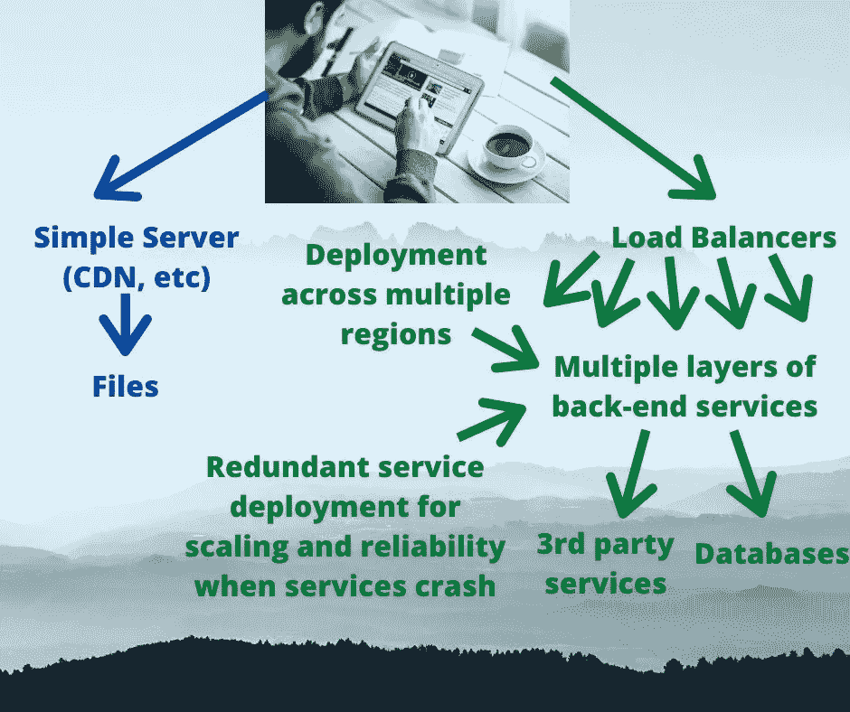

# 什么是 JAMStack，它与静态网站生成器有什么不同？

> 原文：<https://itnext.io/what-is-jamstack-and-how-does-it-differ-from-static-website-generators-73614509c1c2?source=collection_archive---------3----------------------->

JAMStack 和 static website generators 这两个概念作为一种简化网站和 web 应用程序开发的方式而受到关注，同时也是模糊不清的营销术语。两人都谈到了网站的静态资产，但这到底意味着什么呢？为了帮助解码模糊的营销词汇，让我们检查一下这些技术，看看它们有什么不同，并试图找出是否有什么重要的东西需要学习。

最初，网站是你用 FTP 上传到网络服务器的 HTML 文件(和图片)。就是这样。我的第一个网站，在 1994-1995 年，就是这样编码的，当然我用的是 FTP。一大进步是找到了一个程序员编辑器，它可以处理 HTML 语法着色，并且可以直接编辑远程目录结构中的文件。这意味着不必使用 FTP 上传，语法着色使编辑 HTML 变得更容易。另一个进步是一个叫做*的功能，服务器端包含*，允许用户从共享目录中加载侧边栏、页眉或页脚“小部件”作为 HTML 代码片段。这简化了整个网站的一致外观。然后出现了各种各样的伪所见即所得的 HTML 编辑器，我们可以直观地编辑网页，而不是在编辑原始 HTML 时猜测页面的外观。这些编辑器不支持服务器端包含，但 Dreamweaver 中有一个类似的功能，允许用户共享 HTML 片段。

重点是，用简单的 HTML 文件构建网站并不是一个新概念。自从网络出现以来，我们就一直在这么做。

JAMStack 和静态网站生成器的故事是，静态 HTML+CSS+JavaScript 比部署动态内容管理系统(CMS)或定制的服务器端应用程序有很大的速度优势。没有复杂的服务器端代码来呈现页面。

对我来说，这两者都是对复杂的动态 CMS 的反应，或者部署到云主机的复杂的定制微服务。在学习 Drupal 6 和 Wordpress 的复杂性、学习如何定制 Blogger 模板以及学习 Docker 和 Docker Swarm 的这些年里，我对托管一个动态生成页面的复杂内容管理系统的负担感到厌恶。有一段时间，我为不同的网站维护着 10 个左右的 Drupal 实例，管理着多个 VP，面临着永无止境的更新每个网站的模块的苦差事，并担心如何支付托管费用。

由于这些经历，我开发了自己的静态网站生成器 AkashaCMS。有了它，虚拟主机的费用很少，网站用户的页面加载时间也很短。

JAMStack 和 static website generator 的支持者正在宣扬一个类似的愿景——现代 HTML+CSS+JS——静态资产加速——简化部署——消除复杂性——所以让我们从这个问题开始…

# 什么是 JAMStack？

JAMStack 的概念被定义为"*通过预渲染文件交付快速安全的网站和应用，并直接从 CDN 提供服务，消除了管理或运行 web 服务器的需求。*“为了说明问题，首字母缩写 JAM 的意思是:

*   (**J**JavaScript 在 web 浏览器页面中作为客户端层执行
*   ( **A** )客户端 JavaScript 访问托管在服务器上的 API 来检索数据
*   ( **M** )标记，作为 HTML 和 HTML 模板，用于使用 JavaScript 和检索到的数据动态更新页面
*   ( **STACK** )因为，嗯，每个软件产品都被描述成一个栈，对吧？

这很简单，静态资产和快速页面加载时间。但是 JAMStack 定义说“*站点或应用*”，并且要求部署到 CDN。为什么他们明确地指出那些点？JAMStack 和静态网站生成器真的有区别吗？

在像 AkashaCMS 这样的系统中，用户编辑 Markdown 或 AsciiDoc 文件，然后运行工具将这些文件呈现为 HTML+CSS+JS，并使用 *rsync* 部署到 web 服务器。这是 JAMStack 和静态生成的网站模型，将静态 HTML+CSS+JS 资产上传到一个托管系统。一些观察结果:

*   静态生成的网站不需要后端 API 或 DOM 操作，但是如果需要的话，可以包含调用后端 API 和执行 DOM 操作的 JS
*   我们可以在静态生成的网站中使用现代的 HTML+CSS+JS
*   静态生成的网站可以托管在使用 Apache 或 NGINX 网络服务器的廉价共享虚拟主机上
*   这种网站可以托管在 CDN 上，以帮助向世界各地的读者传送
*   为什么坚持部署到 CDN？

换句话说，JAMStack 站点是静态生成的网站的子集，因为 JAMStack 是具有附加约束的静态生成的网站。在这两种情况下，预先呈现的 HTML+CSS+JavaScript 都被部署到一个托管位置，该托管位置除了将文件交付给 web 浏览器之外什么也不做。区别在于对 JavaScript、API 和 DOM 操作的依赖。

有了这两者，我们就跳过了使用动态执行的服务来动态生成网站(例如 Drupal 或 Wordpress)所带来的复杂性和成本。

但是，为什么 JAMStack 的支持者坚持使用 CDN 呢？**什么是 CDN？**CDN，又称内容交付网络，是一种基于云的服务，用于将资产分发到世界各地的远程服务器。承诺是高性能，部分是自动分发内容到世界各地的 CDN 终端。

# 为什么要坚持 CDN？

在 JAMStack 的文献中,“管理 web 服务器”的任务被描述为一个巨大的负担。CDN 被描述为“无服务器”，这被描述为一个巨大的优势。当然*无服务器*是相当愚蠢的，因为 CDN 是由无数的服务器组成的。这实际上意味着部署代码的人不涉及供应和管理服务器的开销。客户不必配置服务器。我们只需部署我们的代码，无服务器服务会处理剩下的事情。有了 CDN，你上传文件，CDN 负责服务器和在全世界分发你的 HTML+CSS+JS 资产。

CDN 的主要优势是，CDN 保证在世界任何地方都有类似的性能。使用单一网络服务器的传统主机——我的网站托管在从 Dreamhost 租赁的共享主机上，其服务器位于南加州——与该服务器的距离会影响访问网站的速度。

根据谷歌分析，我的网站(全部托管在简单共享的 Apache 虚拟主机上)的页面加载速度不到 20 毫秒。在我看来，20 毫秒非常接近于快得惊人的 T2 T3。我还没有尝试过在 CDN 上托管一个网站，也不知道 CDN 提供内容的速度是否更快。我的网站在乌干达的读者可能会比在加州亨廷顿海滩的读者看到更慢的页面加载时间。在 CDN 上托管应该可以平衡这两者。

此外，CDN 提供商真正提供*无限带宽*(收费)。传统的共享主机提供商，如 Dreamhost，提供无限的带宽，但通常有一个未声明的使用水平，超过这个水平，主机提供商将开始发送电子邮件，要求您的网站转移到其他地方。cdn 的性能保证是传统的基于 Apache 的虚拟主机提供商无法做到的。

# JAMStack 是哪里来的？

看起来 JAMStack 来自前端工程师，他们被束缚在编写后端代码的不自然的事情中。管理层可能认为 JavaScript 就是 JavaScript，因此前端工程师应该能够将 Node.js 服务作为 web 应用程序的后端。但是，用 HTML、CSS 和 JavaScript 创建视觉体验的技能与 Docker、Databases 和 Node.js 等后端部署工具的技能非常不同。

前端工程是面向视觉和交互效果的，而后端编码是关于服务器部署、服务扩展等等。前端工程师不愿意进行服务器部署是很正常的。

谈论 JAMStack 的人关注的是部署应用程序的容易程度。像我一样，使用静态网站生成器的人正在寻找一种稍微不同的东西。我们有网站(博客等)部署，看不到动态生成每个页面视图的内容点，并希望降低托管成本。

# 避免复杂性可能是最大的收获

这张图片展示了 JAMStack 和使用静态网站生成器渲染的网站的优势。更简单的系统成本更低，资源影响更小，维护开销更低，速度更快。

左边(蓝色箭头和文本)是部署静态资产的模型。正如 JAMStack 的支持者所坚持的，它们可以部署到 CDN，或者部署到简单的 Apache 或 NGINX 服务器。在这两种情况下，用户的 web 浏览器向 web 服务器发出请求，web 服务器只是发回文件，如此而已。

在右边(绿色文本和箭头)，我们有一个部署在云托管基础架构上的复杂系统。像 AWS 这样的云托管平台有接近无数的功能，让技术专家们有很多兴奋的事情。通过配置和使用云托管平台，驱动所有类型网站的全球规模定制服务是可能的。这是一个引人注目的模式，因为任何人都可以租用服务，只需点击几个按钮，就可以从小规模部署扩展到全球范围的服务。但是请相信我，学习起来很复杂，理解起来很复杂，寻找如何最小化成本很复杂，管理起来也很复杂，等等。

# 无服务器是消除复杂性的真正方法

JAMStack 的支持者称赞 CDN 部署，但他们应该称赞的是*无服务器*概念。

在当今的计算世界中，有许多非常复杂的系统。某些类型的网站需要这种复杂性，因为需要管理大量的服务。

要构建和维护一个跨多个可用性区域工作、自动处理服务故障、处理自动本地化和国际化等等的系统，需要多个高技能工程师团队。不是每个人都能负担得起聘请如此深厚人才基础的成本。

*无服务器*方式提供了一条不同的路线。服务提供商雇佣部署基于云的服务所需的工程人才，我们只需租用他们的服务。无论是数据库服务、内容分发服务、云功能服务还是任何其他服务，我们只需使用服务提供商网站来租赁服务。服务提供商的工程团队负责扩展以满足流量、多区域可用性、备份、可靠性等要求。我们的任务很简单——我们用服务访问细节配置应用程序堆栈，然后继续编写应用程序代码。

非常简单，个人(或小团队)可以:

*   使用前端 JavaScript 创建应用程序
*   将任何自定义后端服务部署到功能即服务系统
*   利用数据库即服务
*   利用其他第三方云服务

一切都不复杂，并且能够快速开发/部署网站或 web 应用程序。所有的复杂性都由无服务器服务提供商来处理。

然而，并非所有的无服务器服务都同样简化。AWS Fargate 被宣传为 AWS ECS 或 AWS EKS 的无服务器版本。ECS 是托管 Docker 容器的 AWS 云服务，EKS 是运行 Kubernetes 的 AWS 服务。Fargate 是*无服务器的*,因为您不提供托管 Docker 容器所涉及的服务器，这确实稍微简化了托管 Docker 服务的任务。但是 Fargate 仍然非常复杂。

在下一节中，让我们更具体地讨论 JAMStack 的实现。

# 这是个不错的理论，但是什么是真正的 JAMStack 或者静态网站呢？

所有这些都相当抽象，所以让我们看一些 JAMStack 的具体例子。

简而言之，JAMStack 是一个包含 JavaScript 的 HTML 页面，它在其中对服务进行 API 调用，使用检索到的数据对 HTML 进行更改。让我们来看一些例子…

# 静态 HTML 或 JAMStack 网站上的评论系统

这些动态合作医疗有其优势。例如，Wordpress 和 Drupal 都集成了一个本地评论系统，并允许用户注册网站来发表评论。通过网站允许你的读者发表评论，可以建立一个社区。为什么我们要放弃这个和其他的特性呢？

第一步是使用静态网站生成器呈现网站内容。有许多这样的系统，每个都有不同的行为。在大多数情况下，内容是用 Markdown 编写的，并通过模板呈现以创建静态 HTML 站点。

然后，对于需要注释的每个页面，添加一些包含注释 UI 的 JavaScript。JavaScript 应该添加到模板中，而不是 Markdown 内容中，以简化整个网站的评论实现。评论 UI 将调用后端评论系统，并在网页的给定位置呈现用户界面。例如:

这(或多或少)是 Disqus 提供的 JavaScript，一个大规模的评论服务。它处理网站上的评论，并有许多有用的工具来管理垃圾邮件发送者和用户认证。

Disqus UI 集成了许多后端服务。例如，用户可以在不离开网页的情况下注册成为 Disqus 用户，它还可以验证使用第三方服务(如脸书或 Twitter)的人。一旦读者通过认证，他们就可以发表评论，评论区会随着其他人发表评论而动态更新。

当我在 Blogger 或 Drupal 博客上安装 Disqus 时，并没有出现 JAMStack 的情况。简单地对第三方服务使用 JavaScript UI 并不能使它成为 JAMStack。Drupal 博客有其自身的复杂性。让它成为 JAMStack 的是使用一个静态网站生成器，这样你就可以部署 HTML+CSS+JS。

有很多像 Disqus 这样的服务提供很多服务。例如，一个天气站点可能会提供一个小部件来显示访问者所在地区的当前天气。以及脸书、Twitter、YouTube 和其他网站提供的嵌入式小部件，也是调用 API 和修改 DOM 的 JavaScript UI 的例子。

# 静态 HTML 或 JAMStack 网站中的自定义后端服务

许多网站也有定制服务。毕竟，第三方服务不能满足所有需求。

举个例子，我的一个网站是一个合适的静态 HTML 站点，其中一个部分有一个用老式 PHP 实现的服务。该服务的最初版本是在 1997 年用 TCL 实现的，在 21 世纪初的某个时候，我将其重写为简单的老式 CGI 风格的 PHP。今天，PHP 脚本是由 AkashaCMS 从模板中呈现的，并使用该网站的 HTML+CSS+JS 进行部署，但它仍然是老派的 PHP。

因此，该网站不是纯粹的静态 HTML，也不是 JAMStack 网站。JAMStack 的支持者认为，这很复杂，应该避免。在这种情况下，PHP 实现需要额外的安全措施。

任何一个给定的站点都可能有无数个定制动态服务的原因。预烘焙的第三方服务并不能满足所有需求。由于 JAMStack 方法不仅关乎性能，还关乎简单性和安全性，这就引出了一个问题:在 JAMStack 站点上使用定制动态服务的最简单、最高性能和最安全的方式是什么？

我立即想到了像 AWS Lambda 这样的功能即服务平台，以及可伸缩性、性能和内置安全性的承诺。

JAMStack 的支持者可能会说实现一个定制的服务:

*   提供 JSON/REST API 的后端
*   JavaScript UI 在浏览器端为用户界面呈现 HTML

很容易为 JavaScript UI 生成一个静态包，以便通过 CDN 进行部署。在

[我的另一个网站](https://techsparx.com/software-development/vue-js/getting-started/)我写了一个关于用 Vue.js 做这件事的教程。使用 Webpack 构建 Vue.js 应用程序包给出了一个包含静态资产的目录，这些资产可以与静态网站的其余部分一起部署。然后将它包含在 HTML 中，如下所示:

URL 处的 JS 代码(在本例中为`/dist/build.js`)必须被编写为以`div#app`元素为目标，在这里它将初始化应用程序。

# 搜索引擎索引 JavaScript 用户界面

阻止我在我的网站上这样做的一件事是，它是否会被搜索引擎索引。相应页面的 HTML 会有 JavaScript 应用程序，而不是当前显示的信息。搜索引擎将如何索引该服务提供的信息？在很多情况下，像我一样，这些信息是网站的一大价值点，许多访问者都是因为这些信息而被吸引到这个网站的。

JAMStack 网站上有一个相应的问题。也就是说，**不是** JAMStack 网站的因素包括:

> *一个单页面应用，在运行时使用同构渲染在服务器上构建视图。*

我不确定这句话是什么意思，但它显然是指服务器端渲染。这

[关于同构 JavaScript 的维基百科页面](https://en.wikipedia.org/wiki/Isomorphic_JavaScript)谈到了服务器端和客户端渲染的混合情况。JAMStack 网站可能会说，使用从服务器检索的数据在客户端进行渲染是最好的。

在维基百科页面上，有一个关于搜索引擎索引有客户端渲染的站点的问题的讨论。更确切地说，由于该页面将同构呈现视为一件好事，因此它给出了以下好处之一:

> 更可预测的 SEO 和站点索引:为了索引 JavaScript 应用程序在客户端呈现的内容，Googlebot 必须在完整的浏览器环境中运行这些 JavaScript 应用程序，并捕获呈现的 DOM。这涉及到复杂的浏览器兼容性问题。此外，因为 JavaScript 应用程序可以发出 AJAX 请求来进一步渲染，所以 Googlebot 必须有一个策略来控制应用程序的网络访问。这就是为什么让你的 JavaScript 应用程序被 Googlebot 正确索引仍然具有挑战性。

因此，我有理由担心这是否会影响我的网站在搜索引擎中的可见性。FWIW Vue.js 声称可以被搜索引擎索引，所以我可能夸大了这个问题。

# 作为应用程序的网站

与我通常创建的网站不同，有些人使用网站作为应用程序的位置。一些例子是 Slack、Discord、Google Mail、Canva，它们都是具有少量公共内容的网站，并且是您访问应用程序的区域。它的主要目的不是像这样呈现书面内容，而是应用程序。

显然，这样的网站与我刚才描述的非常相似。我们将使用一个静态网站生成器来构建几个普通的网页，以及包含 JavaScript 用户界面的页面。如前一节所述，我们将为 JavaScript UI 构建一个代码包，并将其部署到静态网站中。

对于后端服务，UI 可能会使用各种第三方和定制服务。对于自定义服务，我们再次建议您托管在一个无服务器平台上，以保持简单。

遵循这些建议将使这个网站成为 JAMStack 网站。

这样的网站可能不希望搜索引擎索引应用程序。搜索引擎会在文字处理应用程序的用户界面中找到任何可索引的东西吗？

# 摘要

我们了解到，JAMStack 网站类似于静态 HTML 网站，但有几个特定的要求。由于目标是简单的系统管理，JAMStack 站点最好托管在无服务器平台上。

除此之外，JAMStack 与一段时间以来我们称之为静态 HTML 网站的网站没有什么不同。两者都涉及 HTML、JavaScript 和 CSS 的静态捆绑，目标是提高速度和用户体验，让人们阅读我们的网站。

但是坚持 JAMStack 站点/应用程序必须在 CDN 上是有问题的。我完全理解“ *Jamstack 项目不依赖服务器端代码*的目标，因为这消除了交付高性能的瓶颈。明明 JAMStack 网站坚持 CDN 部署，但那是唯一理性的选择吗？

以我的经验来看，对于我处理的流量水平，Apache 在一个简单的共享 web 托管提供商上就足以提供很好的页面加载时间。JAMStack 网站说的一件事是:

> *它们的共同点是不依赖于网络服务器。*

相反，我们应该依赖无服务器服务，当然，这是建立在服务器上的。*无服务器*的意思是*其他人的服务器*，这样做的好处是简化了管理体验。这就是 JAMStack 所说的不依赖于 web 服务器的意思。

我保证使用 Dreamhost 我也不会参与服务器管理。我在 Dreamhost 上的一个简单的共享 Apache 帐户上有六个静态 HTML 站点，并且没有参与管理服务器。我简单地使用 rsync 上传 HTML+CSS+JS 到服务器，一切都很好。我希望 JAMStack 网站不要如此坚持反服务器的立场。

*原载于*[*https://akashacms.com*](https://akashacms.com/news/2020/08/jamstack-websites.html)*。*