# 什么是:Linux 密匙环，gnome 密匙环，秘密服务，和 D-Bus

> 原文：<https://itnext.io/what-is-linux-keyring-gnome-keyring-secret-service-and-d-bus-349df9411e67?source=collection_archive---------1----------------------->


这是一篇很长的文章，我不确定是把它分成三部分还是把它们放在一起更好。一边是钥匙圈，另一边是 D-Bus，最后是特勤局。

最终，我决定把它们放在一起，因为我在相同的范围内搜索了所有的内容，它们彼此相关。

因此，在这篇文章中，我们将讨论下一个问题:

*   **钥匙圈**到底是什么
*   Linux 钥匙圈和 **GNOME 钥匙圈**有什么区别，它们之间有什么联系吗
*   有哪些密匙环实现
*   什么是`org.freedesktop` **特勤**以及它与**侏儒钥匙圈**的关系
*   什么是 **D-Bus** ，我们如何使用它来查看一个密匙环服务是如何工作的
*   以及几个使用 **Linux 密匙环**、 **GNOME 密匙环**、 **KWallet** 和 **KeePass** 作为密匙环后端的例子

这篇文章绝对不是“如何配置它”的“教程”,而是对上面提到的组件的概述，试图理解它们是什么以及如何使用它们。

一个如何配置 KeePass 和 GNOME Keyring 的真实例子，我们会看到下面的帖子。

这个帖子是由一个很长很长的谷歌搜索写的，所以这里会有很多使用过的文档和其他材料的链接。

我可能会混淆一些东西，甚至以错误的方式理解，所以如果你看到任何错误，请欢迎评论。

帖子的写作过程是这样的:

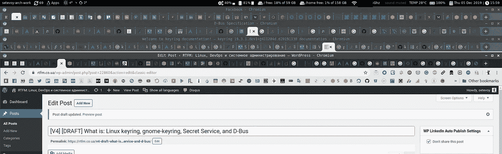

# 内容

*   [什么是钥匙圈？](https://rtfm.co.ua/en/what-is-linux-keyring-gnome-keyring-secret-service-and-d-bus/#What_is_the_Keyring)
*   [Linux key ring vs gnome-key ring](https://rtfm.co.ua/en/what-is-linux-keyring-gnome-keyring-secret-service-and-d-bus/#Linux_keyring_vs_gnome-keyring)
*   [总结](https://rtfm.co.ua/en/what-is-linux-keyring-gnome-keyring-secret-service-and-d-bus/#Summary)
*   [钥匙圈实施](https://rtfm.co.ua/en/what-is-linux-keyring-gnome-keyring-secret-service-and-d-bus/#Keyrings_implementations)
*   [从 gnome-keying 拦截密码](https://rtfm.co.ua/en/what-is-linux-keyring-gnome-keyring-secret-service-and-d-bus/#Passwords_interception_from_the_gnome-keyting)
*   [什么是特勤局？](https://rtfm.co.ua/en/what-is-linux-keyring-gnome-keyring-secret-service-and-d-bus/#What_is_the_Secret_Service)
*   [特勤局术语表](https://rtfm.co.ua/en/what-is-linux-keyring-gnome-keyring-secret-service-and-d-bus/#The_Secret_Service_glossary)
*   [D-Bus](https://rtfm.co.ua/en/what-is-linux-keyring-gnome-keyring-secret-service-and-d-bus/#D-Bus)
*   [D-Bus 工具](https://rtfm.co.ua/en/what-is-linux-keyring-gnome-keyring-secret-service-and-d-bus/#D-Bus_tools)
*   [钥匙圈示例](https://rtfm.co.ua/en/what-is-linux-keyring-gnome-keyring-secret-service-and-d-bus/#Keyrings_examples)
*   [Linux 钥匙圈](https://rtfm.co.ua/en/what-is-linux-keyring-gnome-keyring-secret-service-and-d-bus/#Linux_keyring)
*   [keyctl() syscall](https://rtfm.co.ua/en/what-is-linux-keyring-gnome-keyring-secret-service-and-d-bus/#keyctl_syscall)
*   [侏儒钥匙圈](https://rtfm.co.ua/en/what-is-linux-keyring-gnome-keyring-secret-service-and-d-bus/#gnome-keyring)
*   [D-Bus GetConnectionUnixProcessID](https://rtfm.co.ua/en/what-is-linux-keyring-gnome-keyring-secret-service-and-d-bus/#D-Bus_GetConnectionUnixProcessID)
*   [蟒蛇皮钥匙圈](https://rtfm.co.ua/en/what-is-linux-keyring-gnome-keyring-secret-service-and-d-bus/#python-keyring)
*   秘密工具
*   [KWallet](https://rtfm.co.ua/en/what-is-linux-keyring-gnome-keyring-secret-service-and-d-bus/#KWallet)
*   [KeePass](https://rtfm.co.ua/en/what-is-linux-keyring-gnome-keyring-secret-service-and-d-bus/#KeePass)

## 什么是钥匙圈？

从“**钥匙圈**这个词到底是什么意思开始？

先说维基百科—[https://en . Wikipedia . org/wiki/key ring _(密码术)](https://en.wikipedia.org/wiki/Keyring_(cryptography)):

> 在密码学中，密钥环存储已知的加密密钥(在某些情况下，还存储密码)。

然后，让我们继续 GNOME 项目文档—[https://help . GNOME . org/users/sea horse/stable/key ring . html . en](https://help.gnome.org/users/seahorse/stable/keyring.html.en):

> 就像现实生活中的钥匙圈允许您将某些密钥集合在一起一样，密码和密钥中的钥匙圈允许您将密码和密钥放在不同的组中。

甚至让我们来看看 MySQL 文档—[https://dev . MySQL . com/doc/ref man/5.7/en/key ring-service . html](https://dev.mysql.com/doc/refman/5.7/en/keyring-service.html):

> 一种密匙环服务，使内部服务器组件和插件能够安全地存储敏感信息以供以后检索

最后，看看 http://man7.org/linux/man-pages/man7/keyrings.7.html 的*钥匙圈(7)* 手册页—:

> Linux 密钥管理工具主要是各种内核组件在内核中保留或缓存安全数据、认证密钥、加密密钥和其他数据的一种方式。

所以，**钥匙圈** *概念*——它是某种机制，或者设施，或者具体应用，意在存储一些机密数据。

很好，让我们深入一点。

## Linux 钥匙圈 vs gnome-钥匙圈

使用的有用链接:

*   [内核密钥保留服务](https://www.kernel.org/doc/Documentation/security/keys.txt)
*   [http://www . ICT . Griffith . edu . au/Anthony/info/crypto/passwd _ caching . txt](http://www.ict.griffith.edu.au/anthony/info/crypto/passwd_caching.txt)
*   [http://www.ict.griffith.edu.au/anthony/info/crypto/](http://www.ict.griffith.edu.au/anthony/info/crypto/)
*   [https://wiki.gnome.org/Projects/GnomeKeyring](https://wiki.gnome.org/Projects/GnomeKeyring)
*   [https://wiki.archlinux.org/index.php/GNOME/Keyring](https://wiki.archlinux.org/index.php/GNOME/Keyring)

现在，让我们谈谈 **Linux 内核密匙环**和 **GNOME 密匙环**之间的区别:起初，当我暗示 GNOME 密匙环以某种方式使用内核的密匙环工具时，我感到困惑，但现在——这只是不同的事情。

让我们回到第七代 Linux 钥匙圈:

> 密钥环——内核密钥管理和保留工具

即 *Linux 密匙环* —它是内核的机制，提供存储秘密信息的能力。

现在，让我们阅读`[gnome-keyring](https://wiki.gnome.org/Projects/GnomeKeyring)`文档:

> GNOME Keyring 是 GNOME 中的一个组件集合，它存储秘密、密码、密钥、证书，并使它们对应用程序可用。

所以，*GNOME key ring*——是一个存储机密数据的实用程序(`gnome-keyring-daemon`、库、`seahorse`包等)的集合。参见 [GNOME 钥匙圈架构](https://wiki.gnome.org/Projects/GnomeKeyring/Architecture)。

好的文档也可以在这里找到——[塔楼——加密](http://www.ict.griffith.edu.au/anthony/info/crypto/)，具体参见[缓存密码](http://www.ict.griffith.edu.au/anthony/info/crypto/passwd_caching.txt)文档。

摘要

让我们总结一下 *Linux 钥匙圈*和 *GNOME 钥匙圈*的主要区别:

*   main():
*   Linux 内核——是内核的“密码缓存”工具——它在活动用户/系统会话期间将密码存储在计算机内存中
*   `gnome-keyring` -是将数据保存在硬盘上的持久存储
*   存储:
*   Linux key ring——存储在 RAM 中，因此密码只在会话期间可用，没有必要总是存储它们
*   `gnome-keyring` -在磁盘上创建一个文件，通常在`~/.local/share/keyrings/`
*   访问:
*   Linux 密匙环——通过从用户空间到内核空间的系统调用
*   `gnome-keyring` -途经 DBus
*   要访问的应用程序:
*   Linux 内核— `keyctl`、`systemd-ask-password`等
*   `gnome-keyring` - `[secret-tool](http://manpages.ubuntu.com/manpages/bionic/man1/secret-tool.1.html)`，像`[python-keyring](https://pypi.org/project/keyring/)`、`[seahorse](https://wiki.gnome.org/Apps/Seahorse)`等库

## 钥匙圈实施

*   [KWallet](https://utils.kde.org/projects/kwalletmanager/)
*   [侏儒钥匙圈](https://wiki.gnome.org/Projects/GnomeKeyring)

除此之外，`[python-keyring](https://pypi.org/project/keyring/)`提一下:

*   g Sheet-keyring——一个在谷歌表单中存储秘密的后端。与 [ipython-secrets](https://pypi.org/project/ipython-secrets) 一起使用。
*   [bitwarden-keyring](https://pypi.org/project/bitwarden-keyring/0.1.0/) —在 [BitWarden](https://bitwarden.com/) 密码管理器中存储秘密的后端。

而且这个名单还不全。

此外，还有许多客户端应用程序要与这些密匙环一起使用，同样，列表也不完整:

*   `[libsecret](https://wiki.gnome.org/Projects/Libsecret)`
*   `[python-keyring](https://pypi.org/project/keyring/)`
*   Java-клиент [特勤局](https://github.com/swiesend/secret-service)
*   `[qtkeychain](https://inqlude.org/libraries/qtkeychain.html)`
*   `[secret-tool](http://manpages.ubuntu.com/manpages/bionic/man1/secret-tool.1.html)`
*   `[SecretStorage](https://pypi.org/project/SecretStorage/)`图书馆

## 从`gnome-keyting`拦截密码

在谷歌搜索的时候，在这里发现了一个有趣的 bug 讨论——[https://bugs . launch pad . net/Ubuntu/+source/gnome-keyring/+bug/1780365](https://bugs.launchpad.net/ubuntu/+source/gnome-keyring/+bug/1780365)

简而言之:

1.  客户端和服务通过 D-Bus 进行通信
2.  一个客户向特勤局索要一些数据(在这个案例中是 T7)
3.  该服务通过 D-Bus 发送机密数据
4.  另一个“坏”进程监听 dbus 消息并截获密码

## 什么是特勤局？

另一个我不得不谷歌的概念是:什么是“特勤局”？它与 GNOME 钥匙圈和 KWallet 有什么关系？

它在 Linux 中做什么，我怎样才能接触到它？

好吧，我们再来看文档—[https://specifications . free desktop . org/secret-service/latest/ch01 . html](https://specifications.freedesktop.org/secret-service/latest/ch01.html):

> Secret Service API 允许客户端应用程序将机密安全地存储在用户登录会话中运行的服务中。

啊哈，即*秘密服务*——它不是某个特定的服务或应用程序，但它是一种规范，一种由 GNOME 和 KDE 项目创建的 RFC，用于确定对于想要使用 GNOME Keyring 或 KWallet 存储他们的秘密的客户端，该 API 必须如何实现。

此外，秘密服务 API 不仅受 GNOME Keyring 和 KWallet 支持，还受 KeePass 和其他应用程序的支持。

嗯，有点令人困惑的是*特勤局*的名字本身——“一个隐藏的服务”。如果把它叫做*Secret****s****Service*，即“a secrets data 的服务”，那就清楚多了。

## 特勤局词汇表

简而言之:

*   [secret](https://specifications.freedesktop.org/secret-service/latest/ch02.html) :密码本身，或者任何其他秘密数据
*   [项](https://specifications.freedesktop.org/secret-service/latest/ch03.html):每个这样的秘密加上它的一组属性组成一个*项*
*   集合:一组这样的物品构成一个集合(类似于钥匙圈或钱包的概念)
*   由 D-Bus 对象表示的集合和项目，每个都有其唯一的路径
*   [默认集合](https://specifications.freedesktop.org/secret-service/latest/ch12.html):没有特殊条件的客户端应用程序必须将项目保存到默认集合，该集合必须可以通过`/org/freedesktop/secrets/aliases/default` D-Bus 路径访问

## d 总线

好吧…

现在不是回忆前面部分中经常提到的 D 总线以及如何处理它的时候。

因此，Linux 内核 IPC 上的 D-Bus—*进程间通信* —机制，允许操作系统内部的独立进程相互通信。

有用的链接:

*   文档—[https://tech base . kde . org/Development/Tutorials/D-Bus/Introduction](https://techbase.kde.org/Development/Tutorials/D-Bus/Introduction)
*   又一个 doc:[https://dbus.freedesktop.org/doc/dbus-tutorial.html](https://dbus.freedesktop.org/doc/dbus-tutorial.html)
*   关于 D-Bus 传输:[https://dbus . free desktop . org/doc/dbus-specification . html # transports](https://dbus.freedesktop.org/doc/dbus-specification.html#transports)
*   [D-Bus，快速回顾](http://blog.siphos.be/2014/06/d-bus-quick-recap/)
*   [D-Bus 和 URI 命名空间之间的通用标准映射](https://lists.freedesktop.org/archives/dbus/2008-July/010019.html)
*   [D 总线地址— D 总线连接端点](https://developer.gnome.org/gio//2.28/gio-D-Bus-Addresses.html)

简要介绍 D-Bus 中的主要概念和术语:

*   **D-Bus 一般来说**:它是 IPC 的“总线”，即如果在之前的 SSH 示例(参见 [SSH: RSA keys 和 ssh-agent for SSH keys 及其密码管理](https://rtfm.co.ua/en/ssh-rsa-keys-and-ssh-agent-for-ssh-keys-and-their-passwords-management/)帖子)中使用了 UNIX 套接字，这次我们使用的是总线机制，参见[https://www . kernel . org/doc/html/latest/driver-API/driver-model/Bus . html](https://www.kernel.org/doc/html/latest/driver-api/driver-model/bus.html)。反过来，这些公共汽车可以
*   会话总线
*   系统总线
*   私人巴士
*   **消息**:基本通信单元，类似于 TCP/IP 的数据传输，只是在 D-Bus 中，消息的所有数据都包含在消息中，而不是分割在 TCP 包中
*   当一个消息被发送时，它通常会导致某个方法被提供该方法的应用程序调用来执行某些操作
*   应用程序可以向自己发送消息
*   **名称空间**和**地址**:
*   由于不同的应用程序可以放在同一条总线上(或“监听同一条总线”)，并且在此期间，同一应用程序可以提供各种可以接受消息的对象，因此需要某种方法来处理这些消息。在 D-Bus 中，这样的地址由接口名+服务名+对象名组成
*   一个名称空间示例— *org.freedesktop.dbus*
*   地址示例—*UNIX:tmpdir =/tmp/my-app-name*
*   **接口**:特定对象的特定总线上的一组方法和信号。您可以将接口视为命名的方法和信号组。
*   大多数接口将导致用于应用程序的语言的具体构造，例如，它可以是 Java 接口或с++中的虚拟类
*   一个接口示例—*org . free desktop . introspect*
*   服务:代表特定应用程序到总线的具体连接
*   在*服务下*这里指的是一个总线名称(在[起源](https://techbase.kde.org/Development/Tutorials/D-Bus/Introduction#Namespaces_and_Addresses) — *“众所周知的”总线名称*)，但是要记住这里的“总线名称”意味着一个特定的连接名称，而不是总线名称
*   如果一个应用程序有不止一个到总线的连接，或者如果该应用程序运行在多种类型的实例中——例如，通过一个 PID 号来扩展，以使其唯一
*   一个服务实例— *org.kde.screensaver*
*   **对象**:同一个应用程序可以提供对其多个对象的访问，使用路径来分隔这些对象。与服务相关联的每个这样的路径代表一个专用对象，例如`/MainInterface`或`/Documents/Doc1`。对象允许访问接口，并且同一个对象可以同时提供对多个接口的访问
*   参见[https://dbus.freedesktop.org/doc/dbus-tutorial.html#objects](https://dbus.freedesktop.org/doc/dbus-tutorial.html#objects)
*   **方法**:每个对象都有两种类型的成员——方法和信号
*   方法—发送到对象的 ate 消息，用于触发创建该对象的应用程序中的某些操作
*   方法可以将数据传递给应用程序的输入，并可以从应用程序返回包含一些值的输出
*   方法总是有发送方和接收方地址
*   **信号**:
*   类似于这些方法，但是不依赖于任何特定的目的地，并且可以被同一总线上的任何应用程序接受
*   由导出接口的应用程序生成

## d 总线工具

CLI:

*   `[qdbus](http://manpages.ubuntu.com/manpages/trusty/man1/qdbus.1.html)` -通过 D-Bus 观看和发送信息
*   `[dbus-monitor](https://dbus.freedesktop.org/doc/dbus-monitor.1.html)` -查看公交活动
*   `dbus-send` -通过 D-Bus 发送信息

图形用户界面:

*   `[qdbusviewer](https://doc.qt.io/qt-5/qdbusviewer.html)` -查看对象和消息，是`qt5-tools` 设置的一部分
*   `[d-feet](https://wiki.gnome.org/Apps/DFeet)` - D 总线调试器
*   `[bustle](https://gitlab.freedesktop.org/bustle/bustle)` - D 总线消息分析器和分析器

例如`d-feet`，安装它:

```
$ sudo pacman -S d-feet
```

运行它:

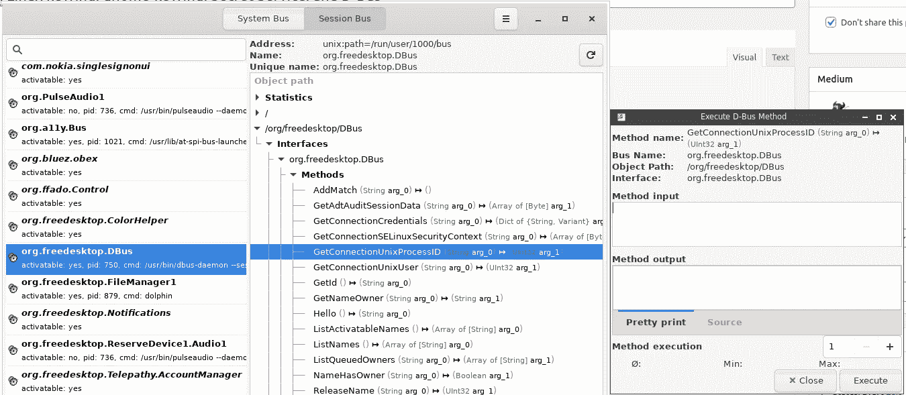

## 钥匙圈示例

以及一些如何从 Python 或 CLI 实用程序中使用这些后端的示例。

## Linux 钥匙圈

如前所述，Linux 密匙环是内核中的一种“缓存服务”。

您可以从`keyutils`和`systemd-ask-password`中使用`keyctl`实用程序。

阅读:

*   [内核密钥保留服务文档](https://www.kernel.org/doc/Documentation/security/keys.txt)
*   `[keyctl](http://man7.org/linux/man-pages/man1/keyctl.1.html)` [doc](http://man7.org/linux/man-pages/man1/keyctl.1.html)

从文档中可以看出:

> 每个进程订阅三个密匙环:特定于线程的密匙环、特定于进程的密匙环和特定于会话的密匙环。

让我们看看哪些钥匙圈可用于我当前的会话:

```
$ keyctl show @s
Session Keyring
185597501 — alswrv 1000 1000 keyring: _ses
182944921 — alswrv 1000 65534 \_ keyring: _uid.1000
```

或者对于我的用户:

```
$ keyctl show @u
Keyring
182944921 — alswrv 1000 65534 keyring: _uid.1000
```

此外，在`/proc/key-users`中，您可以获得所有钥匙圈的信息以及每个用户的统计数据:

```
$ cat /proc/key-users
0: 43 42/42 34/1000000 768/25000000
971: 1 1/1 1/200 9/20000
1000: 4 4/4 4/200 46/20000
```

以及可供我们的进程读取的密钥(称为`cat`的`bash`):

```
$ cat /proc/keys
008f6a74 I — Q — — 1 perm 1f3f0000 1000 65534 keyring _uid_ses.1000: 1
0ae78499 I — Q — — 4 perm 1f3f0000 1000 65534 keyring _uid.1000: empty
0b0ffe3d I — Q — — 225 perm 3f030000 1000 1000 keyring _ses: 1
2a28e4fe I — Q — — 33 perm 3f030000 1000 1000 keyring _ses: 1
```

当前会话中用户的密钥环:

```
$ keyctl describe @us
-5: -lswrvalswrv — — — — — — 1000 65534 keyring: _uid_ses.1000
```

当前密钥环中的密钥:

```
$ keyctl list @us
1 key in keyring:
182944921: — alswrv 1000 65534 keyring: _uid.1000
```

添加密钥:

```
$ keyctl add user example-key example-data @u
546850615
```

找到它:

```
$ keyctl request user example-key
546850615
```

已获得其 ID，现在可以使用此 ID 读取其内容:

```
$ keyctl print 546850615
example-data
```

`keyctl()`系统调用

实际上，`keyctl`实用程序只是执行`[keyctl(2)](http://man7.org/linux/man-pages/man2/keyctl.2.html)`系统调用:

```
$ strace -e keyctl keyctl print 546850615
keyctl(KEYCTL_READ, 546850615, NULL, 0) = 12
keyctl(KEYCTL_READ, 546850615, “example-data”, 12) = 12
example-data
+++ exited with 0 +++
```

在这里的第一个调用中——`keyctl(KEYCTL_READ, 546850615, NULL, 0) = 12`——我们通过传递`KEYCTL_READ`操作和一个密钥 ID 来执行`keyctl()`系统调用。

好的——这里或多或少清楚了。

这里使用的材料:

*   [https://www.kernel.org/doc/Documentation/security/keys.txt](https://www.kernel.org/doc/Documentation/security/keys.txt)
*   [https://www.ibm.com/developerworks/library/l-key-retention/](https://www.ibm.com/developerworks/library/l-key-retention/)
*   [http://man7.org/linux/man-pages/man7/keyrings.7.html](http://man7.org/linux/man-pages/man7/keyrings.7.html)
*   [http://man7.org/linux/man-pages/man1/keyctl.1.html](http://man7.org/linux/man-pages/man1/keyctl.1.html)
*   [http://man7.org/linux/man-pages/man2/keyctl.2.html](http://man7.org/linux/man-pages/man2/keyctl.2.html)

我们去钥匙圈仓库吧。

## `gnome-keyring`

对我来说，这确实是一个有问题的包，但它仍然是应用最广泛的。

如果尚不存在，请安装:

```
$ sudo pacman -S gnome-keyring
```

检查 D-Bus 服务—寻找`org.freedesktop.secrets`:

```
$ dbus-send — session — dest=org.freedesktop.DBus — type=method_call — print-reply /org/freedesktop/DBus org.freedesktop.DBus.ListNames
…
string “org.freedesktop.secrets”
…
```

“啊哈，我们到了”

现在我们可以通过使用`[org.freedesktop.DBus.Introspectable.Introspect](https://www.gnu.org/software/emacs/manual/html_node/dbus/Introspection.html)`方法获得服务描述:

```
$ dbus-send — session — print-reply — dest=org.freedesktop.DBus /org/freedesktop/secrets org.freedesktop.DBus.Introspectable.Introspect
…
<node>
<interface name=”org.freedesktop.DBus”>
<method name=”Hello”>
<arg direction=”out” type=”s”/>
</method>
<method name=”RequestName”>
<arg direction=”in” type=”s”/>
<arg direction=”in” type=”u”/>
<arg direction=”out” type=”u”/>
</method>
<method name=”ReleaseName”>
<arg direction=”in” type=”s”/>
<arg direction=”out” type=”u”/>
</method>
…
```

或者使用`qdbus`，首先找到服务:

```
$ qdbus | grep ‘secrets\|keyring’
org.freedesktop.secrets
org.gnome.keyring
```

阅读`qdbus`帮助:

```
$ qdbus — help
…
With 0 arguments, qdbus will list the services available on the bus
With just the servicename, qdbus will list the object paths available on the service
With service name and object path, qdbus will list the methods, signals and properties available on the object
```

并获得完整服务的描述:

```
$ qdbus org.freedesktop.secrets /org/freedesktop/secrets
signal void org.freedesktop.DBus.Properties.PropertiesChanged(QString interface_name, QVariantMap changed_properties, QStringList invalidated_properties)
method QDBusVariant org.freedesktop.DBus.Properties.Get(QString interface_name, QString property_name)
method QVariantMap org.freedesktop.DBus.Properties.GetAll(QString interface_name)
method void org.freedesktop.DBus.Properties.Set(QString interface_name, QString property_name, QDBusVariant value)
method QString org.freedesktop.DBus.Introspectable.Introspect()
method QString org.freedesktop.DBus.Peer.GetMachineId()
method void org.freedesktop.DBus.Peer.Ping()
…
```

d 总线`GetConnectionUnixProcessID`

实际上，我想看看谁在公共汽车的另一边听着。让我们为此使用`[GetConnectionUnixProcessID](https://dbus.freedesktop.org/doc/dbus-java/api/org/freedesktop/DBus.html#GetConnectionUnixProcessID(java.lang.String))`方法:

```
$ qdbus — session org.freedesktop.DBus / org.freedesktop.DBus.GetConnectionUnixProcessID org.freedesktop.secrets
1278791
```

我们在这里做了:

*   对 org.freedesktop.DBus 服务的调用
*   传递/路径
*   称为`org.freedesktop.DBus.GetConnectionUnixProcessID`方法
*   并将服务名*org . free desktop . secrets*传递给该方法以获取其 PID

检查什么是 *1278791* PID:

```
$ ps xu | grep 1278791
setevoy 1278791 0.0 0.0 383876 8092 ? SLl Dec03 0:00 /usr/bin/gnome-keyring-daemon — start — foreground — components=secrets
```

很好。

所以，现在我们知道特勤局的角色是由`gnome-keyring`应用程序扮演的。让我们尝试使用`python-keyring`和`secret-tool`添加和删除一些数据。

`python-keyring`

从`python-keyring`开始。

安装它:

```
$ sudo pacman -S python-keyring
```

检查:

```
>>> import keyring
>>> keyring.set_password(“system”, “username”, “password”)
>>> keyring.get_password(“system”, “username”)
‘password’
```

如果出现类似这样的错误(例如，在 Arch Linux 上安装后第一次运行时可能发生):

```
>>> keyring.set_password(“system”, “username”, “password”)
Traceback (most recent call last):
…
jeepney.wrappers.DBusErrorResponse: [org.freedesktop.DBus.Error.UnknownMethod] (‘No such interface “org.freedesktop.DBus.Properties” on object at path /org/freedesktop/secrets/collection/login’,)
```

或者:

```
Traceback (most recent call last):
…
raise PromptDismissedException(‘Prompt dismissed.’)
secretstorage.exceptions.PromptDismissedException: Prompt dismissed.
```

您需要执行`/etc/X11/xinit/xinitrc.d/50-systemd-user.sh`脚本:

```
$ . /etc/X11/xinit/xinitrc.d/50-systemd-user.sh
```

创建一个新的密匙环并为其设置密码:

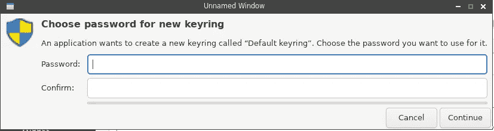

让我们检查一下`dbus-monitor`，看看 D-Bus 中发生了什么:

```
…
method call time=1575542111.465749 sender=:1.576 -> destination=org.freedesktop.secrets serial=7 path=/org/freedesktop/secrets/aliases/default; interface=org.freedesktop.Secret.Collection; member=CreateItem
array [
dict entry(
string “org.freedesktop.Secret.Item.Attributes”
variant array [
dict entry(
string “application”
string “Python keyring library”
)
dict entry(
string “service”
string “system”
)
dict entry(
string “username”
string “username”
)
]
)
dict entry(
string “org.freedesktop.Secret.Item.Label”
variant string “Password for ‘username’ on ‘system’”
)
]
…
struct {
object path “/org/freedesktop/secrets/session/s14”
}
…
signal time=1575542111.476006 sender=:1.220 -> destination=(null destination) serial=689 path=/org/freedesktop/secrets/collection/example_2dkeyring; interface=org.freedesktop.Secret.Collection; member=ItemCreated
object path “/org/freedesktop/secrets/collection/example_2dkeyring/5”
…
```

这里:

1.  *sender=:1.576* —在 D-Bus 服务列表中找到 1.576—这是我们的 Python ( `cmd: python`):

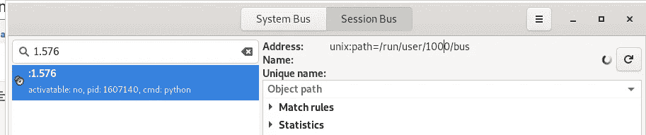

1.  *destination = org . free desktop . secrets*
    我们的`/usr/bin/gnome-keyring-daemon`，已经在`org.freedesktop.DBus.GetConnectionUnixProcessID`输出中看到了

使用`seahorse`实用程序检查`gnome-keyring`存储，例如:

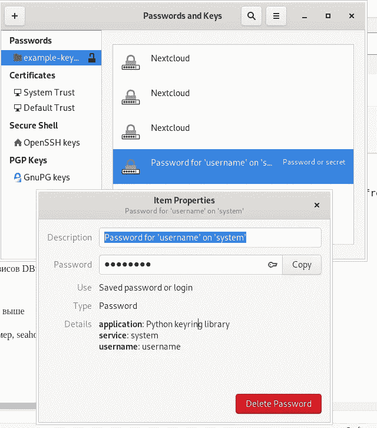

好的，*“管用！”*。

`secret-tools`

另一种方法可以是使用`secret-tools`实用程序。

添加新的秘密:

```
$ secret-tool store — label=SecretToolExample username username service secret
Password:
```

检索它:

```
$ secret-tool lookup username username service secret
password
```

检查仓库里的海马:

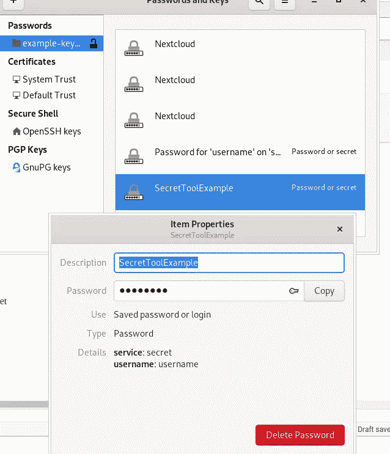

## KWallet

安装:

```
$ sudo pacman -S kwallet
```

检查 D 总线:

```
$ qdbus — session org.freedesktop.DBus / org.freedesktop.DBus.GetConnectionUnixProcessID org.freedesktop.secrets
1278791
$ ps aux | grep 1278791
setevoy 1278791 0.0 0.0 384008 8048 ? SLl Dec03 0:00 /usr/bin/gnome-keyring-daemon — start — foreground — components=secrets
```

呃…

为什么不是`kwallet`，为什么还是`gnome-keyring`？

试着杀死它:

```
$ kill 1278791
```

并且服务文件仍然是旧的:

```
$ cat /usr/share/dbus-1/services/org.freedesktop.secrets.service
[D-BUS Service]
Name=org.freedesktop.secrets
Exec=/usr/bin/gnome-keyring-daemon — start — foreground — components=secrets
```

好了，完全删除`gnome-keyring`:

```
$ sudo pacman -Rsn seahorse
$ sudo pacman -Rsn gnome-keyring
```

现在没有服务文件:

```
$ cat /usr/share/dbus-1/services/org.freedesktop.secrets.service
2019/12/05 13:15:03 open /usr/share/dbus-1/services/org.freedesktop.secrets.service: no such file or directory
```

重新安装`kwallet`:

```
$ sudo pacman -S kwallet
warning: kwallet-5.64.0–1 is up to date — reinstalling
…
```

没有新的服务文件:

```
$ qdbus — session org.freedesktop.DBus / org.freedesktop.DBus.GetConnectionUnixProcessID org.freedesktop.secrets
Error: org.freedesktop.DBus.Error.NameHasNoOwner
Could not get PID of name ‘org.freedesktop.secrets’: no such name
```

太奇怪了…

D-Bus 和特勤局到底有没有得到 KWallet 的支持？

Reddit 表示，事实并非如此:

> 简而言之，据我所知，KDE 不再有特工部门了

并且`ksecretsservice` [文档](https://community.kde.org/KDE_Utils/ksecretsservice)充满了待办事项...

可惜了。我确实喜欢基于 Qt 的 KDE 应用程序。

更奇怪的是，秘密服务规范是由 GNOME 和 KDE 项目共同编写的，但是它只被 GNOME Keyring 支持…

尽管如此，我们可以在没有特勤局整合的情况下使用 KWallet。

运行 KDE 钱包管理器:

```
$ kwalletmanager5
```

创建钱包:

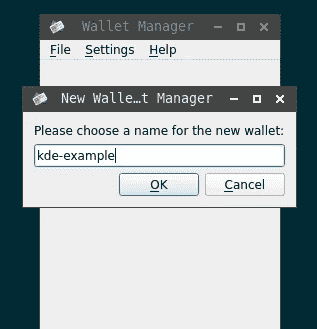

设置其密码:

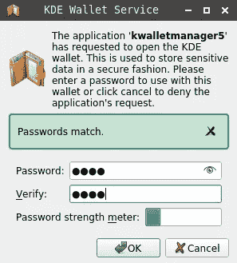

显然，现在我们的 Python 库将停止工作，因为现在没有可用的秘密服务:

```
>>> keyring.set_password(“system”, “username”, “password”)
Traceback (most recent call last):
…
raise value
jeepney.wrappers.DBusErrorResponse: [org.freedesktop.DBus.Error.ServiceUnknown] (‘The name org.freedesktop.secrets was not provided by any .service files’,)
The above exception was the direct cause of the following exception:
Traceback (most recent call last):
…
raise SecretServiceNotAvailableException(data) from resp
secretstorage.exceptions.SecretServiceNotAvailableException: The name org.freedesktop.secrets was not provided by any .service files
During handling of the above exception, another exception occurred:
Traceback (most recent call last):
…
raise RuntimeError(“Unable to initialize SecretService: %s” % e)
RuntimeError: Unable to initialize SecretService: The name org.freedesktop.secrets was not provided by any .service files
```

但是你可以[配置一个](https://pypi.org/project/keyring/#id7) `[keyring](https://pypi.org/project/keyring/#id7)`后端，直接设置`kwallet5`，谷歌一下[这里> > >](https://github.com/jaraco/keyring/issues/269#issuecomment-288684527) :

```
>>> kwallet5 = keyring.backends.kwallet.DBusKeyring()
>>> keyring.set_keyring(kwallet5)
>>> keyring.get_keyring()
<keyring.backends.kwallet.DBusKeyring object at 0x7f7efba66fa0>
```

添加密码:

```
>>> keyring.set_password(“system”, “username”, “password”)
```

检查 D 总线信息:

```
method call time=1575545736.524015 sender=:1.318 -> destination=:1.269 serial=38 path=/modules/kwalletd5; interface=org.kde.KWallet; member=writePassword
int32 365838442
string “system”
string “username”
string “password”
string “Python keyring library”
```

还有夸莱特:

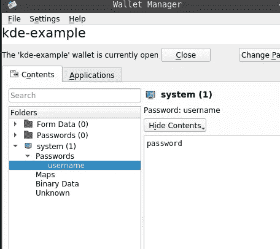

## KeePass

此外，KeePass 可以使用 Secret Storage 规范充当 keyring 后端服务。

如果`gnome-keyring`仍在运行——你会从 KeePass 得到“ [*另一个特工正在运行*](https://github.com/keepassxreboot/keepassxc/issues/3945) ”错误:


取下`gnome-keyring`，激活特勤:

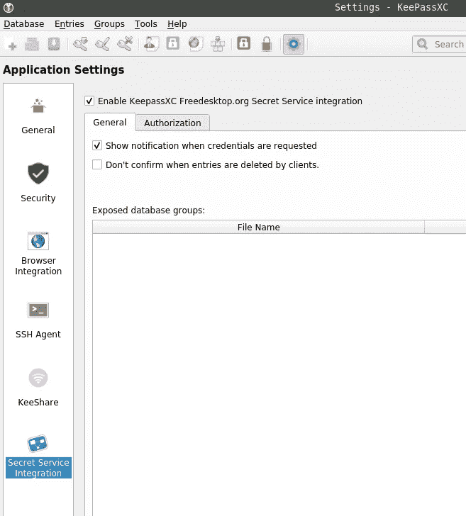

检查 D-Bus 活动:

```
method call time=1575546064.021083 sender=:1.599 -> destination=org.freedesktop.DBus serial=26 path=/org/freedesktop/DBus; interface=org.freedesktop.DBus; member=RequestName
string “org.freedesktop.secrets”
uint32 4
signal time=1575546064.021157 sender=org.freedesktop.DBus -> destination=(null destination) serial=258 path=/org/freedesktop/DBus; interface=org.freedesktop.DBus; member=NameOwnerChanged
string “org.freedesktop.secrets”
string “”
string “:1.599”
signal time=1575546064.021212 sender=org.freedesktop.DBus -> destination=:1.599 serial=16 path=/org/freedesktop/DBus; interface=org.freedesktop.DBus; member=NameAcquired
string “org.freedesktop.secrets”
method return time=1575546064.021245 sender=org.freedesktop.DBus -> destination=:1.599 serial=17 reply_serial=26
uint32 1
```

查查，谁在听*org . free desktop . secrets*:

```
$ qdbus — session org.freedesktop.DBus / org.freedesktop.DBus.GetConnectionUnixProcessID org.freedesktop.secrets
4006761
ps aux | grep 4006761
setevoy 4006761 2.0 0.5 475888 89656 tty1 SLl 13:40 0:02 keepassxc
```

好吧——这是我们的通行证。

向数据库中添加内容:

```
$ secret-tool store — label=SecretToolExample username username service secret
Password:
libsecret-Message: 13:45:13.448: Remote error from secret service: org.freedesktop.DBus.Error.UnknownObject: No such object path ‘/org/freedesktop/secrets/aliases/default’
secret-tool: No such object path ‘/org/freedesktop/secrets/aliases/default’
```

呃…

啊哈，需要在 KeePass 数据库中配置一个内部路径，见[这个> > >](https://github.com/keepassxreboot/keepassxc/issues/3955#issuecomment-560024175) 注释。

在数据库中添加新组:

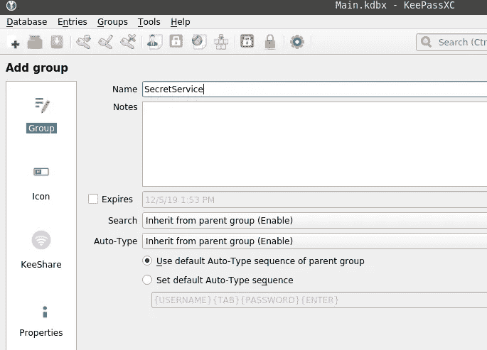

接下来，转到*数据库>数据库设置*并指定一个目录的本地路径，该目录将在充当特勤局存储时用于存储数据:

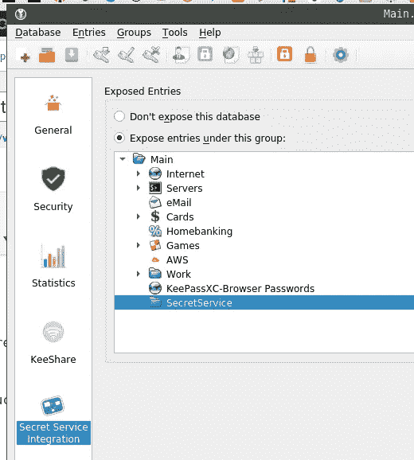

重启 KeePass 并检查 D-Bus —现在可以看到集合是如何添加的了:

```
signal time=1575546948.831195 sender=:1.613 -> destination=(null destination) serial=22 path=/org/freedesktop/secrets; interface=org.freedesktop.Secret.Service; member=CollectionCreated
object path “/org/freedesktop/secrets/collection/Main”
```

添加记录:

```
$ secret-tool store — label=SecretToolExample username username service secret
Password:
```

检查 D 总线:

```
…
method call time=1575547056.148892 sender=:1.616 -> destination=org.freedesktop.secrets serial=10 path=/org/freedesktop/secrets/aliases/default; interface=org.freedesktop.Secret.Collection; member=CreateItem
array [
dict entry(
string “org.freedesktop.Secret.Item.Attributes”
variant array [
dict entry(
string “service”
string “secret”
)
dict entry(
string “username”
string “username”
)
]
)
dict entry(
string “org.freedesktop.Secret.Item.Label”
variant string “SecretToolExample”
)
]
…
```

以及 KeePass 本身:

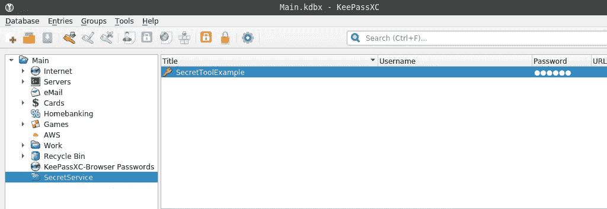

目前就这些。

## 有用的链接

## 钥匙圈、特勤局等

*   [GNOME 钥匙圈](https://wiki.gnome.org/Projects/GnomeKeyring/) — GNOME 项目文档
*   [GNOME/key ring](https://wiki.archlinux.org/index.php/GNOME/Keyring)—Arch Linux Wiki
*   [KDE 钱包](https://wiki.archlinux.org/index.php/KDE_Wallet)
*   [Python 钥匙圈库](https://pypi.org/project/keyring/#third-party-backends)
*   [用海马管理密码、加密密钥等](https://www.linux.com/tutorials/manage-passwords-encryption-keys-and-more-seahorse/)
*   [秘密工具示例](https://www.mankier.com/1/secret-tool#Examples)
*   [钥匙扣](https://www.funtoo.org/Keychain)
*   [从你的脚本中使用 Linux 密匙环的秘密](https://lzone.de/blog/Using+Linux+keyring+secrets+from+your+scripts)
*   特勤局 API 草案
*   [Python 绑定到 FreeDesktop.org 特勤局 API](https://pypi.org/project/SecretStorage/)
*   [Python 钥匙圈库](https://keyring.readthedocs.io/en/latest/)
*   [Libsecret 图书馆参考手册](https://developer.gnome.org/libsecret/)
*   [gnome-key ring 中的凭证很容易被破解](https://bugs.launchpad.net/ubuntu/+source/gnome-keyring/+bug/1780365)
*   [在 Ubuntu 上运行 Python 脚本时“请输入加密密匙环的密码”](https://lnx.azurewebsites.net/please-enter-password-for-encrypted-keyring-when-running-python-script-on-ubuntu/)
*   [使用钥匙圈存储您的凭证](https://alexwlchan.net/2016/11/you-should-use-keyring/)
*   [在 KDE 等离子中，keyring 默认使用 gnome-key ring](https://github.com/jaraco/keyring/issues/273)——只是为了好玩
*   [开始使用 Linux 密钥保留服务](https://www.ibm.com/developerworks/library/l-key-retention/)

## d 总线

*   [D-Bus 教程](https://dbus.freedesktop.org/doc/dbus-tutorial.html)
*   [D-Bus/简介](https://techbase.kde.org/Development/Tutorials/D-Bus/Introduction)
*   [D 总线规格](https://dbus.freedesktop.org/doc/dbus-specification.html)
*   [D-Bus API 设计指南](https://dbus.freedesktop.org/doc/dbus-api-design.html#documentation)
*   [从命令行自检 D-Bus](http://www.kaizou.org/2014/06/dbus-command-line.html)
*   [了解 D 总线](https://bootlin.com/pub/conferences/2016/meetup/dbus/josserand-dbus-meetup.pdf)
*   [dbus-python 教程](https://dbus.freedesktop.org/doc/dbus-python/tutorial.html)
*   [D-Bus 和 URI 命名空间之间的通用标准映射](https://lists.freedesktop.org/archives/dbus/2008-July/010019.html)
*   [D-Bus，快速回顾](http://blog.siphos.be/2014/06/d-bus-quick-recap/)

*最初发布于* [*RTFM: Linux、DevOps 和系统管理*](https://rtfm.co.ua/en/what-is-linux-keyring-gnome-keyring-secret-service-and-d-bus/) *。*