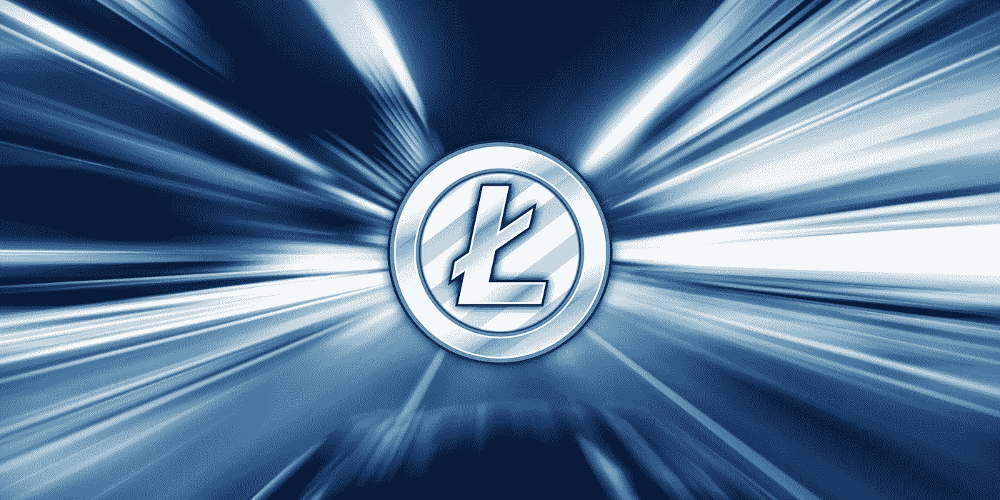
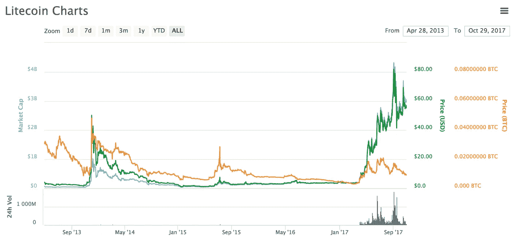
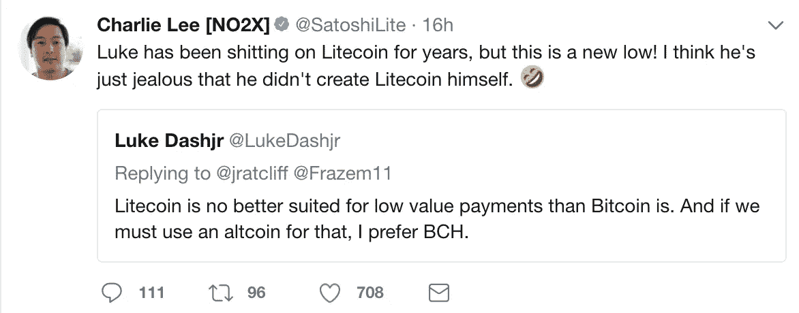

# 什么是莱特币？初学者指南

> 原文：<https://itnext.io/what-is-litecoin-a-beginners-guide-d195a9116b07?source=collection_archive---------0----------------------->

[*点击这里在 LinkedIn* 上分享这篇文章](https://www.linkedin.com/cws/share?url=https%3A%2F%2Fitnext.io%2Fwhat-is-litecoin-a-beginners-guide-d195a9116b07)

Litecoin (LTC)是一种去中心化的点对点加密货币，于 2011 年 10 月 7 日发布，2011 年 10 月 13 日上线。

*把白银变成比特币的黄金。*

*不怎么出门的比特币小兄弟。*

这些只是谈论莱特币时你可能会听到的一些事情。乍一看，莱特币作为十大市值加密货币并没有获得多少尊重。

然而，一旦你进入杂草，莱特币呈现了原始比特币区块链的一个极其有用和有趣的应用。

尽管莱特币受到了各种指责，但人们很容易忽略它实际上是什么，以及它有什么功能。

# 莱特币的内幕

Litecoin 由前谷歌员工查理·李创立。这是比特币核心客户端的第一个分支之一。它是作为比特币的一些瓶颈和可扩展性问题的解决方案提出的，最明显的是在给定时间内可以处理的交易数量。

莱特币优于比特币的优势在于支付交易成本极低，支付速度是比特币的 4 倍。

莱特币最初是在 2013 年 11 月爆发式增长期间引起关注的，当时它的价格飙升了近 15 倍。然而，这种价格上涨是短暂的，莱特币在大约两年的时间里一直徘徊在每 LTC 美元的范围内。直到 2017 年 5 月，在所有加密货币普遍经历大幅增长的时期，它才开始再次加速。

Litecoin 还具有相对创新性，采用了隔离见证等新技术，并完成了第一笔闪电网络交易，在不到一秒的时间内将 0.00000001 LTC 从瑞士苏黎世发送到美国旧金山。

# 比特币的黄金之银

莱特币被拿来和比特币做比较是有原因的。除了一些细微的区别，莱特币的用途和比特币完全一样。毕竟这是最早的比特币分叉之一。

比较莱特币和比特币不仅从方便的角度来看是有意义的，它还让我们在技术层面上区分它的不同之处。莱特币旨在用作点对点加密货币，实际上能够以更快、更低的速度完成与比特币相同的工作。

# 速度:

交易确认速度在一种货币被采用的速度上扮演着重要角色。比特币的确认通常需要 10 分钟左右，并且一直在稳步增长，周期高达 2548 分钟。Litecoin 的网络能够以更快的速度确认交易。

Litecoin 的验证周期持续固定的 2.5 分钟。每一个单独的比特币区块得到确认，就有四个相同大小的莱特币区块得到确认。

# 成本:

发送任何面值的莱特币[的成本约为 0.09 美元](https://bitinfocharts.com/comparison/litecoin-transactionfees.html)，而比特币目前[徘徊在 5.00 美元左右](https://bitinfocharts.com/comparison/bitcoin-transactionfees.html)。对于小额交易来说，这是莱特币优于比特币的直接优势，因为如果你不得不另外支付 5 美元，那么与朋友分享 10 美元的优步对大多数人来说没有意义。Litecoin 提供了支付日常商品的选项，无需支付很快就会增加的高额费用。

# 采矿:

Litecoin 的目标之一是比比特币的网络更均匀地分配哈希功率。Litecoin 的创始人查理·李想要解决的问题是，比特币的散列能力如何在矿池、矿工群体以及通常更小(也更不分散)的矿工子集之间大规模分布。Litecoin 旨在保持哈希权力分散。

Litecoin 的开采也使交易费用相对较低，因为其固有的总供应量较高。比特币只能有 2100 万个，而莱特币最多可以有 8400 万个。这很重要，因为它降低了矿业的竞争力，而矿业的竞争力越强，交易费用就越高。

由于高昂的交易费用，比特币几乎遇到了一些非常严重的可扩展性问题，而莱特币却能够生产出一个又一个区块，并保持其较低的交易成本。诚然，使用莱特币的人不如使用比特币的人多，理论上，如果莱特币经历成比例的增长和使用，它最终可能会面临同样的可扩展性问题，但今天的情况根本不是这样。

Litecoin 还使用 Scrypt 哈希算法，该算法使用的处理能力比比特币 SHA256 哈希算法少得多。Litecoin 更加强调利用高速 RAM，使得单个玩家(或大型玩家的小型集体)主宰矿业世界的可能性大大降低。

**基本非技术差异**

了解比特币和莱特币的不同之处也很重要。

比特币创始人的出身相对来说笼罩在神秘之中。比特币创始人的笔名中本聪基本上被归入了传说和神话。

另一方面，Litecoin 的创始人是公开的，并且活跃在社区中。你可以在 Linkedin 或 Twitter 上找到[查理·李，化名为](https://www.linkedin.com/in/chocobo/) [@SatoshiLite](https://twitter.com/SatoshiLite) 。在谷歌工作并创建 Litecoin 后，他还在比特币基地工作，这是世界上最大的加密货币交易所之一。

就我个人而言，我更喜欢李的平易近人和开放的天性，而不是神秘神秘的聪，李能够让这种情况变得轻松的事实非常人性化。

此外，你很难在莱特币阵营中找到任何严肃的说法或宏伟的幻想。它旨在让每个人都可以获得和使用加密货币，并完全可以取代比特币的地位。

# 所以，莱特币是……更好？

嗯，莱特币在合法使用的情况下能够保持其自身的重量这一事实说明了很多问题，特别是在一个拥有超过 700 个用途可疑的替代硬币的加密货币世界中。

毕竟，它的市值超过了 30 亿美元。这并不是偶然发生的。

与市值约为比特币 33 倍的比特币相比，莱特币确实有几个优势。如上所列，它能够为用户提供更低的交易费用，更快的交易处理时间，更分散的挖掘网络，其创始人甚至偶尔在 Twitter 上发布消息。这些优点在技术上使莱特币成为绝大多数小额交易的更好的硬币。

然而，公平地说，莱特币还没有被推到极限，因为没有多少人使用它。就目前而言，莱特币确实做到了它的初衷:以比特币无法做到的方式提供低成本、快速的交易。

# 最后的想法

事实上，莱特币只是另一种加密货币，只是碰巧证明了它作为低成本分散式点对点支付方法的用例。

莱特币从未与比特币正面交锋，但它的技术优势确实构成了某种威胁。尽管从理论上讲，比特币可能比比特币“更好”，但它已经凭借网络效应，迅速拥有了规模大得多的活跃用户群。

比特币还有一个好处，那就是它现在几乎家喻户晓，而莱特币则更加模糊不清(尤其是像以太坊这样的热门新代币)。绝大多数跳入加密货币世界的人会首先购买比特币，如果他们的饥饿没有得到满足，*也许*一些莱特币和以太坊。

虽然 Litecoin 看起来功能非常好，但假设它可能经历大规模用户采用和增长的情况是很有趣的。无论莱特币的忠实者在咀嚼什么，骨头上都没有多少肉，但值得注意的是，更多人开始将莱特币加入他们的投资组合只是时间问题。

如果，这是一个很大的假设，比特币无法解决其可扩展性问题，莱特币将至少提供相同的效用，而不必支付高昂的费用(如果比特币达到其可扩展性问题的高潮——非常高)。

在那之前，莱特币可能会徘徊在十大市值加密货币周围，做它一直做的事情。

*最初发表于*[*【coincentral.com】*](https://coincentral.com/what-is-litecoin/)*。*