# 什么是模块化 CSS？

> 原文：<https://itnext.io/what-is-modular-css-659949e23534?source=collection_archive---------0----------------------->


模块化 CSS 是一个原则的集合，用于编写高性能和可维护的代码。它起源于 Yahoo 和 Yandex 的开发人员，作为解决维护大型代码库的挑战的一种方法。有些指导方针在推出时是有争议的，但后来被认为是最佳实践。

**目录:**

1.  大规模的 CSS 是困难的
2.  什么是模块化？
3.  模块化框架
4.  OOCSS
5.  不列颠帝国勋章
6.  SMACSS
7.  共享模块原则
8.  常见问题解答
9.  总之，模块化 CSS 是掺杂的

*(psst:如果你对这篇文章的长度感到不知所措，你可能更喜欢* [*看一段视频*](https://www.youtube.com/watch?v=Ty5jtMZXbmk) *它所基于的演示文稿。)*

# 大规模的 CSS 是困难的

模块化 CSS 被创建来解决的主要问题是大规模的 CSS 是棘手的。我喜欢[尼古拉斯·加拉格尔](https://twitter.com/necolas)的这句话:

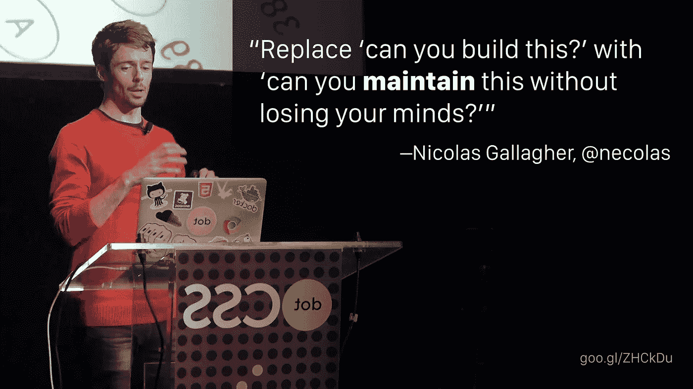

引用:[尼古拉斯加拉格尔](https://twitter.com/necolas/status/360170108028600320)，图片: [dotCSS](https://www.youtube.com/watch?v=L8w3v9m6G04)

这就触及了大规模 CSS 的核心问题。写代码不是挑战。这样做的方式不会随着时间的推移让你陷入技术债务的泥潭。

## 难以理解

这里有一个来自 [CSS 指南](https://cssguidelin.es/#naming-conventions-in-html)的例子，展示了我们遇到的这种问题。除了写这段代码的人之外，没有人知道它是做什么的。

```
<div class="box profile pro-user">
  
  <p class="bio">...</p>
</div>
```

> *类* `*box*` *和* `*profile*` *之间有什么关系？* `*profile*` *和* `*avatar*` *这两个类之间有什么关系？他们有任何关系吗？你应该和* `*bio*` *一起使用* `*pro-user*` *吗？* `*image*` *和* `*profile*` *这两个类会生活在 CSS 的同一个部分吗？你能在其他地方使用* `*avatar*` *吗？*

从这里无法回答这些问题。你必须在 CSS 里做一些侦探工作。

## 难以重复使用

重用代码可能非常棘手。假设一个页面上有一种样式，您想在另一个页面上重用，但是当您尝试时，您发现它是以只在第一页上有效的方式编写的。作者假设它存在于一个特定的元素中，或者它从页面中继承了某些类。在不同的语境下根本行不通。您不想破坏原始代码，所以您复制了代码。

现在你有两个问题:你有你的原始代码和你的复制代码。你的维护负担增加了一倍。

## 难以维护

大规模的 CSS 也很难维护。你改变了标记，样式就像纸牌搭的房子一样倒塌了。你想在一个页面上更新一个样式，而它在另一个页面上中断。你试图覆盖另一页，但陷入了一场特异性战争。

这让我想起了我最喜欢的一个 CSS 笑话:

# 什么是模块化？

那么我们如何解决这些问题呢？答案在于*模块化*的概念，但这到底意味着什么呢？让我们从引用 [Harry Roberts](https://twitter.com/csswizardry) 关于[关注点分离](https://cssguidelin.es/#the-separation-of-concerns)的话开始:

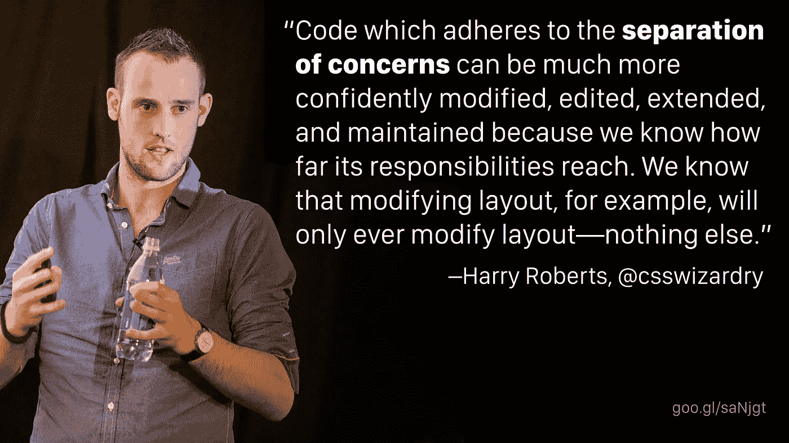

引用:[哈利·罗伯特](https://cssguidelin.es/#the-separation-of-concerns)，照片:[CSSwizardry.com](https://csswizardry.com/)

这是一种常见的编程实践，许多 CSS 开发人员并不熟悉。这样做的目的是确保你写的东西不会超出你的预期。

让我给你举一个我在学习模块化 CSS 之前的工作方式的例子。我会从我的设计师那里得到一个这样的样品:

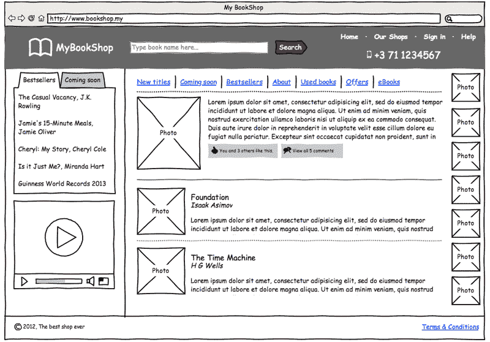

图片: [Yandex](https://github.com/bem-site/bem-method/blob/bem-info-data/articles/yandex-frontend-dev/yandex-frontend-dev.en.md)

我会想“好吧，我在看书店的一页。我在侧边栏里有一些小工具。我把我认为是书的封面的东西列在了右边。我有一篇特色书评，下面还有几篇评论。”

我认为页面是一个完整的单元，较小的部分属于页面。这种方法是自上而下的思维，导致代码中充满了一次性的和只存在于一个页面中的特殊位。这不利于编写可重用的代码。

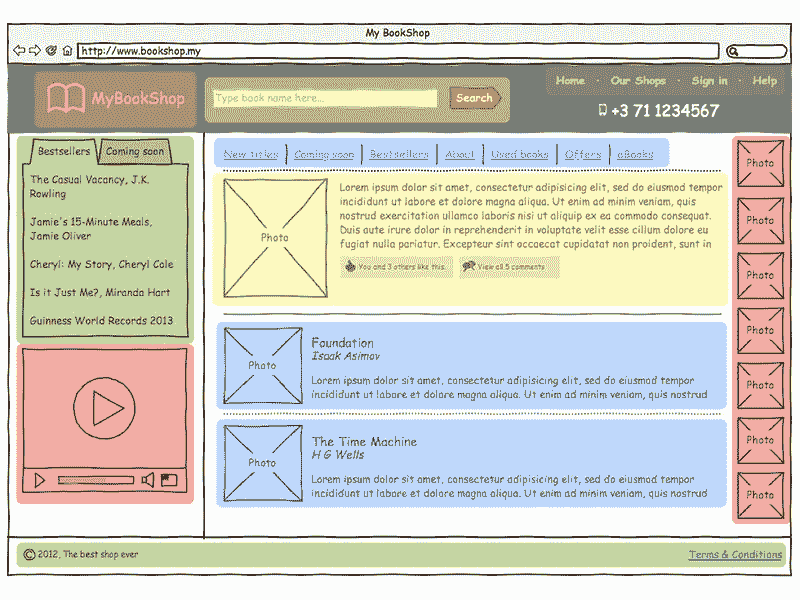

图片: [Yandex](https://github.com/bem-site/bem-method/blob/bem-info-data/articles/yandex-frontend-dev/yandex-frontend-dev.en.md)

模块化 CSS 要求你做的是后退一步，而不是在页面级别考虑这个问题，看看你的页面是由小块离散内容组成的这个事实。这不是一页。这是一系列的作品。

你有一个徽标、一个搜索栏、导航、一个照片列表、一个辅助导航、一个标签框、一个视频播放器等等。这些是可以在你的站点中的任何地方使用的离散的内容。它们只是碰巧在这一页上以这种方式组合在一起。

模块化 CSS 是自底向上的思维。它要求您从构建整个网站的可重用构件开始。


图片:[边界元法](https://github.com/bem-site/bem-method/blob/bem-info-data/articles/19-bem-principles/19-bem-principles.ru.md)

这让你想起什么了吗？应该的！几乎每个写模块化 CSS 的人都用乐高做类比，这是有原因的。用标准化的、易于理解的块构建一个 UI 的想法是一个很好的概念，不管上下文如何，这些块的行为都是可预测的。

这种类型块最著名的例子之一是“媒体对象”，由[妮可·沙利文](https://twitter.com/stubbornella)定义。她认为这个对象是你能在任何网站上找到的最小的离散内容之一。

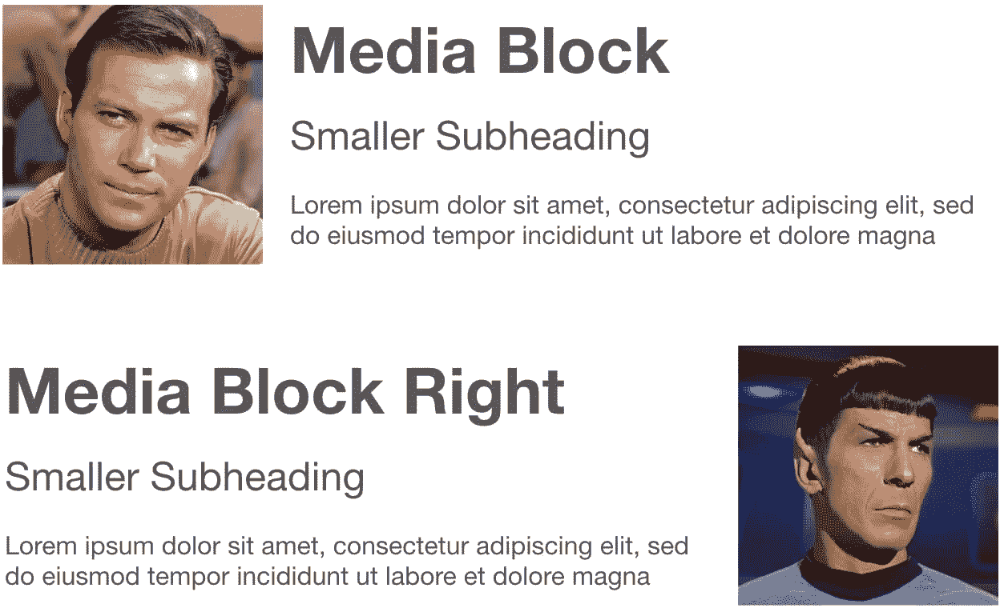

它将固定宽度的图像结合到可变宽度内容的一侧。你可以在任何地方看到这个。她制作了一个案例研究，名为“[媒体对象保存了数百行代码](http://www.stubbornella.org/content/2010/06/25/the-media-object-saves-hundreds-of-lines-of-code/)”，讲述了如何将这种模式应用于大型网站。她举的一个最大的例子是脸书:

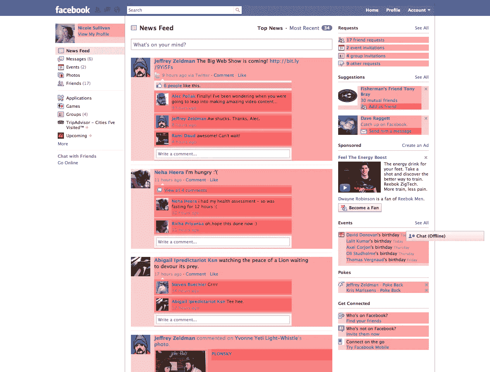

图片:[妮可·沙利文](http://www.stubbornella.org/content/2010/06/25/the-media-object-saves-hundreds-of-lines-of-code/)

这里，她突出显示了脸书流中的所有媒体对象。左上角是个人资料，右边是导航元素，提要中的每个帖子，甚至还有广告。有时它们相互嵌套。尽管它们用于不同的目的，但它们都共享相同的底层模式:固定宽度的图像，灵活宽度的文本。

她的观点是，当我们谈论在脸书的规模上运作时，没有 10 或 20 或 30 个媒体对象。像这样的页面有成百上千个。所以你可以想象，如果你优化了用于这些重复模式的样式，你可以节省大量的代码。这带来了真正的性能和成本节约。

# 模块化框架

那么，现在我们已经清楚了*模块化*的概念，让我们来看看这些年来推进这一概念的三个最大的框架:

# OOCSS

面向对象的 CSS，或称 [OOCSS](https://github.com/stubbornella/oocss/wiki) ，是由[妮可·沙利文](https://twitter.com/stubbornella)于 2009 年创建的，它基于她在雅虎*的工作。这是模块化 CSS 的起源点。她的核心概念是对象是**可重用模式**，其视觉外观不是由上下文决定的。

**对于那些想去“雅虎？真的吗？”你需要明白他们的前端团队当时正在用* [*YUI 库*](https://yuilibrary.com/) *做一些真正前沿的东西。2009 年，雅虎并不是一家没有出路的科技公司。*

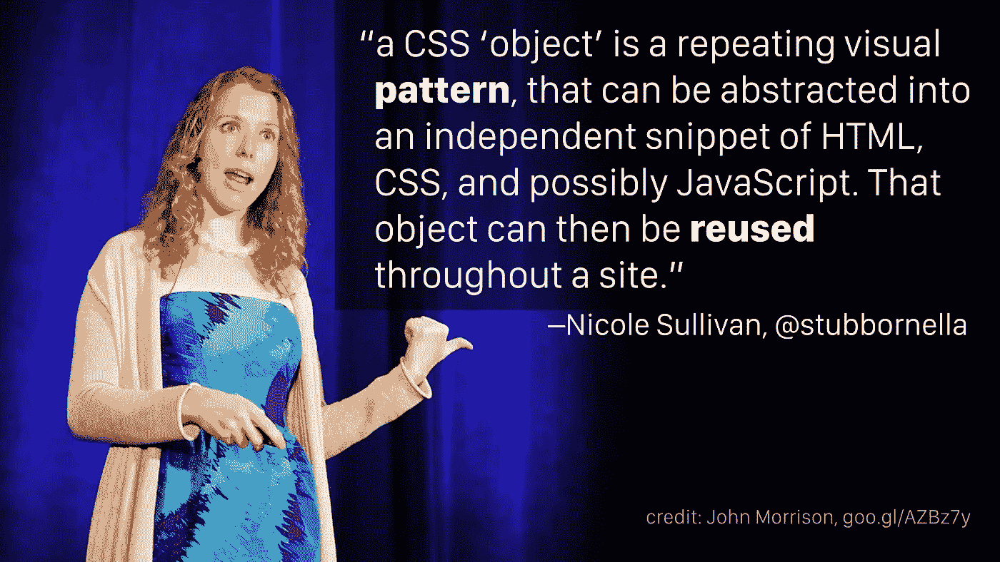

引用:[妮可·沙利文](https://github.com/stubbornella/oocss/wiki)，图片:[约翰·莫里森](https://www.flickr.com/photos/localcelebrity/6025913421/)

这就是模块化 CSS 的根源，正如她在 2009 年定义的那样。除此之外，OOCSS 可以归结为几个核心原则:

## 上下文无关的

首先，无论你把一个物体放在哪里，它看起来都应该是一样的。对象不应该基于它们的上下文来设计样式。

例如，不要把侧边栏中的所有按钮都变成橙色，把主区域中的所有按钮都变成蓝色，而应该把一个按钮类变成蓝色，把一个修饰符变成橙色。那么你的橙色按钮可以在任何地方使用，因为它们不依赖于侧边栏，它们只是你的按钮样式之一。

## 皮肤(又名主题化)

她谈到的另一个概念是如何从正在应用的**皮肤**中抽象出一个物体的**结构。**

我们可以回到媒体对象的例子。它的外观独立于标记和定义的结构。有一个包含元素、一个固定宽度的图像和内容。你可以用一百种不同的方式来设计它，但是不管它看起来怎么样，它的标记和结构都是一样的。

她还建议为常见的视觉模式创建可重用的类。她的一个例子是，2009 年在亚马逊上，几乎所有东西上都有阴影，它们只是有一点点不同。它们都是由不同的艺术家创作的图形元素，它们很相似，但又不相同。通过标准化这些阴影，你可以优化代码，使网站更有性能。

## 使用类

她还有一个原则，当时很有争议，但后来被证实了:使用类来命名对象及其子元素，这样标记可以在不影响样式的情况下改变。

她的意思是，你不希望你的标记决定你的 CSS。所以如果你把标题从`h1`改成了`h4`，你不需要更新你的 CSS。标题上应该有一个类，不管你选择什么元素，这个类都会被应用。比如，你的导航应该是类似`.site-nav` *的东西，而不是* `#header ul`。

## 不要使用身份证

“总是使用类”的自然推论是她建议永远不要使用 ID 选择器。这与当时使用 id 作为命名空间并直接引用嵌套在其中的元素的惯例相反。

id 混淆了特异性，因为它们太强了，但更重要的是，对象应该是可重用的。根据定义，id 是唯一的。所以，如果你给你的对象加上一个 ID，你就不能在同一个页面上重用它，这就失去了模块化对象的意义。

# 不列颠帝国勋章

这就把我们带到了下一个大框架，来帮助定义模块化 CSS 精神。 [BEM](https://en.bem.info/methodology/) ，代表块、元素、修改器，也是在 2009 年创建的。它是在 Yandex 开发的，就像俄罗斯版的谷歌。他们还运营着一个搜索引擎和网络邮件程序，所以他们同时也在解决和雅虎一样的与规模相关的问题。

他们为如何编写代码提出了一套非常相似的操作原则。他们的核心概念是**块**(Nicole 称之为“对象”)由子**元素**组成，并且可以**修改**(或者“蒙皮”或“主题化”)。

参与 BEM 工作的主要前端人员之一瓦娅·斯捷潘诺娃是这样描述的:

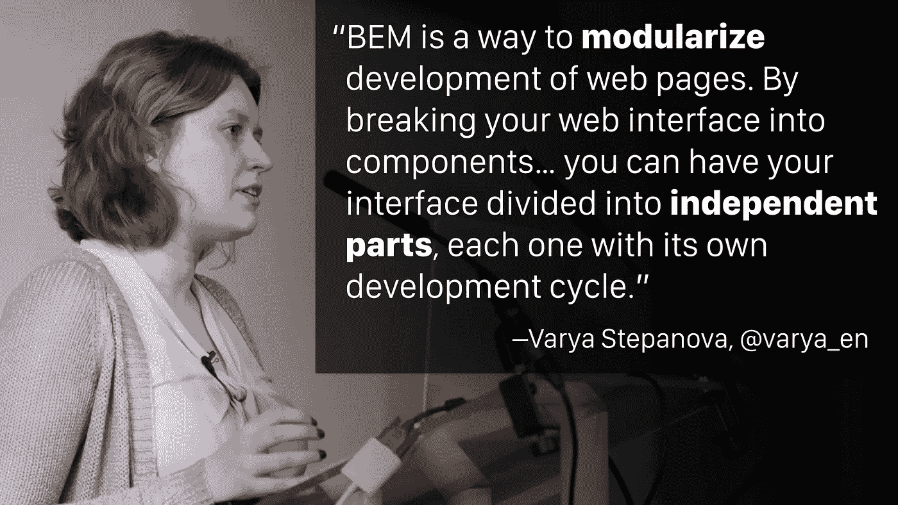

引用:[瓦娅·斯捷潘诺娃](https://www.youtube.com/watch?v=ya7QsFUfn3U)，照片:[苏格兰日报](https://www.youtube.com/watch?v=gWzYMJjtx-Y)

边界元法由三部分组成:

## 阻碍

块是网页的逻辑上和功能上独立的组件。BEM 的创建者在 Nicole 定义的基础上增加了一些其他属性:

首先，积木是可嵌套的。它们应该能够被包含在另一个块中而不破坏任何东西。例如，在你的侧边栏中可能有一个选项卡式界面小部件的块，并且这个块可能包含按钮，这是一个单独类型的块。按钮的样式和选项卡式元素的样式互不影响。只是一个嵌套在另一个里面。

其次，块**是可重复的**。一个接口应该能够包含同一个块的多个实例。就像 Nicole 说的媒体对象一样，重用块的能力可以显著节省代码。

## 元素

元素是块的组成部分，不能在块之外使用。一个很好的例子是，如果你有一个导航菜单，它包含的项目在菜单的上下文之外没有意义。你不会为一个菜单项定义一个块。菜单本身有一个块，菜单项是子元素。

## 修饰语

修改器定义块的外观和行为。例如，根据所使用的修饰符，菜单块的外观可能会从垂直变为水平。

## 命名约定

BEM 做的另一件事是定义了一个非常严格的命名约定:

`.block-name__element--modifier`

这看起来有点复杂，所以让我来分解一下:

*   名字是用小写字母写的
*   名称中的单词由连字符(`-`)分隔
*   元素由双下划线(`__`)分隔
*   修饰符由双连字符(`--`)分隔

这变得有点抽象，所以让我们举个例子:

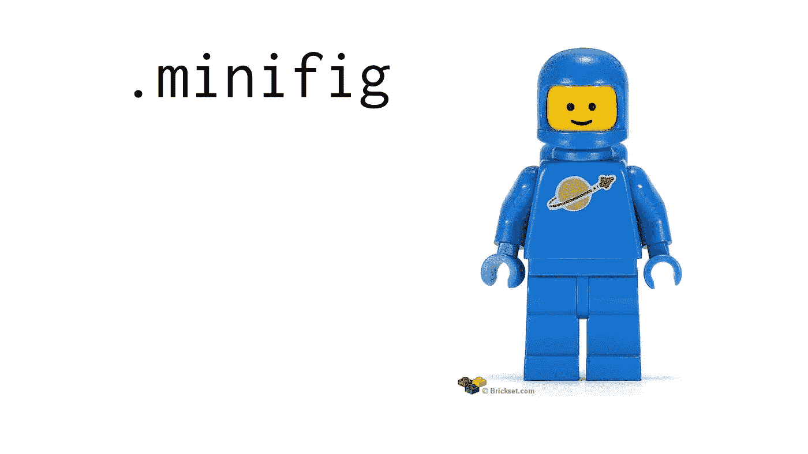

这里我们有一个标准的乐高迷你玩具。是一个蓝色的宇航员。我们将用块类`.minifig`来标识它。

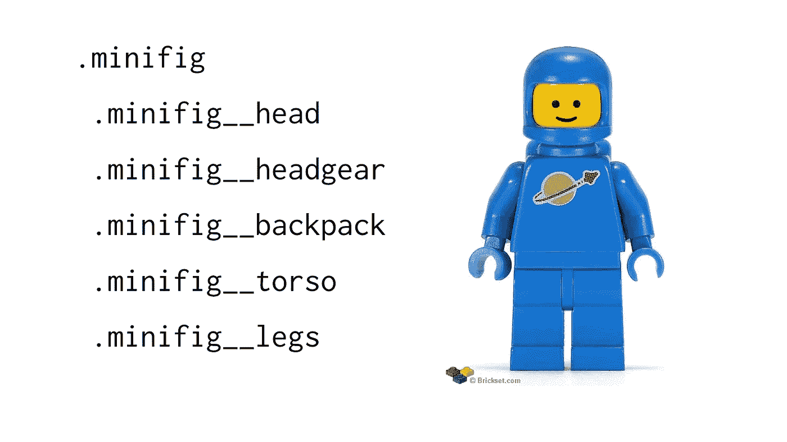

可以看到`.minifig`块是由`.minifig__head`和`.minifig__legs`等更小的元素组成的。现在让我们添加一个修饰符:

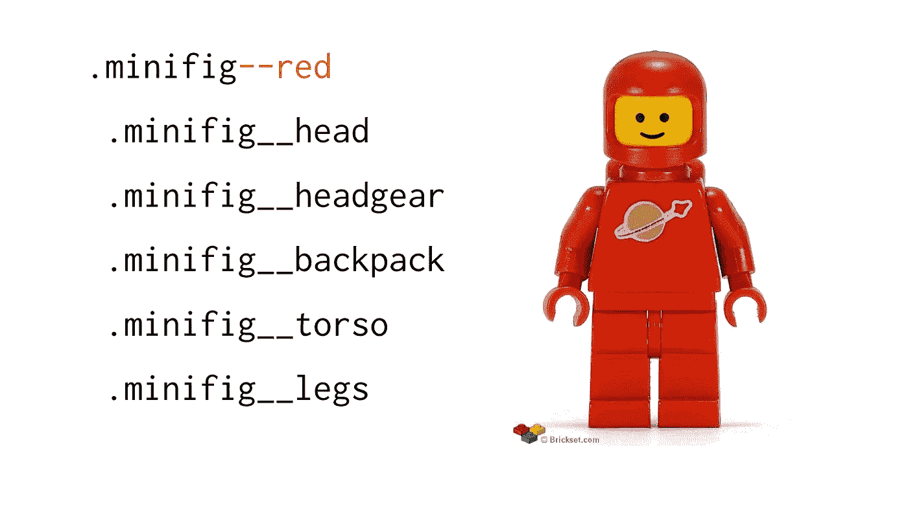

通过添加`.minifig--red`修改器，我们创建了标准蓝色宇航员的红色版本。

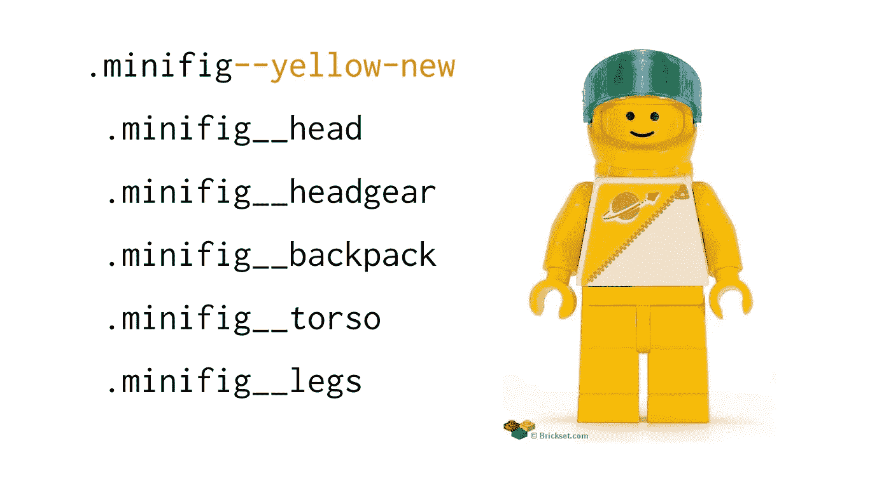

或者，我们可以使用`.minifig--yellow-new`修改器给我们的宇航员换上新式的黄色制服。

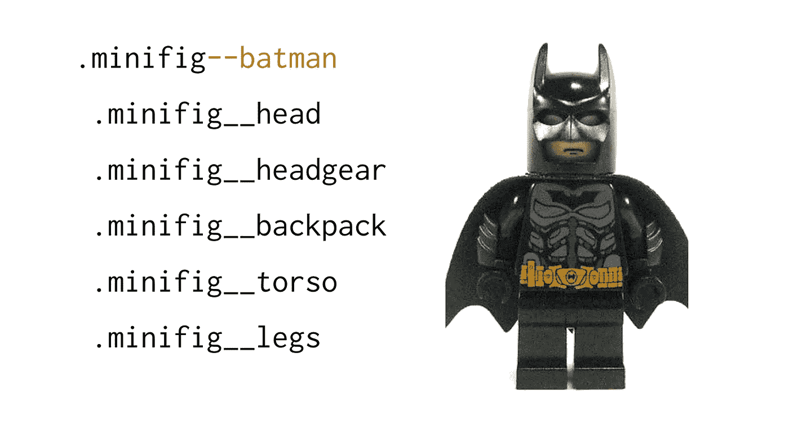

你可以用同样的方法做出更大的改变。通过使用`.minifig--batman`修改器，我们只用一个类就改变了迷你图的每个部分的外观。

下面是一个更实用的 BEM 语法示例:

```
<button class="btn btn--big btn--orange">
  <span class="btn__price">$9.99</span>
  <span class="btn__text">Subscribe</span>
</button>
```

即使没有看到任何 CSS，你也能一眼看出这段代码会创建一个大大的橙色价格按钮。无论您是否喜欢这种带有连字符和下划线的样式，有一个严格的命名约定的想法是一个巨大的进步。它使代码自文档化！

## 没有嵌套的 CSS

就像 OOCSS 建议使用类而不是 id 一样，BEM 为如何编写代码添加了一些原则。最值得注意的是，他们认为不应该嵌套 CSS 选择器。嵌套选择器增加了特异性，使得重用代码更加困难。比如，只用`.btn__price` *不用* `.btn .btn__price`。

*注意:这里的嵌套指的是在 Sass 或更少的 Sass 中实际嵌套选择器的实践，但是更广泛的概念也适用，即使你没有使用预处理器，因为它是关于选择器特性的。*

这个原则是可行的，因为它们有严格的命名约定。我们过去常常嵌套选择器，将它们隔离在一个命名空间的上下文中。BEM 的命名约定提供了一个命名空间，所以我们不再需要嵌套。尽管在 CSS 的根层，所有的东西都是一个类，但是它们的名字足够明确，可以避免冲突。

作为一个规则，如果一个选择器不需要嵌套就可以工作，那么就不要嵌套它。BEM 允许该规则的唯一例外是基于块或其修改器的状态来设计元素的样式。例如，当应用了一个修改器时，你可以先用`.btn__text`然后用`.btn--orange .btn__text`来覆盖按钮的文本颜色。

# SMACSS

我们要讨论的最后一个框架是 [SMACSS](https://smacss.com/) ，它代表 CSS 的可伸缩&模块化架构。它是由乔纳森·史努克在 2011 年创造的。他也在雅虎工作，为雅虎邮箱写 CSS。

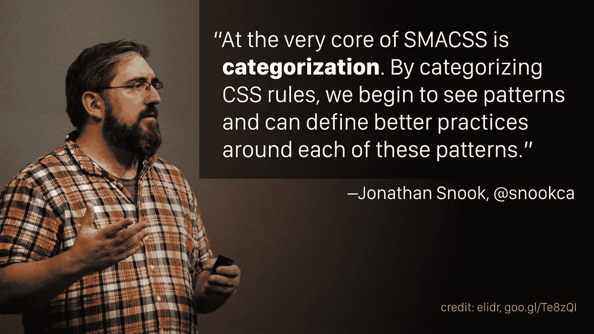

引用:[乔纳森·斯努克](https://smacss.com/book/categorizing)，照片:[艾丽达·阿里扎](https://www.flickr.com/photos/elidr/10864268273/)

他在 OOCSS 和 BEM 的基础上补充的关键概念是，不同类别的组件需要不同的处理方式。

## 种类

以下是他为 CSS 系统可能包含的规则类型定义的类别:

1.  **基本**规则是链接、段落和标题等 HTML 元素的默认样式。
2.  **布局**规则将页面分成几个部分，并将一个或多个模块放在一起。他们只定义布局，而不是颜色或排版。
3.  **模块**(又名“对象”或“块”)是设计中可重用的模块化部分。例如按钮、媒体对象、产品列表等。
4.  状态规则描述了模块或布局在特定状态下的样子。通常用 JavaScript 应用或删除。比如隐藏、展开、活动等。
5.  规则描述了应用主题时模块或布局的外观。例如，在 Yahoo Mail 中，您可以应用一个用户主题，这会影响页面上的每个模块。(这个真的是具体到雅虎这样的 app。大多数网站不会使用这个类别。)

## 命名约定前缀

他引入的下一个原则是使用前缀来区分规则的类别。他喜欢 BEM 有一个清晰的命名约定的想法，但是他希望能够一眼看出他正在查看的是什么类型的模块。

*   `l-`用作布局规则的前缀:`l-inline`
*   `m-`用作模块规则的前缀:`m-callout`
*   `is-`用作州规则的前缀:`is-collapsed`

(基本规则没有前缀，因为它们直接应用于 HTML 元素，不使用类。)

# 共享模块原则

这些框架相似之处多于不同之处。我看到了一条从 OOCSS 到 BEM 再到 SMACSS 的清晰路径。他们的发展代表了我们行业在性能和大规模编写 CSS 方面不断增长的经验。

你不需要只选择一个。相反，让我们尝试定义模块化 CSS 的通用主题。让我们看看这些框架有什么共同点，并保留最好的部分。

## 模块化元素

模块化系统由以下要素组成:

*   **模块:**(又名对象、块或组件)一个可重用的自包含模式。示例包括媒体对象、导航和页眉。
*   **子元素:**模块中独立的一部分。示例包括媒体对象图像、导航选项卡和页眉徽标。
*   模块修改器:(又名皮肤或主题)改变模块的视觉外观。示例包括左/右对齐的媒体对象、垂直/水平导航。

## 模块化类别

模块化系统中的样式可以分为以下几类:

*   基本规则是 HTML 元素的默认样式。例子:`a`、`li`、`h1`
*   规则控制模块如何布局，但不控制视觉外观。例子:`.l-centered`、`.l-grid`、`.l-fixed-top`
*   模块是可重用的、自包含的 UI 组件的视觉样式。示例:`.m-profile`、`.m-card`、`.m-modal`
*   **状态**规则由 JavaScript 添加。示例:`.is-hidden`、`.is-collapsed`、`.is-active`
*   **Helper** (又名 utility)规则范围小，独立于模块。例子:`.h-uppercase`、`.h-nowrap`、`.h-muted`

## 模块化规则

在模块化系统中编写样式时，请遵循以下规则:

*   不要使用身份证
*   不要嵌套 CSS 超过一层
*   向子元素添加类
*   遵循命名约定
*   前缀类名

# 常见问题解答

## 这不是意味着我的 HTML 有很多类吗？

我经常看到的对模块化 CSS 方法的第一个反对意见是，它会在 HTML 中产生许多类。我认为这是因为它曾经被认为是避免在你的标记中有太多类的最佳实践。早在 2011 年，妮可·沙利文就写了一篇名为“[我们的(CSS)最佳实践正在杀死我们](http://www.stubbornella.org/content/2011/04/28/our-best-practices-are-killing-us/)”的博文，明确驳斥了这一观点。

我看到一些开发人员提倡的一个选项是使用预处理器的`extend`函数将多个样式连接成一个类名。我建议不要这样做，因为这会降低代码的灵活性。不允许其他开发者以新的方式组合你的乐高积木，他们会被你定义的几种组合卡住。

## 但是 BEM 类名又长又丑！

不要害怕长的类名。它们是自我记录的！当我看到 BEM 风格的类名(或任何其他模块化命名约定)时，我很高兴我一眼就能看出这些类的用途。这就像是你的标记中的书面痕迹。

## 孙元素的命名约定是什么？

长话短说:没有这回事。

模块化 CSS 的新手很快掌握了子元素的思想:`minifig__arm`是`minifig`的一部分。然而，有时他们会在匹配 CSS 中的 DOM 结构时遇到麻烦，他们会询问如何指示进一步的嵌套层次，比如`minifig__arm__hand`。

没必要这样。记住，这个想法是将你的样式从你的标记中分离出来。不管`hand`是`minifig`的直接子节点还是嵌套在 DOM 中的几个层次。CSS 关心的只是`hand`是`minifig`的子。

```
.minifig {}
  .minifig__arm {}
    .minifig__arm__hand {} /* don't do this */
  .minifig__hand {} /* do this instead */
```

## 模块冲突怎么办？

模块化 CSS 新手倾向于关注的另一件事是模块之间的冲突。例如，如果我将`l-card`模块和`m-author-profile`模块应用于同一个元素，会不会导致问题？

答案是，理想情况下，模块不应该重叠太多。在这个例子中，`l-card`模块关注的是布局，而`m-author-profile`模块关注的是样式。你可能会看到`l-card`设置宽度和边距，而`m-author-profile`应用背景颜色和字体。

测试你的模块是否被正确隔离并且不冲突的一个方法是以随机的顺序加载它们。您可以配置您的构建系统，在构建时打乱模块样式表。如果你开始发现错误，你就会知道你已经得到了一个期望以特定顺序加载的 CSS。

如果您发现您需要将两个模块应用到同一个元素，并且它们是冲突的，请考虑这是否真的是两个独立的模块。也许可以用一个修改器把它们合并成一个模块？

该规则的最后一个例外是“助手”或“实用工具”类可能会冲突，在这种情况下，您可以放心地考虑使用`!important`。我知道，你已经被告知`!important`是邪恶的，不应该被使用，但是让我们应用一点细微的差别:主动使用它来确保一个助手类总是赢得一场特异性的战斗是好的。( [Harry Roberts 在 CSS 指南](https://cssguidelin.es/#important)中对这个话题有更多的说明。)

# 总之，模块化 CSS 是掺杂的

让我们简单回顾一下。还记得这个吗？

```
<div class="box profile pro-user">
  
  <p class="bio">...</p>
</div>
```

> *类* `*box*` *和* `*profile*` *之间有什么关系？类别* `*profile*` *和* `*avatar*` *之间有什么关系？他们有任何关系吗？你应该在* `*bio*` *旁边使用* `*pro-user*` *吗？类* `*image*` *和* `*profile*` *会生活在 CSS 的同一个部分吗？你能在其他地方使用* `*avatar*` *吗？*

现在我们知道如何解决所有这些问题。通过编写模块化 CSS 并使用适当的命名约定，我们可以生成自文档化的代码:

```
<div class="l-box m-profile m-profile--is-pro-user">
  
  <p class="m-profile__bio">...</p>
</div>
```

我们可以看到哪些类彼此相关，哪些不相关，以及如何相关。我们知道在这个组件的范围之外不能使用什么类。此外，我们知道哪些类可以在其他地方自由重用。

模块化 CSS 简化了代码，方便了重构。它产生自文档化的代码。它产生了不影响其范围之外的可重用代码。

或者换句话说，模块化 CSS 是可预测的、可维护的和高性能的。

现在我们可以重温这个老笑话，并做一点小小的改变:

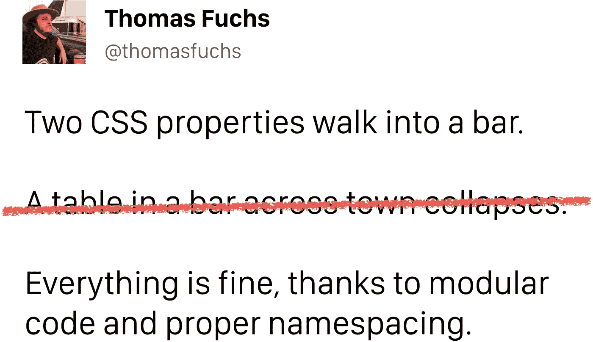

*原载于 2018 年 9 月 18 日*[*【spaceninja.com*](https://spaceninja.com/2018/09/17/what-is-modular-css/)*。*