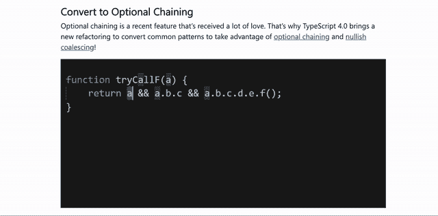
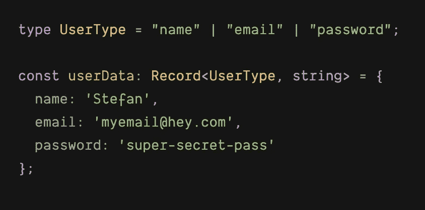
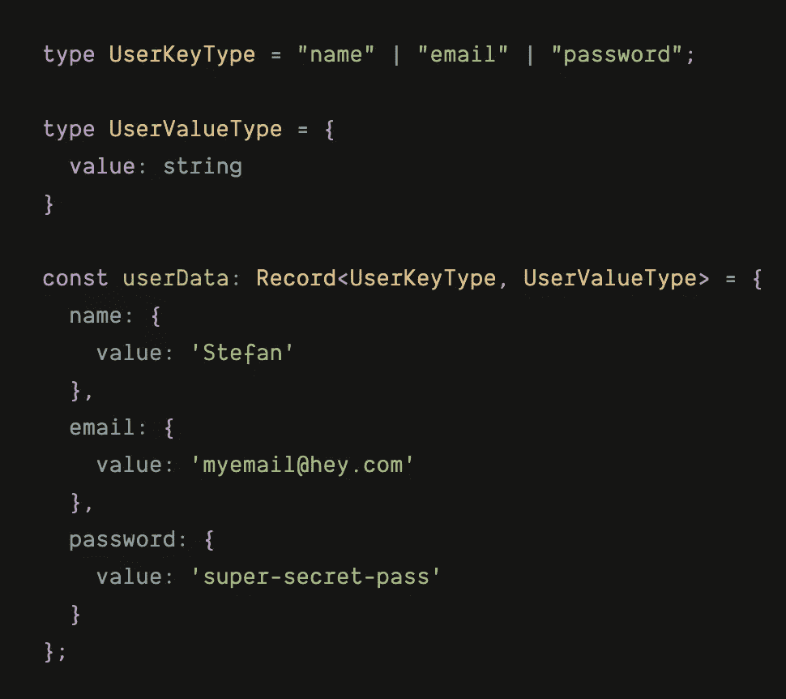
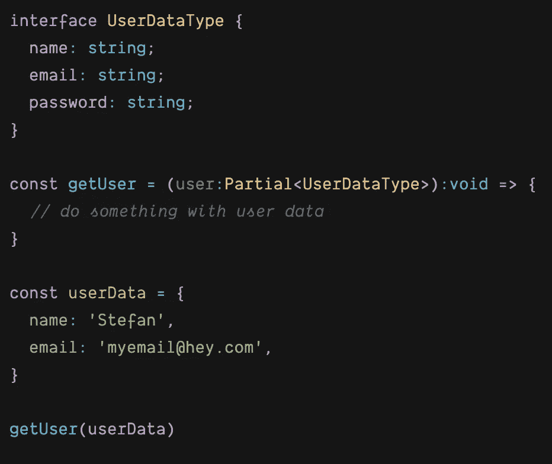
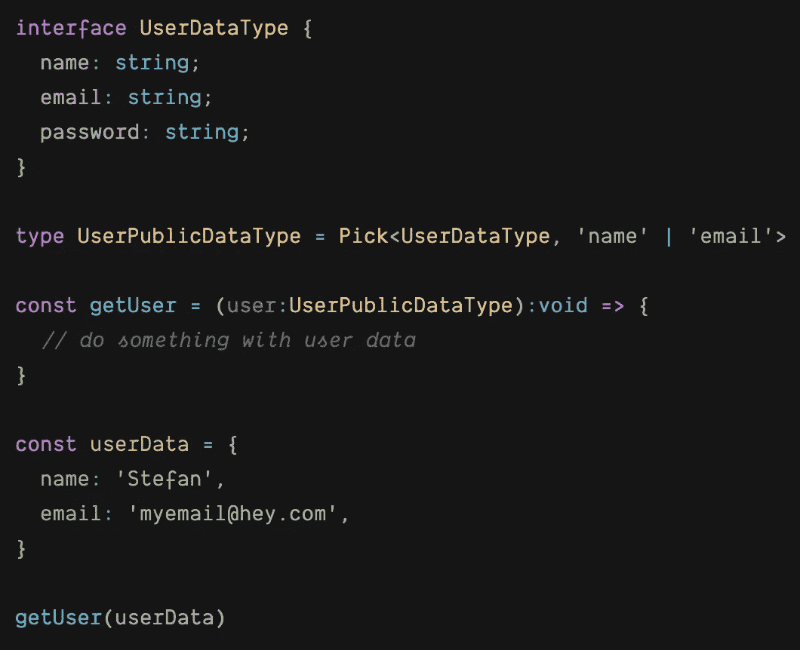
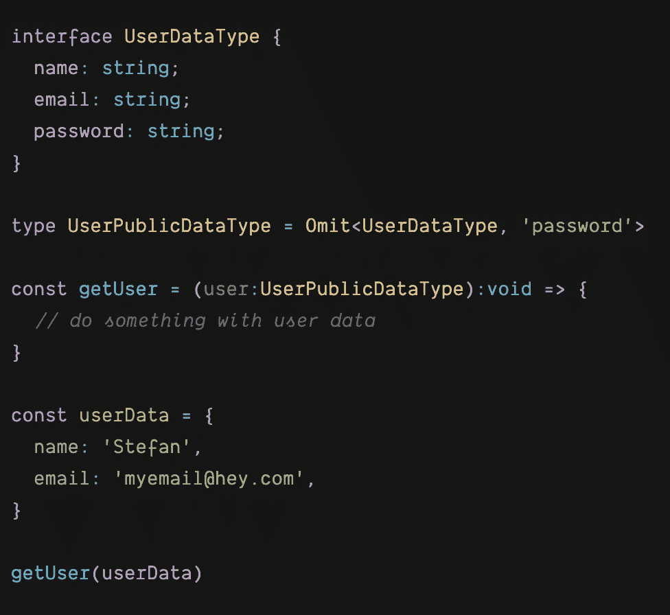
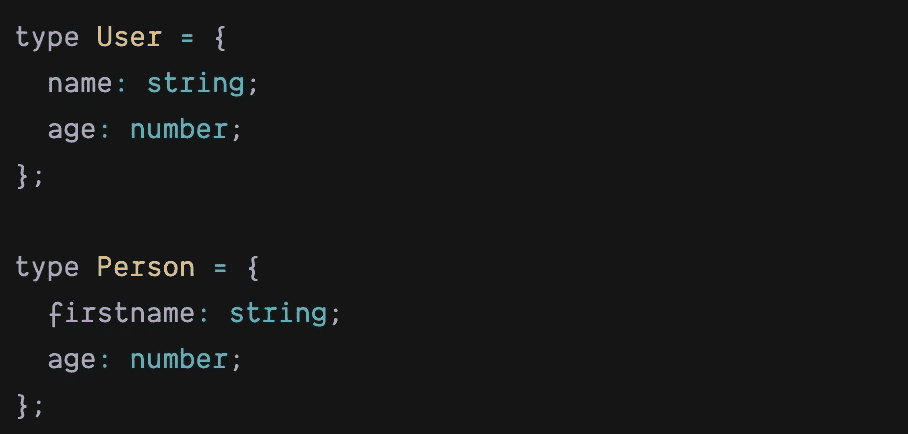
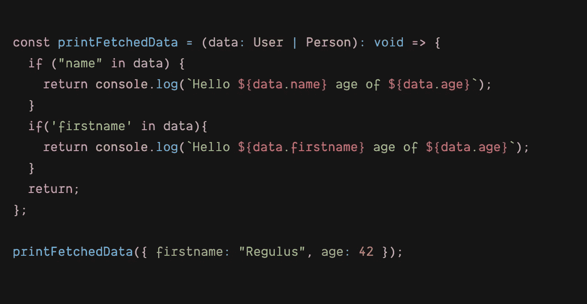

# 对 Typescript 4.0 和更多版本的期待。

> 原文：<https://itnext.io/what-is-new-in-typescript-4-0-and-more-6c5fa72fa1db?source=collection_archive---------2----------------------->

## 您应该开始使用的高级功能和技术。


照片由 [Unsplash](https://unsplash.com/s/photos/timelapse?utm_source=unsplash&utm_medium=referral&utm_content=creditCopyText) 上的 [Fotis Fotopoulos](https://unsplash.com/@ffstop?utm_source=unsplash&utm_medium=referral&utm_content=creditCopyText) 拍摄

无论你是否在 2020 年使用 Typescript，有一个不可否认的事实，那就是这种语言正在稳步发展和快速进化，为我们的应用程序带来了更多的便利和坚实的基础，而不必牺牲他们的可维护性。在写这篇文章的时候，这种语言已经有 12，125，535 的周下载量来自 npmjs.com 的 T4。为了让你对这些数字有更全面的了解，React 的周下载量为 7，671，193 次。

此外，对最受喜爱的语言 Stack Overflow 的年度调查显示，今年 Typescript 上升了一个位置，取代了 Python，获得了银牌，只让位于这个类别中的 Rust。同样为了便于比较，在同一调查中，JavaScript 今年排在第十位。

我希望，如果您还在考虑是否应该深入研究 Typescript，这几行文字已经说服了您。
闲话少说，让我给你一个概述，看看你能从这篇文章中得到什么:

*   语言中的新内容和即将出现的内容。
*   最近一些有用的模式和实用程序的例子，可能不太为人所知，但肯定非常方便。

# 让我们开始吧，Typescript 有什么新特性？

最近，打字领域发生了很多事情。就在几天前，Typescript [主页](https://www.typescriptlang.org/)焕然一新，拥有更广泛、结构更好的文档，更新了 TS playground，以及(我最喜欢的部分)所有可以在 tsconfig 文件中使用的标志的专用部分，其中有详细的解释和示例参考，您可以在这里找到。

如果您正在使用 Typescript，我强烈建议您花几分钟时间熟悉一下这个新网站。如果你正在考虑是否要从这门语言开始，这是一个更好的快速浏览文档的理由。

除了完美的网站之外，4.0 版本的发布候选也被公布了。在这里，你可以找到[的新功能和附加功能的完整列表。在接下来的几行中，我将尝试涵盖它最有趣的部分。](https://devblogs.microsoft.com/typescript/announcing-typescript-4-0-rc/)

## 元组不再需要古怪而繁琐地键入

元组可以用一个现在可以扩展的通用元素来表示，这对于类型来说更加方便，因为我们不再需要预先知道实际的类型结构。

这将是一个有效的语法:

```
const returnTuple = (arg: Array<unknown>):[string, ...T]
```

此外，我们现在可以将元素分散并放置在元组中的任何位置，例如:

```
const returnTuple = (arg: Array<unknown>):[...T, string, ...R]
```

或者换句话说，要扩展的元素不必再位于最后一个位置。在添加之前，如果我们试图扩展一个不是元组中最后一个的元素，我们会看到这个编译错误消息

```
**A rest element must be last in a tuple type.**
```

tuple 类型体验的另一个很好的补充是，我们现在可以在每个位置标记 tuple 元素。这里要记住的一点是，如果我们决定将标签附加到元组元素，那么元组的所有成员也应该有标签。

```
type UserInput = [email: string, password: string]
```

Typescript 4.0 带来了一些很好的文本编辑器改进，主要集中在 VS 代码上。[这里的](https://devblogs.microsoft.com/typescript/announcing-typescript-4-0-rc/#editor-improvements)是新版本即将推出的新增功能的完整列表。特别引起我注意的是可选链接的重构选项，这也是对 Typescript 的一个相当新的补充。

这个例子直接来自 Typescript 文档:



酷吧？😊关于 VS 代码的另一篮子好东西，请查看我的文章:

[](https://medium.com/better-programming/how-to-configure-vs-code-like-a-pro-782d2d718586) [## 如何像专业人士一样配置 VS 代码

### VS 代码生产率的终极指南

medium.com](https://medium.com/better-programming/how-to-configure-vs-code-like-a-pro-782d2d718586) 

# 您之前承诺的那些有用的实用程序和模式呢？

除了语言中新的和即将到来的改进，让我分享一些实用类型的帮助器和模式，你可能会觉得有趣和有用。

## `Record<Keys,Type>`

> 用类型`Type`的一组属性`Keys`构造一个类型。该实用工具可用于将一种类型的属性映射到另一种类型。

或者换句话说，当我们想要更严格地键入任何对象(如数据结构)中的键时，Record 实用程序类型特别有用。

这里有一个简单的例子来说明我们如何利用它:



记录类型简单示例

当然，如果有必要，我们可以利用 Record utility 中的第二个参数来进一步扩展我们的类型签名:



记录类型示例扩展

## **偏<型>型**

> 构造一个类型，将`Type`的所有属性设置为可选。该实用程序将返回一个表示给定类型的所有子集的类型。

当您处理动态数据并且响应包含您期望的类型数据集中的部分信息时，或者您只想部分使用给定的类型时(正如该实用程序的名称所暗示的那样)，这非常有用。下面的例子展示了第二种情况:



部分公用事业类型示例

在这个例子中，我们有一个 UserDataType 接口，它保存了树的属性——名称、电子邮件和密码。接下来，我们将该接口分配给来自 **getUser** 函数的参数。通常，如果我们省略了`Partial`的使用，Typescript 编译器会抱怨我们没有传递足够的属性，但是由于我们利用了**部分<类型>类型**类型实用程序，Typescript 很高兴，因此我们也很高兴。

这个用例的另一种方法是用 Typescript 中全局可用的另一个实用程序类型来转换 UserDataType
。

## `Pick<Type, Keys>`

> 通过从`Type`中选取属性集`Keys`来构造类型。

使用该语言提供的这一特性，我们前面的示例将如下所示:



选择实用程序类型

这里我们定义了一个新的类型 UserPublicDataType，我们现在用它来定义用户参数数据类型的形状。

我们可以采用另一种非常相似的方法来满足传递给用户参数的变量的类型需求，那就是使用实用程序类型:

## `Omit<Type, Keys>`

> 通过从`Type`中选取所有属性，然后移除`Keys`来构造一个类型。



省略实用程序类型示例

有更多的实用程序助手可以使我们的生活更容易转换和塑造我们的数据类型。如果您感兴趣，请查看文档并了解更多信息[点击此处](https://www.typescriptlang.org/docs/handbook/utility-types.html)。

在本文的最后一部分，我想强调一种特别聪明的方法，Typescript 可以从类型保护检查中检测和拾取正确的类型结构。

## 防护类型

> 类型保护是一些执行运行时检查的表达式，它保证类型在某个范围内。

通常在谓词表达式中使用类型保护来帮助我们确定表达式是否满足某个标准。
有一些不同类型的安全检查可供我们使用，在这里找到所有这些检查。

接下来的例子有望澄清到底什么是类型保护，以及我们如何利用这种模式。

这次让我们一步一步来，让一切变得非常简单。

首先，让我们假设我们必须处理两组非常接近的数据类型，但是我们需要一种方法来区分它们。



定义类型

让我们想象一下，我们正在从一个外部数据源获取一个数据，
,由于某种原因，数据集可以是 User 类型或者 Person 类型。
获取数据后，我们需要将其传递给一个子组件，该子组件必须打印出接收到的数据。

这里的问题现在应该很明显了，我们如何确定我们实际收到的是哪种数据类型并打印出正确的属性？
型守卫前来救援，在我们的 if 检查中使用操作符中的**将解决我们的类型问题。**



Typescript 足够智能，可以检测我们传递给函数的数据是否包含 User 类型的 name 属性或 Person 类型的 firstname 属性，因此函数总是可以返回正确的问候消息。

## 最后的话

好了，这就是我现在的观点，真的希望你会发现这篇文章很有用，它会让你的打字体验更好。

享受快乐的黑客生涯！👨‍💻⌨️👩‍💻