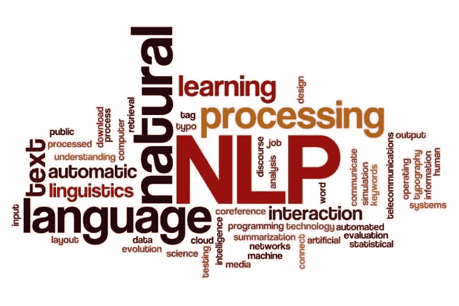
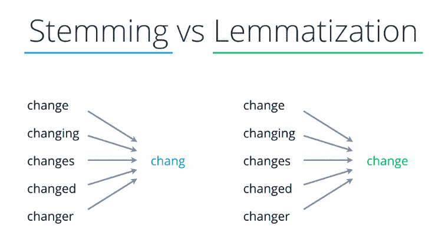
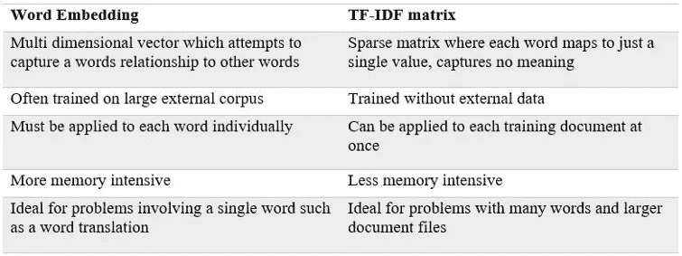
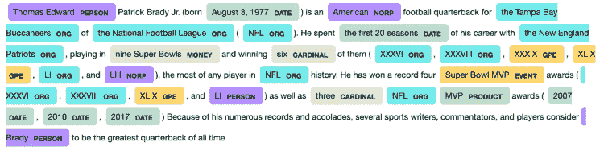

# 什么是 NLP？自然语言处理导论

> 原文：<https://itnext.io/what-is-nlp-an-introduction-to-natural-language-processing-f48ff68a2e90?source=collection_archive---------2----------------------->


阿玛多·洛雷罗在 [Unsplash](https://unsplash.com?utm_source=medium&utm_medium=referral) 上的照片

# 介绍

这篇文章的目的是给已经具备基本的[](https://en.wikipedia.org/wiki/Machine_learning)**机器学习技能并想进入[机器学习的](https://en.wikipedia.org/wiki/Natural_language_processing)领域的人一个自然语言处理([**【NLP】**](https://en.wikipedia.org/wiki/Natural_language_processing))的快速介绍。**

**我将从什么是[](https://en.wikipedia.org/wiki/Natural_language_processing)**以及它在**人工智能** **生态系统**中的位置开始一个非常简短的概述。在本文中，我将只关注**文本** **数据**而不是音频或视频处理。****

****这篇文章是我之前的[文章](/introduction-to-natural-language-processing-nlp-tools-for-python-cf39af3cfc64)的摘录，其中也谈到了 Python 中可用的不同工具。****

# ****什么是 NLP？****

****简单来说，NLP 就是 [**机器学习**](https://en.wikipedia.org/wiki/Machine_learning) 专注于从[](https://en.wikipedia.org/wiki/Natural_language)**自然语言中提取洞察的一个领域。你的目标是让计算机理解我们自己的语言。******

******自然语言处理的一些实际例子有语音识别、翻译、情感分析、主题建模、词汇分析、实体提取等等。******

******使用所有这些工具和算法，你可以**从自然语言中提取结构化数据**，这些数据可以被计算机处理。此外， **NLP** 任务的输出通常是机器学习算法，该算法将使用这些原始数据来进行**预测**。******

********

****通过**将许多算法结合在一起**，您可以提取有用的数据，这些数据可用于广泛的场景，例如:****

*   ****欺诈检测****
*   ****[风险情报](https://aylien.com/solutions/risk-intelligence)****
*   ****电子邮件分类****
*   ****[情绪分析](https://pythonspot.com/python-sentiment-analysis/)****

# ****常见 NLP 任务****

****你大概听说过**花在[](https://en.wikipedia.org/wiki/Machine_learning)**机器学习的 80%** 时间是**数据准备**:数据清洗、[数据角力](https://en.wikipedia.org/wiki/Data_wrangling)、特征工程等。对于 NLP 来说尤其如此，因为我们的主要目标是将文本转换成计算机可以使用的数字。******

# ****数据准备****

****这些任务包括初始准备，如加载文本数据，删除停用词，小写字母，删除页眉和页脚或任何其他无用的文本；还有更多。****

****[**Pandas**](https://pandas.pydata.org/) 是这个探索阶段的必备工具，因为它可以让你轻松地**实验**数据，并与其他团队成员和利益相关者分享你的见解和成果。****

****[**记号化**](https://en.wikipedia.org/wiki/Lexical_analysis#Tokenization) 是另一个重要的任务，有很多记号化器可用，它的配置将取决于你要实现的目标。这个想法是将文本分割成单词，这些单词以后可以被量化并表示为数字。除了将文本拆分成单词之外，您可能还想将它们拆分成元组。**句子分割**是一个类似的过程，但目标是将文本分割成完整的句子。****

******词法分析**是自然语言处理中的一项重要任务，目标是将单词还原为其基本形式。有两种方法可以做到这一点:****

*   ****[](https://en.wikipedia.org/wiki/Stemming)****词干化是将单词还原为基本形式的过程(*如*)，“close”将是“closed”、“closing”、“close”、“closer”等的词根。).我这样做是基于规则，而不是字典。换句话说，结果可能是也可能不是一个真正的单词，它更像是一个前缀。********
*   ******[**引理化**](https://en.wikipedia.org/wiki/Lemmatisation) 的任务是仅移除屈折词尾，并返回单词的基本字典形式，也称为**引理**。换句话说，它从字典中产生一个真实的单词。******

********

****词干化和词汇化的区别****

****注意，根据你想要达到的目标**，每种方法都有自己的优点和缺点**。如果你不在乎单词的意思，而只想对文本进行分类，那么词干提取会更快更容易。****

****一旦你已经阅读了文本数据，删除不必要的内容，删除停用词，小写的文本，标记的文本和减少单词的词条；您已经准备好应用 NLP 算法。请注意，根据您的任务和您计划使用的算法，数据准备会有所不同，一些任务(如词条化或小写字母)可能不需要和/或不推荐使用文本。****

# ****特征提取和文本分类****

****在机器学习中，给你一组列或**特征**，你用它们来预测一些结果。NLP 的棘手之处在于能够从非结构化的文本中提取有意义的特征。这就是**特征提取**的目标；完成这些之后，您可以应用其他 ML 算法进行文本分类。****

****在 NLP 中，你还有[有监督的](https://en.wikipedia.org/wiki/Supervised_learning)和[无监督的](https://en.wikipedia.org/wiki/Unsupervised_learning)算法；简而言之，**监督的**算法需要**标记的数据**而非监督的不需要。我们将在本文后面讨论标记数据，但为了简单起见；让我们用一个简单的例子来解释这个过程:图像你想检测垃圾邮件。您已经标记了[数据](https://www.kaggle.com/balaka18/email-spam-classification-dataset-csv)，其中包含邮件正文以及该邮件是否为垃圾邮件。****

****在机器学习中，你通常会有一个列列表(**特征**)和一个**目标** (Spam/NotSpam)。例如，如果您试图预测一所房子的价格，您将拥有诸如卧室数量、大小、到学校的距离等列。这些都是可以转换成数字的数字或类别；并且可以容易地输入到机器学习算法中。但是我们如何用自然语言做到这一点呢？****

******NLP 特征提取**算法用于将单词转换成包含足够信息的数字表示，以便将其输入到统计模型中。为此，我们将文本转换成一种称为**特征向量**的数字表示。 [**袋词模型**](https://en.wikipedia.org/wiki/Bag-of-words_model) 是实现这一点的简单方法。在这种情况下，我们只是将每个单词转换成一个数字，即该单词在语料库中出现的次数。例如，如果我们有:****

```
**'All my cats in a row',
'When my cat sits down, she looks like a Furby toy!',**
```

****这将被转换为:****

```
**{'all': 0, 'cat': 1, 'cats': 2, 'down': 3, 'furby': 4, 'in': 5, 'like': 6, 'looks': 7, 'my': 8, 'row': 9, 'she': 10, 'sits': 11, 'toy': 12, 'when': 13 }**
```

****现在我们有数字了！每个单词将是高维向量中的一列，该向量可以被馈送给[神经网络](https://en.wikipedia.org/wiki/Neural_network)或任何其他算法，并用于分类/回归。我们还可以[归一化](https://iq.opengenus.org/normalization-in-detail/)这些值，以便为某些算法获得更好的结果。****

****在我们的*垃圾邮件*示例中，机器算法可能会“学习”到，如果出现大量类似“购买”的特定单词，那么它将是垃圾邮件。为了做到这一点，我们真的需要删除经常出现的停用词，并将词减少到其引理，这样它们就不会被计算在内，而是单独的特征。**这就是数据准备如此重要的原因。******

****然而，词频是非常基本的，大多数时候，你会对出现在你的输入文本中但不在一般语料库中的词感兴趣。此时 [**TF-IDF**](https://en.wikipedia.org/wiki/Tf%E2%80%93idf) 前来救援，定义如下:****

> *****TF-IDF 中的高权重通过该术语在整个文档集合中的高术语频率(在给定文档中)和低文档频率来达到。*****

****它结合了两种算法:****

******词频******

```
****TF(t) = (Number of times term t appears in a document) / (Total number of terms in the document)****
```

******逆文档频率******

```
****IDF(t) = log_e(Total number of documents / Number of documents with term t in it)****
```

****将文本转换为矢量的另一种技术是 [**单词嵌入**](https://en.wikipedia.org/wiki/Word_embedding) ，它将单词转换为 n 维矢量。像“汽车”和“车辆”这样的相关单词将映射到相似的 n 维向量，而像“狗”和“箭头”这样的单词在向量空间中将是遥远的。****

********

****自然语言处理中两种主要特征工程技术综述****

****总而言之，**我们使用 NLP 中的特征提取来从文本中提取特征，**因此它们可以被馈送到用于**文本分类的监督机器学习模型中**。使用这些技术的一些例子是垃圾邮件检测或[情感分析](https://en.wikipedia.org/wiki/Sentiment_analysis)。稍后，我们将看到一些简化文本分类过程的库。****

# ****词性标注****

****[**词性标注**](https://en.wikipedia.org/wiki/Part-of-speech_tagging) ( **POS** )是将句子中的词标注为名词、形容词、动词等的过程。这些算法自动用正确的标签标记文本数据的内容，其他算法可以使用输出来检测主题、相似性等。****

********

****[SVM](https://en.wikipedia.org/wiki/Support_vector_machine) 、[最大熵分类器](https://en.wikipedia.org/wiki/Maximum_entropy_classifier)、[最近邻法](https://en.wikipedia.org/wiki/K-nearest_neighbor_algorithm)等机器学习算法可以用于 **POS** ，大部分可以达到 95%以上的准确率。****

# ****命名实体识别(NER)****

****[](https://en.wikipedia.org/wiki/Named-entity_recognition)**是一种**监督**技术，用于将[非结构化文本](https://en.wikipedia.org/wiki/Unstructured_data)中提到的实体分类成预定义的类别，如人名、组织、地点、[医疗代码](https://en.wikipedia.org/wiki/Medical_classification)、时间表达式、数量、货币值、百分比等。目标是**检测你的文本中的类别，这样你就可以提取关于文本内容的见解**或者它是否在谈论某个主题。这对于**风险检测**、分类、欺诈检测等非常有用。******

********

****NER 在行动中检测人员，日期，组织…****

****在这篇 [**文章**](/nlp-named-entity-recognition-ner-with-spacy-and-python-dabaf843cab2) 中，我给出了一个完整的 **NER** 的端到端例子。****

# ****主题建模****

****[**主题建模**](https://en.wikipedia.org/wiki/Topic_model) 是一种**无监督**方法，用于发现文档集合中出现的抽象“主题”。它可以用于文本挖掘或发现隐藏的语义结构。主题建模技术产生的“主题”是一组相似的单词。****

****[**LDA**](https://en.wikipedia.org/wiki/Latent_Dirichlet_allocation) 算法常用于主题建模。像其他非监督算法一样，你需要预先选择你想要提取多少主题。****

# ****结论****

****我们可以这样总结 NLP:**它结合了一套工具和技术，将复杂的自然语言转换成机器可读的数据。******

******特征工程**和提取是**自然语言处理**中的关键步骤。像 **TF-IDF** 和单词嵌入这样的技术被用来将单词转换成可以被统计模型用于文本分类的数字。**命名实体提取(NER)** 是一个非常有用的算法，允许我们从文本数据中提取类别和其他见解。文本分类和 NER 都是**监督的**算法，你需要提供带标签的数据。****

******主题建模**可用于聚集文章内的相关主题，例如创建实时[新闻内容主题集群](https://aylien.com/blog/getting-started-with-real-time-topic-clustering)。这是一个**无监督**算法。****

****许多组织花费大量资源建立复杂的模型来改善结果，而不是关注数据。良好的**数据准备和特征工程**可以比任何 ML 算法更快更好地提高模型性能。****

*****记得来* ***拍拍*** *如果你喜欢这篇文章和* [***关注*******me****](https://javier-ramos.medium.com/subscribe)**或*[*订阅*](https://javier-ramos.medium.com/membership) *获取更多更新！******

*****我希望你喜欢这篇文章。欢迎发表评论或分享这篇文章。跟随[***me***](https://javier-ramos.medium.com/subscribe)*进行未来岗位。******