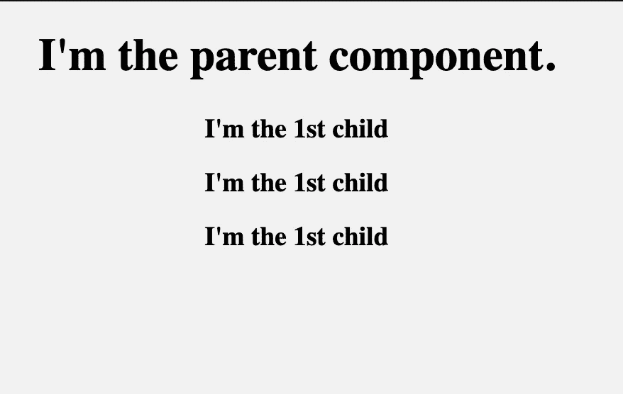
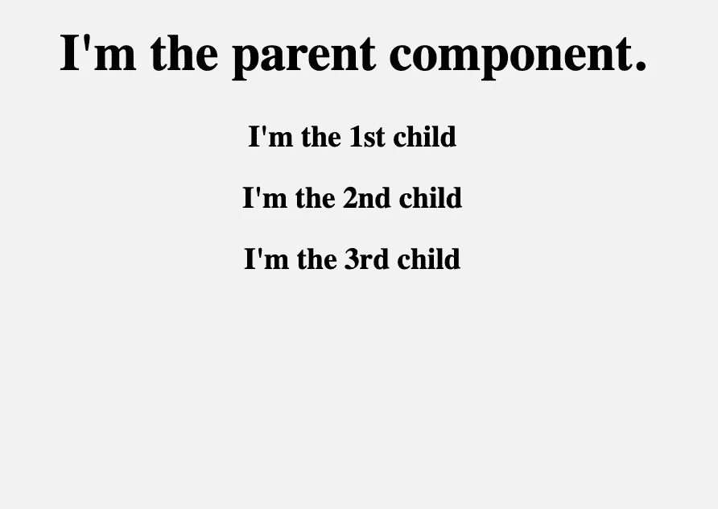

# 什么是“道具”，如何在 React 中使用？

> 原文：<https://itnext.io/what-is-props-and-how-to-use-it-in-react-da307f500da0?source=collection_archive---------0----------------------->


与其他框架相比，React 有一种不同的处理数据流和操作的方法，这就是为什么一开始理解一些概念(如道具、状态等)会很困难。

我认为最好在单独的帖子中继续解释它们，在本文中，我们将重点关注 **React 的 Props** 功能以及如何使用它。

要理解道具是如何工作的，首先，你需要对组件的概念有一个大致的了解。如果你不太了解 React 中的组件，我推荐阅读我的[以前关于 React 组件](https://codeburst.io/react-js-understanding-functional-class-components-e65d723e909)的文章。

> *如果你有兴趣学习更多编程知识，可以考虑订阅* [*我的简讯*](https://bit.ly/2KXEBsv) *。*

# 什么是道具？

**React 是一个基于组件的库**，它将用户界面分成可重用的小块。在某些情况下，这些组件需要通信(相互发送数据),在组件之间传递数据的方式是使用 **props。**

**“Props”**是 React 中的一个特殊关键字，代表**属性**，用于**将数据从一个组件传递到另一个**。

但是这里重要的部分是，带有道具的数据是以**单向流**传递的。(从父母到孩子的单向)

此外， **props 数据是只读的，**这意味着来自父**的数据不应被子组件**改变。

好了，现在让我们通过一个例子来看看如何使用道具…

> 注:你也可以通过看我的[教程视频](https://youtu.be/M_Fmvs5CiDo)来学习如何使用道具。

# 在 React 中使用道具

我将一步一步地解释如何使用道具。

1.  首先，定义一个属性及其值(数据)
2.  然后使用 Props 将它传递给子组件
3.  最后，渲染道具数据

在我以前的文章中，我已经展示了如何在另一个组件中创建&调用一个 React 组件。所以在这个例子中，我们有一个包含另一个组件(子组件)的 **ParentComponent** :

```
**class** ParentComponent **extends** Component { **render()** {
    **return** **(
      <h1>** I'm the parent component.
        **<ChildComponent />**
      **</h1>
    );**
  }
}
```

这是我们的**子组件**:

```
**const** ChildComponent = () => {  
  **return** **<p>**I'm the 1st child!**</p>**; 
};
```

这里的问题是，当我们多次调用**子组件**时:

```
**class** ParentComponent **extends** Component { **render()** {
    **return** **(
      <h1>** I'm the parent component.
        **<ChildComponent />
        <ChildComponent />
        <ChildComponent />
      </h1>
    );**
  }
}
```

它总是一次又一次地呈现相同的字符串:



但是我们在这里想做的是获得动态输出，因为每个子组件可能有不同的数据，让我们看看如何通过使用 **props** 来解决这个问题…

## 第一步:定义属性和数据

我们已经知道可以给 HTML 标签分配属性和值:

```
**<a href="www.google.com">**Click here to visit Google**</a>**;
```

同样，我们可以对 React 组件做同样的事情。我们可以定义自己的属性，并用**插值{ }:** 赋值

```
<ChildComponent **someAttribute={value}** **anotherAttribute={value}**/>
```

在这里，我为**子组件**声明了一个 **"text"** 属性，然后分配了一个字符串值:“**我是第一个子组件**”。

```
<ChildComponent **text={**“**I’m the 1st child**”**}** />
```

现在**子组件**有了属性和值。接下来，我们需要通过**道具来传递。**

## 第二步:使用 Props 传递数据

好，现在让我们来看看**“我是第一个孩子！”**用道具串起来传。

传递道具很简单。就像我们将参数传递给函数一样，我们将 props 传递给 React 组件，props 带来所有必要的数据。

**传递给函数的参数:**

```
**const** addition = (firstNum, secondNum) => {  
  **return** firstNum + secondNum; 
};
```

**传递给 React 组件的参数:**

```
**const** ChildComponent = (**props**) => {  
  **return** **<p>**I'm the 1st child!**</p>**; 
};
```

> Props 是传递给 React 组件的参数。—w3schools.com

## 最后一步:渲染道具数据

好了，到目前为止，我们已经创建了一个属性和它的值，然后我们通过道具传递它，但我们仍然看不到它，因为我们还没有渲染它。

## 道具是一种物品

在最后一步，我们将使用字符串插值来渲染道具对象:

```
**{props}**
```

但是首先将道具记录到控制台，看看它会显示什么:

```
**console.log(props);**
```


我们可以看到，**道具**返回一个对象。在 JavaScript 中，我们可以用**点(.)批注**。因此，让我们用插值来呈现我们的**文本**属性:

```
**const** ChildComponent = (**props**) => {  
  **return** <p>**{props.text}**</p>; 
};
```


就是这样！我们已经实现了渲染来自父组件的数据。

在关闭之前，让我们对其他子组件进行同样的操作:

```
**class** ParentComponent **extends** Component { **render()** {
    **return** **(
      <h1>** I'm the parent component.
        <ChildComponent **text={"I'm the 1st child"}** />
        <ChildComponent **text={"I'm the 2nd child"**} />
        <ChildComponent **text={"I'm the 3rd child"}** /> **</h1>
    );**
  }
}
```



正如我们所看到的，每个**子组件**现在呈现它自己的属性数据。这就是我们如何使用 Props 来传递数据并将静态组件转换成动态组件。

# 概述:

*   Props 代表属性，是 React 中的一个特殊关键字
*   属性被传递给像函数参数这样的组件
*   道具只能以一种方式传递给组件(父级到子级)
*   Props 数据是不可变的(只读)

理解 React 的数据操作方法需要时间。我希望我的帖子能帮助你变得更善于应对。如果你有任何问题，请在下面评论。接下来，您可以阅读如何使用另一个特殊的 React 特性来管理数据: [**状态。**](https://codeburst.io/react-js-understanding-state-e875911e921c)

喜欢这篇文章吗？Medium 是一个很棒的平台，可以承载成千上万篇很棒的文章，却不显示任何广告。由于 Medium 是无广告的，热爱这个平台的读者可以通过成为会员来支持它。

[你可以成为这里的媒体会员](https://medium.com/@cem.eygi/membership)并且拥有**无限制**访问媒体上的每一个故事。如果你使用上面的链接，它也会支持我成为一个作家，因为我会从 Medium 赚一点佣金。谢谢:)