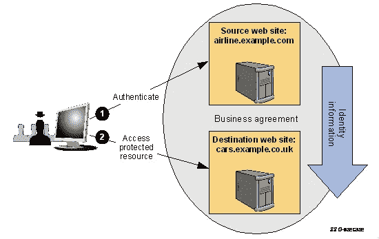
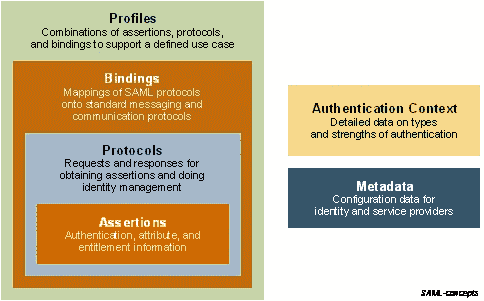
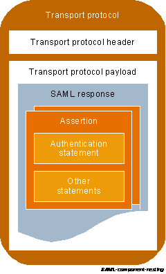
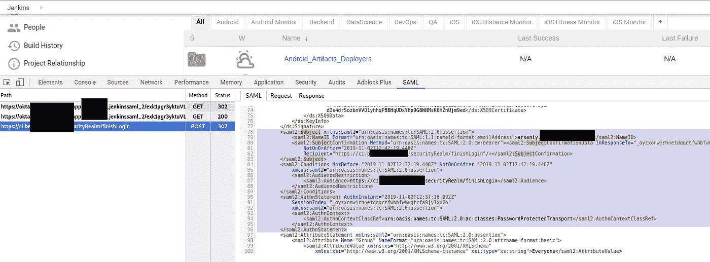
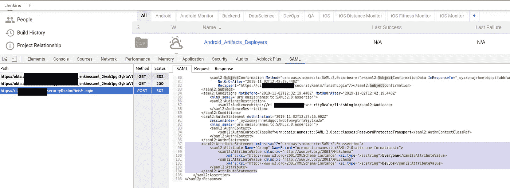
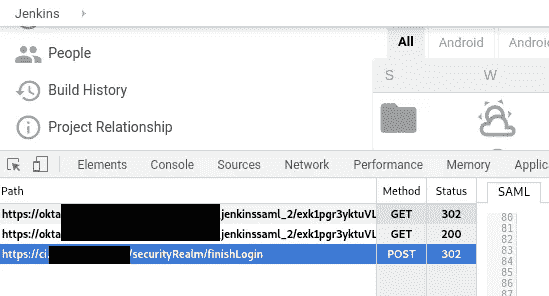
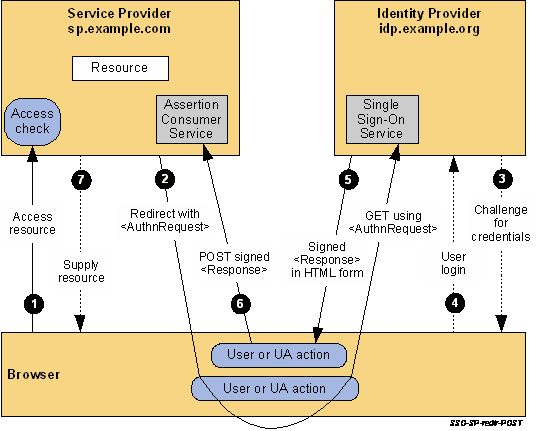
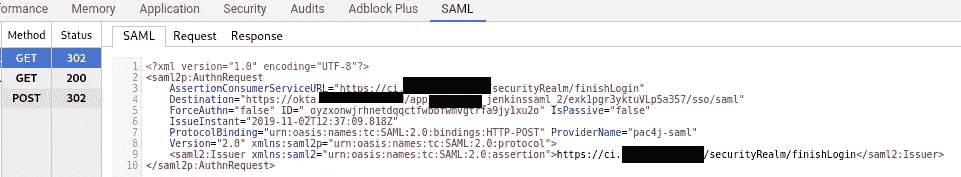
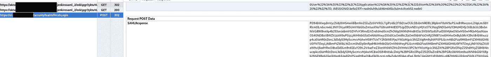
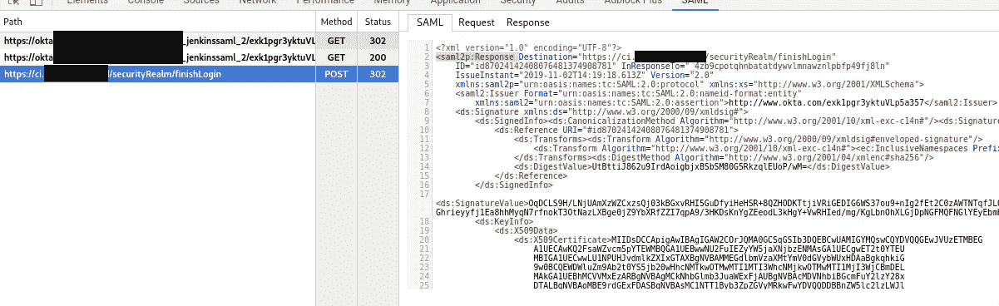

# 什么是:SAML——概述，它的结构，以及 Jenkins 和 Okta SSO 之间的请求跟踪

> 原文：<https://itnext.io/what-is-saml-an-overview-its-structure-and-requests-tracing-between-a-jenkins-and-okta-sso-811ef4b758d7?source=collection_archive---------4----------------------->


在为 Jenkins 配置 SAML SSO 的过程中，我遇到了一个问题，一些属性没有从 Okta 传递到 Jenkins 实例。

因此，在这篇文章中，我们将尝试弄清楚 SAML 的一般含义，简要概述它的架构和主要组件，并进行一些 SAML 请求跟踪/嗅探，以了解在使用 SAML SSO 的身份验证过程中到底传递了哪些数据。

由于有很多关于 SAML 的技术信息，我们将只仔细看看在 Jenkins <=> Okta 通信中使用的组件。

查看以下关于我们詹金斯-奥克塔整合的帖子:

*   [Jenkins:Okta SSO 和用户组的 SAML 认证](https://rtfm.co.ua/en/jenkins-saml-authentication-via-okta-and-users-groups/)
*   [Jenkins: SAML、Okta、用户组和基于角色的安全插件](https://rtfm.co.ua/en/jenkins-saml-okta-users-groups-and-role-based-security-plugin/)

在这篇文章中，我主要使用了 2008 年 3 月 25 日发布的安全断言标记语言(SAML) V2.0 技术概述，所以这里可能会有一些不准确的地方，但总体上看起来是正确的(我希望如此)。

关于 SAML 的其他有用资料有:

*   [SAML 2.0](https://en.wikipedia.org/wiki/SAML_2.0)
*   [SAML 响应(IdP - > SP)](https://www.samltool.com/generic_sso_res.php)
*   [什么是 SAML，它是如何工作的？](https://www.varonis.com/blog/what-is-saml/)
*   [SAML 认证如何工作](https://auth0.com/blog/how-saml-authentication-works/#L4--Add-your-Service-Provider-metadata-to-the-Identity-Provider)
*   所有的 SAML XML 规范都可以在这里找到:[http://docs.oasis-open.org/security/saml/v2.0/](http://docs.oasis-open.org/security/saml/v2.0/)

*因为这里有很多文字，最初是用俄语* *写在这个博客里的*[*——我为这里的错误/印刷错误道歉。请随意填写，对它们以及下述过程中的任何错误发表评论。*](https://rtfm.co.ua/what-is-saml-obzor-struktura-i-trassirovka-zaprosov-na-primere-jenkins-i-okta-saml-sso/)

*   [SAML:概述](https://rtfm.co.ua/en/what-is-saml-an-overview-its-structure-and-requests-tracing-between-a-jenkins-and-okta-sso/#SAML_an_overview)
*   [SAML 角色](https://rtfm.co.ua/en/what-is-saml-an-overview-its-structure-and-requests-tracing-between-a-jenkins-and-okta-sso/#SAML_roles)
*   [SAML 用例](https://rtfm.co.ua/en/what-is-saml-an-overview-its-structure-and-requests-tracing-between-a-jenkins-and-okta-sso/#SAML_Use_Cases)
*   [SAML 参与者](https://rtfm.co.ua/en/what-is-saml-an-overview-its-structure-and-requests-tracing-between-a-jenkins-and-okta-sso/#SAML_Participants)
*   [Web 单点登录用例](https://rtfm.co.ua/en/what-is-saml-an-overview-its-structure-and-requests-tracing-between-a-jenkins-and-okta-sso/#Web_Single_Sign-On_Use_Case)
*   [IdP 发起的 Web SSO](https://rtfm.co.ua/en/what-is-saml-an-overview-its-structure-and-requests-tracing-between-a-jenkins-and-okta-sso/#IdP-initiated_Web_SSO)
*   [SP 发起的 Web 单点登录](https://rtfm.co.ua/en/what-is-saml-an-overview-its-structure-and-requests-tracing-between-a-jenkins-and-okta-sso/#SP-initiated_Web_SSO)
*   [SAML 架构](https://rtfm.co.ua/en/what-is-saml-an-overview-its-structure-and-requests-tracing-between-a-jenkins-and-okta-sso/#SAML_Architecture)
*   [SAML 语句](https://rtfm.co.ua/en/what-is-saml-an-overview-its-structure-and-requests-tracing-between-a-jenkins-and-okta-sso/#SAML_statement)
*   [SAML 断言](https://rtfm.co.ua/en/what-is-saml-an-overview-its-structure-and-requests-tracing-between-a-jenkins-and-okta-sso/#SAML_asserts)
*   SAML 协议
*   [SAML 绑定](https://rtfm.co.ua/en/what-is-saml-an-overview-its-structure-and-requests-tracing-between-a-jenkins-and-okta-sso/#SAML_bindings)
*   [SAML 配置文件](https://rtfm.co.ua/en/what-is-saml-an-overview-its-structure-and-requests-tracing-between-a-jenkins-and-okta-sso/#SAML_profiles)
*   [SAML 元数据](https://rtfm.co.ua/en/what-is-saml-an-overview-its-structure-and-requests-tracing-between-a-jenkins-and-okta-sso/#SAML_Metadata)
*   [认证上下文](https://rtfm.co.ua/en/what-is-saml-an-overview-its-structure-and-requests-tracing-between-a-jenkins-and-okta-sso/#Authentication_context)
*   [SAML XML 结构和示例](https://rtfm.co.ua/en/what-is-saml-an-overview-its-structure-and-requests-tracing-between-a-jenkins-and-okta-sso/#SAML_XML_Constructs_and_Examples)
*   [SAML 组件的关系](https://rtfm.co.ua/en/what-is-saml-an-overview-its-structure-and-requests-tracing-between-a-jenkins-and-okta-sso/#Relationship_of_SAML_Components)
*   [saml 镀铬面板](https://rtfm.co.ua/en/what-is-saml-an-overview-its-structure-and-requests-tracing-between-a-jenkins-and-okta-sso/#saml-chrome-panel)
*   [断言、主语和语句结构](https://rtfm.co.ua/en/what-is-saml-an-overview-its-structure-and-requests-tracing-between-a-jenkins-and-okta-sso/#The_Assertion_Subject_and_Statement_Structure)
*   [属性语句结构](https://rtfm.co.ua/en/what-is-saml-an-overview-its-structure-and-requests-tracing-between-a-jenkins-and-okta-sso/#Attribute_Statement_Structure)
*   [SAML 配置文件](https://rtfm.co.ua/en/what-is-saml-an-overview-its-structure-and-requests-tracing-between-a-jenkins-and-okta-sso/#SAML_Profiles)
*   [网络浏览器单点登录配置文件](https://rtfm.co.ua/en/what-is-saml-an-overview-its-structure-and-requests-tracing-between-a-jenkins-and-okta-sso/#Web_Browser_SSO_Profile)
*   [Jenkins 和 Okta — SP 发起的单点登录:重定向/后绑定](https://rtfm.co.ua/en/what-is-saml-an-overview-its-structure-and-requests-tracing-between-a-jenkins-and-okta-sso/#Jenkins_and_Okta_SP-Initiated_SSO_RedirectPOST_Binding)

## SAML:概述

SAML 单点登录认证至少包括两个主要方——一个*服务提供者(SP)* 和一个*身份提供者(IdP)* ，过程本身由*信任建立*过程和实际的认证过程组成。

例如，在我们的例子中，Jenkins 实例将扮演*服务提供者*的角色，Okta 将是*身份提供者*。

简而言之，身份验证流程有以下流程:

1.  用户在浏览器中打开 Jenkins URL
2.  Jenkins 将这个用户重定向到一个 SSO URL，Okta
3.  Okta 对用户进行身份验证，并将信息发送回 Jenkins
4.  Jenkins 执行授权检查，例如通过基于角色的安全插件和配置的角色

为了传递关于用户的数据，SAML 使用一个*断言*对象，该对象包含所有必要的信息——用户用户名、其认证状态、组等，这取决于一个*断言*类型。

哪些*断言*在特定情况下是必要的——SAML 在其 *SAML 协议*中定义(将在本文的 [*SAML 协议*](https://rtfm.co.ua/en/?p=22524#SAML_protocols) 部分讨论)，SAML 协议通过 HTTP 或 SOAP 传递，这在 SAML *绑定*中定义(参见 [*SAML 绑定*](https://rtfm.co.ua/en/?p=22524#SAML_bindings) *部分*)。

反过来， *SAML 协议*、*绑定*和使用过的*断言*被合并到*概要文件(*参见 [*SAML 概要文件*](https://rtfm.co.ua/?p=22481#SAML_profiles) *)* ，例如——*Web 浏览器 SSO 概要文件(*参见 [*Web 浏览器 SSO 概要文件*](https://rtfm.co.ua/en/?p=22524#Web_Browser_SSO_Profile) *) 【T41)，或者 LDAP*

## SAML 角色

*   **身份提供者** ( *IdP* ):生成关于主体的*断言*(带有认证数据的对象或文档)的系统。例如，它可以是一个用户，IdP 为其生成一个断言，声明 John Smith 已成功通过身份验证，并且他具有诸如组和邮箱
    *身份提供者*也称为 *SAML 授权方* и *断言方*。
*   **服务提供者** ( *SP* ):使用来自 IdP 的信息的系统。在此期间，*服务提供者*依赖于*断言*的认证数据，但仍然可以应用额外的本地策略来确定用户在该 SP 内部拥有哪些权限
    *服务提供者*也称为*依赖方*，因为它们*依赖于来自从*身份提供者* ( *断言方【接收的断言的*信息*

## SAML 用例

在深入研究之前，让我们先简要概述一下 SAML 用例。

## SAML 参与者

在 SAML 认证信息交换过程中，至少包括双方——一个 *SAML 声明方*和一个 *SAML 依赖方*。

*SAML 断言方* —创建 *SAML 断言*的系统，以及相应的 *SAML 依赖方* —使用那些断言的一方。

当 *SAML 声明方*或 *SAML 依赖方*执行请求时，它成为 *SAML 请求方*方，第二方成为 *SAML 响应方*方。

在 SAML 身份验证过程中，流程中的参与者由 SAML 角色操作，这些角色描述 SAML 服务、SAML 协议和要使用的断言类型。

例如，对于 SSO，SAML 定义了 SAML 角色*身份提供者(IdP)* 和*服务提供者(SP)* ，如上所述。

另一个例子可以是*属性权限*角色，当一方在响应另一方*属性请求者*的属性请求时生成一个断言。

在大多数 SAML *断言*中，有一个*主题*需要被认证。这样的主体可以是用户或者例如专用服务器。

通常，一个*断言*包含类似于“*这是 John Smith，他有一个邮箱“john.smith@google.com”，并且他通过了密码认证机制*的认证。

反过来，服务提供商将自己决定它需要哪些信息，并根据它自己的本地访问策略来授权或拒绝 John 的访问。

## Web 单点登录用例

IdP 启动的 Web SSO

**多域 Web 单点登录** —最常用的 SAM Web SSO 用例之一。

在这种情况下，用户在某个网站上有一个登录会话(例如安全上下文)，例如*airline.example.com*。在某个时间点，用户会直接或间接地被重定向到合作伙伴的网站，比如说*cars.example.co.uk*，在本例中它扮演服务提供商的角色。一个 IdP 网站(本例中的*airline.example.com*为这个 SP(【cars.example.co.uk】T42)创建一个断言，确认这个用户是已知的、经过身份验证的，并且有一组属性。

因为 SP*cars.example.co.uk*信任它的 IdP*airline.example.com*——它为这个用户创建一个本地认证会话:



使用这种方法，用户首先在 IdP 上进行身份验证，然后才能访问 SP 上的受保护资源。

这种方式被称为 ***IdP 发起的 Web SSO*** 。

SP 启动的 Web 单点登录

一个更广泛的使用案例是 VIсe versa——当用户第一次访问服务提供商资源时，服务提供商资源将该用户重定向到 IdP 服务以对其进行身份验证。

用户在 IdP 上执行身份验证步骤后，该 IdP 将创建一个断言，SP 将使用该断言来检查用户在该 SP 上的权限。

这种方式被称为 ***SP 发起的 Web 单点登录*** 。

## SAML 架构

SAML 由一堆组装在一起的构建块“组成”,允许构建各种方式来使用 SAML。

这些组件描述了用于传递身份数据、认证信息和用户属性的机制。

## SAML 语句

如前所述，在 SAML 认证过程中，使用了包含一组*语句*的*断言*，这些语句包含关于用户的信息。例如，一个资产可以包含一个关于用户的*姓名* " *约翰·史密斯*"的声明，以及另一个关于其电子邮件"*john.smith@google.com*"的声明，并且他的*组*是 *DevOps* 。

SAML 描述了三种主要的语句类型:

*   *认证语句*:由成功认证用户的一方创建(例如，由 IdP 角色中的 Okta 创建)
*   *属性声明*:一组属性，例如用户的邮箱
*   *授权决策语句*:一组授权规则，例如该用户允许的动作

## SAML 断言

SAML *断言*包含关于被认证对象的数据(上面讨论的*语句*)。一个断言包含一个断言的主体(例如，一个用户)、该断言有效的条件以及一组语句。

SAML 断言结构和字段在 [SAML 断言 XML 模式](https://docs.oasis-open.org/security/saml/v2.0/saml-schema-assertion-2.0.xsd)中描述。

## SAML 协议

通常，断言是在收到 SP 请求的 IdP 端创建的。为了传递这些请求，使用 SAML 协议，该协议在 [SAML 定义的协议 XML 模式](https://docs.oasis-open.org/security/saml/v2.0/saml-schema-protocol-2.0.xsd)中描述了这些消息的结构和内容。

这些协议中的一些是*认证请求协议*、*单一注销协议*、*断言查询以及请求协议*等。

## SAML 绑定

通过 HTTP 或 SOAP 等底层网络协议传递这些消息的方式在 *SAML 绑定*中设置。

那些绑定是 *HTTP 重定向绑定*、 *HTTP POST 绑定*、 *HTTP 工件绑定、*等。

下面我们将对 *HTTP 重定向绑定*进行一个概述，它在 Jenkins < = > Okta 认证期间使用(参见本文的 [SP 发起的 SSO:重定向/POST 绑定](https://rtfm.co.ua/?p=22481#SP-Initiated_SSO_RedirectPOST_Bindings)部分)。

## SAML 配置文件

最后是定义 SAML 用例的 SAML 概要文件，例如 [*Web 浏览器 SSO 概要文件*](https://rtfm.co.ua/?p=22481&Web_Browser_SSO_Profile) 。

概要文件描述了 SAML 断言、协议和绑定的内容，这些内容将一起用于解决特定的业务需求。

还有*属性配置文件*，它与消息协议或绑定无关，但是描述了如何通过使用*断言*来交换关于属性的信息。

## SAML 元数据

元数据定义了在 IdP 和 Sp 之间分发配置信息的方式。例如，关于所使用的 SAML 绑定、参与者的角色(IdP、SP)、支持的属性、加密细节等，在它自己的 [SAML 元数据 XML 模式](https://docs.oasis-open.org/security/saml/v2.0/saml-schema-metadata-2.0.xsd)中。

## 认证上下文

在某些情况下，服务提供商可能需要有关 IdP 端使用的身份验证类型的更详细信息。

在这种情况下，使用一个 *SAML 认证上下文*，它被添加到在它们之间传递的*断言*的*认证语句*中。

除此之外，在 SAML 请求生成期间，SP 可以在其向 IdP 侧的请求中指定认证上下文，要求使用指定的特定机制来认证用户，例如，使用双因素认证来认证用户。

所有这些都可以用下一个方案显示:



## SAML XML 结构和示例

## SAML 组件的关系

SAML asserts 包含一个或多个*语句*，通过 HTTP、SOAP 或其他数据传输协议通过网络传递:



SAML-铬合金面板

为了进行 SAML 请求跟踪和解析，让我们使用 Chrome 的`[saml-chrome-panel](https://github.com/milton-lai/saml-chrome-panel)`扩展。

安装它，打开 Chrome 开发者工具，打开 Jenkins 选项卡，登录，让我们调查一下我们的 Jenkins 和 Okta 之间传输了哪些数据。

## 断言、主题和语句结构

让我们仔细看看断言、主语及其语句:



```
<saml2:Assertion ID="id5145226399860569827675102" IssueInstant="2019-11-02T12:37:19.440Z"
        Version="2.0" xmlns:saml2="urn:oasis:names:tc:SAML:2.0:assertion"
        xmlns:xs="http://www.w3.org/2001/XMLSchema">
        <saml2:Issuer Format="urn:oasis:names:tc:SAML:2.0:nameid-format:entity"
            xmlns:saml2="urn:oasis:names:tc:SAML:2.0:assertion">http://www.okta.com/exk1pgr3yktuVLp5a357</saml2:Issuer>
...
       <saml2:Subject xmlns:saml2="urn:oasis:names:tc:SAML:2.0:assertion">
            <saml2:NameID Format="urn:oasis:names:tc:SAML:1.1:nameid-format:emailAddress">arseniy@example.com</saml2:NameID>
            <saml2:SubjectConfirmation Method="urn:oasis:names:tc:SAML:2.0:cm:bearer"><saml2:SubjectConfirmationData InResponseTo="_oyzxonwjrhnetdqqctfwbbfwmvgtrfa9jy1xu2o"
                NotOnOrAfter="2019-11-02T12:42:19.440Z"
                Recipient="https://ci.example.com/securityRealm/finishLogin"/></saml2:SubjectConfirmation>
        </saml2:Subject>
        <saml2:Conditions NotBefore="2019-11-02T12:32:19.440Z" NotOnOrAfter="2019-11-02T12:42:19.440Z"
            xmlns:saml2="urn:oasis:names:tc:SAML:2.0:assertion">
            <saml2:AudienceRestriction>
                <saml2:Audience>https://ci.example.com/securityRealm/finishLogin</saml2:Audience>
            </saml2:AudienceRestriction>
        </saml2:Conditions>
        <saml2:AuthnStatement AuthnInstant="2019-11-02T12:37:16.992Z"
            SessionIndex="_oyzxonwjrhnetdqqctfwbbfwmvgtrfa9jy1xu2o"
            xmlns:saml2="urn:oasis:names:tc:SAML:2.0:assertion">
            <saml2:AuthnContext>
                <saml2:AuthnContextClassRef>urn:oasis:names:tc:SAML:2.0:ac:classes:PasswordProtectedTransport</saml2:AuthnContextClassRef>
            </saml2:AuthnContext>
        </saml2:AuthnStatement>
...
```

在这个 XML 片段中，我们可以看到一个*断言*示例和一个*认证语句*:

1.  在前缀为`saml:`的第一行，声明了 SAML *断言*(`<saml2:Assertion>`)及其生成时间(`<IssueInstant>`)
2.  接下来，使用 SAML 版本— `Version`
3.  创建此断言的 IdP 的唯一标识符— `<saml2:Issuer>`
4.  然后，在`<saml2:Subject>`块中，添加关于已认证主题的信息- `<saml2:NameID>arseniy@example.com</saml2:NameID>`以及他在电子邮件视图中的标识符- `Format="urn:oasis:names:tc:SAML:1.1:nameid-format:emailAddress"`
5.  在`<saml2:Conditions>`中，条件被指定为认为该断言有效，例如，时间范围(`NotBefore` и `NotOnOrAfter`)
6.  最后在`<saml2:AuthnStatement>`中，使用一种认证类型来认证该用户- ( `<saml2:AuthnContextClassRef>urn:oasis:names:tc:SAML:2.0:ac:classes:PasswordProtectedTransport</saml2:AuthnContextClassRef>`)

## 属性语句结构

下一部分是`<AttributeStatement>`:



```
...
        <saml2:AttributeStatement xmlns:saml2="urn:oasis:names:tc:SAML:2.0:assertion">
            <saml2:Attribute Name="Group" NameFormat="urn:oasis:names:tc:SAML:2.0:attrname-format:basic">
                <saml2:AttributeValue xmlns:xs="http://www.w3.org/2001/XMLSchema"
                    xmlns:xsi="http://www.w3.org/2001/XMLSchema-instance" xsi:type="xs:string">Everyone</saml2:AttributeValue>
                <saml2:AttributeValue xmlns:xs="http://www.w3.org/2001/XMLSchema"
                    xmlns:xsi="http://www.w3.org/2001/XMLSchema-instance" xsi:type="xs:string">DevOps</saml2:AttributeValue>
            </saml2:Attribute>
        </saml2:AttributeStatement>
...
```

除了上面讨论的关于认证的信息之外，IdP 还可以传递关于被认证对象的属性。

*   这里是`<saml2:Attribute Name="Group">`，使用 *SAML* *基本属性概要* ( `NameFormat="urn:oasis:names:tc:SAML:2.0:attrname-format:basic"`)，一个属性用两个值传递——一个组`<saml2:AttributeValue>Everyone</saml2:AttributeValue>`，另一个组`<saml2:AttributeValue>DevOps</saml2:AttributeValue>`

## SAML 配置文件

正如已经提到的，SAML 为不同的用例定义了一堆不同的概要文件。

在 Jenkins 和 Okta 的案例中，使用了最广泛使用的 SAML 认证类型 *Web 浏览器 SSO 配置文件*。

## Web 浏览器 SSO 配置文件

**Web 浏览器单点登录配置文件**定义了交换 SAML 消息以实现 Web 单点登录的流程，具体为:

1.  首先，它描述了一个认证初始化向量— *IdP 发起的*或 *SP 发起的*
2.  第二，必须使用哪些 SAML 绑定来通过网络传递这些消息

我们已经在上面讨论了 IdP 启动的和 SP 启动的角色，在我们的例子中，它将是 SP 启动的(用户打开 Jenkins URL，它从 IdP 请求这个用户认证)。

当用户第一次打开它的 Okta 帐户，然后点击那里的 Jenkins 图标，那么 Okta 将扮演一个初始化者的角色，并将生成一个 assert，该 assert 将被传递给 Jenkins 实例。

该配置文件定义的第二件事是用于在 IdP 和 SP 之间传递数据的*绑定*。

例如，可以使用 *HTTP 重定向绑定*、 *HTTP POST 绑定*或 *HTTP 工件绑定*将*认证请求*从 SP 传送到 IdP，并且可以使用 *HTTP POST 绑定*或 *HTTP 工件绑定*将*响应消息*从 IdP 传送到 SP。

这样，在同一个认证会话中，可以使用一种绑定类型发送*认证请求*，使用另一种绑定类型发送*响应消息*，这由 IdP 和 SP 配置描述。

分别有各种身份验证过程类型:

*   ***SP 发起的单点登录使用重定向绑定*** 将`<AuthnRequest>`消息从 SP 传递到 IdP，并使用 *POST 绑定*将`<Response>`消息从 IdP 传递到 SP
*   ***SP 发起的单点登录使用`<AuthnRequest>`消息的后绑定*** 和*工件绑定*来传输`<Response>`消息
*   ***IDP 发起的 SSO 使用 POST Binding*** 将`<Response>`消息从 IDP 传送到 SP；`<AuthnRequest>`根本不用

Jenkins 和 Okta — SP 启动的单点登录:重定向/后绑定

最后，让我们通过使用 **SP 发起的 SSO: Redirect/POST Bindings** 来详细说明 Jenkins 和 Okta 之间的整个 SSO 认证过程，这很容易通过 HTTP 方法从`saml-chrome-panel`输出中识别:



这个过程可以示意性地显示如下:



这里是一步一步的 SSO 认证:

1.  用户打开了一个*sp.example.com*页面(在这种情况下是 Jenkins URL)，并且他没有活动的登录会话(例如*安全上下文*)。SP 将保存用户请求的 URL
2.  SP 用 302 或 303 重定向代码向用户的浏览器返回请求，在 HTTP *位置*头中将指定一个 SSO 服务 URL，在 URL 变量`SAMLRequest`中将传递一个`<AuthnRequest>`请求体



1.  然后，浏览器将处理接收到的重定向，并向一个 IdP URL 发出 HTTP `GET`，在那里传递`SAMLRequest`
2.  SSO 服务检查用户是否已经有一个活动的登录会话，该会话必须符合从 SP (Jenkins)传入的`AuthnRequest`中所请求的身份验证类型。如果找不到这样的会话，那么用户必须首先在 IdP 上使用他的登录名和密码进行身份验证
3.  用户在 IdP 上被认证，其中为他创建了一个*安全上下文*
4.  IdP 单点登录服务生成一个 SAML `<Response>`，其中包含一个带有这个用户安全上下文的断言。SAML `<Response>`被放入名为`SAMLResponse`的 HTTP `FORM`中:



1.  `SAMLResponse`体在`<saml2p:Response>`元素中以 base64 编码传输:



1.  生成的 HTML 作为 HTTP 响应传递给用户的浏览器。
2.  浏览器将通过`SAMLResponse`
    向 SP (Jenkins)发出`POST`请求。SP 将检查< `Response>`内容，并将为此用户创建新的本地安全上下文
3.  最后一步，SP 可以执行一个额外用户的*授权*来检查这个用户在这个系统中有哪些权限。例如，詹金斯可以通过使用[基于角色的安全插件](https://rtfm.co.ua/en/jenkins-saml-okta-users-groups-and-role-based-security-plugin/)来授权用户

嗯，大体就是这样。

*最初发布于* [*RTFM: Linux、DevOps 和系统管理*](https://rtfm.co.ua/en/what-is-saml-an-overview-its-structure-and-requests-tracing-between-a-jenkins-and-okta-sso/) *。*