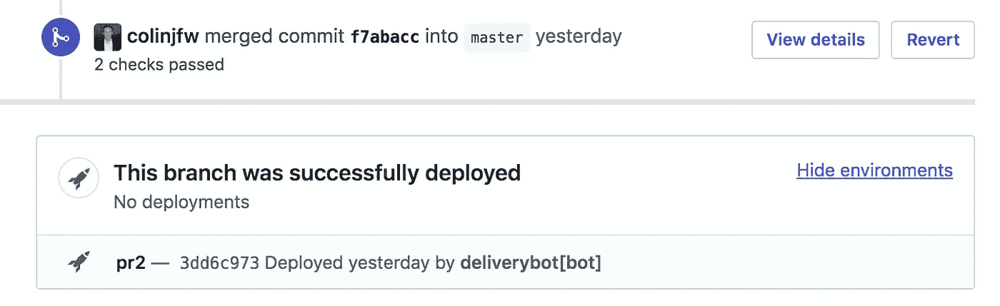

# 什么是 GitHub 部署 API？

> 原文：<https://itnext.io/what-is-the-github-deployments-api-638ce3088ed2?source=collection_archive---------3----------------------->

## 一个鲜为人知的工具，它可以将你的代码装载到 GitHub 中。

*这是关于构建*[*delivery bot*](http://deliverybot.github.io/)*的系列帖子的一部分，这是一个在 GitHub 上实现简单部署自动化的部署工具。*

大约一年前，我在 GitHub 中发现了一个有趣的特性，叫做部署 api。它看起来有点像 GitHub 文档中丢失的部分，与其他组件断开连接，不像 GitHub 中的几乎所有东西，我真的没有使用过它。在过去一个月左右的时间里，我花了一些时间研究部署 API，并希望为那些已经接触到它并想知道它是什么的人解释这一点。

GitHub 部署 API 实际上是一个用于**触发**部署的解耦 API。GitHub 不会尝试并实际为我们部署代码，它只是给我们一个事件，让我们自己的系统响应并实际部署代码。

工作流程似乎相对简单:

*   GitHub 用一些有效载荷开始部署事件。
*   我的系统从 GitHub 接收一个事件，并运行实际的部署。

当我发现这一点时，我觉得这很酷。我可以用更现代、更 API 驱动的东西取代我的 Jenkins 管道。此外，它通过使用 GitHub 作为所有需要发生的自动化的真实来源，将工具彼此解耦。推送事件决定何时构建我的代码，部署事件决定何时部署我的代码。

GitHub 还增加了一些新的用户界面，为特定的拉取请求提供了一幅部署图:

我们还可以通过访问项目上的“环境”选项卡来查看所有环境的部署列表:

## 完成图片

到目前为止一切顺利。然而，当我去连接我的集成时，我意识到这个故事缺少了一部分。GitHub 部署 API 的工作流程大致如下图所示。

这意味着部署的情况如下:

1.  *工具调用 GitHub API 来说“部署这个提交”*
2.  GitHub 向采取行动部署提交的系统触发 webhooks。
3.  当这个系统接收到 webhook 时，您的代码就被部署了。

第三步，我们可以使用 GitHub 动作，或者我们甚至可以启动一个 lambda 函数来监听 http 事件，以部署我们的代码。第二步全部由 GitHub 处理。这个故事的第一步就是这个问题。我们还没有一个标准化的工具包来调用这个 API。

我马上想到我在这里想要的几样东西:

1.  我想要一种在分支上发生推送事件时自动触发该 API 的方法。
2.  我想从 Slack (ChatOps)使用酷斜线命令部署的方式。
3.  我想在拉取请求中使用这些来部署短暂的环境。

还有机会在此基础上构建高级工作流。我们可以要求在进行部署之前通过某些状态检查。我们还可以监听部署成功事件，以触发对不同环境的其他部署。拥有一个 API 甚至驱动平台给了我们很大的权力和自由。

## 什么是 [Deliverybot](https://deliverybot.dev) ？

在研究所有这些工具时，我想要一个 GitHub 应用程序来填补这些空白。送货机器人是这些差距的答案。它允许您简单地点击 commit 并触发部署事件，让 GitHub 操作或您自己的工具处理事件并实际执行部署。试试看，让我知道你的想法！

*感谢您的阅读，敬请关注更多关于部署和开发运维的精彩文章。在 twitter 上关注我*[*@ colinjfw*](https://twitter.com/@colinjfw)*。*