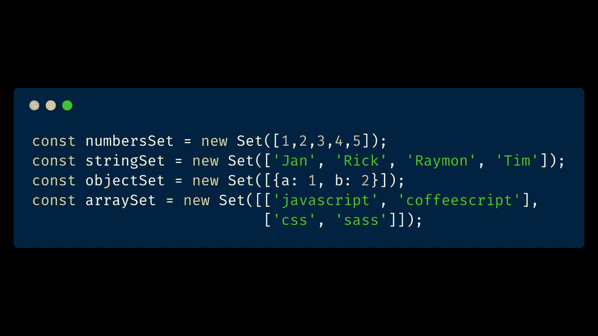

# ES2015 中的 JavaScript 集是什么，应该在什么时候使用？

> 原文：<https://itnext.io/what-is-the-javascript-set-in-es2015-and-when-should-you-use-it-d7e3b8048891?source=collection_archive---------0----------------------->



## ES2015 规范充满了新功能，这些新功能将不断引入所有新浏览器。这个系列是那些新事物中的一个。

我的第一个想法是，我可以用一个普通的`Array`！但是我会告诉你你可以用`Set`系列做什么。

# ES2015 套装是什么？

什么是`Set`，你能用它做什么？Mozilla 文档对此非常清楚:

> `Set`集合允许您存储任何类型的唯一值，无论是原始值还是对象引用。**来源:**[**Mozilla Docs**](https://developer.mozilla.org/en-US/docs/Web/JavaScript/Reference/Global_Objects/Set)

这个特殊的对象可以像普通对象一样存储各种值，但是它们必须是唯一的，重复的值将被过滤掉。

感谢 Addy Osmani 的推文，我发现了`Set()`！

从 JavaScript 数组中过滤出重复的值总是一件麻烦的事情，你需要遍历数组并自己找出答案，所以`Set`让这变得容易多了。😁

# 向集合添加数据

有几种方法可以将数据添加到`Set`集合中。

# 作为参数传递

这是一个将数据作为参数添加到`Set`集合的例子。

```
const numbersSet = new Set([1,2,3,4,5]);
const stringSet = new Set(['Jan', 'Rick', 'Raymon', 'Tim']);
const objectSet = new Set([{a: 1, b: 2}]);
const arraySet = new Set([['javascript', 'coffeescript'], ['css', 'sass']]);
```

# 通过 Add 方法添加数据

将数据传递到`Set`集合的另一种方式是使用`add()`方法。

```
const newSetObject = new Set();
newSetObject.add('Raymon');
newSetObject.add({a: 1, b: 2});
newSetObject.add(1).add(2).add(3).add(4).add(5)

// Result: Raymon, {a: 1, b: 2}, 1, 2, 3, 4, 5
```

# 使用 has 方法检查集合内部的值

`Set`集合有一个非常方便的方法来检查某个值是否在对象内部。

```
const numbersSet = new Set([1,2,3,4,5]);
const stringSet = new Set(['Jan', 'Rick', 'Raymon', 'Tim']);
const objectSet = new Set([{a: 1, b: 2}]);
const arraySet = new Set([['javascript', 'coffeescript'], ['css', 'sass']]);

numberSet.has(4); // true
numberSet.has(6); // false
stringSet.has('Raymon'); // true
objectSet.has({a: 1, b: 2}); // false
arraySet.has('css'); // false
```

`has()`方法在[原始值](https://developer.mozilla.org/en-US/docs/Glossary/Primitive)上工作正常，但是像`Object`和`Array`这样的非原始值就不起作用了。

非原始值不能链接原始值的原因有一个。原因是`has()`方法不仅比较值，还比较它与`===`操作符的引用。

如果你在一个变量中引用了`Object`或`Array`并在`has()`方法中使用了它们，那么结果将会和预期的一样。

```
const exampleObject = {a: 1, b: 2};
const exampleArray1 = ['javascript', 'coffeescript']
const exampleArray2 = ['css', 'sass'];
const objectSet = new Set([exampleObject]);
const arraySet = new Set([exampleArray1, exampleArray2]);

objectSet.has({a: 1, b: 2}); // false
objectSet.has(exampleObject); // true
arraySet.has('css'); // false
arraySet.has(exampleArray1); // true
arraySet.has(exampleArray2); // true
```

所以请记住，在对`Set`集合使用`has()`方法时，拥有对非原始值的引用是很重要的。

# 从集合中移除数据

向`Set`集合中添加数据非常简单，但是从集合中删除数据也一样简单。

# 用删除方法删除数据

如果你想删除`Set`集合中的一个项目，只需使用`remove`方法。

```
const numbersSetObject = new Set([1,2,3,4,5,6,7,8,9]);
numbersSetObject.has(2); // true
numbersSetObject.delete(2);
numbersSetObject.has(2); // false
console.log(numbersSetObject); // 1,3,4,5,6,7,8,9
```

# 用 clear 方法删除所有数据

但是如果您想从`Set`集合中移除所有数据，请使用`clear`方法。

```
const numbersSetObject = new Set([1,2,3,4,5,6,7,8,9]);
numbersSetObject.has(2); // true
numbersSetObject.clear();
console.log([...numbersSetObject]); // []
```

# 使用 size 属性检查项目的数量

像`Array`一样，您使用`length`属性检查项目的数量，而`Set`集合具有用于此的`size`属性。

如果我们检查前一个例子中的`Set`集合，大小将是 7。

```
newSetObject.size // 7
```

# 过滤重复的原始值

如果我试图将复制的原始值放入`Set`，只有唯一的值会保留下来。

```
const uniqueArray = new Set([1,2,2,2,3,4,5,5,6,7,9,9,8]);
console.log('uniqueArray: ', uniqueArray)
// unique: 1, 2, 3, 4, 5, 6, 7, 9, 8
```

# 过滤重复的非原始值

过滤掉重复值后，非原始值略有不同。文档非常清楚，`Set`本身不是比较对象，而是比较参考。

把它看作是用`==`操作符比较事物，但是用`===`操作符将比较引用和值。

如果我们试着把两个相同的物体放在`Set`中，用不同的参照物，那么就不会有问题。

```
const objectSet = new Set([{a: 1, b: 2}, {a: 1, b: 2}]);
console.log('objectSet: ', objectSet);
// objectSet: {a: 1, b: 2}, {a: 1, b: 2};
```

但是当我们放入相同参考的相等物体时会发生什么呢？

```
const demoObject = {a: 1, b: 2};
const objectSet = new Set([demoObject, demoObject]);
console.log('objectSet: ', objectSet);
// objectSet: {a: 1, b: 2};
```

希望你猜到了`objectSet`只包含 1 个`demoObject`。它清除重复的😁

# 在集合上循环

一个`Set`的好处是，你可以在一个`Set`上循环！

医生告诉我们更多关于这个场景的信息:

> 集合对象是值的集合。您可以按插入顺序循环访问集合中的元素。**来源:**[**Mozilla Docs**](https://developer.mozilla.org/en-US/docs/Web/JavaScript/Reference/Global_Objects/Set)

要循环遍历一个`Set`集合，我们可以使用`for-of`循环和附加到`Set`的`forEach`方法。

# 用 forEach 方法循环

使用`Set.forEach()`，您可以遍历`Set`集合中的所有数据。

```
const objectSet = new Set([{a: 1, b: 2}, {a: 1, b: 2}]);
objectSet.forEach(object => {
    console.log('Object: ', object);
})

// result:  
// Object:  {a: 1, b: 2}
// Object:  {a: 1, b: 2}
```

# 使用 for-of 循环方法的循环

使用`for-of`循环，我们有一些方法来循环遍历`Set`集合中的所有项目。

*   `entries()`
*   `keys()`
*   `values()`

```
const objectSet = new Set([{a: 1, b: 2}, {a: 1, b: 2}]);
for (let [key, value] of objectSet.entries())  {
   console.log(key);
}

// {a: 1, b: 2}
// {a: 1, b: 2}
```

唯一奇怪的是，`entries`、`keys`和`values`方法在`Set`上返回完全相同的东西。可能是因为`Set`和`Map` API 有很多共同点吧。

# 集合和地图的区别

`Map`和`Set`最大的区别在于`Set`看起来很像`Array`而`Map`看起来更像`Object`。

希望这篇文章对你有所帮助！如果你有问题，请在评论中告诉我。

# 阅读我的其他帖子

[](/dive-into-graphql-w-apollo-client-by-building-a-spacex-app-in-angular-8-20e703c93f0a) [## 通过构建 SpaceX 深入了解 GraphQL w/ Apollo 客户端🚀Angular 8 中的应用

### 我知道这听起来很奇怪，但是在带有 Apollo 客户端的 Angular 8 应用程序中使用 GraphQL 感觉就像…

itnext.io](/dive-into-graphql-w-apollo-client-by-building-a-spacex-app-in-angular-8-20e703c93f0a) [](/graphql-microservices-architecture-by-apollo-8b6eb557c5e2) [## 阿波罗的 GraphQL(微服务)架构

### GraphQL 太棒了！阿波罗围绕它制造工具，使我们的生活更容易，大规模使用它

itnext.io](/graphql-microservices-architecture-by-apollo-8b6eb557c5e2) [](/prevent-cannot-read-property-of-undefined-errors-with-javascript-classes-typescript-a388c1f0ef45) [## 用 JavaScript 类+ TypeScript 防止“无法读取未定义的属性”…”错误

### 每个开发 JavaScript 的人都会遇到类似“无法读取 undefined 的属性“…”这样的错误。有一个…

itnext.io](/prevent-cannot-read-property-of-undefined-errors-with-javascript-classes-typescript-a388c1f0ef45) [](https://medium.com/@devbyrayray/from-xhr-to-fetch-with-async-await-on-the-finish-line-b021de1d226b) [## 从 XHR 到终点的异步/等待取货

### 我已经有一段时间没有写我的最新帖子了。我一直在忙着探索一些与我的…

medium.com](https://medium.com/@devbyrayray/from-xhr-to-fetch-with-async-await-on-the-finish-line-b021de1d226b)