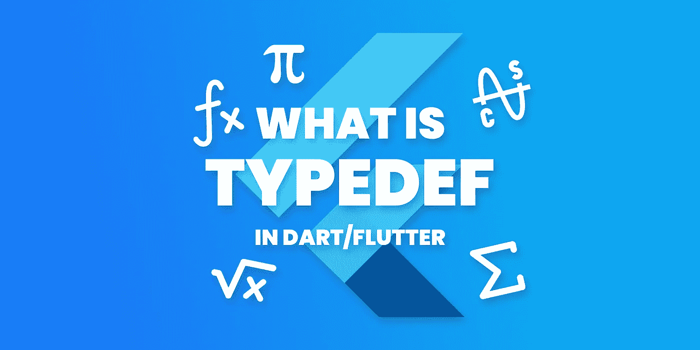
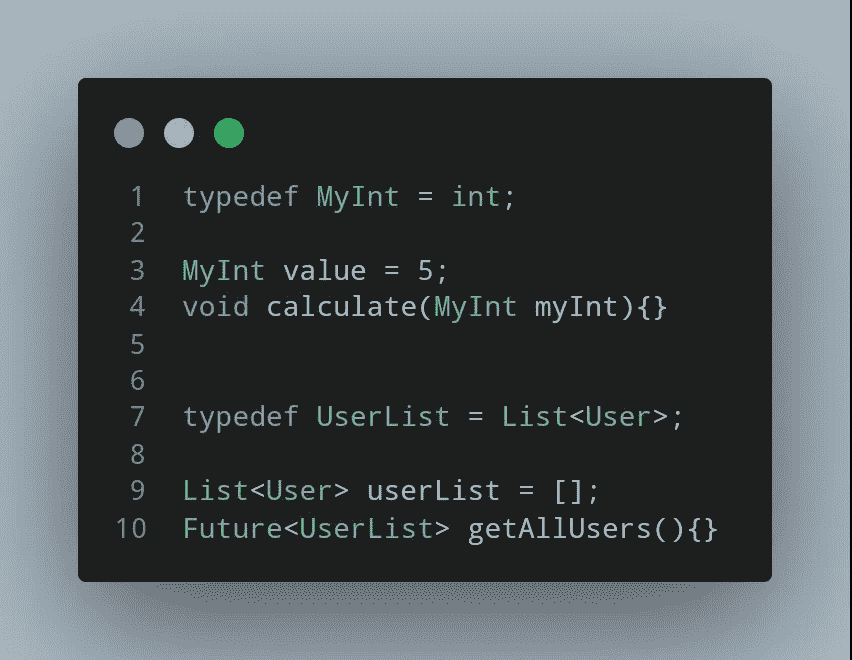
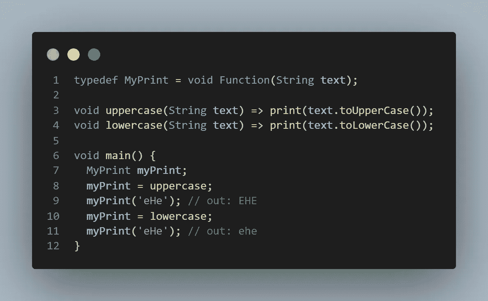
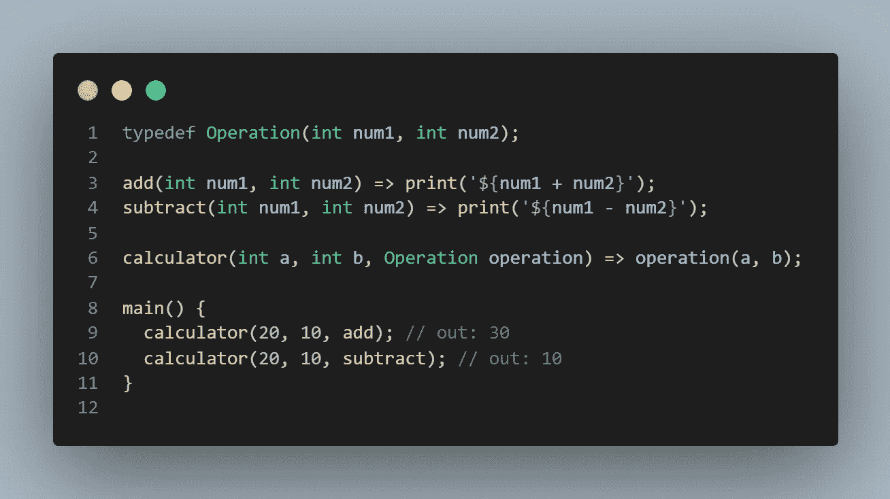
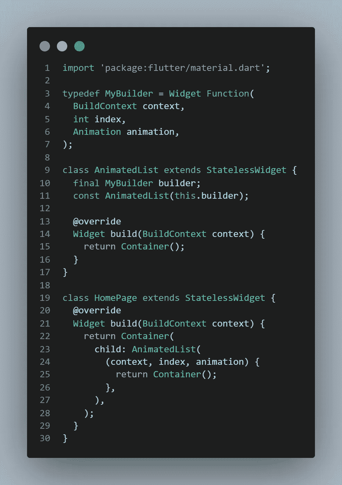

# 扑/镖中的 typedef 是什么？

> 原文：<https://itnext.io/what-is-typedef-in-flutter-dart-c297a921d6c2?source=collection_archive---------3----------------------->



## 只谈 typedefs

基本上， **typedef** 就是用户自定义的函数/数据接口。

这意味着你可以定义自己的数据类型和函数！

让我用有助于你更好理解的用法例子来解释

## 1.数据类型

您可以轻松地为您的场景定义特殊的数据类型



很简单，对吧？现在让我们来看看函数 typedefs！

## 2.功能

你也可以定义自己的函数！我将向您展示一些不同的用例，让您更容易理解

让我们从一个基本的例子开始，将文本转换成大写和小写字母，如下所示。



让我们更进一步，使用 typedef 作为参数。



现在，让我们看看如何在 Flutter 中使用 typedef！



当然，你可以随心所欲地使用 typedefs，这些例子只是我能想象的，你可以用不同的方式使用它们。

## **注意:你也可以使用普通的类型定义，比如；**

```
typedef Ehe = List<T> Function<T>(T);
```

# 感谢您的阅读！

我试图创造尽可能简单的例子。希望你喜欢。

如果你喜欢这篇文章，请点击👏按钮(你知道你可以升到 50 吗？)