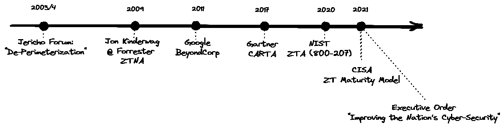
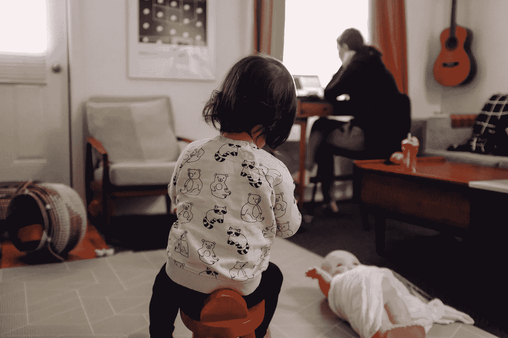
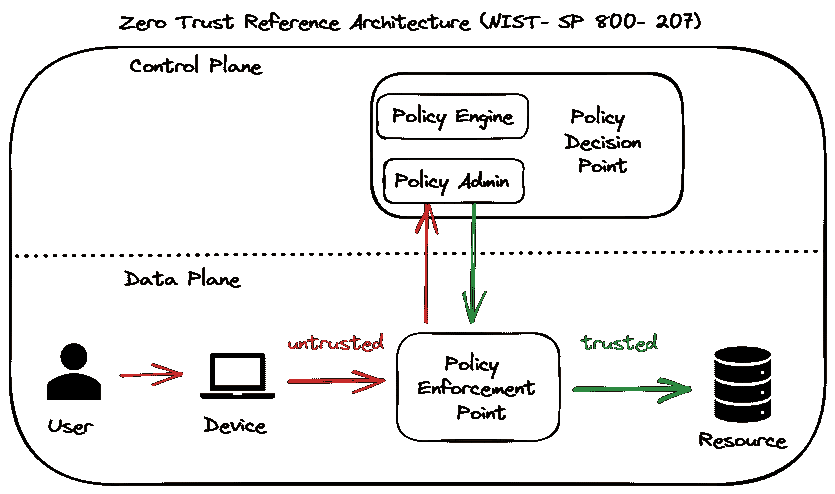

# 什么是零信任，为什么它是旧闻

> 原文：<https://itnext.io/what-is-zero-trust-and-why-its-old-news-deed1cb1a2d7?source=collection_archive---------2----------------------->

## 软件架构/安全性

## ZTNA 的快速技术概述，超越术语

菲尔·肖在 [Unsplash](https://unsplash.com/s/photos/clone-trooper?utm_source=unsplash&utm_medium=referral&utm_content=creditCopyText) 上的照片

您是否正在寻找零信任网络架构的技术概述，其中包含实际的具体解释，而不是没完没了的流行词汇和营销口号？

当我证明零信任范例、原则甚至架构早于它们被接受的历史时，我们将在这里讨论这个问题，然后深入探讨。我们将回到 1995 年，看看视频安全行业如何为付费电视创建一个零信任模型，这一模型今天仍可以借鉴，以设计更安全的零信任系统，解决我们当前面临的共同安全挑战。

您将看到的零信任的标准历史显示了这种向无边界安全转移的第一篇论文，它出现在杰里科论坛 2003-2004 年关于“去边界化”的工作中。

零信任时间线

在本系列的[第二部分](https://medium.com/p/f51f4e41f9e/)中，我将证明零信任方法至少可以追溯到 1995 年，随着付费电视的出现。

1995 年有条件接收？这和零信任有什么关系？

但是在我们对约会变得挑剔之前，我一直坚持的零信任到底是什么？

要了解零信任，我们需要了解在零信任出现之前*存在了什么，零信任*改变了*。*

**预零信任安全模型**

曾几何时，在企业行业，那是一个美好的世界。我们相互信任。我们有信念。

我们的用户是公司员工，他们从公司拿工资，他们想继续从公司拿工资。金钱让世界转动。所以很明显，我们开发人员、系统设计人员、架构师和安全研究人员可以信任他们。

挑战是外面的大坏狼。竞争。黑客。敌国政府。我们把他们都称为“攻击者”，在威胁建模中，我们把他们称为“恶意的马洛里”和“窃听夏娃”。

我们在我们的系统周围竖起了栅栏，以无状态和有状态防火墙、网关和 dmz 的形式。

一些组织更进一步，使用没有连接到公共互联网的空中网络，完全切断了与外界的联系。

我们的全部重点是确保只有“好人”才能进入我们的系统。我们关注访问控制、身份和访问管理(IAM)；识别和验证用户，然后授权他们访问系统。我们采用了 LDAP 等协议，以及后来的 SAML 和 OAuth 2.0/OIDC。

这种模式的重点是网络安全，通常被比作一座城堡，周围有护城河，守卫放下吊桥，只有授权的访客才能进出。但我更多地看到的是停车场入口处的交通高峰，因为进入是受控制的——但停车场内是免费的，每个人都可以自由离开，带走 T2 的任何东西。

由[巴鲁克·怀斯曼](https://www.instagram.com/baruch.photographer/)拍摄

**零信任动机**

这给我们带来了网络安全模式的第一个缺点，如果(或者更准确地说是“当”)恶意攻击者获得了访问权限，他们通常可以提升权限并使用横向移动来访问系统中最有权限的区域，一旦他们这样做了，他们也可以轻松地将信息发送到系统之外。此外，2013 年，每个组织的泡沫都破裂了，当时斯诺登公布了机密信息，打破了我们对所有员工应该有多信任的幻想。

随之而来的是云，即天空中的低语(或云服务提供商(CSP)上的虚拟机)，这意味着企业需要担心其进出流量，保护其虚拟私有云(VPC)，当然，企业不想将所有鸡蛋放在一个篮子里，因此出现了多云以及保护 CSP 到 CSP 流量的有趣任务。

别忘了 Covid-现在是 2019 年，我们都开始在家工作。

在家工作-在我的梦里..(Peggy Anke 在 [Unsplash](https://unsplash.com/s/photos/digital-nomad?utm_source=unsplash&utm_medium=referral&utm_content=creditCopyText) 上拍摄)

好吧，JK。这是我在家里工作的经历:

在家工作——事实上..(图片由 [charlesdeluvio](https://unsplash.com/es/@charlesdeluvio?utm_source=unsplash&utm_medium=referral&utm_content=creditCopyText) 在 [Unsplash](https://unsplash.com/s/photos/working-from-home?utm_source=unsplash&utm_medium=referral&utm_content=creditCopyText) 上拍摄)

但不管怎样，你都不在办公室。您可能正在通过 VPN 连接到您组织的服务器，但是您是否考虑过您家庭路由器和 Wifi 的安全性？您使用的是贵组织提供的 PC 还是 BYOD 移动设备？

所以我们总结一下:

**零信任的 3 个主要动机:**

1.网络安全模型中的漏洞

2.公共云的使用

3.混合劳动力和自带设备

现在，我们终于准备好解决一个重大问题——什么是零信任？感谢您的耐心！

**零信任定义**

简短的回答是**零信任是“无边界”安全**。

一个稍微长一点的正式答案，由 NIST 在其[特别出版物 800–207](https://nvlpubs.nist.gov/nistpubs/SpecialPublications/NIST.SP.800-207.pdf):*中提供:“零信任(ZT)是一组不断发展的网络安全范式的术语，这些范式将防御从静态的、基于网络的边界转移到关注用户、资产和资源。”*

我更喜欢帕洛阿尔托网络公司的定义:

*“零信任是一种网络安全的战略方法，通过消除隐性信任和持续验证数字交互的每个阶段来保护组织。”*

这里的理念是不再有任何隐含的信任，也就是没有违约、不合理的信任。换句话说，要多疑。有罪，直到被证明是无辜的。

**零信任原则**

信任不再是布尔型的是/否。相反，ZTNA 引入了“信任级别”，即我在多大程度上信任设备 Y 上的用户 X 在时间 t 执行操作 Z。请注意这里的额外限制，这是 ZTNA 主要的“权限限制”，它一直存在于安全领域，但现在获得了更多的关注。除了网络安全 IAM 方法对用户进行身份验证和授权，ZTNA 还要求对用户的*设备*进行身份验证和授权。因为也许用户的凭证被盗了？或者用户是合法的，但是他们的设备不安全？我们还限制访问时间。永久访问键在 ZTNA 模型中是一个大禁忌。授权模型应该使用基于时间的过期和更新要求，而不是依赖撤销来识别恶意行为者(这是有道理的，因为成功实现撤销设计(如许多安全协议描述的 CRL 和 OCSP)具有难以置信的挑战性)。

让我们总结一下零信任原则:

1.每一个用户、设备和网络流都会不断地进行身份验证和授权。

2.最低特权——限制用户和实体只能访问他们需要的资源。

3.最少访问——不要让任何实体访问他们不需要访问的任何服务。这也称为微分段，因为我们将网络划分为段。

这不是网络接入的全有或全无。没有——你在公司内网，你用了我们的 VPN，你登录了——玩得开心。将细菌在空旷拥挤的体育场中的传播与人们被分成“胶囊”时的传播进行比较。(后 covid 我们都是流行病学专家)

4.最少曝光——这里的重点是*我们试图保护的东西。—我们最珍贵的数据，我们最敏感的流程。*

*通常这是数据，而不是逻辑/代码/知识产权——尽可能少地暴露这些数据，最好使用强加密技术来保护。*

5.凝聚力——整个系统被持续监控和分析。

所有实体、所有系统行为——对其进行分析，当发现异常时，系统应该会注意到。这将始终需要自动化和分析，通常还需要机器学习，以便识别有效和可疑的用户行为。内聚通常是引入遗留系统的最具挑战性的方面。

**ZTNA 参考架构**

NIST [提出了 2020 年的参考架构](https://nvlpubs.nist.gov/nistpubs/SpecialPublications/NIST.SP.800-207.pdf)。他们的目标是为 ZTNA 系统架构创建一组逻辑组件和一种通用语言。

我们在这里看到用户及其设备的身份验证，策略执行点(PEP)是针对每个资源的，而不是整个系统的单一入口点。基于控制平面的策略引擎将基于外部输入(例如分析)以及内部业务逻辑来建立信任级别，并且如果要授权访问，则策略引擎将通常使用密码和限时访问令牌来提供访问，PEP 可以使用该令牌来访问资源。

**缺什么？又名平行宇宙**

所以我们有零信任哲学，零信任原则，甚至零信任参考架构。

尽管如此，NIST 强调了设计和建造 ZTNA 系统方面一个重大挑战。这种模式是新的，很少有系统完全适应这种模式，所以我们在前进中学习。

这就是我不同意他们的地方。

因为在另一个行业，我们从未信任过我们的用户。

有一个行业我们总是疑神疑鬼。

我们总是假设，如果观众可以轻松地免费获取内容，他们就会这么做。我们总是担心那些热衷于分享内容以获得美元报酬的人。

这就是视频安全行业。

接下来的 [Part 2 - **为什么视频安防原来是零信任体系**](https://medium.com/p/f51f4e41f9e/) **。**