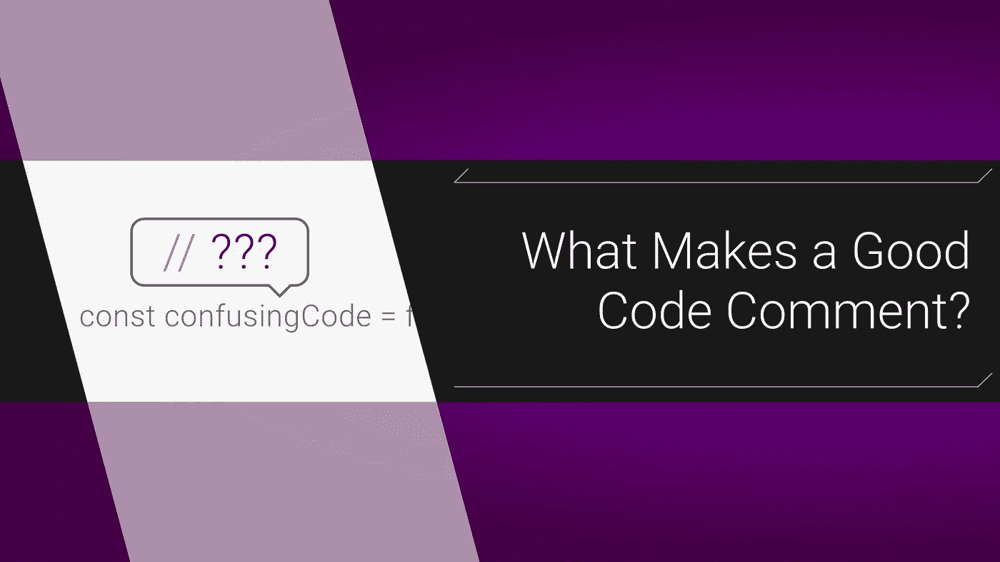

# 什么是好的代码注释？

> 原文：<https://itnext.io/what-makes-a-good-code-comment-5267debd2c24?source=collection_archive---------5----------------------->

## 注释如何澄清代码不能澄清的事情



“如何给代码添加注释”是一个… *激烈的*话题。这不完全是“制表符对空格”，但也很接近。一些工程师仅仅将注释的出现视为糟糕代码的标志。我觉得那有点苛刻，那我们就跳进火焰大战，谈谈什么才算好评论，怎么写好评论。

# 什么与为什么

对注释的一个常见批评是它们是多余的:

```
// add students to honor roll if they have a high grade
**students**.forEach(**student** => {
  if (**student**.grade > **honorRoll**) {
    **honorRollStudents**.push(**student**) 
  }
} 
```

一旦你在阅读代码方面变得更好，这些类型的注释就变得没用了。我觉得不好的评论指出*是什么代码，好的评论解释*代码为什么存在。*一个方便的经验法则是:**注释应该*只添加*来回答代码不能回答的问题。**如果你不困惑于一段代码在做什么，而是困惑于它为什么在那个时刻做这件事*，*那么应该添加一个注释。*

# *令人沮丧的真实世界的例子*

*假设我们正在调试用户迁移代码:*

```
*if (**user**.default_name) *delete* **user**.default_name;
***await*** **Database**.User.migrate(**user**);*
```

*为什么我们要删除`default_name`？我们的第一反应是在回购协议中搜索其他的`default_name`实例，但是我们什么也没找到。我们问了我们的团队，但是没人知道，写这个的人也辞职了。仅仅是因为我们现在正在使用更新的`username`字段吗？我们被迫去 Slack 询问是否有人使用它。原来，订阅团队有一个遗留系统，使用`default_name`的存在来确定用户是来自`v1`还是`v2`。因为我们要迁移到 v2，所以我们删除了该字段。*

# *添加解释*

*既然我们知道为什么要这样做，我们可以把它放入一个有描述性名称的函数中:*

```
*const **makeSureUserAppearsNewToSubscriptionAPI** = (**user**) => {*
```

*但那很笨重。一句评论就完美了:*

```
**// subscription API needs this to be null for v2 users*
if (**user**.default_name) *delete* **user**.default_name;*
```

*这并不漂亮，但它在没有其他人帮助的情况下立即解释了情况。如果未来的开发人员有问题，他们知道该找谁。*

# *“那是糟糕的代码”*

*我已经能感觉到怀疑者在说，如果系统设计得更好，如果有更好的知识共享，或者如果有真正的文档，这个评论就不需要了。你知道吗？他们完全正确。*

*…如果我们生活在编码教科书中。在生产中，代码很快被推出，遗留软件做奇怪的事情，内部文档总是处于低优先级。对我来说，评论是一个笨拙的解决方案，但是笨拙的解决方案比依赖 Slack 要好。然而，这并不意味着我们应该过度评论。*

# *少即是多*

*我喜欢评论不代表我喜欢很多评论。如果你发现自己写的东西听起来更像有用的提示或简洁的解释，你应该把它们放到你的团队文档中，或者至少放到你的个人笔记中。*

## *保持简短*

*评论是有争议的，所以越短越好:*

```
**// we need this to set up the user's permissions for v3 auth method*
# should be
*// set user permissions for updated v3 auth**
```

## *较长的注释应该格式化*

*如果你需要多行代码，试着把这段混乱的代码分解成一个函数，然后添加一个 [jsDoc](https://devdocs.io/jsdoc/about-getting-started) 风格的注释:*

```
*/**
 * *To support a 3rd party integration we must
 * ping their servers and wait for OK signal
 * @***param**{**object**}***user*** *- user data sent after OK*
 */
const **createViaIntegration** = (**user**) => {*
```

*不一定是那种风格，但是如果你使用的话，很多 IDE 会自动补全。*

## *注释不能修复糟糕的代码*

*如果你发现代码你真的不明白它在做什么，可能是时候重构了。多行解释是一个很好的帮助，但是需要注释来理解其语法的混乱代码通常是一种求助。注释应该解释实现，而不是机制。*

# *最后*

*帮助他人理解你的代码是成为一名优秀开发人员的关键部分。评论应该只是你腰带上的另一个工具。我希望这有所帮助，如果你有任何你喜欢使用的评论惯例，请在下面评论！*

*大家编码快乐，*

*麦克风*