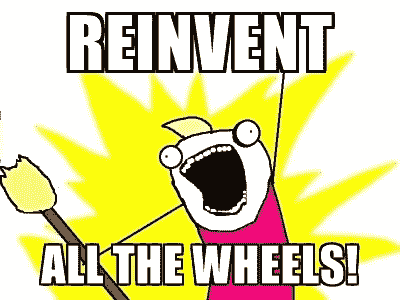
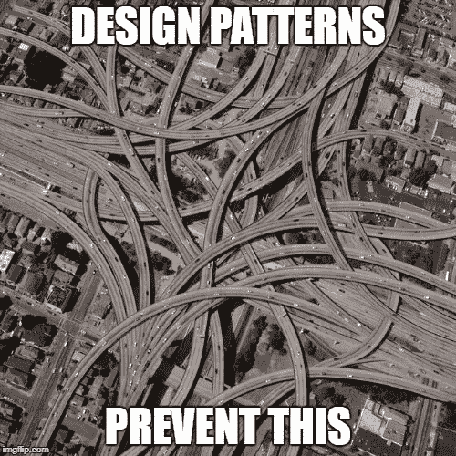
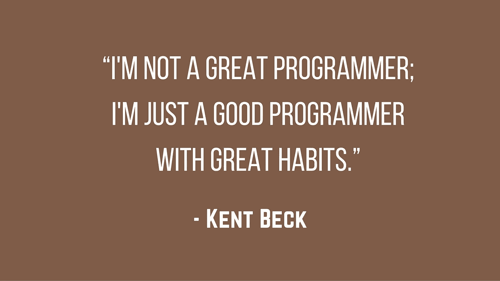

# 是什么造就了一个伟大的软件工程师？

> 原文：<https://itnext.io/what-makes-a-great-software-engineer-d6e10761fe55?source=collection_archive---------1----------------------->

了解算法和数据结构会让你得到这份工作。但是要变得伟大，你需要更多。

许多程序员进入这个行业时都具备算法和数据结构的必备知识，不管他们是直接从大学、网络课堂还是训练营来的。不幸的是，仅仅这些技能——尽管它们很棒——并不能让你在工程领域获得成功。

在这个行业中有龙，经过 20 年的救火，我想我可以认识到使一个伟大的开发者脱颖而出的特征。这与其说是你对苹果或 Linux 的偏好，不如说是人们是否能与你合作。

相信我，不会的。

## 你能和别人一起很好地工作吗？要诚实。

如果你选择这个职业是为了避开其他人，我有一个坏消息——它不是那样工作的。尽管电视和好莱坞电影赞美孤独的黑客一生，但现实是 ***所有*开发*所有*公司都发生在团队**中。即使你是创业公司的 1 号员工，也会有其他人来找你。

出于各种原因，伟大的工程师不会在真空中工作，但最重要的一个原因是，他们的代码很少能很好地集成，除非他们能与其他人很好地合作。由于大学里的大多数学习或训练都是个人努力，当你第一次开始工作时，可能会有一个可怕的惊喜。编码不仅仅是一个人的活动。

你越早开始与他人一起编写代码，你就会变得越好。你可以从开源项目上的 GitHub 中提取代码开始，贡献并从社区中获得反馈。在培训中，参加团队挑战和代码评审是获得一些经验的好方法。

两个开发人员*从不会*以同样的方式看待问题及其解决方案，所以你将学习如何评估不同的方法，如果你发现了别人的盲点，如何争取你的意见。三个开发人员可能有三个以上的解决方案，并从那里升级。你认为为什么 JavaScript 框架每五分钟就出现一次？

这一点对于任何想成为开发团队领导或架构师的人来说都是至关重要的。团队领导通常擅长让团队凝聚在一起，但是架构师必须弄清楚如何将大量的工作分解成小块的工作。这两种技能都来自于在项目的不同部分与其他开发人员合作，以及学习如何将代码整合在一起。

不要把这看作是一个巨大的麻烦。抓住指导和被指导的机会。

解雇任何使用共享空间的人。暗示仇恨邮件在 3…2…

## 知道你的目的。提示:你正在构建产品。

对于智力挑战解谜来说，软件是一个很有吸引力的行业。如何优化算法，最大限度地减少使用的代码量，以及如何编写通用的代码以实现代码重用，这些都是程序员困扰的挑战。啊，我喜欢早上 1 点的味道。美好时光。

问题是，在现实生活的工作中，这并不是你得到报酬的原因。将这些任务视为爱的劳动的工程师会错过更大的图景，无法交付成果。

在一份有报酬的编程工作中，我们需要开发解决客户问题的工作软件，按时、按预算、*每时每刻*交付。如果你想重构 stdlib，在公司工作可能不是最适合你的地方。

Hulu 重新设计发布会。

这意味着使用第三方库，次优的方法，有时发布难看的代码来完成工作。*这不是异端。*我们是来生产的，如果没有软件发布，没人会关心算法是否快。

这并不是说没有有趣的挑战——从事软件工作仍然是最有成就感的工作之一。但是计算机科学是关于权衡的，最常见的现实世界中的权衡是在编写合理的足够好的代码和继续以可预测和有效的方式发布软件之间。让我们付抵押贷款吧，伙计们！

## 不要爱上工具。

在大学里，我学习了 C++，并认为这是最好的，也是唯一需要的语言。

在我的第一份工作中，我发现 C++做任何事情都要花很长时间，并被告知使用 VB6，这真的就像看一场赢得米其林星级的冷冻晚餐。过了一段时间，我发现了 PHP，并认为它是我需要的最好也是唯一的工具。

然后 Python 就发生了。然后是 JavaScript！而现在 Node 是最好的，也是唯一的切片面包类型。

事实上，你的第一门编程语言*是你的初恋，但它不是你将要与之结婚并安定下来的语言。你会对围棋着迷，对前途无量的 JavaScript 库醉醺醺地一夜情，但你会用更可靠、更无聊的东西来付账，比如 Java。*

另一个事实是，您选择的工具有一个短暂的生命周期，并且在您的职业生涯中会被多次替换(或者一夜之间，如果您是一个 JavaScript 人)。变量、循环、条件和对象的基本原理没有太大变化，但是语法、开发环境和构建工具非常灵活。拥抱这种不断变化的语言和框架的诀窍是适应，而不是停留在你最喜欢的语言和框架上。

在公司软件环境中尤其如此，这可能是一个乱糟糟的失去希望的科学怪人的荒地。在那里，公司以同时成为全 Java、全微软或其他公司而自豪。这种技术部落主义限制了构建产品和创建任何类型的适应未来的基础设施的潜在效率。

## 当你能偷的时候，不要重新发明轮子。

(我想[西蒙·沃德利](https://twitter.com/swardley+)说过这句话，但我偷了它)。

许多软件的最大挑战归结为 CPU、电源、内存、电池、带宽和存储的固有限制。他们总是在架构决策上强迫开发者的手。尽管 IT 资源越来越丰富，但这些权衡一直存在，并将一直存在，除非物理定律得到重大改写。

肮脏的秘密是，许多处理这些问题的旧模式仍然具有非凡的价值。所以不要在思维上从一张白纸开始。你会发现你今天试图解决的问题已经被别人解决了。

设计模式是非常强大的通用解决方案。它们也经常未被充分利用。好的框架将这些模式扩展成您自己的应用程序的可用框架，因此您甚至不必太费力地思考。你可以用这些来加速你的发展，而不是一遍又一遍地解决老问题。最重要的是，**它们还能让你在工作中看起来超级聪明。**

城市大小的交通圈是显而易见的选择。

这在云中非常明显，那里的工具通常是建立在成熟的设计模式之上的。明智的开发人员将难题——如加密、安全、规模和同步——推至云解决方案，这些解决方案拥有您可以使用的优雅且可维护的工具。你不可能在解决这些问题上做得更好，所以把你的努力集中在你能增加价值的地方。

## “不是我的问题”才是问题所在

令人欣慰的是，开发团队中已定义的角色开始变得越来越模糊。您会在不同的团队中发现不同的专长——网络、质量保证、前端、后端等等——但是在更大的软件工作中，这产生了推卸责任的倾向。

如果不指名道姓，开发人员通常会在代码中留下明显的 bug，因为他们知道 QA 团队会找到(并修复)它们，或者依靠安全工程师来填补他们应该自己修复的漏洞。前端工程师将把工作推到后端，因为这使他们的代码更快，生活更轻松，即使逻辑不属于那里。

这种专业化制造了分歧，并把问题推向了下一步，而不是专注于一起工作来尽可能地构建最好的产品。更糟糕的是，当失败发生时，这些分离会造成相互指责，将责任推卸给链条中的下一个人。

当与快速发布周期混合在一起时,“不是我的问题”的心态会严重失败。这是软件开发旧时代的遗留物，在旧时代，团队更像一条装配线，而不是一个协作小组。

今天，成功的编码团队根据需要交叉培训人们来承担角色。开发运维、安全和质量保证的日常挑战由自动化和构建流程处理，团队一起进步和学习所有技能。

最重要的是，通过这种方式的合作，我们承认产品的任何问题都是我们解决的问题。的确是库姆巴亚。

## 好习惯来自经验。

当有机会在商业环境中展示你的编程技能时，一些最聪明的人可能会在从学生到专业人员的飞跃中失败。

编写优秀的代码来生产高质量的软件是一门需要多年才能掌握的手艺。这是一份回报丰厚的职业，需要不断的学习和敏锐的解决问题的能力。掌握这些特质会给你最好的机会去创造伟大的软件，领导你的团队，向你周围的聪明人学习。

别忘了注释你的代码。