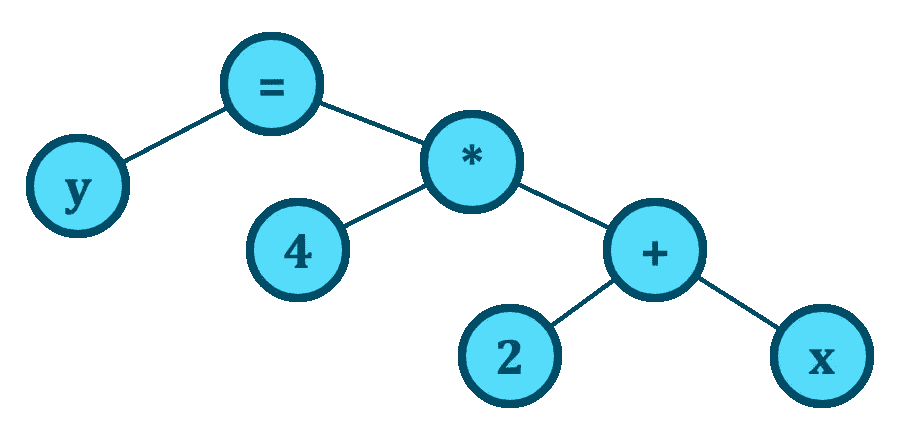

# LISP 的独特之处是什么？

> 原文：<https://itnext.io/what-makes-lisp-unique-8a0576b42293?source=collection_archive---------1----------------------->

## 探索 LISP 的同象性特征，以及它如何使 LISP 更像是一种语言


医学博士康拉德·巴斯基设计的外星人口齿不清吉祥物

T he LISP 编程语言及其衍生出来的 Scheme、Clojure 等，有一个特性让我很着迷，叫做同象性。

这意味着在 LISP 中代码被表示为数据，因此可以像数据一样被操作和修改。要真正体会这样一个简单语句的深刻含义，需要阅读一本书并编写自己的 LISP 代码。你可能没有时间做这些，所以让我通过这篇短文给你一点提示或直觉。

理解 LISP 总是从理解 LISP 构建的核心数据结构——链表开始。理解一种语言依赖于理解一种数据结构，这似乎有点奇怪，但是请耐心听我说。

下面的 LISP 代码定义了一个包含一个整数、一个字符串、一个布尔值、一个浮点数和一个字符的链表。注意 LISP 表达式是如何以括号开始和结束的。LISP 因大量的括号而臭名昭著。

```
(list 43 "hello" true 2.5 'c')
```

请注意，为了使 LISP 代码示例更容易阅读，我冒昧地对布尔值和字符使用了类似 C 的语法。标准 LISP 将使用不同的语法。

链表由节点组成，其中每个节点可以指向另一个节点。它还有一个储存数据的单元格。但这也可以是指向另一个列表的指针。因此，我们可以有列表的列表，这些列表也可以是列表的列表。

```
(list 34 (list "hello" true) (list 2.5 'c'))
```

因此，可以用这种方式表达复杂的数据结构和树结构。如果你对编译器的工作原理有所了解，你就会知道当它解析代码时，会产生一个抽象的语法树。在主流编程语言中，你可能会有一个表达式，比如`y = 4*(2 + x)`。它可以用下面的语法树来表示。



表达式 y = 4*(2 + x)的抽象语法树(AST)

写 LISP 代码的时候，基本上就是直接创建这个抽象语法树。原则上，您可以像任何其他数据结构一样重新排列和转换这样的代码树。

让我们举一个例子来说明 LISP 代码表示方法的普遍性。考虑一个用 c 语言编写的 *Hello World* 程序。抽象语法树(AST)，即代表这个程序的数据结构，并不是显而易见的。

```
#include <stdio.h>

int main () {
    printf("hello, world\n");
    return 0;
}
```

然而，也有 LISP 风格的 C 语言版本，可以让你用 LISP 语法编写这个 *Hello World* 程序(我们称之为 s 表达式)。请注意代码的语法结构变得更加清晰。

```
(import cstdio)

(def main (fn extern-c int (void)
  (printf "hello, world\n")))
```

让我们看另一个 C 代码片段来帮助澄清。下面的代码定义了一个名为`Point`的新复合类型，它有两个整数字段`x`和`y`。

```
struct Point {
    int x;
    int y;
};
```

我们可以使用 s 表达式来表达相同的类型定义，如下所示。

```
(def Point (struct intern (
    (x int) 
    (y int)
)))
```

我要带着这个去哪里？为什么要用这种看似丑陋和笨拙的语法编写代码呢？使用 s 表达式的好处是代码变得有规律。例如，在这个类型定义中，可以清楚地看到代码被定义为一个列表，其中前两个元素是`def`和`Point`。第三个元素是以元素`struct`和`intern`开始的另一个列表。内部列表有第三个元素，这是一个包含所有复合类型字段的列表。

好吧，那又怎样？这个新语法给了我什么？让我给你举个例子:如果代码放在一个文件中，其他 LISP 代码可以将代码作为数据加载并转换它。代码可以像任何其他链表一样迭代`Point`定义代码。可以替换、插入或移动元素。

这里有一个问题:在 LISP 中，你不需要把代码放在一个单独的文件中来实现这一点。使用引号，代码可以作为数据直接放在其他 LISP 代码中。请允许我用一个简单的代码示例来说明。数学表达式`4 + x`用 LISP 写成:

```
(+ 4 x)
```

在 LISP 中，如果我想定义一个值为 10 的变量`y`，我写:

```
(defvar y 10)
```

稍后，我可以使用`setf`命令修改`y`变量:

```
(setf y 5)
```

列表中的第三个元素不必是数字。我们可以在里面放任何东西，甚至是一列代码。但是我们如何避免代码被评估呢？下面的代码将首先计算`3 + 4`并将结果值 7 存储在`y`变量中。

```
(setf y (+ 3 4))
```

解决方法是引用列表。引用将表达式转换为常规列表数据。我们现在将代码`(+ 3 4)`存储在`y`变量中，而不是将值 7 存储在`y`变量中。

```
(setf y '(+ 3 4))
```

使用一个 LISP 交互式 REPL 环境(读取-评估-打印-循环)，如[SBCL](https://www.sbcl.org)(Steel Bank Common LISP)，我们可以检查并评估这个变量:

```
sbcl> (setf y '(+ 3 4))
(+ 3 4)

sbcl> y
=> (+ 3 4)

sbcl> (eval y)
=> 7
```

我们可以使用`cons`函数分多个步骤拼凑这样一个列表。函数的作用是:在列表的开头添加一个节点。在下面的代码中，我们将值 3 添加到列表`(5 8)`中。

```
sbcl> (cons 3 '(5 8))
=> (3 5 8)
```

您可以使用这种方法来组合列表中的代码片段。例如，在下面的 REPL 会话中，我们使用`first`函数从存储在变量`y`中的代码中挑选出第一个元素。第一个元素是`+`操作符。接下来，我们使用`cons`函数将该操作符添加到数字 4 和 5 的列表中。

```
sbcl> (cons (first y) '(4 5))
=> (+ 4 5)
```

如您所见，这些操作产生的表达式`4 + 5`在 LISP 中写成`(+ 4 5)`。接下来，我们可以使用`eval`函数计算刚刚创建的表达式，并产生值 9。

```
sbcl> (eval (cons (first y) '(4 5)))
=> 9
```

LISP 同象性比我在这个故事中展示的要多得多。我们只是触及了表面。但重点是向您展示，通过将任何代码放入 s 表达式中，您可以轻松地转换和操作这些代码。

这种方法允许您将前面展示的 LISP 风格的 C 代码放在常规的 LISP 代码中，并对该代码执行转换。然后，生成的代码可以输入到一个程序中，如 [C-Mera](https://github.com/kiselgra/c-mera) ，该程序会将 LISP 风格的 C 代码转换成可以编译的普通 C 代码。下面是一个使用 s 表达式实现 Unix [wc](https://en.wikipedia.org/wiki/Wc_(Unix)) shell 命令的实际例子。

```
(include <stdio.h>)

(function main () -> int
  (decl ((int c)
         (int nl = 0))
    (while (!= (set c (getchar)) EOF)
      (if (== c #\newline)
          ++nl))
    (printf "%d\\n" nl)
    (return 0)))
```

[C-Mera](https://github.com/kiselgra/c-mera) 程序会将其转换成 C 代码。我们使用`cm`命令将文件`wc-l.lisp`中的 s 表达式源代码转换成 C 代码。

```
$ ls
wc-l.lisp
$ cm c wc-l.lisp
#include <stdio.h>

int main(void)
{
        int c;
        int nl = 0;
        while ((c = getchar()) != EOF) {
                if (c == '\n') 
                        ++nl;
        }
        printf("%d\n", nl);
}
```

有人可能想知道走这条弯路有什么好处。其中一个优点是可以利用 LISP 的能力来修改和生成代码，以减少样板代码。


针对 PS2 的 Jak 和 Daxter 系列中的 Jak 3 是使用 LISP 语言 GOAL 制作的。

这种能力是 LISP 不仅仅被认为是一种语言的原因之一，它更像是一个创建自己语言的完整系统。一个现实世界的例子是视频游戏制作公司[顽皮狗](https://en.wikipedia.org/wiki/Naughty_Dog)用来为 Playstation 制作游戏的 [GOAL(面向游戏的汇编 LISP)](https://en.wikipedia.org/wiki/Game_Oriented_Assembly_Lisp) 语言。例如，PlayStation 2 [Jak 和 Daxter](https://en.wikipedia.org/wiki/Jak_and_Daxter) 游戏就是用 GOAL 制作的。游戏的 LISP 代码被转换成 Playstation 汇编代码，而不是输出 C 代码。这种方法的美妙之处在于，他们可以使用现有的商业 LISP 环境创建整个汇编程序，比如 [Allegro Common Lisp](https://en.wikipedia.org/wiki/Allegro_Common_Lisp) 。在 LISP 开发环境中，操作目标代码变得很容易。它已经有了 LISP 设计的 s 表达式。所有为 Allegro 设计的工具和编辑器都可以很容易地与 GOAL 一起使用，因为它们都使用相同的 s 表达式。

为 s 表达式设计的编辑器可以变得非常强大。普通的编辑器是用来处理行和列的，但是当处理 s 表达式时，你可以考虑一个父、子和兄弟的树形结构。热键用于在兄弟姐妹之间跳转，跳转到父级，或者选择或删除子级或兄弟姐妹。

# LISP 在现实世界中的使用

LISP 的强大之处很大一部分在于它有些陌生的语法。实现一个 LISP 解析器和一个 LISP 语言是非常容易的，这就是为什么你会发现很多早期的软件都是用 LISP 作为脚本语言。你可能已经知道 EMACS 编辑器使用 LISP 作为脚本语言是出了名的。Autodesk 的计算机辅助设计(CAD)工具 AutoCAD 以使用 LISP 作为脚本语言而闻名。

LISP 作为解析其他语言的语言也非常有用。对于编程语言设计人员来说，一个聪明的策略是首先将语言语法转换成 LISP 语法，然后让 LISP 语言接管剩下的解析和代码生成工作。一种叫做 [Julia](https://julialang.org) 的现代高性能 JIT 编译动态语言使用了这种策略。在引擎盖下，一个名为 [Femtolisp](https://github.com/JeffBezanson/femtolisp) 的最小 LISP 实现用于处理 Julia 代码。

Julia 潜在的 LISP 传统在许多方面都是可见的。Julia 有一个`Meta.show_sexpr`函数，可以让你看到一个 Julia 表达式被转换成什么 s 表达式。甚至有一个叫做 [LispSyntax](https://juliapackages.com/p/lispsyntax) 的 Julia 包，它允许你在 Julia 交互式 REPL 环境中用 LISP 语法编写 Julia 代码。它添加了一个名为`jλ`的新 REPL 模式，该模式接受 LISP 语法。下面是一个在 REPL 会话中使用 LISP 语法在 Julia 中实现斐波那契函数的例子。

```
jλ> (defn fib [a] 
      (if (< a 2) 
        a 
        (+ (fib (- a 1)) (fib (- a 2)))))

jλ> (fib 10)
55
```

我想以说 LISP 可能不是一种你最终会专业使用的语言来结束我的演讲，但是它有点像是一种每一个对计算机科学认真的人都应该在他们的一生中学习一次的语言。LISP 就像基础知识。不了解 LISP，你不可能真正了解我们的领域。

# 资源

如果您对探索 LISP 和类似 LISP 的语言(如 Scheme)更感兴趣，我已经添加了一些链接，指向这些年来我发现有用的东西。

*   [LISP 之地:学习用 Lisp 编程，一次一个游戏](https://www.amazon.com/Land-Lisp-Learn-Program-Game/dp/1593272812)——Conrad Barski 的 Lisp 书，提供了一种有趣的学习 Lisp 编程的方式。说真的，我读这本书很开心。
*   [巫师之书](https://mitp-content-server.mit.edu/books/content/sectbyfn/books_pres_0/6515/sicp.zip/index.html) —其实名为*计算机程序的结构与解释*是一本经典。这是那种每个认真对待编程的人一生中都应该读一次的书。这是那种让你大吃一惊的书。此外，它还介绍了 LISP 的一个函数变体 Scheme。
*   [rack](https://racket-lang.org)—如果你对函数式 LISP 编程很认真，那么 rack 是你今天能找到的最令人愉快和用户友好的 Scheme 语言之一。它带有一个很棒的图形 IDE，叫做 DrRacket，非常适合初学者。
*   制作 Crash Bandicoot[——Andy Gavin 讲述了他和顽皮狗的 Jason Rubin 如何使用他们自己的 LISP 语言 GOOL 和 GOAL 开发 Crash Bandicoot、Jax 和 Daxter。](https://all-things-andy-gavin.com/2011/02/02/making-crash-bandicoot-part-1/)