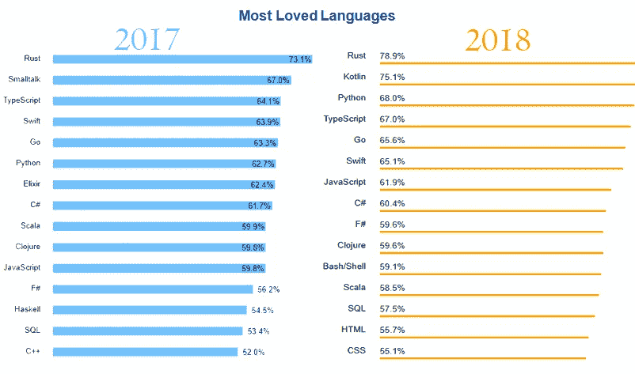
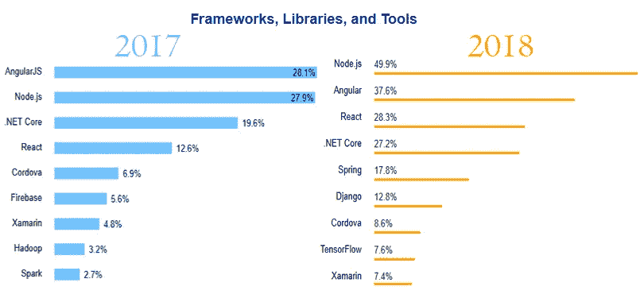
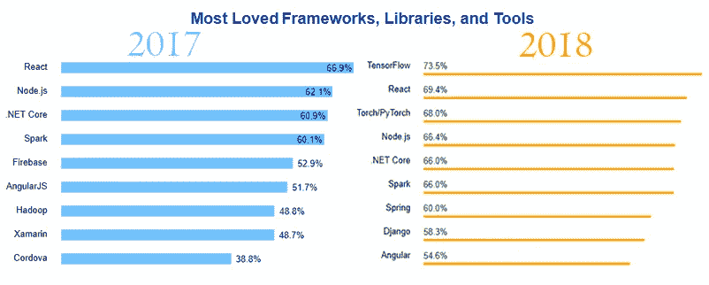
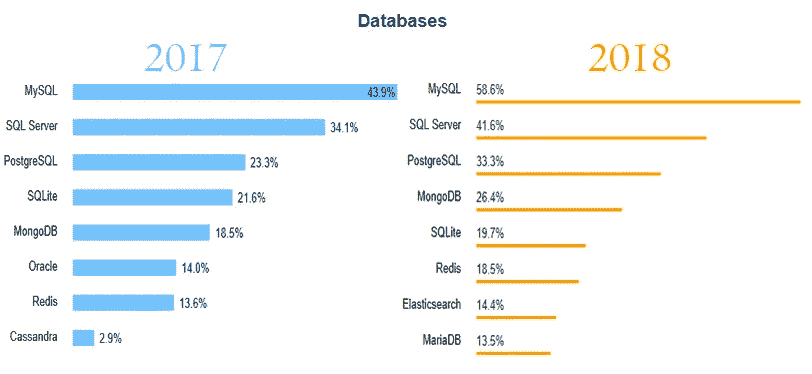
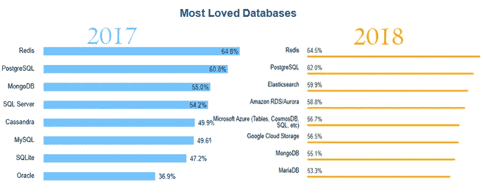
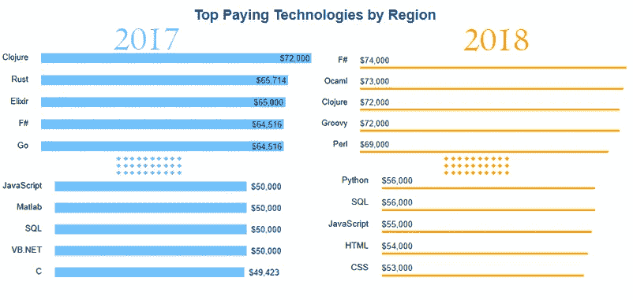

# 关于 JavaScript，StackOverflow 的见解告诉了我们什么

> 原文：<https://itnext.io/what-stackoverflow-insights-tell-us-about-javascript-31ec0af61d83?source=collection_archive---------3----------------------->

> [点击这里在 LinkedIn 上分享这篇文章](https://www.linkedin.com/cws/share?url=https%3A%2F%2Fitnext.io%2Fwhat-stackoverflow-insights-tell-us-about-javascript-31ec0af61d83)

作为一个 JavaScript 爱好者，当我发现 StackOverflow 对于【2018 年不同语言的洞察；我想到的第一件事是检查 JavaScript 周围的事情是如何进行的。

从他们去年的见解中，我已经知道 JavaScript 已经是全球最流行的语言；但是我也有点担心 JS 会随着 [webassembly](http://voidcanvas.com/will-javascript-die-due-to-webassembly/) 的强大而失去人气。

幸运的是，我亲爱的 JS 开发者不用担心。这里一切都很好。而这里是 StackOverflow 对 2017 年和 2018 年的洞察的一个小对比。

# 受欢迎程度仍在增长

2017 年，66.7%的开发者使用/熟悉 JavaScript。然而，在 2018 年，这一比例增加了 5%。毫无疑问，新用户更倾向于使用 JavaScript，老用户也可能开始使用 JavaScript。对社区真的有好处。另一个很好的收获是看到 Typescript 的发展。我坚信 JavaScript 需要 Typescript 的支持才能达到成功的巅峰。

# 框架上的灯

## 爱你节点

看看这里 node.js 惊人的跳跃就知道了。从 27.9%到 49.9%。就连这一跳也是从 2016 年开始的。在 StackOverflow 的 2016 年 insight 中，这一比例约为 17%。所以，17 比 29.9 比 49.9。现在我对 2019 年的另一次大跳跃充满希望。我可能会偏向我的爱人:D

## 可疑的角度

老实说，我在 angular 2 中看到的大屠杀，我认为这是社区向 angular 说再见的时候了。
他们完全重写了它，并迫使用户使用 typescript(是的，我知道你会说 TS 不是强制性的，但我也知道你没有在 Ng2 中使用 JS 编写过任何应用程序)并重写他们在 AngularJS 1.x 中的现有应用程序。但是令人惊讶的是，图表显示的却不是这样。似乎受欢迎程度并没有下降太多。是的，我可以理解那些已经在 2016 年或之前设定了 Angular 技能集的人不会仅仅因为他们不喜欢 Ng2 和后续版本而删除它；但是应该有更少的新手。或者可能是新学员从他们的前辈那里了解到 Angular，并仅仅以此开始。不管是什么原因，angular 似乎至少保持了它的流行。

# 我们亲爱的蒙哥

你可以用 node.js 使用任何数据库，但是 node 和 mongo 从一开始就有一种特殊的化学反应。看到 mongo 在最常用数据库列表中上升一位也不错。然而随着弹性搜索等的兴起。似乎开发人员正在用新的数据库女孩抛弃 mongo

# 钱，蜂蜜

有人真的喜欢钱吗？除了加拿大医生？我不这么认为。这就是为什么 StackOverflow 还提供了工资单图表。

多年以来，JavaScript 开发人员的工资一直偏低，而且这一趋势似乎还在继续。当涉及到工资标准时，JavaScript 在列表中排名垫底。虽然看起来 2018 年的涨幅很小，但我会说这将随着:D·:D 的初始率而正常化

# 我会永远爱你

图表真的重要吗？嗯…我想对于 JS 爱好者来说，他们不会。不管报酬或任何其他因素，我们将继续热爱、发展并为 JavaScript 社区做出贡献。因为我们相信这种几年前没人重视的小语言，蕴藏着巨大的力量。所以，让我们回到 JavaScript。