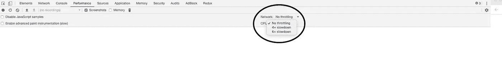
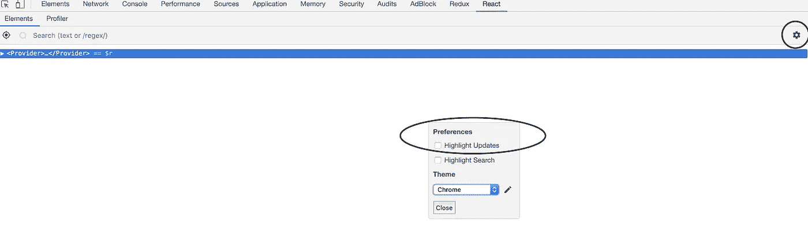
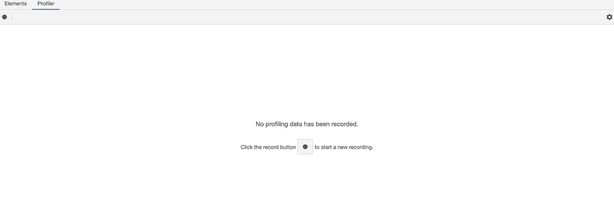

# 当你的 React 应用程序运行缓慢时该怎么办

> 原文：<https://itnext.io/what-to-do-when-your-react-app-feels-slow-3744c966ddf?source=collection_archive---------1----------------------->

我想这是马特宏峰

# 介绍

React 很快，但出于某种原因，你的应用程序感觉很慢。考虑到你在使用“反应”这一事实，感觉并不像它应该的那样顺畅，而且你也不容易理解是什么导致了它。在本文中，我将尝试帮助您解决这些情况，当您想要识别 React 应用程序中的性能问题时，我会给出一个步骤列表。

# 探讨这个问题

## **模拟用户的环境**

你应该做的第一件事是了解谁是你的观众。不同的用户有不同的设备，这意味着不同的 CPU & GPU 功率。如果你的受众主要在移动设备上，那么你就有了不同的阈值，如果你的受众主要通过桌面使用你的应用程序。此外，如果你的目标是一个大范围的年龄组，有可能会有更多的人拥有慢速和低端电脑，而不是只针对年轻人。CPU 节流在这里是你的朋友(在 Chrome 的 devtools 中的*“性能”*标签下)。

Chrome 开发工具中的 CPU 节流

如果你的应用程序是移动优先的，那么 4 倍的速度就可以了；如果只是台式机，那么也许不需要减速(取决于你的电脑)。在您将某个东西归类为“慢”之前，请确保您以最好的方式模拟了普通用户的环境。
*提示:打开 devtools 会降低你的应用程序速度，如果你打开它们，你可能会看到明显的性能差异(尤其是在动画方面)。根据您的电脑，有些情况下，您可能希望在检查某个程序是否变慢之前关闭它们。例如，从低端 PC 开发，同时面向高端桌面用户。*

## 在生产模式下检查它

您应该检查的第二件事是您是否正在使用 React 的生产版本。在开发版本中，React 要慢得多，因为它需要分析数据并为其警告消息创建调用堆栈。虽然这些消息可能有所帮助，但它们也会降低应用程序的速度，所以只要确保您的项目在生产模式下运行 React 运行时即可。有些东西(比如动画)在开发时显得滞后，在生产模式下可能就没问题了。记住这一点。

## 大概了解一下什么是过度渲染

React devtools 是您在这里最好的朋友。如果您还没有安装它们，请从[这里](https://chrome.google.com/webstore/detail/react-developer-tools/fmkadmapgofadopljbjfkapdkoienihi?hl=en)开始安装。为了分析性能，这包括两个非常重要的工具。第一个工具是一个“复选框”,选中时，它会使重新渲染的 React 组件在屏幕上有一个闪烁的边框。

Reaxt devtools 中的“突出显示更新”复选框

虽然这没有做太多，但它确实帮助您大致了解哪些更新很多，哪些没有。当它被激活时，你只需在你的应用程序周围转一转，开始做“事情”,同时看看什么变得华而不实。像高尔夫球一样，我们的目标是大致接近问题所在的地方。我更喜欢使用这个工具在缓慢/滞后阶段看到整个应用程序的重新渲染。这个工具本身并不能帮助您解决问题，而是为性能问题确定一个潜在的候选人。我说潜在的原因是，虽然大多数时候频繁更新的组件会导致整体延迟，但也有一些时候组件可能很少更新，但其渲染仍然非常昂贵，实际上会影响应用程序的整体性能。为了分析所有这些，我们将使用 React 分析器。

## 使用 React Profiler 获得精确的测量值

profiler 是你应该用来理解应用渲染的主要工具，可以在 React devtools 的“Profiler”标签下找到。这适用于使用 React ≥ 16.5 的项目，因此请确保您没有安装旧版本的 React，否则选项卡根本不会显示。

反应分析器选项卡

它所做的是，全面分析每个组件经历的重新渲染次数，同时测量每个渲染花费的时间(在应用程序和组件级别)。分析器可以帮助您了解是否应该忽略大量重新渲染的内容(因为它的渲染时间可以忽略不计)或者是否应该优化它(因为它可能会严重影响您的应用程序)。这个工具的[文档非常棒，会让你立刻完全熟悉它！](https://reactjs.org/blog/2018/09/10/introducing-the-react-profiler.html)

现在，作为一个经验法则，如果应用程序的总渲染是< 16ms, then you shouldn’t worry about optimising anything. Why 16ms? Well this is question for another article, but it has to do with the way React Fiber works. The Fiber implementation of React takes advantage of the 【 API of the browsers, in order to defer non-essential tasks when the browser has some “idle time”. That’s why people were saying that the Fiber implementation will be faster; because instead of blocking the main thread, it would be able to potentially schedule work for later when the browser is less stressed. The maximum amount of time that the browser can spend on a task without losing any frames is roughly ~16ms, so that’s why if your render takes less than that, you can safely assume that you are ok in terms of performance. Of course, a lot of the times an application render **可能需要更多的时间，这可能仍然是好的**。这一切都取决于你的应用程序如何呈现它的用户界面。如果你的应用有一个非常互动的用户界面，那么丢失一些帧会很快被用户注意到。另一方面，如果你的应用大部分是静态用户界面，那么即使是 80 毫秒的渲染也不会显得滞后。都是相对的。
在隔离组件的渲染时间时，profiler 提供了一种通过火焰图快速确定哪个组件的渲染时间最长的方法。颜色越是橙色，部件就越贵。这些信息是有用的，但是它*不会也不应该自动暗示这个组件需要优化*。火焰图是用来对单个渲染阶段内组件的渲染时间进行相对比较的。这并不意味着这个组件的渲染是昂贵的，而仅仅是它比另一个组件的渲染**更昂贵**。
分析器的巨大好处是，你可以看到哪些组件被渲染，而它们不应该被渲染(当它们的道具没有改变的时候)。这些组件可以很容易地受益于渲染纾困技术，如`PureComponent`和`memo()`。如果正确使用它们，那么不应该渲染的组件将显示为浅灰色，这表明 React 重新使用了上一个渲染周期的输出，而没有经过该组件的协调过程。

在我看来，使用分析器的理想方式是:

*   隔离那些使你的应用程序无法运行的行为。是在点击某个元素之后吗？是在初始应用挂载期间吗？是不是当你从某一页过渡到另一页的时候？
*   创建一个记录，在这个记录中你可以重现那些让你的应用程序滞后的步骤。(提示:删除任何 console.logs 和调试器，因为它们会影响测量)
*   分析渲染总数。你的应用程序渲染的次数是否比正常或预期的要多？
*   分析每个渲染阶段的总渲染时间。检查每一次渲染，看看你的程序渲染花了多少时间。如果存在性能问题，您可能会看到几个渲染时间超过 100 毫秒(正如前面提到的，这个数字与您的应用程序的性质有关)。
*   检查**昂贵的渲染组件栈，隔离出对总渲染时间贡献最大的组件。**
*   尝试并找到前述组件下的子组件，它们可以受益于渲染保释技术。通过简单地不重新呈现没有改变的东西，你可以节省一些宝贵的和解时间。
*   尝试找到子组件，它们的代码可以从记忆技术中受益。有时，数组或对象可能会被不必要地重新计算，从而浪费主线程资源。

只要你发现了代码中的害群之马，你就可以做很多事情来优化它。[我关于 React 性能技巧](/6-tips-for-better-react-performance-4329d12c126b)的文章试图涵盖其中一些技巧。

在我们结束这一部分之前，重要的是要注意，在撰写本文时，新的 React devtools 有一个[测试版](https://react-devtools-experimental-chrome.now.sh/)，它将让您访问更多有趣的功能，以便调试您的代码。像现场道具更换、初始安装期间的记录、组件渲染堆栈跟踪&历史和屏幕截图捕捉都已经实现，并将进一步促进 React 应用程序调试。我强烈建议你跟随它的创造者[布莱恩·沃恩](https://twitter.com/brian_d_vaughn/)获取最新更新！

## 全面了解 Chrome 的开发工具

虽然分析器很棒，但它只是输出渲染花了多长时间。大多数时候这已经足够了，但是有些时候我们需要完全理解到底是什么使得这种特殊的渲染如此缓慢。最理想的工具是 Chrome 的 devtools 提供的性能分析。这与 profiler 的工作原理完全一样，但是它不是输出每个组件的渲染时间，而是给出浏览器的所有脚本、绘画和渲染时间。通俗地说，它会告诉你调用了哪些函数，浏览器花了多长时间计算元素在屏幕上的位置，以及每种颜料的成本。

说到 React，性能选项卡“太解析”了，包括 React 的内部函数调用(像`performWork`)。这就是为什么在执行 React 渲染分析时，React 探查器比它更受欢迎，因为它可以帮助您更好地理解正在发生的事情。Chrome 的 devtools 的好处是，你实际上可以得到一个渲染中发生的所有调用的完整明细。这可能有助于您准确理解组件的哪一部分(可能很大)代码导致了问题。

除此之外，您还可以访问更高级的浏览器计时，如 paint & render。绘制是指浏览器实际上必须创建用户界面的图形，而渲染是指浏览器必须计算并可能更新元素在屏幕上的位置。这两个过程成本都很高，如果它们*冗长* 并且在“滞后阶段”出现*过于频繁* ，那么理想情况下应该最小化。虽然这些操作在性能分析中存在是很自然的(毕竟，如果它们不存在，屏幕上什么也看不到)，但有时 React 代码可能会迫使它们过于频繁地触发。也许你不知道改变`<body>`元素的`overflow`属性(启用/禁用滚动)会导致主体内所有组件的重新计算。这种细微的变化可能会给主线程带来很大的压力(如果你的应用程序有很多组件的话),并且可能是你的应用程序在打开模式或侧边栏时感觉很慢的原因。这是**只有**这个标签可以找到的东西，这就是它如此重要的原因。分析这种行为的原因和方式超出了本文的范围，但是可以在这里随意阅读更多相关内容。

# **结论**

虽然我没有解决很多问题(例如发出多个并发网络请求的问题)，但我的目的是给出在尝试调试 React 应用程序时应该遵循的高级步骤。正确模拟用户的环境，检查 React 是否处于生产模式，可选地检查某些东西是否大量重新渲染，然后转移到分析器。分析器将帮助您在 95%的情况下提高应用程序的速度，因为大多数性能瓶颈都是由您构建 React 代码的方式造成的。如果评测器无法帮助您识别和解决问题，那么您应该转到 performance 选项卡。后者肯定会给你想要的答案。

感谢阅读:)

*👋 ***嗨，我是***[***Aggelos***](https://aggelosarvanitakis.me)***！如果你喜欢这个，考虑一下*** [***在 twitter 上关注我***](https://twitter.com/AggArvanitakis) ***并与你的朋友分享这个故事*😀***