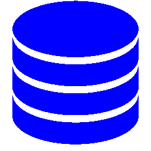

# 关于数据库，我会教什么

> 原文：<https://itnext.io/what-would-i-teach-about-databases-f02417b188d2?source=collection_archive---------4----------------------->

*(也发表在* [*我的博客*](https://blog.segersian.com/2019/10/17/teach-about-databases/) *)*

当我与一名软件工程专业的学生讨论在学校学习 SQL 和缺少任何其他数据库引擎的问题时，我问自己“如果我要给有抱负的软件工程师讲课，我会教数据库什么?”？

根据我目前的知识水平。我是数据库专家，也不是管理员。但是随着我的兴趣倾向于解决方案架构，我感到有动力写下我的想法，在今天的软件工程环境中，什么样的主题是有用的。

欧洲大多数大学(根据与多名工程师的交谈)的核心重点仍然是 SQL。虽然我强烈主张将 SQL 保留在课程中，但我确实认为大学应该探索更多(即将到来的)数据库技术，并挑战学生创造能够选择数据库引擎的思维模式。

不言而喻，我不能代表所有大学的课程，有些可能更先进，有些只专注于纯 SQL 和关系数据库。因此，我将涉及一些我认为值得修改到课程中的主题，以及(可能)现有的主题，以强调它们的重要性。

**题目:CAP** 在我大学的时候，我们很快接触到了 [CAP 定理](https://en.wikipedia.org/wiki/CAP_theorem)(如果我没记错的话)。但是我们很快就看完了。讨论一个人是否只教你一个 DB 引擎几乎没有意义。经常有很多关于 [ACID](https://en.wikipedia.org/wiki/ACID) 特性的强调，这些特性很重要，但是 CAP 定理对于理解 DB 引擎的核心特性非常有用。

学习一些不同 DB 引擎的例子，以及它们在 CAP 三角形上各自的方向，对于了解选择特定 DB 引擎的缺点、挑战和影响是非常有教育意义的。

**主题:一致性模型** 有两种以上的一致性模型(强一致性与最终一致性)。这两者之间有一个光谱。了解存在什么类型的一致性模型，并学习根据应用程序的用例来确定您需要哪些一致性模型是非常有用的。

在使用数据库时，这是一个值得学习的有趣概念。您需要学习理解基于用例您需要或偏好的一致性模型，帮助您理解您应该考虑什么数据库。Doug Terry 做了一个精彩的演讲，他解释了一些不同的一致性模型，以及如何理解哪些模型对您的用例有影响。

**题目:SQL** 不言而喻。由于 SQL 仍然是一个标准，并且在行业中被广泛使用，我只是想指出这是一个到目前为止已经过时的话题。学习使用 SQL(最好是 DB 引擎不可知的)、执行计划和性能仍然是相关的主题，有助于理解数据库的内部。

**主题:NoSQL 数据库** 在我的大学里，我们只讨论了基本的 SQL 数据库。“非 SQL”数据库的想法没有被提及，也没有被认为是一个“模糊的领域”。

这个想法并不是要在一个深层次上覆盖许多不同的数据库。相反，去观察地平线，看看那里有什么样的类型。看看真实世界的场景、挑战和优势！

简单的小型“Hello-World”类型的示例就足够了，因此作为一名学生，您会理解，除了 SQL 之外，还有很多其他的东西。

**主题:云/托管数据库** 云数据库绝对是“最新”的产品(例如 DynamoDB、Cosmos DB 等)。这里的核心焦点不是“日常使用”，而是学习这些数据库背后的概念和设计。

这些数据库经过工程设计，旨在提供“高可用性”和“高可扩展性”。因此，有许多有趣的概念要涵盖，如“多主机”、“分片键”、“读取副本”、“更改馈送”和“灾难恢复”。我可能只触及这些主题的表面，但足以深入了解“大规模”数据库及其对您的运营、一致性模型和首选 CAP 方向的影响。

**主题:合并数据库** 在我学习之后，我有一个(天真的)印象，你的解决方案中可能总是只有一个数据库。为什么需要更多？但在现实中，这很少是真的。如今，许多架构由多个数据库组成，每个数据库满足一个特定的需求。

例如，将一个 SQL 数据库作为您的“真实的单一来源”，并使用一个“内存中的”数据库来“缓存”循环查询，以减轻您的 SQL 数据库负载。这里需要向学生强调的重要一点是，你也不需要从一开始就过度设计解决方案。

不过，对于学生来说，重要的是要了解，不同的数据库并行存在是完全正常的，每个数据库根据需求扮演不同的角色。

**主题:关于你的数据库模式** SQL 类型数据库的一个很好的主题是规范化和反规范化你的数据库模式设计。必须教会人们挑战他们的数据库模式设计，并训练他们变得更好。

在 SQL 数据库中，模式“在”DB 本身之内，通常非常接近他们的解决方案的域模型。以 MongoDB 为例，您可以在代码库中移动“模式设计”。这引发了一场有趣的讨论；

*   将您的模式设计放在您的应用程序代码中更好吗(尊重干净的架构理念，即“[DB 是一个细节](https://www.oreilly.com/library/view/clean-architecture-a/9780134494272/ch30.xhtml)”)？
    让您的架构更加独立于数据库。
*   或者将数据模型的模式放在数据库中有意义吗？在应用程序代码和数据库之间创建更紧密的耦合，但获得更多的数据一致性。

我不会在这里告诉和捍卫我的观点，但我想挑战学生思考这样的问题。

**主题:选择合适的数据库** 我认为最重要的主题之一！如果我教数据库，重点将是“什么是适合我的数据库？”。

我所涉及的大多数主题都是为了教会学生正确的技能组合，让他们自己形成一个受过良好教育的客观答案。教授一个良好的思维过程，以便为技术堆栈做出正确的、有根据的决策。相比任何炒作驱动的心态。

重要的是首先理解你的解决方案的用例，它们的**实际**需求(例如，不要武断地断定用户**总是**需要强一致性)。从理解您的需求出发，您可以考虑他们需要什么样的一致性模型，以及数据库应该在 CAP 谱上的什么位置来适应需求。

您是否应该考虑“高可用性”、“灾难恢复”和非常短的响应时间？如果是，有哪些数据库，这对 CAP 特征有什么影响？您必须平衡数据库的必需特性和特征，以满足您的需求。

这个想法并不是说一个刚毕业的学生可以自己回答所有这些问题，而是要教他们正确的态度和心态，以客观的方式选择他们的堆栈。理解每个数据库都是利弊之间的平衡。学会根据你的实际需求做出选择，学会有一个批判的头脑，学会理解“为什么”

如果你讨厌这篇文章或不同意，我鼓励你回复你的评论和关注，我喜欢讨论！如果你喜欢，a👏总是受到赞赏。看看我的其他作品…

 [## JavaScript:新手应该知道的事情

### 了解更多关于 JavaScript 生态系统的核心概念。

itnext.io](/javascript-things-newbies-should-know-e04bab10449f)  [## 开发人员对云的介绍

### 了解和区分云供应商及其众多产品的快速指南。

itnext.io](/a-developer-introduction-to-the-cloud-91012abbaed4)