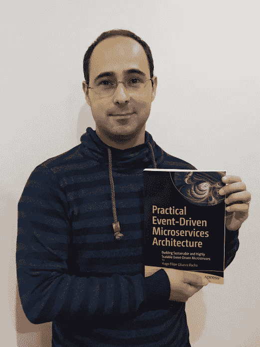

# 关于失败，写书教会了我什么

> 原文：<https://itnext.io/what-writing-a-book-taught-me-about-failure-31bd15561e58?source=collection_archive---------2----------------------->

我和我的书，《实用的事件驱动微服务架构》

在软件开发中，有时人们说“那些不能做的人，管理；不会管理的，教；而不能教的，写书”。嗯，我喜欢认为这纯粹是胡说八道，因为我经常至少做其中的三件事，我害怕这种情况会发生在我身上。无论如何，我是《[实用事件驱动的微服务架构](https://www.goodreads.com/book/show/59637521-practical-event-driven-microservices-architecture)》一书的作者，尽管这是一个我将永远铭记在心的成就，但即将出版的旅程绝对是一个挑战。

正如布莱恩·格里芬所说，有些人梦想着写并出版一本书，被称为出版作家，为时代精神做出贡献。事实上，出版一本书往往是作者掌握和主题专业知识的不可否认的证明。作为一个最近的作者，我必须说第一次拥有自己作品的书面副本有一种神奇的感觉，这是多年承诺、专注和努力工作的有形象征。在这个世界上，我们的大部分工作都是在数字媒体中进行的，拥有一个象征着你的专业知识、努力和承诺的物理令牌绝对是独一无二的体验。

如同我生命中所有美好的事情一样，我的旅程始于我妻子的一个建议。她总是看我的科技文章，当她愿意为你的退出笑的时候，你知道有人真的爱你。老实说，我的第一个想法是，这是我永远没有时间去做的事情，是留给我们当中单身且没有孩子的科技作家的事情。然而，我决定试一试。

# 提交

我相信写一本书本身是有价值的，至少对作者来说是这样。通过出版和与更广泛的读者分享这些知识，甚至有更多的价值。然而，在当前软件工程书籍出版商的布局中，有许多出版商采取了一种散弹枪式的出版方式。这并不是说他们没有任何有用的或高质量的书，而是找到一本有用的或高质量的书通常很困难。这一过程似乎缺乏每本书都需要的体面而彻底的审查。考虑到这一点，我决定只接触三家出版商，我认为它们是最好的(Apress 是其中之一，但不是我开始接触的那家)。

第一阶段是提交一份提案表格，描述该书的主题、为什么它很重要、读者会学到什么、作者的背景、为什么他是谈论该主题的最佳人选、竞争标题、预期的目录等。提交后，出版商将决定是否推进或拒绝建议。

我提交了建议，几天后，他们安排了一次会议来讨论出书的建议。我们讨论了几个话题，例如，对我的背景的预览，这本书的方法是其他书中没有的，它将如何与众不同，等等。已经有几本关于事件驱动微服务的书了。我确实感觉到，在了解和克服由事件驱动的高度分布式微服务架构的缺陷方面，缺乏意识和指导。由于多年来在生产中面临这些挑战，并应用了一些没有很好记录的策略，我可以阐明一些事情。我们拿着目录来来回回看了几次。例如，我从一个比最终版本更“艺术”的版本开始。他们提出应该突出读者将会学到的东西。最终，我定义了一个我们都满意的目录，并推进了这个提议。有几篇发表的文章很有帮助，因为他们可以直接看到我的写作风格以及人们对它的反应。

之后，他们在内部分析主题的市场可行性并提交给审批委员会后，将提交的内容提交给一系列审批部门(我对内部程序的了解有限，但似乎有其自身的复杂性)。一旦内部批准，我的建议被提交给 15 位负责人和建筑师专家审阅，我认为他们可以自己写这本书。他们每个人都必须为提案填写一份相当全面的反馈表。根据反馈，他们将决定是否推进。我回顾了反馈，并根据我认为有意义的观点调整了提案，例如，我没有想到会谈到事件风暴，这很有意义，并根据反馈调整了目录以包括它。

# 写作

听到提议被接受，我欣喜若狂，我可以开始写书了。我签了合同，开始写第一章。我还被分配到一个发展编辑(负责写作风格、语法、事情如何解释、讲故事等)和一个技术编辑(负责技术准确性)。在每一章之前，我必须填写一个章节计划，解释读者将会学到什么，主要主题，核心图表等等。对于我完成的每一章，两位编辑都会仔细检查手稿并提出改进意见。

平衡工作、个人生活和写书是一个真正的挑战。如果说我从开发软件中学到了什么的话，那就是永远不要为了赶上最后期限而牺牲真实环境的稳定性和质量。

> 作为一名工程经理，我宁愿与利益相关者进行艰难的交谈，也不愿推动团队交付不稳定的东西。我相信这同样适用于写书。

平衡工作中的不断变化、随叫随到、2 岁的女儿和怀孕的妻子、生活抛给你的一切，以及找到不受干扰的高质量时间和必要的专注和专注来写作，这确实是一个挑战。出版商规定的最后期限确实雄心勃勃。也许对以写作为生的人来说不是，我习惯于不时地写作，作为一种爱好，每隔几个月就写一篇文章。在如此短的时间内写出如此大量的内容和所需的细节，这的确是我从未做过的事。

最终，一旦我准备好了这本书的一半，它就被送到同样的 15 个架构师和负责人那里进行评审。我对反馈感到非常兴奋，看到你的作品得到了验证，人们对它的内容和写作方式发表了很好的评论，这太棒了。

然而，当我开始拖延截止日期时，我与出版商有一些困难的会议。他们说一切都很好，让我继续写作，但我觉得有些不对劲。我想他们刚刚意识到我正在探讨的全部主题(尽管在提案和评论者的反馈中已经很清楚了)，并担心他们会部分地与他们的其他书竞争。随着错过最后期限，他们最终决定取消这本书，解释原因是太有挑战性，无法成功营销这本书。他们没有给我更多的细节。那时我已经准备好了将近 70%的书。

那打击真的很大。有时候，当你失败的时候，你过去所有的恶魔都会出现。想要某样东西的问题是想到永远得不到它。有时，我们无法实现我们为自己描绘的形象。我们想象我们能够实现的所有成就，我们渴望却常常得不到的东西，拆除了建在流沙上的城堡。

在你真正致力于做的事情失败时，会有一种奇怪的清晰感和启发感。当你被迫回首往事，看到自己不知不觉做出的选择时，比如多花几个小时写作，而不是和两岁的女儿玩耍。你做出的牺牲，你选择去做的牺牲，浪费掉的，那些你永远也不会回来的时刻。

> 比我聪明得多的人会说，失败者不是那些失败的人，而是那些没有尝试的人。如果你像我一样失败，这听起来就像你在励志海报上读到的廉价俏皮话。

不尝试总会有一种熟悉的安慰，你对自己说“如果我尝试了，如果我真的尝试了，我也能做到”。尝试的行为在你的想象中闪耀出现实的光芒，一种消除所有怀疑的黯淡的清晰，你尝试了，但你失败了。

最终，成就是二元的，要么你完成了，要么你没有。我倾向于思考我走过的路，我付出的努力，我走过的伟大的反馈和里程碑，试图看到光明的一面。事实是，它们只是我们用来充分利用糟糕情况的机制，是你为不把自己视为失败者而制造的借口。

然而，有时候你必须找到原谅自己的力量，让失败成为你的一部分。把它当作一个伤疤，让你的手在下次想要争取什么的时候变得更硬。最后，我认为我可能是个失败者，但我不会轻易放弃。

想到整个会议周期、内部和外部审查、我必须做出的改变以及我必须再次经历的改变，真的令人沮丧。尽管如此，我还是决定从头开始。我选择的三家出版商中还有两家，所以这次我决定选择 press。我填了出书申请表格并提交了上去。

这个过程和我之前经历的差不多，所以我就不多说了。大约一周后，他们回复说他们对我的提议非常感兴趣。我们讨论了一下目录，他们通过了内部审批。我对流程的这一部分不太了解，但似乎有一系列内部批准。几个星期后，他们给了我一个好消息，并提前签订了合同。

同样，技术和发展编辑审查了整个内容。在几个月的时间里，我反复考虑他们的建议，同时也完成了这本书的剩余部分。一旦这本书准备好并通过了第一轮审查，它将被提交给更正式的审查。几周后，我收到了页面校样(数字版)和修改请求，但没有什么太复杂的东西需要修改。最后的批准是确认我确实要成为一个出版作者。

接下来是一系列微小但自豪的时刻。比如看到封面和封底的设计，在亚马逊和其他网站上预订的书，向公众开放的最终日期，当然，还有收到实体书。我第一次把它拿在手中的那一刻，是一个真正快乐和自豪的时刻。

技术书籍通常理论性很强，缺乏对现实世界的快速了解。描述如何应对真正挑战的最佳人选不是那些构建假设场景和理论模式的人，而是那些在现实世界的业务中应对挑战、每天都在战壕中与之斗争的人。你需要被生产中的那些挑战烫伤，才能真正理解什么可行，什么不可行。

有时候，最好的建议来自那些每天都在战壕中，努力克服所谓最佳实践的挑战的人。在我看来，你不需要站在你的脚趾上大喊你所有的假设成就，或者在每个会议上公开发言，成为一个同样有效的专家，并帮助技术社区。如果你想写一本书，那就大胆试试，把专注、承诺、努力、毅力和运气结合起来，你可能会对结果非常满意。

> 就像亨利·梭罗曾经说过的，“当你没有站起来生活的时候，坐下来写作是多么的徒劳”。

请随意查看我的其他文章，网址:[https://medium.com/@hugo.oliveira.rocha/](https://medium.com/@hugo.oliveira.rocha/)

 [## 通过我的推荐链接加入 Medium—Hugo Rocha

### 作为一个媒体会员，你的会员费的一部分会给你阅读的作家，你可以完全接触到每一个故事…

medium.com](https://medium.com/@hugo.oliveira.rocha/membership)