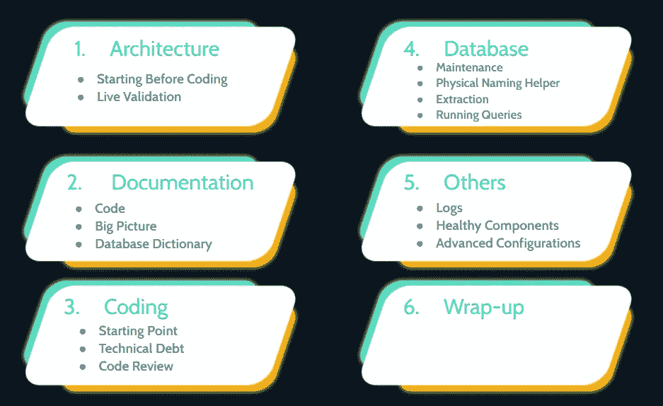
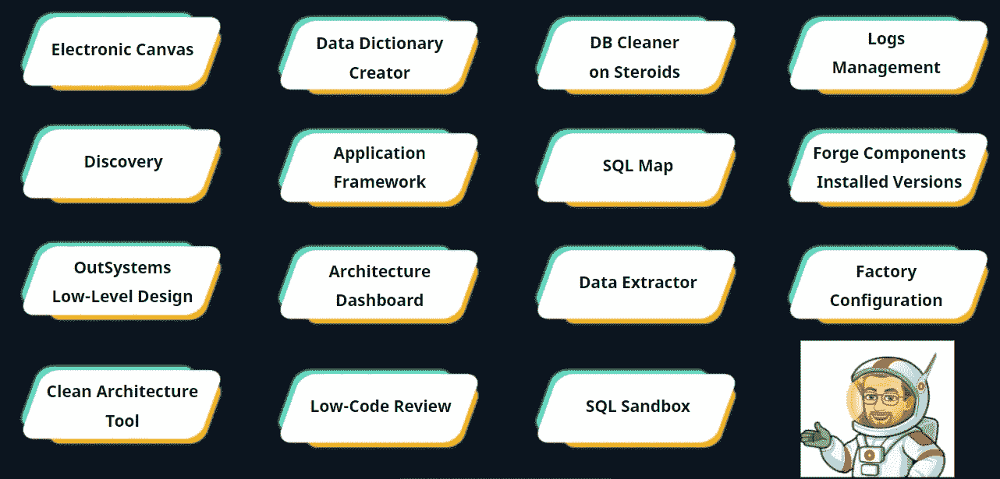

# 在我的 OSDC 会议上你错过了什么——对拱门的恐惧:成功的工具

> 原文：<https://itnext.io/what-you-have-missed-in-my-osdc-session-fear-of-the-arch-tools-for-success-143f248f0368?source=collection_archive---------2----------------------->

17 日和 18 日， [OutSystems 开发者大会——OSDC 2021](https://www.outsystems.com/nextstep/osdc/)——上线了，这是人们期待已久的年度低代码技术盛会。在 APAC、EMEA 和 AMER 三个时区举行的 72 小时全球活动的并行会议中，有数百小时的直播内容。

我很荣幸成为这次盛会的发言人，为所有 OutSystems 架构师提供必备工具的简要概述。我探索了所有软件架构师应该在开发的所有阶段——从分析到交付——跨系统项目使用的组件、方法和模式。

我从这个演示中提取了一些重要的亮点，并分享了我在会议中探索的所有工具的链接。最后，我还回答了观众的所有问题，以确保我没有留下任何问题没有回答。

如需完整演示，请观看以下链接中的视频，不要忘记在 OSDC 网站注册，以便访问活动期间提供的所有内容。它是免费的。在 2021 年 12 月中旬之前，所有会议都可以按需提供，此后，它们将被迁移到 OutSystems 站点。

请看这里的演讲:[对拱门的恐惧:成功的工具——下一步& OSDC](https://web-eur.cvent.com/hub/events/b1c07d39-e689-4a0b-9dc3-00a89bd3ffc6/sessions/e3a42529-80e1-4c18-850c-51d5d86b8682)

# 介绍

我们一直被要求在有史以来最好的架构之上创建惊人的应用，包括最现代的实践。即使是最有经验的架构师，当他们被要求使用最佳实践来组织他们的外部系统环境时，也会感到恐慌，保持东西整齐、自组织，并遵循最佳模式和建议。

在这个环节中，我分享了一些帮助我保持环境健康和日常管理的武器。主要目标是为每个组提供几个组件的列表，但是我没有深入研究它们。

# 种类

我把它们分成五组不同的工具:架构、文档、编码、数据库和其他。以下是所有这些网站的链接。

# 体系结构

[电子画布—概述|外部系统](https://www.outsystems.com/forge/component-overview/706/electronic-canvas)

[发现—概述|外部系统](https://www.outsystems.com/forge/component-overview/409/discovery)

# 证明文件

[外部系统低层设计—概述|外部系统](https://www.outsystems.com/forge/component-overview/10662/outsystems-low-level-design)

[清洁架构工具—概述|外部系统](https://www.outsystems.com/forge/component-overview/1548/clean-architecture-tool)

[数据字典创建者—概述|外部系统](https://www.outsystems.com/forge/component-overview/7763/data-dictionary-creator)

# 编码

[应用框架—概述|外部系统](https://www.outsystems.com/forge/component-overview/5944/application-framework)

[https://architecture.outsystems.com/](https://architecture.outsystems.com/)

[低代码审查—概述|外部系统](https://www.outsystems.com/forge/component-overview/10634/low-code-review)

# 数据库ˌ资料库

[类固醇 DB 清洁剂—概述|外部系统](https://www.outsystems.com/forge/component-overview/5018/db-cleaner-on-steroids)

[SQL 映射—概述|外部系统](https://www.outsystems.com/forge/component-overview/369/sql-map)

[数据提取器—概述|外部系统](https://www.outsystems.com/forge/component-overview/1093/data-extractor)

[SQL 沙箱—概述|外部系统](https://www.outsystems.com/forge/component-overview/5900/sql-sandbox)

# 其他人

[日志管理—概述|外部系统](https://www.outsystems.com/forge/component-overview/1195/logs-management)

[伪造组件安装版本—概述|外部系统](https://www.outsystems.com/forge/component-overview/8152/forge-components-installed-versions)

[工厂配置—概述|外部系统](https://www.outsystems.com/forge/component-overview/25/factory-configuration)

# 总结

非常重要的一点是，在项目结束时，不要对无法预见的问题感到惊讶，因为如果不进行艰苦而昂贵的返工，就太晚了。做到这一点的最佳方式是在正确的时间使用正确的工具，积极主动，并始终寻找可能危及您的架构的问题。

我的想法是分享我的工具集，但非常重要的是，你要尝试这些工具，并选择和创建自己的工具集。这是将您的架构置于安全区域的唯一方法。这完全取决于你。

# 问与答(Question and Answer)

> 你说与技术部相关的最重要的部分不是归零，你能解释得更好吗？

作为解决方案架构师，我们最重要的任务是根据仪表板发现的问题在项目中做出决策。根据我们项目的特定需求，比将所有问题都标记为已修复更好的方法是对为什么会在那里发现该问题的原因进行适当的解释，并解释我们是否会修复它们，以及如果会，何时修复。

有时广告会出现一个问题，但我们知道这是目前唯一可能的实现方式。我们有责任为此提供正确的理由。

例如，假设您有一个应用程序，其中部分屏幕是公开的，没有身份验证。仪表板会将这些屏幕视为问题，但我们知道那里没有问题，因为它是故意这样设计的。

> 关于架构仪表板，你如何区分哪些发现是最重要的，尤其是当你有大型工厂，你不能期望解决所有架构仪表板的发现？

我认为安全和性能问题是最重要的。比让我们的代码干净并且所有的描述都可用更好的是让我们的代码安全并且避免数据泄露。

> 除了架构仪表板，还有什么工具可以帮助架构师识别可能的安全问题吗？因为我感觉并不是所有人都熟悉这个工具。

不幸的是，锻造厂没有其他工具可以做到这一点。

> 你今天谈到的那些组件中，哪些是项目生命周期中最重要的？

如果我只能从列表中选择两个，我会说最重要的是 Discovery 和 Architecture Dashboard。

> 内部是否有低代码审查？

是的，当然。该组件可用于云和本地安装。

> 有什么工具可以在生产中进行查询吗？

您可以使用 SQL 沙箱来实现这一点，但是要注意不要弄乱您的数据库。

> 你没有时间把任何额外的工具包括在这个列表中，但是你认为把它添加到这个文件夹中是很重要的？

我可以在这个列表中再添加三个工具:

[Refactor—Overview | out system](https://www.outsystems.com/forge/component-overview/496/refactor):帮助重构你的模块，并在它们之间移动元素。

[bulk insert—Overview | out systems](https://www.outsystems.com/forge/component-overview/1117/bulkinsert):一次性执行批量插入。它比使用 For Each 和内置实体操作的解决方案性能好得多。

[计时器图—概述|外部系统](https://www.outsystems.com/forge/component-overview/508/timer-map):为您提供一个更好的管理视图，查看您环境中运行的所有计时器。

> 所有这些组件都由它们的作者支持。将它们用于生产有风险吗？

其中一些组件没有得到 OutSystems 的官方支持，但是如果你研究一下作者，你会发现他们是值得信任的，并且在这个平台上有很长的历史。当我需要使用新的锻造部件时，我总是检查这个。

> 你的清单在哪里有吗？

现在列表在这里:)

> 您可以向架构仪表板添加自定义检查吗？+
> 可以向架构仪表板添加自定义检查吗？

不幸的是，广告模式是由外部系统定义的，没有办法添加自定义的。

*感谢阅读。我希望你喜欢它。请让我知道你的想法。留下你的评论。对下一篇文章的主题提出建议。我想听听你的意见。如果你喜欢，请关注我的频道，分享吧。可以通过* [*LinkedIn*](https://linkedin.com/in/fantato/) *或* [*OutSystems 简介*](https://www.outsystems.com/profile/40762/) *联系我。*

*特别感谢 Kilian Hekhuis 和 Ian Berry，他们总是为提高我的英语水平做出宝贵的贡献。*

*Fábio 在软件开发领域工作了超过 25 年，其中 10 年是在 OutSystems 工作。他决定离开巴西，在葡萄牙开始新的挑战，与 Do iT Lean 团队分享他的经验和每天的学习。这不仅仅是关于生意，而是他觉得自己是一个大家庭的一员。他喜欢听音乐，徒步旅行，现在打理里斯本附近的小农场。作为 OutSystems MVPs 的一员，他可以为整个社区做出贡献，并帮助保持这个平台的领先地位。*

[精益生产——您可以依靠的系统专业知识！](http://doitlean.com/)