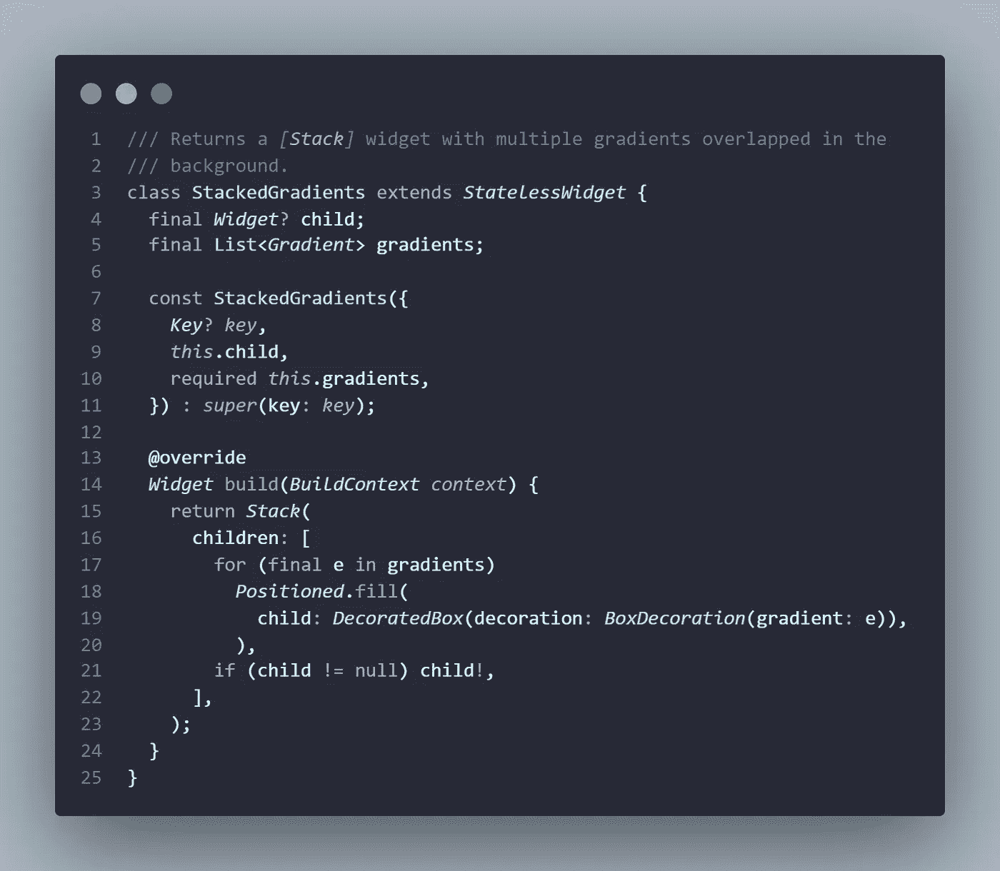
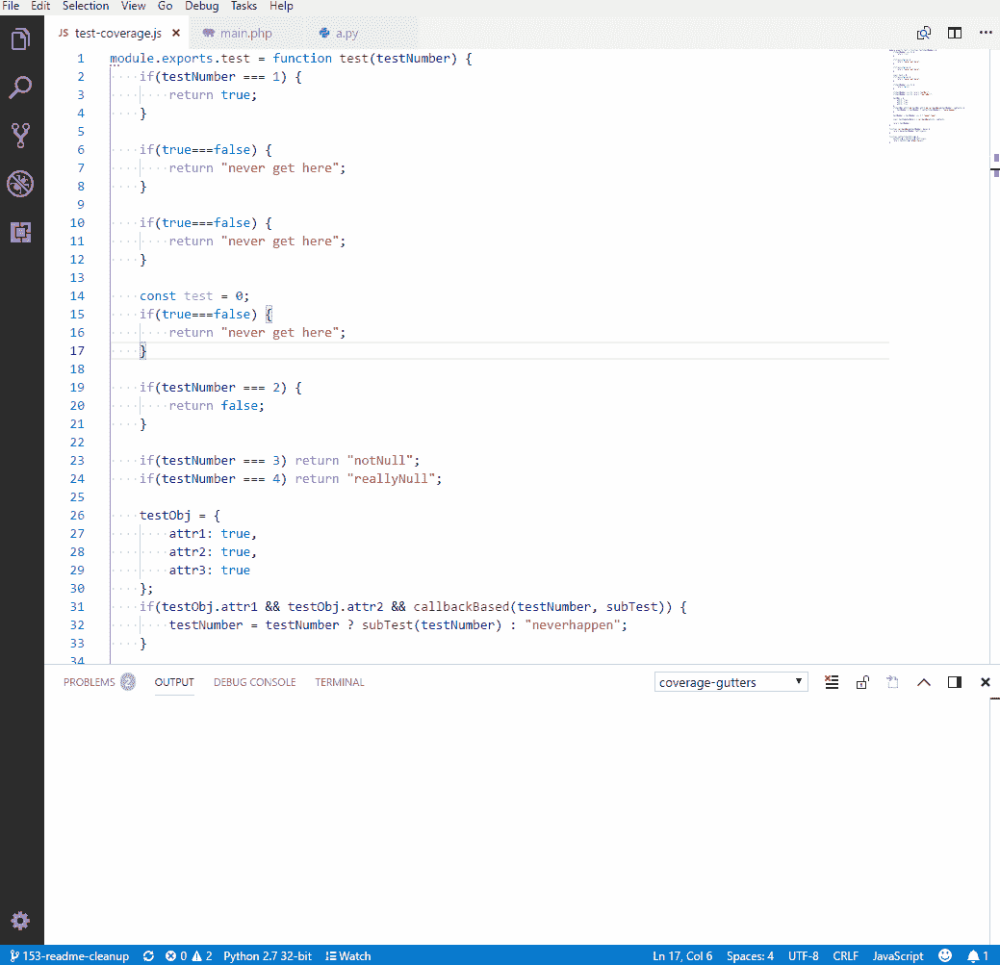
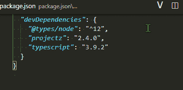

# 我的 VSCode 中有什么？—用于颤振发展

> 原文：<https://itnext.io/whats-in-my-vscode-for-flutter-development-48ee88e0adaf?source=collection_archive---------1----------------------->

我的主要编辑，说到写代码，已经好几年了 [Visual Studio 代码](https://code.visualstudio.com/)。它是免费的，开源的，有一个很好的插件生态系统，所以今天，我将展示我在 Dart & Flutter 中编码时使用的不同工具。

事不宜迟，下面是我用得最多的扩展:

*   [**更好的注释**](https://marketplace.visualstudio.com/items?itemName=aaron-bond.better-comments) :一个非常有用的扩展，可以以一种更加人性化的方式将样式应用于代码中的注释。

[https://github . com/aaron-bond/better-comments/raw/HEAD/images/better-comments。PNG](https://github.com/aaron-bond/better-comments/raw/HEAD/images/better-comments.PNG)

*   [**bloc**](https://marketplace.visualstudio.com/items?itemName=FelixAngelov.bloc) :如果你已经在你的项目中使用了 [flutter_bloc](https://pub.dev/packages/flutter_bloc) 库，那么这个扩展是必须的。它将帮助您轻松地创建 blocs 和 cubits，但也包括一些很酷的片段，以更快地创建软件包提供的所有不同的类。

[https://raw . githubusercontent . com/fel angel/bloc/master/extensions/vs code/assets/new-bloc-usage . gif](https://raw.githubusercontent.com/felangel/bloc/master/extensions/vscode/assets/new-bloc-usage.gif)

*   [**CodeSnap**](https://marketplace.visualstudio.com/items?itemName=adpyke.codesnap) :无论何时你想分享你的代码的漂亮截图，CodeSnap 都能帮你搞定。我一直用它来做你能在我的[颤振提示库](https://github.com/TesteurManiak/flutter-tips)中找到的所有截图。

[https://github . com/TesteurManiak/flutter-tips/raw/main/images/stacked _ gradients . png](https://github.com/TesteurManiak/flutter-tips/raw/main/images/stacked_gradients.png)

*   [**覆盖率 Gutters**](https://marketplace.visualstudio.com/items?itemName=ryanluker.vscode-coverage-gutters) :这是一个非常酷的扩展，可以帮助你一个文件一个文件地可视化你的代码覆盖率。将它与[**Flutter Coverage extension**](https://marketplace.visualstudio.com/items?itemName=Flutterando.flutter-coverage)结合起来，你就没有借口不跟踪项目的代码覆盖率了。

[https://github . com/ryanluker/vs code-coverage-gutters/raw/HEAD/promo _ images/coverage-gutters-features-1 . gif](https://github.com/ryanluker/vscode-coverage-gutters/raw/HEAD/promo_images/coverage-gutters-features-1.gif)

*   [**Dart 数据类生成器**](https://marketplace.visualstudio.com/items?itemName=hzgood.dart-data-class-generator) :有了它，你将能够轻松地为你的`toJson`、`fromJson`、`copyWith`(包括对`hashCode`的覆盖)等等生成代码。

[https://github . com/Huang 12 Zheng/Dart-Data-Class-Generator/raw/HEAD/assets/gif _ from _ Class . gif](https://github.com/huang12zheng/Dart-Data-Class-Generator/raw/HEAD/assets/gif_from_class.gif)

*   [**错误镜头**](https://marketplace.visualstudio.com/items?itemName=usernamehw.errorlens) :这个扩展会让你的错误和警告在你的代码中凸显出来，这总是好的。

[https://raw . githubusercontent . com/username HW/vs code-error-lens/master/img/demo . png](https://raw.githubusercontent.com/usernamehw/vscode-error-lens/master/img/demo.png)

*   [**Flutter Intl**](https://marketplace.visualstudio.com/items?itemName=localizely.flutter-intl) :如果您计划[使用 arb 格式国际化您的 Flutter 应用程序](https://docs.flutter.dev/development/accessibility-and-localization/internationalization#adding-your-own-localized-messages)，这个扩展将突出显示您的翻译文件的内容。它还包括一些很好的命令来生成您需要的样板文件。
*   [**Flutter Riverpod 片段**](https://marketplace.visualstudio.com/items?itemName=robert-brunhage.flutter-riverpod-snippets) :最近我在 Flutter 中开发时越来越多地使用 [flutter_riverpod](https://pub.dev/packages/flutter_riverpod) 包。这个扩展帮助我创建了所有的提供者。如果你和 Riverpod 一起工作，你需要这个！

[https://github . com/RobertBrunhage/flutter-river pod-snippets/raw/HEAD/gifs/greeting provider . gif](https://github.com/RobertBrunhage/flutter-riverpod-snippets/raw/HEAD/gifs/greetingProvider.gif)

*   GitHub Copilot :现在，这是一个有争议的问题，但我从测试版开始就一直使用 Copilot，它大大提高了我的工作效率。大多数情况下，所提供的建议都是相关且乏味的任务，比如为 JSON 编写解析逻辑就成了儿戏。如果您有机会或有能力订阅 Copilot，这可能是本文中展示的最能改变游戏规则的扩展。

[https://github . github assets . com/images/modules/site/copilot/copilot . png](https://github.githubassets.com/images/modules/site/copilot/copilot.png)

*   **:同样的，上面的一些扩展也支持特定的包。如果你经常使用 [melos](https://pub.dev/packages/melos) 包来管理你的 monorepo，那么这个工具会增加一些不错的功能，比如验证/自动完成你的`melos.yaml`文件或者运行最重要脚本的命令。**

****

**[https://static.invertase.io/assets/melos-logo.png](https://static.invertase.io/assets/melos-logo.png)**

*   **[**版本镜头**](https://marketplace.visualstudio.com/items?itemName=pflannery.vscode-versionlens) :如果你总是觉得在 pub.dev 上查看你一直在使用的软件包的最新版本很乏味，那么就说没有更多的版本镜头支持你，直接从你的`pubspec.yaml`上显示版本。**

****

**[https://git lab . com/version lens/vs code-version lens/-/raw/master/images/FAQ/show-releases . gif](https://gitlab.com/versionlens/vscode-versionlens/-/raw/master/images/faq/show-releases.gif)**

*   ****:这最后一个扩展为 VSCode 提供了一些 YAML 语言支持，因为进行一些验证来确保你的文件没有任何格式问题总是好的。****

********

****[https://raw . githubusercontent . com/red hat-developer/vs code-YAML/main/images/demo . gif](https://raw.githubusercontent.com/redhat-developer/vscode-yaml/main/images/demo.gif)****

******结论******

****感谢你阅读这篇文章，我希望它能帮助你找到一些你不知道的扩展，并能帮助你作为一个 Flutter 开发者的生产力。****

****如果你想表达你的支持，请不要犹豫，拍下这篇文章，发表评论，并分享它！这是激励我继续写更多内容的动力。****

****祝你有美好的一天和快乐的编码！****