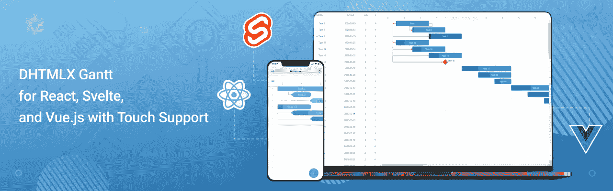
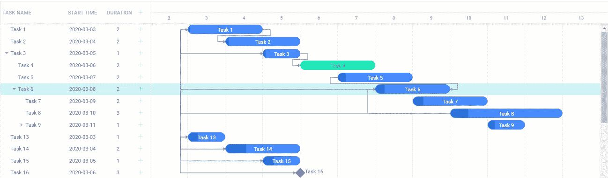
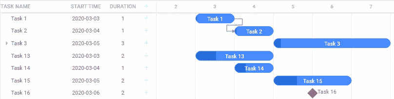

# React、Vue 和 Svelte v1.1 的 DHTMLX 甘特图库中的新增功能

> 原文：<https://itnext.io/whats-new-in-dhtmlx-gantt-libraries-for-react-vue-and-svelte-v1-1-aaa23868cf2c?source=collection_archive---------3----------------------->

就在几个月前，我们的项目管理应用程序 UI 组件产品组合增加了甘特库，包括 [React](https://dhtmlx.com/docs/products/dhtmlxGantt-for-React/) 、 [Vue](https://dhtmlx.com/docs/products/dhtmlxGantt-for-Vuejs/) 和 [Svelte](https://dhtmlx.com/docs/products/dhtmlxGantt-for-Svelte/) 。有了这些 Gantts，程序员可以扩展他们的技术堆栈，更高效地使用流行的 JavaScript 框架，而最终用户则获得了一个处理大量任务的项目的有效工具。第一个版本包括最基本的甘特功能，但第二次更新——2021 年 5 月 27 日发布的次要版本 1.1——带来了更复杂的功能。它提供了一系列有用的功能，例如在甘特图网格区域中对任务进行拖放操作、触摸支持和本地化。

让我们更详细地考虑一下这些新奇的东西。

## 在网格中处理任务

在实际项目中使用甘特图时，项目经理能够以直观的方式安排任务是非常有用的。现在，所有为 React、Svelte 和 Vue 创建的基于 DHTMLX 的甘特图都可以通过拖放轻松地组织在网格中。由于我们 Gantts 的反应，这种任务操作的结果将立即显示在时间线中。

## 本地化

如果您决定将 DHTMLX Gantt 组件之一合并到项目管理应用程序中，您肯定会希望 Gantt 中的所有文本数据对来自不同国家的用户绝对清晰。这就是新添加的本地化特性发挥作用的地方。它有助于使组件适应各种语言。

## 触摸友好

从 1.1 版开始，我们的甘特图库不仅提供了开发桌面版项目管理应用程序的可能性，还提供了开发移动版项目管理应用程序的可能性。无需额外配置，您就可以创建在触摸屏上显示良好的甘特图。触控支持为最终用户提供了提高工作效率所需的移动性。沿着时间线跟踪任务、指定依赖关系、编辑更改——所有这些使用甘特图的重要操作都可以在任何位置通过移动设备使用常见的触摸手势来执行。

## 最后的话

抓住机会，通过 npm 安装所需库的试用版，免费测试本文中介绍的新特性:

*   [反应甘特图](https://www.npmjs.com/package/@dhtmlx/trial-react-gantt)
*   [苗条身材的甘特图](https://www.npmjs.com/package/@dhtmlx/trial-svelte-gantt)
*   [Vue 的甘特图](https://www.npmjs.com/package/@dhtmlx/trial-vue-gantt)

同样值得一提的是，我们的开发团队将继续致力于为流行的 JS 框架进一步改进 DHTMLX 甘特图库。到今年年底，我们计划添加更复杂的功能，如资源管理、关键路径计算、反向规划、自动调度和任务分割。

**来源:** [发布文章](https://dhtmlx.com/blog/dhtmlx-gantt-react-svelte-vue-js-localization-touch-support-v1-1/)发表于 2021 年 5 月 27 日，DHTMLX 博客上