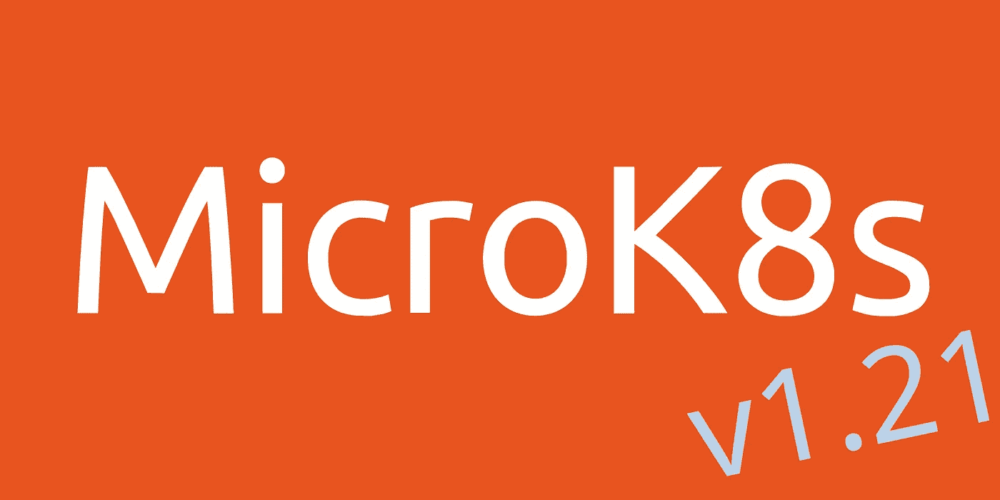

# MicroK8s v1.21 有什么新功能？

> 原文：<https://itnext.io/whats-new-in-microk8s-v1-21-5b84c27d85db?source=collection_archive---------0----------------------->

Kubernetes *v1.21* 出来了！这个版本中有很多增强功能，但是这个帖子不是关于新的 Kubernetes goodies！如果您对那些前往 K8s [发布页面](https://www.kubernetes.dev/resources/release/)和/或试驾 *v1.21* 感兴趣，请:

```
sudo snap install microk8s --classic --channel=1.21/stable
```

这篇文章是关于进入 [MicroK8s](https://microk8s.io/) 的额外工作，面向工作站、edge 和 CI/CD 工作流的轻量级 Kubernetes 发行版。



## 那么…自从上一个版本发布以来，我们都做了些什么？

*   在 *v1.21* 中，我们有一个关于多节点集群存储的更好的故事。我们引入了一个新的插件来部署 [OpenEBS](https://openebs.io/) 。试一试，`microk8s enable openebs`。 [OpenEBS](https://microk8s.io/docs/addon-openebs) 使用 iscsi 设备，跨节点复制数据块。这有效地为多节点集群提供了可靠的存储解决方案。如果你对 OpenEBS 不感兴趣，你会很高兴地发现我们增强了与 CSI 插件的兼容性。很多 CSI 插件都假设 kubelet 把文件放在`/var/lib/kubelet`下。对于路径为`/var/snap/microk8s/common/var/lib/kubelet`的 MicroK8s 来说，情况并非如此。不幸的是，大多数 CSI 掌舵图不允许你设置库伯莱路径。因此，在 snap install 中，MicroK8s 会将`/var/lib/kubelet`链接到 MicroK8s kubelet 位置，假设您的系统中没有其他 K8s 发行版。
*   大量的工作已经进入了数据存储库。Mathieu，新的 dqlite 维护者解决了内存泄漏和数据一致性问题，并且正在进行更多的改进！对这个项目的未来感到兴奋。
*   `microk8s enable gpu`插件现在将使用新的英伟达 GPU 运营商。这提高了该插件的稳定性和兼容性，因为包括 nVidia 驱动程序在内的所有软件依赖现在都由运营商负责。这种方法目前可能有些粗糙，所以请确保您检查了[已知问题](https://docs.nvidia.com/datacenter/cloud-native/gpu-operator/release-notes.html#operator-known-limitations)。这是应该走的路！
*   [OpenFaaS](https://www.openfaas.com/) 是一个新的附加组件，`microk8s enable openfaas`。现在，您可以用一个命令安装流行的无服务器框架。
*   `microk8s join`现在验证它联系的节点的证书。形成簇[是一个两步过程](https://microk8s.io/docs/clustering)。您在集群中的一个节点上调用`microk8s add-node`,这会打印出您需要在加入节点上使用的连接字符串。连接字符串现在包括集群中节点的 SSL 证书的指纹。
*   许多插件得到了更新，看看[发布公告](https://discuss.kubernetes.io/t/microk8s-v1-21-released/15476)的完整列表和版本。非常感谢社区成员，特别是 [@balchua](https://github.com/balchua) 帮助保持 MicroK8s 的最新状态。
*   其他你可能永远不会注意到的更新包括 containerd 升级到 v1.4.4 和 core 升级到 core18。通过将所有 Kubernetes 服务作为 go 例程而不是 systemd 服务运行，MicroK8s 的内存占用减少了。

现在你知道是什么让我们忙碌，希望你能理解 Kubernetes 发行版带来了什么。

## 总结

这个版本有很大的潜力。它集合了许多有用的生态系统组件，您需要掌握这些组件才能精通 Kubernetes。希望你喜欢使用它！

非常感谢 [@balchua](https://github.com/balchua) 和其他社区成员让这次发布成为可能。谢谢， [@tbertenshaw](https://github.com/tbertenshaw) ， [@angelnu](https://github.com/angelnu) ， [@petermetz](https://github.com/petermetz) ， [@lazyoldbear](https://github.com/lazyoldbear) ，[@ luci mon](https://github.com/luciimon)，[@ galgalgalesh](https://github.com/galgalesh)， [@barosl](https://github.com/barosl) 。

期待您的反馈。查看我们的[回购](https://github.com/ubuntu/microk8s)，并在#microk8s 频道的 [Kubernetes Slack](http://slack.kubernetes.io/) 给我们留言！

干杯！

# 链接

 [## Kubernetes 1.21 版本信息

### 关于当前发布周期的信息，包括重要日期、发布团队联系信息、跟踪…

www.kubernetes.dev](https://www.kubernetes.dev/resources/release/) [](https://microk8s.io/) [## MicroK8s -面向开发人员、edge 和物联网的零运营 Kubernetes | MicroK8s

### 面向开发人员、云、集群、工作站、边缘和物联网的低运营成本、最小生产量 Kubernetes。为…选择平台

microk8s.io](https://microk8s.io/) [](https://openebs.io/) [## OpenEBS - Kubernetes 存储简化版。

### OpenEBS 构建在 Kubernetes 之上，使有状态应用程序能够轻松访问动态本地 PV 或复制 PV。由…

openebs.io](https://openebs.io/)  [## micro k8s-Addon:open EBS | micro k8s

### 首页:来自 MicroK8s 的 https://openebs.io/版本:1.21+支持的 arch: amd64 OpenEBS，是部署最广泛的…

microk8s.io](https://microk8s.io/docs/addon-openebs)  [## Dqlite -高可用性 SQLite | Dqlite

### Dqlite 是一个快速、嵌入式、持久的 SQL 数据库，具有 Raft 共识，非常适合容错物联网和边缘…

dqlite.io](https://dqlite.io/)  [## 发行说明- NVIDIA 云原生技术文档

### 修正了 NVIDIA Container Toolkit 1.4.5 与 containerd 和空 containerd 配置一起使用时的问题…

docs.nvidia.com](https://docs.nvidia.com/datacenter/cloud-native/gpu-operator/release-notes.html#operator-known-limitations)