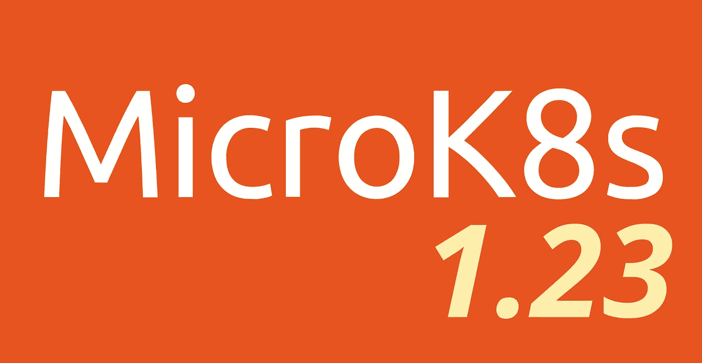

# MicroK8s v1.23 有什么新功能？

> 原文：<https://itnext.io/whats-new-in-microk8s-v1-23-9516c452fdaf?source=collection_archive---------2----------------------->

致力于我们的使命，我们今天发布了 MicroK8s v1.23，仅在上游 Kubernetes 发布后几个小时。对于那些可能还不知道 MicroK8s 的人来说，micro k8s 是一个低运营成本、最低产量的 Kubernetes 发行版，适用于:

*   开发人员工作站
*   物联网
*   边缘
*   CI/CD

给 1.23 版本一个旋转:

```
sudo snap install microk8s --classic --channel=1.23
```

你可以在[官方公告](https://kubernetes.io/blog/2021/12/07/kubernetes-1-23-release-announcement/)中阅读更多关于最新 Kubernetes 的内容。在这里，我们重点介绍我们在这个 MicroK8s 版本上所做的工作和主要功能。



## 仅工作节点

到目前为止，集群中的所有节点都运行控制平面，这有助于 MicroK8s 的弹性和容错。现在，您可以选择将仅工作节点添加到集群中。这种节点不运行 K8s 控制平面，对集群的高可用性没有贡献。然而，它们消耗较少的资源，因此适用于低端设备。仅工作节点也适用于运行 K8s 工作负载的节点不可靠的配置，或者只是不信任它们来承担控制平面的任务。你可以在我们的文档中阅读更多关于形成有或没有工人节点[的集群。](https://microk8s.io/docs/clustering)

## 支持多实例的 GPU 运算符

我们随 GPU 插件`microk8s enable gpu`一起提供的更新的 NVIDIA GPU operator 使我们能够通过配置图配置[多实例 GPU](https://docs.nvidia.com/datacenter/cloud-native/gpu-operator/gpu-operator-mig.html#configuring-mig-profiles)。由 NVIDIA 工程师开发的顶级边缘技术！

## FPGA，第一步

真的很兴奋在 FPGA 湖中用新的 [InAccel 附加模块](https://microk8s.io/docs/addon-inaccel)测试水域。加入我们:`microk8s enable inaccel`

## 轻松的 lxc 部署

在这个版本中，MicroK8s 将检测它是否部署在 lxc 容器中，并指示 kube-proxy 不要配置连接跟踪。连接跟踪设置是从主机节点继承的。

## 大量附加升级

我们要感谢我们的社区成员，特别是 [@balchua](https://github.com/balchua) 积极维护发行版中的附加组件。

## 质量改进

这可能是您永远不会注意到的事情，但是我们的默认数据存储 dqlite 的良好工作进展顺利。除了核心 dqlite 的性能和可靠性改进之外，我们还将 dqlite 拆分到它自己的 systemd 进程中，以提高稳定性。

## 魅力 MicroK8s

MicroK8s 正式进入 [Juju charms](https://juju.is/) 的世界。我们已经掌握了 MicroK8s 的魅力。前往 [charmhub.io](https://charmhub.io/microk8s) 尝试一下。

# 总结

1.23 版本是迄今为止最好的版本。许多细节已经解决了。我相信你会喜欢的。向所有为这次发布做出贡献的人大声欢呼。 [@balchua](https://github.com/balchua) ， [@balasu](https://github.com/balasu) ， [@gkarthiks](https://github.com/gkarthiks) ， [@jlettman](https://github.com/jlettman) ， [@erulabs](https://github.com/erulabs) ， [@MichaelCduBois](https://github.com/MichaelCduBois) ， [@farazmd](https://github.com/farazmd) ， [@BabisK](https://github.com/BabisK) ， [@sfstpala](https://github.com/sfstpala) ， [@tobiasmuehl](https://github.com/tobiasmuehl) ，

期待在#microk8s 频道的 Kubernetes Slack 与您见面。

# 参考

[](https://microk8s.io/docs/clustering) [## MicroK8s -创建一个 MicroK8s 集群| MicroK8s

### 尽管 MicroK8s 是作为 Kubernetes 的一个超轻量级实现而设计的，但它仍然是可能的，并且对……

microk8s.io](https://microk8s.io/docs/clustering) [](https://kubernetes.io/blog/2021/12/07/kubernetes-1-23-release-announcement/) [## Kubernetes 1.23:下一个前沿

### 作者:Kubernetes 1.23 发布团队我们很高兴地宣布 Kubernetes 1.23 的发布，这是……

kubernetes.io](https://kubernetes.io/blog/2021/12/07/kubernetes-1-23-release-announcement/)  [## micro k8s-Addon:in Accel | micro k8s

### 主页:来自 MicroK8s 的 https://inaccel.com/版本:1.23+支持的 arch: amd64 InAccel 允许您构建、运送和…

microk8s.io](https://microk8s.io/docs/addon-inaccel) [](https://charmhub.io/microk8s) [## 使用 Charmhub 部署 MicroK8s 开放操作集合

### 关于 MicroK8s 是一款面向开发者、物联网和 edge 的小型、快速、单包 Kubernetes。阅读更多相关链接…

charmhub.io](https://charmhub.io/microk8s)  [## GPU 运营商与 MIG - NVIDIA 云原生技术文档

### 预装驱动程序时，MIG 管理器将尝试停止并重新启动主机上的一系列 systemd 服务…

docs.nvidia.com](https://docs.nvidia.com/datacenter/cloud-native/gpu-operator/gpu-operator-mig.html#configuring-mig-profiles)