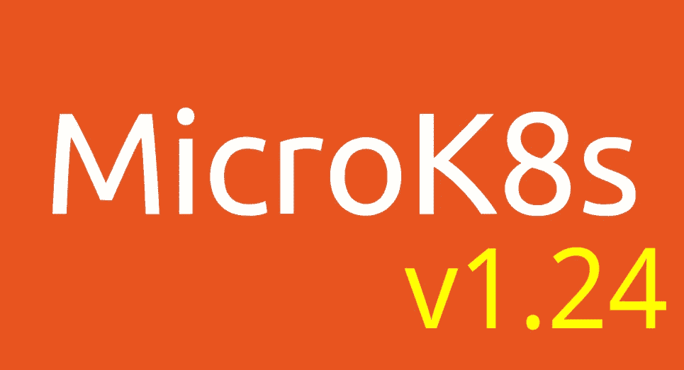

# MicroK8s v1.24 有什么新功能？

> 原文：<https://itnext.io/whats-new-in-microk8s-v1-24-cf9180bc6a82?source=collection_archive---------2----------------------->

你可能会看着 [Kubernetes v1.24 发布公告](https://kubernetes.io/blog/2022/05/03/kubernetes-1-24-release-announcement/)，认为“这是一个乏味的发布”，你可能是对的！Kubernetes 重新定义了基础设施的运营方式，现在正处于稳定性是其成功关键的阶段。只有微小的渐进变化才能让它的生态系统繁荣。

MicroK8s 建立在 Kubernetes 的成功基础上，随着 1.24 版的发布，推出了一个不容忽视的 Kubernetes 发行版。下面是原因！



# Mayastor 高可用性存储

Kubernetes 以非常高效和优雅的方式解决了一个非常具体的问题。它托管容器化的服务/工作负载，并在相当常见的条件下确保其高可用性。托管工作负载可以动态扩展，以满足需求的波动，并在出现故障时重新启动。Kubernetes 负责所有可用主机上的网络和工作负载放置。简而言之，Kubernetes 决定应用程序何时何地启动，并创建网络规则，以便同一应用程序的多个实例可以通过单个端点使用。

OpenEBS 用 Mayastor 解决了分布式存储的问题。每个 Kubernetes 节点贡献其本地存储资源的一部分，Mayastor 确保数据被透明地复制，以便它们在节点故障时仍然存在。

当 Kubernetes 和 OpenEBS Mayastor 结合使用时，可以确保应用程序及其使用的数据都是高度可用的。总的来说，这是一个非常吸引人的设置。尝试使用:

```
sudo snap install microk8s --classic --channel=1.24/stable
sudo microk8s enable mayastor
```

您将被要求[启用 HugePages 并加载](https://microk8s.io/docs/addon-mayastor) `[nvme-tcp](https://microk8s.io/docs/addon-mayastor)` [内核模块](https://microk8s.io/docs/addon-mayastor)。

在`mayastor`存储类中，您应该将您的永久卷声明发送到:

```
# pod-with-pvc.yaml
---
apiVersion: v1
kind: PersistentVolumeClaim
metadata:
  name: test-pvc
spec:
  storageClassName: mayastor
  accessModes: [ReadWriteOnce]
  resources: { requests: { storage: 5Gi } }
---
apiVersion: v1
kind: Pod
metadata:
  name: test-nginx
spec:
  volumes:
    - name: pvc
      persistentVolumeClaim:
        claimName: test-pvc
  containers:
    - name: nginx
      image: nginx
      ports:
        - containerPort: 80
      volumeMounts:
        - name: pvc
          mountPath: /usr/share/nginx/html
```

当然，要完成 HA 设置，您需要将至少三个 [MicroK8s 节点加入一个集群](https://microk8s.io/docs/clustering)。加入两个节点`snap install microk8s`并调用它们

```
sudo microk8s add-node
```

…在第一个节点上。这将打印您需要在第二个节点上发出的命令，以启动“[创建多节点集群](https://microk8s.io/docs/clustering)”操作指南中描述的`microk8s join`操作。

# 每个人的插件

MicroK8s 最受欢迎的特性之一是带有`foo`的`microk8s enable foo`命令，可以是你能想到的任何东西。现在，您可以创建自定义插件，并将其作为 git 库共享。让我给你一些…关于 1.24 版本中可能发生的事情的思考。

在你的 github 账户下克隆[模板插件库](https://github.com/canonical/microk8s-addons-repo-template)。在 [addons.yaml](https://github.com/canonical/microk8s-addons-repo-template/blob/main/addons.yaml) 中输入你心目中的插件的描述。例如:

```
- name: "pizza"
      description: "Need some food for thought?"
      version: "1.0.0"
      check_status: "${SNAP_DATA}/none"
      supported_architectures:
        - arm64
        - amd64
```

在你的库中创建一个名为`pizza`的目录。在`pizza`目录中放置一个`enable`文件，并使其可执行。在`enable`文件中有如下一行:

```
xdg-open [https://www.dominos.com/index.intl.html](https://www.dominos.com/index.intl.html)
```

您的 github 库是一个 MicroK8s 插件库。将它添加到 MicroK8s 集群中，如下所示:

```
sudo microk8s addons repo add myrepo https://github.com/myorg/myrepo
```

点一些食物:

```
sudo microk8s enable pizza
```

你可以在各自的 microk8s 文档中阅读更多关于如何编写插件的内容。

# 这还不是全部…

以上是 v1.24 MicroK8s 版本中最激动人心的两个特性。如果你有兴趣看过去几个月让我们忙碌的事情的长长的列表，看看[发布公告](https://discuss.kubernetes.io/t/microk8s-v1-24-released/19883)。最后，请允许我衷心感谢所有为这次发布做出贡献的伟大的人们， [@balchua](https://github.com/balchua) ，[@ Caleb loyd](https://github.com/caleblloyd)， [@hryyan](https://github.com/hryyan) ， [@miro-balaz](https://github.com/miro-balaz) ， [@balasu](https://github.com/balasu) ，[@ Chris-hamb](https://github.com/chris-hamper)， [@dirien](https://github.com/dirien) ， [@AnaisUrlichs](https://github.com/AnaisUrlichs) 。

# 链接

[](https://kubernetes.io/blog/2022/05/03/kubernetes-1-24-release-announcement/) [## 库伯内特 1.24:观星者

### Kubernetes 1.24 作者:Kubernetes 1.24 发布团队我们很高兴地宣布 Kubernetes 1.24 的发布…

kubernetes.io](https://kubernetes.io/blog/2022/05/03/kubernetes-1-24-release-announcement/) [](https://github.com/openebs/mayastor) [## GitHub - openebs/mayastor:容器中的云原生声明性数据平面

### Mayastor 是用 Rust 编写的云原生声明性数据平面。我们的目标是抽象存储资源及其…

github.com](https://github.com/openebs/mayastor)  [## MicroK8s - Addon: OpenEBS Mayastor 集群存储| MicroK8s

### MicroK8s 支持基于 OpenEBS Mayastor 的集群就绪复制存储解决方案。这确实需要一些初始…

microk8s.io](https://microk8s.io/docs/addon-mayastor) [](https://microk8s.io/docs/clustering) [## MicroK8s -创建一个 MicroK8s 集群| MicroK8s

### 尽管 MicroK8s 是作为 Kubernetes 的一个超轻量级实现而设计的，但它仍然是可能的，并且对……

microk8s.io](https://microk8s.io/docs/clustering) [](https://neoaggelos.github.io/blog/004-mayastor/) [## 面向 MicroK8s Kubernetes 和 Mayastor 的零操作扩展存储解决方案

### 我们如何为 MicroK8s 带来通用的集群级存储解决方案。Kubernetes 是众所周知的开源软件…

neoaggelos.github.io](https://neoaggelos.github.io/blog/004-mayastor/) [](https://microk8s.io/docs/howto-addons) [## MicroK8s -使用、编辑或创建插件| MicroK8s

### MicroK8s 的插件，可以添加到你的基本集群的额外服务，是用户的最爱。做…

microk8s.io](https://microk8s.io/docs/howto-addons)