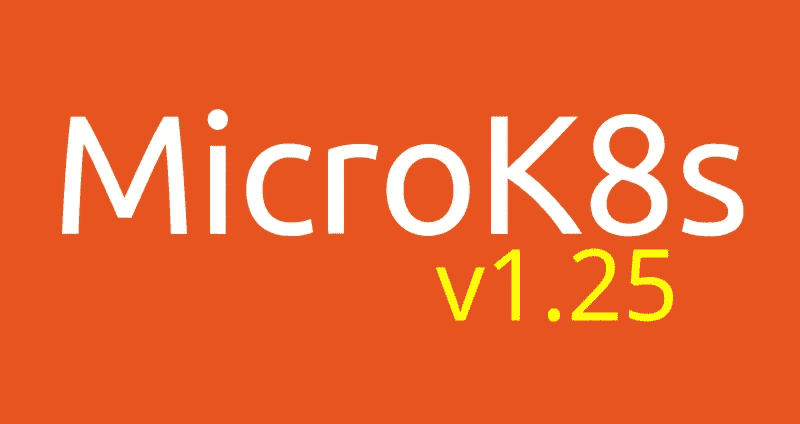

# MicroK8s v1.25 有什么新功能？

> 原文：<https://itnext.io/whats-new-in-microk8s-v1-25-d5b06cd82ba0?source=collection_archive---------3----------------------->

我们很高兴为您带来 Kubernetes *v1.25，试用:*

```
sudo snap install microk8s --classic --channel=1.25
```

安装 [MicroK8s](https://microk8s.io/docs) 非常简单，这是面向开发人员工作站、edge 和物联网的零操作 Kubernetes。



如果你以前没有用过 MicroK8s，这里有一些提示:

*   `microk8s status --wait-ready`将等待 K8s 集群准备就绪，并报告其状态以及启用的插件。
*   `microk8s kubectl get all -A`将显示集群的视图。注意 kubectl 是如何成为 MicroK8s 发行版的一部分的。
*   `microk8s enable dns`将启用 dns 插件。
*   `microk8s config`将获取 kubeconfig 文件来访问您的集群。
*   `microk8s helm`是掌舵人！

尽情探索新版本吧！

# 是什么让我们在过去的四个月里忙个不停

## 严格限制进入普遍可用性

你已经知道 MicroK8s 是小菜一碟。因此，它打包了所有 Kubernetes 二进制文件、CNI、数据存储及其所有依赖项。这种打包允许透明的就地升级。每次有新的补丁时，您的集群都会升级。快照非常适合经常发布的项目。对于 Kubernetes 来说，是每隔几周一次。

snaps 的另一个特点是，snapshot 应用程序可以放在[严格限制的“监狱”](https://snapcraft.io/docs/snap-confinement)中。这提供了额外的安全层，因为 Kubernetes 的工作负载无法逃脱强加的限制。当然，在大多数情况下，您信任正在运行的工作负载。您相信它不会被利用，也不会因为整个节点瘫痪而崩溃。但是，如果您与托管工作负载的关系不是建立在信任的基础上，一个严格限制的 MicroK8s 可能是您正在寻找的。

试用严格限制的 K8s，搭配:

```
snap install microk8s --channel=1.25-strict
```

如果出于某种原因，您发现所采用的 AppArmor 配置过于严格，请尝试`--devmode`选项:

```
sudo snap install microk8s --channel=1.25-strict --devmode
```

请注意`--classic`标志是如何丢失的。在传统 snap 中，工作负载可以像任何其他基于 apt/rpm 的包一样访问主机系统。

## 插件越来越强大

随着核心&社区插件库的引入，我们被赋予了进一步发展 MicroK8s 友好应用生态系统的灵活性。你会很高兴地发现一组新插件，你可以用`microk8s enable <addon>`试试:

*   `[kube-ovn](https://discuss.kubernetes.io/t/addon-kubeovn/20700),`众所周知的 CNI，
*   `[cert-manager](https://cert-manager.io),`颁发证书、
*   `[nfs](https://discuss.kubernetes.io/t/addon-nfs-server-provisioner/20903),`社区拥有 NFS 运营商、
*   `[osm-edge](https://discuss.kubernetes.io/t/addon-osm-edge/20969),`社区自带的插件安装了一个[开源网格](https://github.com/openservicemesh/osm)

现有插件中值得注意的改进包括在`registry`插件中设置存储类的选项，以及为现有的`hostpath-storage`存储类设置主机路径。

## Power9 架构支持

从未拥有过 Power9 机器？嗯…我也是，但这并没有阻止我们支持这个架构。这项工作最好的一点是如何轻松的单元包装使它。我们不得不点击一个复选框，在这个颇具异国情调的建筑中创建我们的快照。

## 缩小捕捉大小

为了让 MicroK8s 尽可能小，我们做了大量工作，设法将快照大小从 230MB 降至 170MB。除了安装时间上的明显改进之外，这种减少还会产生显著的内存占用和性能优势。

# 一个大大的“谢谢”！

致我们的贡献者:

*   [@balchua](https://github.com/balchua) ，用于 hostpath 类的工作和维护 Linkerd、Jaeger、MetalLB、Keda 插件
*   [@Orzelius](https://github.com/Orzelius) ，用于入口工作
*   [@jkosik](https://github.com/jkosik) ，用于处理 hostpath-storage、NFS 和 ArgoCD 插件
*   [@sudeephb](https://github.com/sudeephb) ，对于注册表的改进
*   [@MFAshby](https://github.com/MFAshby) ，用于外观约束修复
*   [@ortegarenzy](https://github.com/ortegarenzy) ，用于 kubelet 令牌修复
*   [@naqvis](https://github.com/naqvis) ，用于 osm-edge 插件
*   [@dud225](https://github.com/dud225) ，为仪表盘更新和对木尔图斯的贡献
*   @eliaskoromilas ，因为他在 inaccel 插件上的工作
*   [@balasu](https://github.com/balasu) ，感谢他对 Portainer 的贡献
*   [@csantanapr](https://github.com/csantanapr) ，用于 Knative 上的工作

# 链接

[](https://microk8s.io) [## MicroK8s -面向开发人员、edge 和物联网的零运营 Kubernetes | MicroK8s

### 开发人员的最佳 Kubernetes 体验，开发人员的 DevOps、云和 MicroK8s 是最容易和…

microk8s.io](https://microk8s.io)