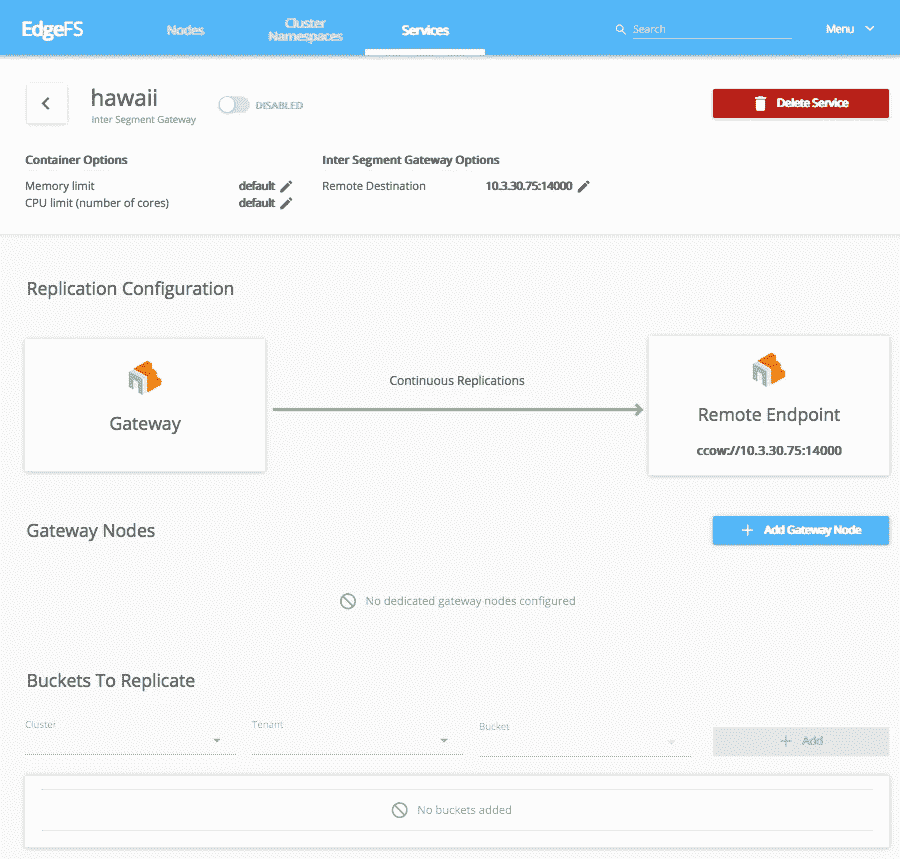

# 即将到来的 Kubernetes 1.14 和 Rook EdgeFS 1.0 有什么新内容？

> 原文：<https://itnext.io/whats-new-in-upcoming-kubernetes-1-14-and-rook-edgefs-1-0-7aa1865e018a?source=collection_archive---------4----------------------->

Kuberentes 1.14 现在处于功能冻结阶段。由于 Kubernetes 发布了流程透明度，我们可以预览[即将到来的](https://docs.google.com/spreadsheets/d/116X6E-lmDJG5UZPlqDAFw8hN9vS6SNY4qRNZ9fKtsMU/edit#gid=0)。

让我从我的角度给你一个简短的总结，什么是酷和重要的。

## 支持 Windows Server 工作节点

这项工作从 1.5 版本开始，我可以看到它将在 1.14 中逐渐稳定下来。有了这个稳定的，现在可以配置双 Linux + Windows 集群，其中一些节点将被指定运行 Windows 应用程序，由 Kubernetes 协调[。EdgeFS 提供了出色的横向扩展 iSCSI 数据块支持，有了它，Kubernetes CSI provisioner 现在可以为 Windows pods 协调 iSCSI 数据块设备分配。感兴趣吗？现在把手弄脏...:)](https://github.com/kubernetes/website/blob/264f4ed83ceb4338c73743be19ba3612c5c82017/content/en/docs/getting-started-guides/windows/_index.md)

## 永久本地卷现在稳定

这项工作从 1.8 版本开始，现在的目标是在 1.14 中正式发布。借助该功能，Kubernetes 用户可以轻松地将本地可用存储配置到 pod 的容器中，从而简化分布式高性能和低延迟集群(如 [EdgeFS](http://edgefs.io) )的配置。特别是，对[可发现的原始块](https://github.com/kubernetes/enhancements/blob/master/keps/sig-storage/20190124-local-persistent-volumes.md#block-devices-and-raw-partitions)特性的支持是 Rook 运营商将受益的事情，现在它已经升级到稳定，这应该不会花很长时间！

## CSI 拓扑支持

这个特性[升级到 Beta 版使得所有 1.14 用户都可以使用它，而不需要在 kubeadm 部署期间特别启用任何东西。借助该功能，即将推出的](https://github.com/kubernetes/community/blob/master/contributors/design-proposals/storage/container-storage-interface.md#topology-representation-in-node-objects) [EdgeFS CSI Block 插件](https://github.com/Nexenta/edgefs-csi)将能够通过在已配置的拓扑中平均分配 I/O 来提高多路径 iSCSI、多头横向扩展 NFS 的性能和可用性。这是一个令人兴奋的发展，并期待看到行动！

## 不需要 PV/PVC 的 CSI 临时本地卷

这个特性将会在 alpha 版本中推出。本地临时卷是其生命周期与单个 pod 的生命周期相关联的卷。然而，每次需要时，都必须提供 PV/PVC 定义，这使得该功能的使用变得复杂。通过内联定义，pod 的容器可以访问空的或预填充的临时卷，而不需要 PV/PVC。使用完全不可变的设计，可以通过 CSI provisioner 命令 EdgeFS 在几秒钟内创建一个非常大的数据集的服务器端临时克隆，从而以无状态的方式按需提供给 pod。

# Rook EdgeFS 1.0 功能预览

什么是 EdgeFS？这是 CNCF 鲁克项目的一个新的存储提供商，你可以在 https://rook.io/docs/rook/master/edgefs-storage.html 的[了解更多信息。](https://rook.io/docs/rook/master/edgefs-storage.html)

EdgeFS 的优势在于它能够将底层基础架构虚拟化为可扩展、高可用性的分布式存储系统。它的工作方式类似于“git ”,其中所有的修改都是全局不可变的、完全版本化的、自我验证的、分布式的，因此是容错的。因此，它支持对对象、文件和数据块常用存储协议的跨云和地理透明的高性能分布式访问。

我对 Rook 社区迄今为止在 EdgeFS operator 上取得的进展感到满意。

## 网段间网关链接

[EdgeFS 段间网关链接](https://rook.io/docs/rook/master/edgefs-isgw-crd.html)是 EdgeFS 跨站点、跨云全局名称空间同步功能的构建块。

它异步分发已修改的数据块，并实现对文件、对象和块设备的无缝和地理上透明的访问。值得注意的是，文件或块设备由一个或多个对象组成，因此，在 EdgeFS 范围内，最终所有东西都是对象，全局不可变且自我验证。

打个比方，EdgeFS 对修改的全局不变性的概念非常类似于“git”对存储库提交和分支的操作方式。因此，这种技术使 EdgeFS 用户能够构建和操作广泛分布的全局名称空间，同时大大简化了管理开销。ISGW 端点链接会立即注意到在设置了 ISGW 链接的源站点上修改的文件或对象，从而传播更改。最终，所有连接的站点都将收到文件修改，其中只传输修改过的数据块。

## 普罗米修斯仪表板

现在[为 EdgeFS 设置](https://rook.io/docs/rook/master/edgefs-monitoring.html) Prometheus 监控非常简单。它甚至能够聚合、呈现基于每个租户或每个服务的 I/O 指标、智能统计、故障计数器等。存储集群的可观察性和管理从未如此简单。

## 管理 GUI

配置完成后，[管理 GUI](https://rook.io/docs/rook/master/edgefs-ui.html) 将在端口 3000 或 3443 上自动可用。现代化且直观的设计应能简化存储基础架构管理流程。它与 Rook EdgeFS CRDs 紧密集成，因此您无需手动编辑 CRDs，它可以通过浏览器界面完成:

## 支持块 CSI 集成

这项工作[现在正在审查中](https://github.com/rook/rook/issues/2507)，用户将能够通过持久卷横向扩展 iSCSI 数据块接口协调 pod 的供应。这是对 [EdgeFS CSI 块插件](https://github.com/Nexenta/edgefs-csi)的新添加，它完全支持 CSI snapshotter，并将很快提供与 Linux I/O 多路径子系统的无缝集成。与 EdgeFS 中的任何其他逻辑构造一样，它的快照可以在 MxN I/O 网状拓扑中跨段间网关链路传输。也就是说，同步目的位置将自动接收它订阅的快照。我希望 Crossplane、Federation v2、Kasten 等多种云协调层能够从这项技术中受益，因为它将简化整体用户体验，并在许多地理上分散的站点之间提供急需的数据一致性。

# 摘要

我希望我对未来的回顾是有用的。Kubernetes space 即将推出一些令人兴奋的新功能，这些功能将释放构建跨云、跨站点全球命名空间作为软件定义的存储层的真正潜力。

今天就加入我们的 [Rook](http://rook.io) 和 [EdgeFS](http://edgefs.io) 社区吧！